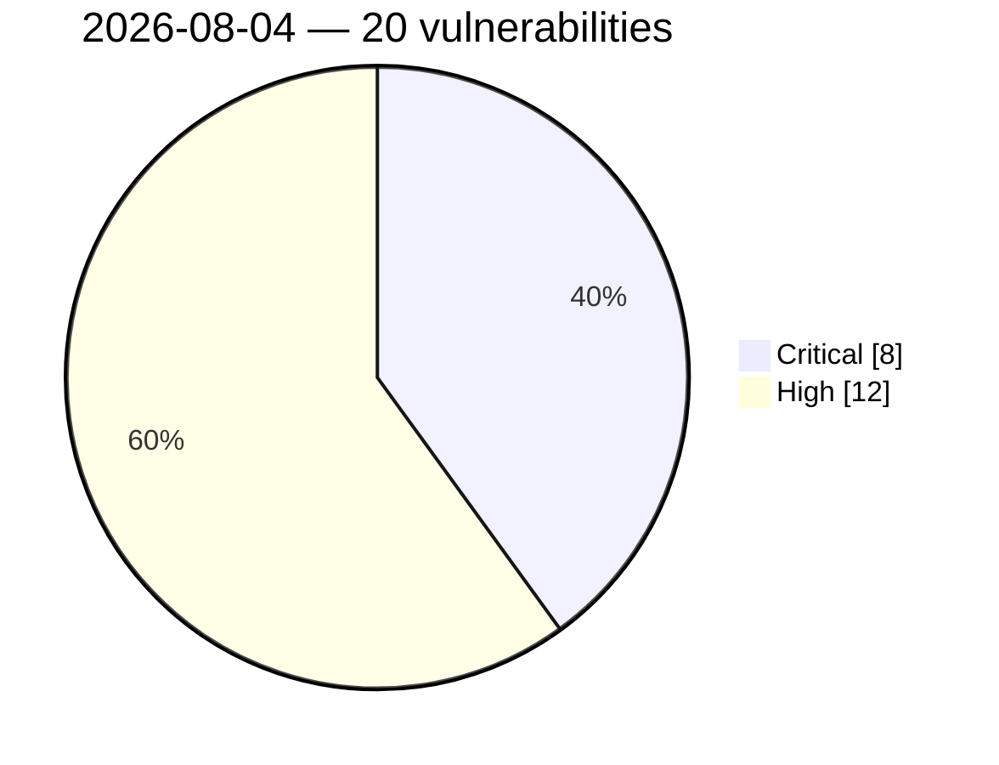

# Critical & High Severity Vulnerabilities — 2026-08-04

🔥 Actively exploited (KEV): **0**  |  ⭐ Watchlist matches: **17**

## 🔴 Critical (8)

- **(CVSS 9.8)** ⭐ WATCHLIST [CVE-2026-70554 - MaxSite CMS Unauthenticated PHP Object Injection via maxsite_comuser Cookie](https://cvefeed.io/vuln/detail/CVE-2026-70554) — _cvefeed.io (High/Critical)_ (2026-08-04 21:16 UTC) — _reported 7 hours, 30 minutes ago_
- **(CVSS 9.8)** ⭐ WATCHLIST [CVE-2026-45538 - OpenSIPS: Stack Buffer Overflow in sip_to_json() Header Name Copy](https://cvefeed.io/vuln/detail/CVE-2026-45538) — _cvefeed.io (High/Critical)_ (2026-08-04 21:16 UTC) — _reported 7 hours, 30 minutes ago_
- **(CVSS 9.8)** ⭐ WATCHLIST [CVE-2026-70553 - MaxSite CMS Unauthenticated RCE via Install Endpoint](https://cvefeed.io/vuln/detail/CVE-2026-70553) — _cvefeed.io (High/Critical)_ (2026-08-04 20:16 UTC) — _reported 8 hours, 30 minutes ago_
- **(CVSS 9.8)** ⭐ WATCHLIST [CVE-2026-70552 - MaxSite CMS 109.5 Unauthenticated AJAX Dispatcher Bypass via ajax.php](https://cvefeed.io/vuln/detail/CVE-2026-70552) — _cvefeed.io (High/Critical)_ (2026-08-04 20:16 UTC) — _reported 8 hours, 30 minutes ago_
- **(CVSS 9.5)** ⭐ WATCHLIST [CVE-2026-70477 - Flowise: CSV Agent Prompt Injection Remote Code Execution Vulnerability](https://cvefeed.io/vuln/detail/CVE-2026-70477) — _cvefeed.io (High/Critical)_ (2026-08-04 20:16 UTC) — _reported 8 hours, 30 minutes ago_
- **(CVSS 9.2)** ⭐ WATCHLIST [CVE-2026-70478 - Flowise: Unauthenticated OAuth2 token refresh endpoint returns access tokens — enables token theft for any connected service](https://cvefeed.io/vuln/detail/CVE-2026-70478) — _cvefeed.io (High/Critical)_ (2026-08-04 20:16 UTC) — _reported 8 hours, 30 minutes ago_
- **(CVSS 9.1)** [CVE-2026-45537 - OpenSIPS: Global Buffer Overflow in construct_uri](https://cvefeed.io/vuln/detail/CVE-2026-45537) — _cvefeed.io (High/Critical)_ (2026-08-04 23:16 UTC) — _reported 5 hours, 30 minutes ago_
- **(CVSS 9.1)** [CVE-2026-45100 - OpenSIPS: Buffer Overflow in Base64 Encode Transformation](https://cvefeed.io/vuln/detail/CVE-2026-45100) — _cvefeed.io (High/Critical)_ (2026-08-04 22:17 UTC) — _reported 6 hours, 29 minutes ago_

## 🟠 High (12)

- **(CVSS 8.8)** [CVE-2026-70619 - Odysseus Missing Admin Authorization via Embedding Endpoint Routes](https://cvefeed.io/vuln/detail/CVE-2026-70619) — _cvefeed.io (High/Critical)_ (2026-08-04 22:17 UTC) — _reported 6 hours, 29 minutes ago_
- **(CVSS 8.7)** ⭐ WATCHLIST [CVE-2026-45084 - OpenSIPS: Denial of service in presence.handle_publish() from unchecked Content-Type state](https://cvefeed.io/vuln/detail/CVE-2026-45084) — _cvefeed.io (High/Critical)_ (2026-08-04 22:17 UTC) — _reported 6 hours, 29 minutes ago_
- **(CVSS 8.7)** ⭐ WATCHLIST [CVE-2026-70492 - Open WebUI: Stored XSS via unescaped KaTeX render-error fallback in rendered messages](https://cvefeed.io/vuln/detail/CVE-2026-70492) — _cvefeed.io (High/Critical)_ (2026-08-04 21:16 UTC) — _reported 7 hours, 30 minutes ago_
- **(CVSS 8.5)** ⭐ WATCHLIST [CVE-2026-65986 - CVAT has stored XSS via annotation guide assets](https://cvefeed.io/vuln/detail/CVE-2026-65986) — _cvefeed.io (High/Critical)_ (2026-08-04 21:16 UTC) — _reported 7 hours, 30 minutes ago_
- **(CVSS 8.3)** ⭐ WATCHLIST [CVE-2026-18814 - H3C NX15 esps reload.reload_config command injection](https://cvefeed.io/vuln/detail/CVE-2026-18814) — _cvefeed.io (High/Critical)_ (2026-08-04 22:17 UTC) — _reported 6 hours, 29 minutes ago_
- **(CVSS 8.3)** ⭐ WATCHLIST [CVE-2026-18813 - H3C NX15 esps delete command injection](https://cvefeed.io/vuln/detail/CVE-2026-18813) — _cvefeed.io (High/Critical)_ (2026-08-04 21:16 UTC) — _reported 7 hours, 30 minutes ago_
- **(CVSS 8.3)** ⭐ WATCHLIST [CVE-2026-18812 - H3C NX15 esps esps.ipv6.wan command injection](https://cvefeed.io/vuln/detail/CVE-2026-18812) — _cvefeed.io (High/Critical)_ (2026-08-04 21:16 UTC) — _reported 7 hours, 30 minutes ago_
- **(CVSS 8.3)** ⭐ WATCHLIST [CVE-2026-18811 - H3C NX15 esps add command injection](https://cvefeed.io/vuln/detail/CVE-2026-18811) — _cvefeed.io (High/Critical)_ (2026-08-04 21:16 UTC) — _reported 7 hours, 30 minutes ago_
- **(CVSS 8.3)** ⭐ WATCHLIST [CVE-2026-70476 - Flowise: Broken Access Control in Stripe Subscription Endpoints Allows Cross-Tenant Billing Manipulation](https://cvefeed.io/vuln/detail/CVE-2026-70476) — _cvefeed.io (High/Critical)_ (2026-08-04 20:16 UTC) — _reported 8 hours, 30 minutes ago_
- **(CVSS 8.2)** ⭐ WATCHLIST [CVE-2026-70486 - Open WebUI: Same-origin XSS to account takeover via terminal file-preview iframe hardcoding allow-same-origin](https://cvefeed.io/vuln/detail/CVE-2026-70486) — _cvefeed.io (High/Critical)_ (2026-08-04 20:16 UTC) — _reported 8 hours, 30 minutes ago_
- **(CVSS 8.1)** ⭐ WATCHLIST [CVE-2026-70494 - Open WebUI: A folder write-collaborator can permanently delete the owner's chats by deleting a shared subfolder](https://cvefeed.io/vuln/detail/CVE-2026-70494) — _cvefeed.io (High/Critical)_ (2026-08-04 21:16 UTC) — _reported 7 hours, 30 minutes ago_
- **(CVSS 8.1)** ⭐ WATCHLIST [CVE-2026-70482 - Open WebUI: Account takeover via OAuth token exchange accepting tokens issued to any client](https://cvefeed.io/vuln/detail/CVE-2026-70482) — _cvefeed.io (High/Critical)_ (2026-08-04 20:16 UTC) — _reported 8 hours, 30 minutes ago_
