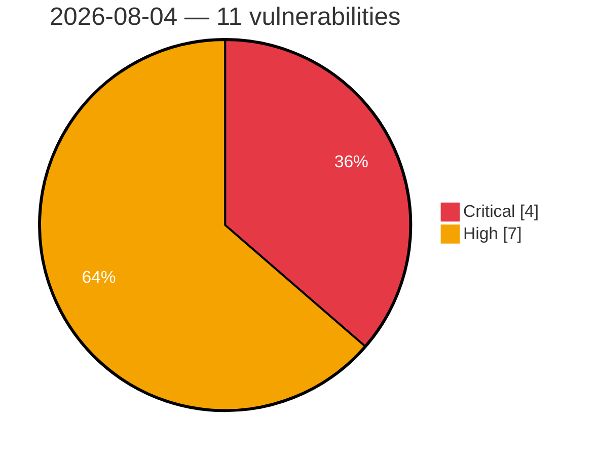

# Critical & High Severity Vulnerabilities — 2026-08-04

**Source:** cvefeed.io (High/Critical)
**KEV (actively exploited):** 0  **Watchlist matches:** 8

## Critical (4)

| CVSS | Flags | CVE / Title | Reported |
|------|-------|-------------|----------|
| 9.8 | ⭐ | [CVE-2026-70554 - MaxSite CMS Unauthenticated PHP Object Injection via maxsite_comuser Cookie](https://cvefeed.io/vuln/detail/CVE-2026-70554) | 10 hours, 38 minutes ago |
| 9.8 | ⭐ | [CVE-2026-45538 - OpenSIPS: Stack Buffer Overflow in sip_to_json() Header Name Copy](https://cvefeed.io/vuln/detail/CVE-2026-45538) | 10 hours, 38 minutes ago |
| 9.1 | — | [CVE-2026-45537 - OpenSIPS: Global Buffer Overflow in construct_uri](https://cvefeed.io/vuln/detail/CVE-2026-45537) | 8 hours, 38 minutes ago |
| 9.1 | — | [CVE-2026-45100 - OpenSIPS: Buffer Overflow in Base64 Encode Transformation](https://cvefeed.io/vuln/detail/CVE-2026-45100) | 9 hours, 38 minutes ago |

## High (7)

| CVSS | Flags | CVE / Title | Reported |
|------|-------|-------------|----------|
| 8.8 | — | [CVE-2026-70619 - Odysseus Missing Admin Authorization via Embedding Endpoint Routes](https://cvefeed.io/vuln/detail/CVE-2026-70619) | 9 hours, 38 minutes ago |
| 8.7 | ⭐ | [CVE-2026-45084 - OpenSIPS: Denial of service in presence.handle_publish() from unchecked Content-Type state](https://cvefeed.io/vuln/detail/CVE-2026-45084) | 9 hours, 38 minutes ago |
| 8.7 | ⭐ | [CVE-2026-70492 - Open WebUI: Stored XSS via unescaped KaTeX render-error fallback in rendered messages](https://cvefeed.io/vuln/detail/CVE-2026-70492) | 10 hours, 38 minutes ago |
| 8.5 | ⭐ | [CVE-2026-65986 - CVAT has stored XSS via annotation guide assets](https://cvefeed.io/vuln/detail/CVE-2026-65986) | 10 hours, 38 minutes ago |
| 8.3 | ⭐ | [CVE-2026-18814 - H3C NX15 esps reload.reload_config command injection](https://cvefeed.io/vuln/detail/CVE-2026-18814) | 9 hours, 38 minutes ago |
| 8.3 | ⭐ | [CVE-2026-18813 - H3C NX15 esps delete command injection](https://cvefeed.io/vuln/detail/CVE-2026-18813) | 10 hours, 38 minutes ago |
| 8.1 | ⭐ | [CVE-2026-70494 - Open WebUI: A folder write-collaborator can permanently delete the owner's chats by deleting a shared subfolder](https://cvefeed.io/vuln/detail/CVE-2026-70494) | 10 hours, 38 minutes ago |
