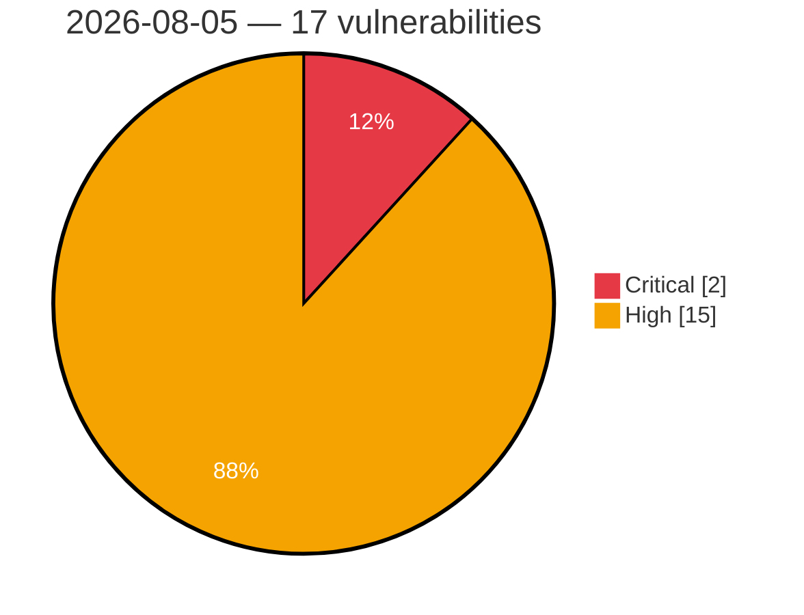

# Critical & High Severity Vulnerabilities — 2026-08-05

**Source:** cvefeed.io (High/Critical)
**KEV (actively exploited):** 0  **Watchlist matches:** 10

## Critical (2)

| CVSS | Flags | CVE / Title | Reported |
|------|-------|-------------|----------|
| 9.9 | ⭐ | [CVE-2026-70615 - boringproxy 0.10.0 SSH authorized_keys Injection via Tunnel Creation](https://cvefeed.io/vuln/detail/CVE-2026-70615) | 15 hours, 4 minutes ago |
| 9.6 | ⭐ | [CVE-2026-71319 - Nuxt.js Unauthenticated WebSocket RPC Call Leading to Remote Code Execution](https://cvefeed.io/vuln/detail/CVE-2026-71319) | 13 hours, 5 minutes ago |

## High (15)

| CVSS | Flags | CVE / Title | Reported |
|------|-------|-------------|----------|
| 8.8 | ⭐ | [CVE-2026-17556 - Path traversal in GitHub Enterprise Server allowed unauthenticated deletion of instance storage via the X-GitHub-Request-Id header](https://cvefeed.io/vuln/detail/CVE-2026-17556) | 15 hours, 5 minutes ago |
| 8.8 | — | [CVE-2026-9201 - Langflow OSS is affected by arbitrary code execution in component generation, validation, and custom component handling](https://cvefeed.io/vuln/detail/CVE-2026-9201) | 16 hours, 4 minutes ago |
| 8.8 | — | [CVE-2026-8478 - Langflow OSS is affected by arbitrary code execution in component generation, validation, and custom component handling](https://cvefeed.io/vuln/detail/CVE-2026-8478) | 16 hours, 4 minutes ago |
| 8.8 | — | [CVE-2026-8182 - Langflow OSS is affected by arbitrary code execution in component generation, validation, and custom component handling](https://cvefeed.io/vuln/detail/CVE-2026-8182) | 16 hours, 4 minutes ago |
| 8.6 | ⭐ | [CVE-2026-71309 - rclone: Incomplete path validation allows backend root escape in serve restic](https://cvefeed.io/vuln/detail/CVE-2026-71309) | 14 hours, 5 minutes ago |
| 8.6 | ⭐ | [CVE-2026-66298 - JS-view sandboxed output can synthesize keyboard events to trigger unconfirmed global shortcuts](https://cvefeed.io/vuln/detail/CVE-2026-66298) | 15 hours, 5 minutes ago |
| 8.6 | ⭐ | [CVE-2026-18953 - Improper limitation of a pathname to a restricted directory in aws-transform-mcp-server](https://cvefeed.io/vuln/detail/CVE-2026-18953) | 15 hours, 5 minutes ago |
| 8.4 | — | [CVE-2026-17583 - Thermo Fisher Applied Biosystems Genetic Analyzers Missing Support for Integrity Check](https://cvefeed.io/vuln/detail/CVE-2026-17583) | 14 hours, 5 minutes ago |
| 8.2 | — | [CVE-2026-19024 - HDF5 H5Pget_fill_value NULL Pointer Dereference via Malformed Fill Value Message](https://cvefeed.io/vuln/detail/CVE-2026-19024) | 12 hours, 5 minutes ago |
| 8.2 | ⭐ | [CVE-2026-71315 - Nuxt route rules silently dropped for mixed-case paths, bypassing appMiddleware auth gates (incomplete fix for CVE-2026-53721)](https://cvefeed.io/vuln/detail/CVE-2026-71315) | 14 hours, 5 minutes ago |
| 8.1 | ⭐ | [CVE-2026-71320 - Nuxt: Server-Side Remote Code Execution via Runtime Template Injection in Nuxt Server Island Props](https://cvefeed.io/vuln/detail/CVE-2026-71320) | 13 hours, 5 minutes ago |
| 8.1 | — | [CVE-2026-18411 - Use of hard-coded cryptographic key in Acrisure KARR BT and DR-100](https://cvefeed.io/vuln/detail/CVE-2026-18411) | 14 hours, 5 minutes ago |
| 8.1 | ⭐ | [CVE-2026-70617 - Spacebar Server Missing Authorization via Group DM Recipient Endpoint](https://cvefeed.io/vuln/detail/CVE-2026-70617) | 15 hours, 4 minutes ago |
| 8.1 | — | [CVE-2026-9196 - Langflow OSS is affected by arbitrary code execution in component generation, validation, and custom component handling](https://cvefeed.io/vuln/detail/CVE-2026-9196) | 16 hours, 4 minutes ago |
| 8.0 | ⭐ | [CVE-2026-71312 - rclone: PowerShell Smart-Quote Filename Injection Enables SFTP Server-Side Command Execution](https://cvefeed.io/vuln/detail/CVE-2026-71312) | 14 hours, 5 minutes ago |
