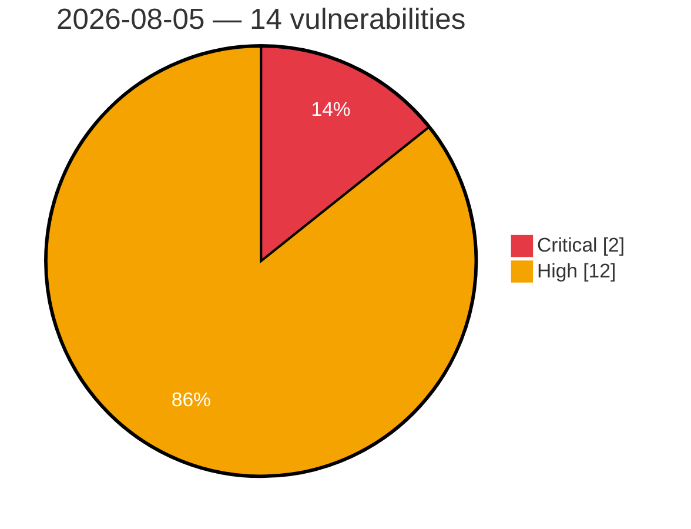

# Critical & High Severity Vulnerabilities — 2026-08-05

**Source:** cvefeed.io (High/Critical)
**KEV (actively exploited):** 0  **Watchlist matches:** 6

## Critical (2)

| CVSS | Flags | CVE / Title | Reported |
|------|-------|-------------|----------|
| 10.0 | ⭐ | [CVE-2026-49004 - PostgreSQL Misconfiguration and Command Injection Vulnerability in ZTE NX799J (Red Magic 11 Air) Product](https://cvefeed.io/vuln/detail/CVE-2026-49004) | 38 minutes ago |
| 9.3 | — | [CVE-2026-9273 - Membership Plugin – Kadence Memberships <= 4.0.0 - Unauthenticated Password Reset Link Poisoning to Account Takeover](https://cvefeed.io/vuln/detail/CVE-2026-9273) | 1 hour, 38 minutes ago |

## High (12)

| CVSS | Flags | CVE / Title | Reported |
|------|-------|-------------|----------|
| 9.0 | — | [CVE-2026-18898 - UTT HiPER 1200GW ConfigAdvideo strcpy stack-based overflow](https://cvefeed.io/vuln/detail/CVE-2026-18898) | 3 hours, 38 minutes ago |
| 9.0 | — | [CVE-2026-18897 - UTT HiPER 1250GW getOneApConfTempEntry strcpy stack-based overflow](https://cvefeed.io/vuln/detail/CVE-2026-18897) | 5 hours, 38 minutes ago |
| 9.0 | — | [CVE-2026-18895 - UTT HiPER 1250GW APSecurity_5g strcpy stack-based overflow](https://cvefeed.io/vuln/detail/CVE-2026-18895) | 5 hours, 38 minutes ago |
| 8.8 | ⭐ | [CVE-2026-8761 - Dokan <= 5.0.2 - Missing Authorization to Authenticated (Vendor+) Privilege Escalation](https://cvefeed.io/vuln/detail/CVE-2026-8761) | 1 hour, 38 minutes ago |
| 8.8 | ⭐ | [CVE-2026-18322 - Smart Popup by Supsystic <= 1.12.0 - Unauthenticated Privilege Escalation to Administrator](https://cvefeed.io/vuln/detail/CVE-2026-18322) | 1 hour, 38 minutes ago |
| 8.7 | — | [CVE-2026-71190 - OpenStack Swift Proxy Server Regular Expression Denial of Service](https://cvefeed.io/vuln/detail/CVE-2026-71190) | 1 hour, 38 minutes ago |
| 8.7 | — | [CVE-2026-46334 - OpenSIPS: Denial of Service in SDP bandwidth parsing via QoS SDP cloning](https://cvefeed.io/vuln/detail/CVE-2026-46334) | 7 hours, 38 minutes ago |
| 8.7 | — | [CVE-2026-45809 - OpenSIPS: Denial of Service in watcherinfo XML generation from oversized watcher URI](https://cvefeed.io/vuln/detail/CVE-2026-45809) | 7 hours, 38 minutes ago |
| 8.4 | — | [CVE-2026-66839 - Integrated Systems Technologies NetKids iMark Unquoted Search Path Vulnerability](https://cvefeed.io/vuln/detail/CVE-2026-66839) | 1 hour, 38 minutes ago |
| 8.3 | ⭐ | [CVE-2026-18902 - H3C NX15 esps repeaterproc command injection](https://cvefeed.io/vuln/detail/CVE-2026-18902) | 1 hour, 38 minutes ago |
| 8.3 | ⭐ | [CVE-2026-18901 - H3C NX15 Web API esps service.add routine](https://cvefeed.io/vuln/detail/CVE-2026-18901) | 2 hours, 38 minutes ago |
| 8.3 | ⭐ | [CVE-2026-18900 - H3C NX15 Backend RPC esps file.exec os command injection](https://cvefeed.io/vuln/detail/CVE-2026-18900) | 2 hours, 38 minutes ago |
