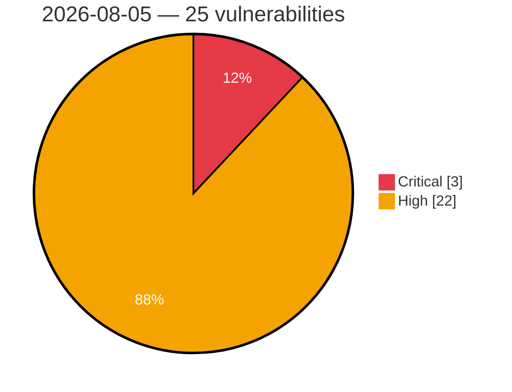

# Critical & High Severity Vulnerabilities — 2026-08-05

**Source:** cvefeed.io (High/Critical)
**KEV (actively exploited):** 0  **Watchlist matches:** 13

## Critical (3)

| CVSS | Flags | CVE / Title | Reported |
|------|-------|-------------|----------|
| 10.0 | ⭐ | [CVE-2026-48168 - PraisonAI: GitHub Actions Claude workflow command injection via unquoted PR branch name](https://cvefeed.io/vuln/detail/CVE-2026-48168) | 2 hours, 38 minutes ago |
| 9.9 | ⭐ | [CVE-2026-70615 - boringproxy 0.10.0 SSH authorized_keys Injection via Tunnel Creation](https://cvefeed.io/vuln/detail/CVE-2026-70615) | 1 hour, 38 minutes ago |
| 9.0 | ⭐ | [CVE-2026-70426 - Jenkins Remoting Deserialization Filter Bypass](https://cvefeed.io/vuln/detail/CVE-2026-70426) | 3 hours, 38 minutes ago |

## High (22)

| CVSS | Flags | CVE / Title | Reported |
|------|-------|-------------|----------|
| 8.8 | ⭐ | [CVE-2026-17556 - Path traversal in GitHub Enterprise Server allowed unauthenticated deletion of instance storage via the X-GitHub-Request-Id header](https://cvefeed.io/vuln/detail/CVE-2026-17556) | 1 hour, 38 minutes ago |
| 8.8 | — | [CVE-2026-9201 - Langflow OSS is affected by arbitrary code execution in component generation, validation, and custom component handling](https://cvefeed.io/vuln/detail/CVE-2026-9201) | 2 hours, 37 minutes ago |
| 8.8 | — | [CVE-2026-8478 - Langflow OSS is affected by arbitrary code execution in component generation, validation, and custom component handling](https://cvefeed.io/vuln/detail/CVE-2026-8478) | 2 hours, 38 minutes ago |
| 8.8 | — | [CVE-2026-8182 - Langflow OSS is affected by arbitrary code execution in component generation, validation, and custom component handling](https://cvefeed.io/vuln/detail/CVE-2026-8182) | 2 hours, 38 minutes ago |
| 8.8 | — | [CVE-2026-17632 - Langflow OSS is affected by arbitrary code execution in component generation, validation, and custom component handling](https://cvefeed.io/vuln/detail/CVE-2026-17632) | 2 hours, 38 minutes ago |
| 8.8 | ⭐ | [CVE-2026-70432 - Jenkins Multijob Plugin Cross-Site Request Forgery Vulnerability](https://cvefeed.io/vuln/detail/CVE-2026-70432) | 3 hours, 38 minutes ago |
| 8.8 | — | [CVE-2026-70431 - Jenkins Multijob Plugin Arbitrary Code Execution Vulnerability](https://cvefeed.io/vuln/detail/CVE-2026-70431) | 3 hours, 38 minutes ago |
| 8.8 | — | [CVE-2026-20312 - Cisco Catalyst SD-WAN Security Hardening Release - Information Disclosure Vulnerabilities](https://cvefeed.io/vuln/detail/CVE-2026-20312) | 4 hours, 38 minutes ago |
| 8.7 | ⭐ | [CVE-2026-69111 - Milvus 2.6.22, 3.0.0 Unauthenticated Denial of Service via /management/stop](https://cvefeed.io/vuln/detail/CVE-2026-69111) | 1 hour, 38 minutes ago |
| 8.6 | ⭐ | [CVE-2026-71309 - rclone: Incomplete path validation allows backend root escape in serve restic](https://cvefeed.io/vuln/detail/CVE-2026-71309) | 38 minutes ago |
| 8.6 | ⭐ | [CVE-2026-70617 - Spacebar Server Missing Authorization via Group DM Recipient Endpoint](https://cvefeed.io/vuln/detail/CVE-2026-70617) | 1 hour, 38 minutes ago |
| 8.6 | ⭐ | [CVE-2026-66298 - JS-view sandboxed output can synthesize keyboard events to trigger unconfirmed global shortcuts](https://cvefeed.io/vuln/detail/CVE-2026-66298) | 1 hour, 38 minutes ago |
| 8.6 | ⭐ | [CVE-2026-18953 - Improper limitation of a pathname to a restricted directory in aws-transform-mcp-server](https://cvefeed.io/vuln/detail/CVE-2026-18953) | 1 hour, 38 minutes ago |
| 8.5 | — | [CVE-2026-17633 - Langflow OSS is affected by arbitrary code execution in component generation, validation, and custom component handling](https://cvefeed.io/vuln/detail/CVE-2026-17633) | 2 hours, 38 minutes ago |
| 8.5 | — | [CVE-2026-17624 - Langflow OSS is affected by arbitrary code execution in component generation, validation, and custom component handling](https://cvefeed.io/vuln/detail/CVE-2026-17624) | 2 hours, 38 minutes ago |
| 8.5 | — | [CVE-2026-9077 - Reliance on Untrusted Inputs in a Security Decision vulnerabilities in Model Context Protocol features](https://cvefeed.io/vuln/detail/CVE-2026-9077) | 4 hours, 38 minutes ago |
| 8.4 | — | [CVE-2026-17583 - Thermo Fisher Applied Biosystems Genetic Analyzers Missing Support for Integrity Check](https://cvefeed.io/vuln/detail/CVE-2026-17583) | 38 minutes ago |
| 8.3 | ⭐ | [CVE-2026-34966 - Gitea prior to 1.27.0 SSRF via Migration URI Fetch Bypass](https://cvefeed.io/vuln/detail/CVE-2026-34966) | 38 minutes ago |
| 8.2 | ⭐ | [CVE-2026-71315 - Nuxt route rules silently dropped for mixed-case paths, bypassing appMiddleware auth gates (incomplete fix for CVE-2026-53721)](https://cvefeed.io/vuln/detail/CVE-2026-71315) | 38 minutes ago |
| 8.1 | — | [CVE-2026-18411 - Use of hard-coded cryptographic key in Acrisure KARR BT and DR-100](https://cvefeed.io/vuln/detail/CVE-2026-18411) | 38 minutes ago |
| 8.1 | — | [CVE-2026-9196 - Langflow OSS is affected by arbitrary code execution in component generation, validation, and custom component handling](https://cvefeed.io/vuln/detail/CVE-2026-9196) | 2 hours, 37 minutes ago |
| 8.0 | ⭐ | [CVE-2026-71312 - rclone: PowerShell Smart-Quote Filename Injection Enables SFTP Server-Side Command Execution](https://cvefeed.io/vuln/detail/CVE-2026-71312) | 38 minutes ago |
