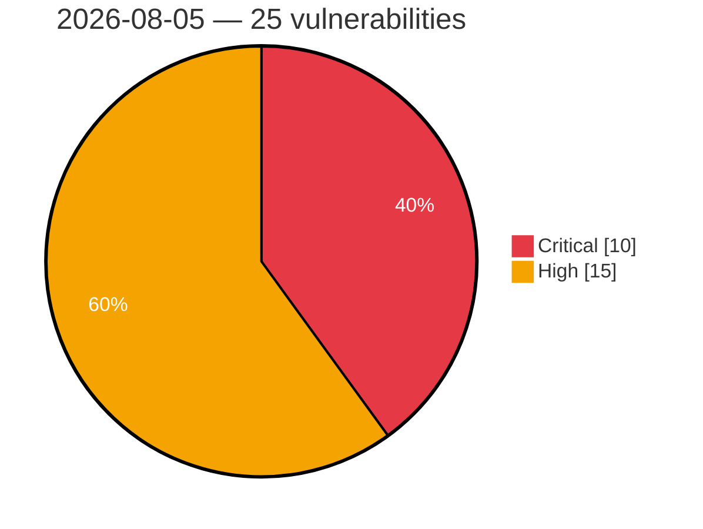

# Critical & High Severity Vulnerabilities — 2026-08-05

**Source:** cvefeed.io (High/Critical)
**KEV (actively exploited):** 0  **Watchlist matches:** 12

## Critical (10)

| CVSS | Flags | CVE / Title | Reported |
|------|-------|-------------|----------|
| 9.9 | ⭐ | [CVE-2026-20304 - Cisco Catalyst SD-WAN Security Hardening Release - Access Control Vulnerabilities](https://cvefeed.io/vuln/detail/CVE-2026-20304) | 38 minutes ago |
| 9.9 | — | [CVE-2026-20303 - Cisco Catalyst SD-WAN Security Hardening Release - Input Validation Vulnerabilities](https://cvefeed.io/vuln/detail/CVE-2026-20303) | 38 minutes ago |
| 9.9 | ⭐ | [CVE-2026-9193 - Privilege escalation in Progress MarkLogic Server Hadoop integration](https://cvefeed.io/vuln/detail/CVE-2026-9193) | 1 hour, 38 minutes ago |
| 9.9 | ⭐ | [CVE-2026-8709 - Privilege escalation in Progress MarkLogic Server REST document patch operation](https://cvefeed.io/vuln/detail/CVE-2026-8709) | 1 hour, 38 minutes ago |
| 9.8 | — | [CVE-2026-20272 - Cisco IOS XE Software Security Hardening Release](https://cvefeed.io/vuln/detail/CVE-2026-20272) | 38 minutes ago |
| 9.8 | ⭐ | [CVE-2026-9192 - Authentication bypass in Progress MarkLogic Server ODBC App Server](https://cvefeed.io/vuln/detail/CVE-2026-9192) | 1 hour, 38 minutes ago |
| 9.3 | ⭐ | [CVE-2026-9195 - Cross-site scripting in Progress MarkLogic Server Query Console](https://cvefeed.io/vuln/detail/CVE-2026-9195) | 1 hour, 38 minutes ago |
| 9.1 | — | [CVE-2026-20310 - Cisco SD-WAN Software Security Hardening Release - Improper Link Resolution Before File Access](https://cvefeed.io/vuln/detail/CVE-2026-20310) | 38 minutes ago |
| 9.1 | — | [CVE-2026-9190 - HTTP request smuggling in Progress MarkLogic Server](https://cvefeed.io/vuln/detail/CVE-2026-9190) | 1 hour, 38 minutes ago |
| 9.0 | ⭐ | [CVE-2026-20267 - Cisco IOS XE Software Security Hardening Release](https://cvefeed.io/vuln/detail/CVE-2026-20267) | 38 minutes ago |

## High (15)

| CVSS | Flags | CVE / Title | Reported |
|------|-------|-------------|----------|
| 8.8 | — | [CVE-2026-20312 - Cisco Catalyst SD-WAN Security Hardening Release - Information Disclosure Vulnerabilities](https://cvefeed.io/vuln/detail/CVE-2026-20312) | 38 minutes ago |
| 8.8 | ⭐ | [CVE-2026-20200 - Cisco Integrated Management Controller Argument Injection and Remote Code Execution Vulnerability](https://cvefeed.io/vuln/detail/CVE-2026-20200) | 38 minutes ago |
| 8.8 | ⭐ | [CVE-2026-17626 - Langflow is affected by security vulnerabilities in Model Context Protocol features](https://cvefeed.io/vuln/detail/CVE-2026-17626) | 38 minutes ago |
| 8.8 | ⭐ | [CVE-2026-17623 - Langflow is affected OS Command Injection in Model Context Protocol features](https://cvefeed.io/vuln/detail/CVE-2026-17623) | 38 minutes ago |
| 8.6 | — | [CVE-2026-20301 - Cisco IOS Software and IOS XE Software Extensible Messaging Client Protocol Denial of Service Vulnerability](https://cvefeed.io/vuln/detail/CVE-2026-20301) | 38 minutes ago |
| 8.6 | — | [CVE-2026-20273 - Cisco IOS XE Software Security Hardening Release](https://cvefeed.io/vuln/detail/CVE-2026-20273) | 38 minutes ago |
| 8.6 | — | [CVE-2026-20271 - Cisco IOS XE Software Security Hardening Release](https://cvefeed.io/vuln/detail/CVE-2026-20271) | 38 minutes ago |
| 8.6 | — | [CVE-2026-20270 - Cisco IOS XE Software Security Hardening Release](https://cvefeed.io/vuln/detail/CVE-2026-20270) | 38 minutes ago |
| 8.6 | ⭐ | [CVE-2026-20269 - Cisco IOS XE Software Security Hardening Release](https://cvefeed.io/vuln/detail/CVE-2026-20269) | 38 minutes ago |
| 8.6 | — | [CVE-2026-20268 - Cisco IOS XE Software Security Hardening Release](https://cvefeed.io/vuln/detail/CVE-2026-20268) | 38 minutes ago |
| 8.6 | — | [CVE-2026-20263 - Cisco IOS XE Software Blocks Extensible Exchange Protocol Denial of Service Vulnerability](https://cvefeed.io/vuln/detail/CVE-2026-20263) | 38 minutes ago |
| 8.5 | — | [CVE-2026-9077 - Reliance on Untrusted Inputs in a Security Decision vulnerabilities in Model Context Protocol features](https://cvefeed.io/vuln/detail/CVE-2026-9077) | 38 minutes ago |
| 8.5 | ⭐ | [CVE-2026-17617 - Server-Side Request Forgery (SSRF) in IBM Application Gateway Operator](https://cvefeed.io/vuln/detail/CVE-2026-17617) | 38 minutes ago |
| 8.5 | ⭐ | [CVE-2026-9203 - Server-side request forgery in Progress MarkLogic Server](https://cvefeed.io/vuln/detail/CVE-2026-9203) | 1 hour, 38 minutes ago |
| 8.1 | — | [CVE-2026-8400 - Multiple Vulnerabilities in IBM® Java SDK affect IBM WebSphere Application Server and WebSphere Application Server Liberty due to the July 2026 CPU](https://cvefeed.io/vuln/detail/CVE-2026-8400) | 1 hour, 38 minutes ago |
