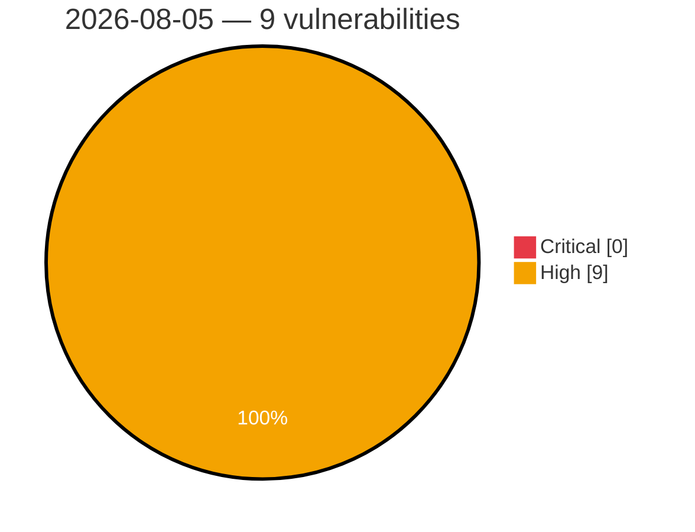

# Critical & High Severity Vulnerabilities — 2026-08-05

**Source:** cvefeed.io (High/Critical)
**KEV (actively exploited):** 0  **Watchlist matches:** 2

## High (9)

| CVSS | Flags | CVE / Title | Reported |
|------|-------|-------------|----------|
| 9.0 | — | [CVE-2026-18898 - UTT HiPER 1200GW ConfigAdvideo strcpy stack-based overflow](https://cvefeed.io/vuln/detail/CVE-2026-18898) | 1 hour, 40 minutes ago |
| 9.0 | — | [CVE-2026-18897 - UTT HiPER 1250GW getOneApConfTempEntry strcpy stack-based overflow](https://cvefeed.io/vuln/detail/CVE-2026-18897) | 3 hours, 41 minutes ago |
| 9.0 | — | [CVE-2026-18895 - UTT HiPER 1250GW APSecurity_5g strcpy stack-based overflow](https://cvefeed.io/vuln/detail/CVE-2026-18895) | 3 hours, 41 minutes ago |
| 8.7 | — | [CVE-2026-71190 - OpenStack Swift Proxy Server Regular Expression Denial of Service](https://cvefeed.io/vuln/detail/CVE-2026-71190) | 1 hour, 4 minutes ago |
| 8.7 | — | [CVE-2026-46334 - OpenSIPS: Denial of Service in SDP bandwidth parsing via QoS SDP cloning](https://cvefeed.io/vuln/detail/CVE-2026-46334) | 5 hours, 41 minutes ago |
| 8.7 | — | [CVE-2026-45809 - OpenSIPS: Denial of Service in watcherinfo XML generation from oversized watcher URI](https://cvefeed.io/vuln/detail/CVE-2026-45809) | 5 hours, 41 minutes ago |
| 8.4 | — | [CVE-2026-66839 - Integrated Systems Technologies NetKids iMark Unquoted Search Path Vulnerability](https://cvefeed.io/vuln/detail/CVE-2026-66839) | 1 hour, 31 minutes ago |
| 8.3 | ⭐ | [CVE-2026-18901 - H3C NX15 Web API esps service.add routine](https://cvefeed.io/vuln/detail/CVE-2026-18901) | 41 minutes ago |
| 8.3 | ⭐ | [CVE-2026-18900 - H3C NX15 Backend RPC esps file.exec os command injection](https://cvefeed.io/vuln/detail/CVE-2026-18900) | 41 minutes ago |
