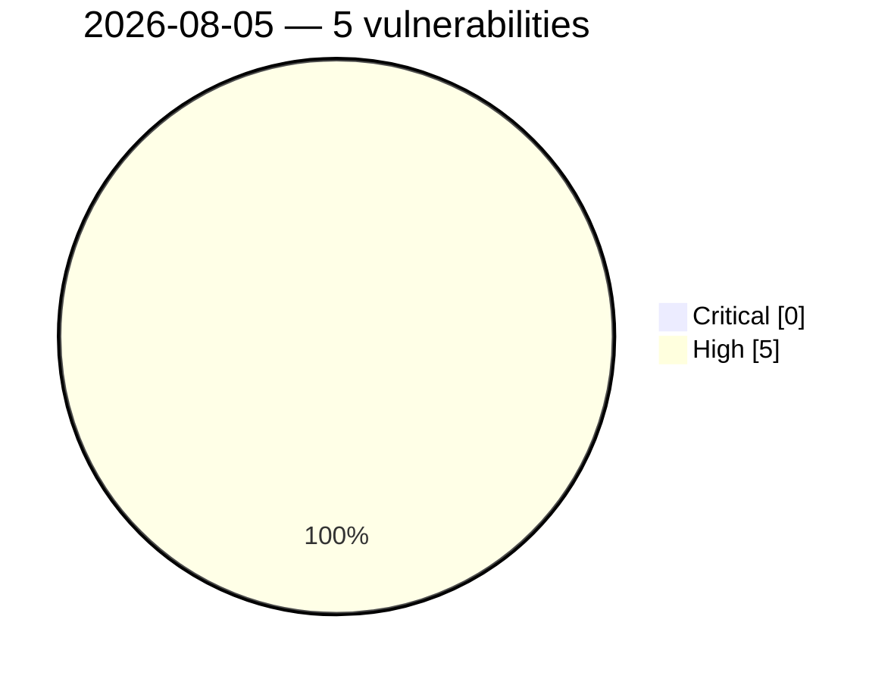

# Critical & High Severity Vulnerabilities — 2026-08-05

🔥 Actively exploited (KEV): **0**  |  ⭐ Watchlist matches: **0**

## 🟠 High (5)

- **(CVSS 9.0)** [CVE-2026-18898 - UTT HiPER 1200GW ConfigAdvideo strcpy stack-based overflow](https://cvefeed.io/vuln/detail/CVE-2026-18898) — _cvefeed.io (High/Critical)_ (2026-08-05 04:17 UTC) — _reported 29 minutes ago_
- **(CVSS 9.0)** [CVE-2026-18897 - UTT HiPER 1250GW getOneApConfTempEntry strcpy stack-based overflow](https://cvefeed.io/vuln/detail/CVE-2026-18897) — _cvefeed.io (High/Critical)_ (2026-08-05 02:16 UTC) — _reported 2 hours, 30 minutes ago_
- **(CVSS 9.0)** [CVE-2026-18895 - UTT HiPER 1250GW APSecurity_5g strcpy stack-based overflow](https://cvefeed.io/vuln/detail/CVE-2026-18895) — _cvefeed.io (High/Critical)_ (2026-08-05 02:16 UTC) — _reported 2 hours, 30 minutes ago_
- **(CVSS 8.7)** [CVE-2026-46334 - OpenSIPS: Denial of Service in SDP bandwidth parsing via QoS SDP cloning](https://cvefeed.io/vuln/detail/CVE-2026-46334) — _cvefeed.io (High/Critical)_ (2026-08-05 00:17 UTC) — _reported 4 hours, 30 minutes ago_
- **(CVSS 8.7)** [CVE-2026-45809 - OpenSIPS: Denial of Service in watcherinfo XML generation from oversized watcher URI](https://cvefeed.io/vuln/detail/CVE-2026-45809) — _cvefeed.io (High/Critical)_ (2026-08-05 00:17 UTC) — _reported 4 hours, 30 minutes ago_
