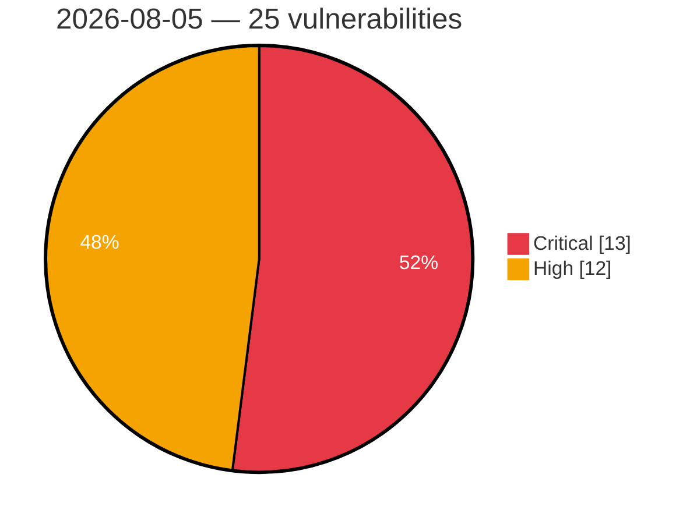

# Critical & High Severity Vulnerabilities — 2026-08-05

**Source:** cvefeed.io (High/Critical)
**KEV (actively exploited):** 0  **Watchlist matches:** 21

## Critical (13)

| CVSS | Flags | CVE / Title | Reported |
|------|-------|-------------|----------|
| 9.9 | ⭐ | [CVE-2026-10090 - Multicluster-operators-subscription: multicluster-operators-subscription: namespace edit user can deploy cluster-scoped clusterrolebinding and become cluster-admin via application subscription](https://cvefeed.io/vuln/detail/CVE-2026-10090) | 3 hours, 15 minutes ago |
| 9.8 | — | [CVE-2026-71256 - nanoMODBUS Client-Side Out-of-Bounds Read Leading to Wild-Pointer Write via object_id](https://cvefeed.io/vuln/detail/CVE-2026-71256) | 14 minutes ago |
| 9.8 | ⭐ | [CVE-2026-71254 - nanoMODBUS Server-Side Out-of-Bounds Write in handle_read_file_record()](https://cvefeed.io/vuln/detail/CVE-2026-71254) | 14 minutes ago |
| 9.8 | ⭐ | [CVE-2026-71248 - Inventory-Management-System-PHP: Unauthenticated SQL Injection in Login and Product Deletion](https://cvefeed.io/vuln/detail/CVE-2026-71248) | 1 hour, 17 minutes ago |
| 9.8 | ⭐ | [CVE-2026-71237 - Miantang IoT-PHP: Unauthenticated SQL Injection in /userlogin](https://cvefeed.io/vuln/detail/CVE-2026-71237) | 1 hour, 17 minutes ago |
| 9.8 | ⭐ | [CVE-2026-71231 - IOTSmartHome: Unauthenticated SQL Injection via lastLogin Cookie](https://cvefeed.io/vuln/detail/CVE-2026-71231) | 1 hour, 17 minutes ago |
| 9.8 | ⭐ | [CVE-2026-66747 - ENDLESSDOORS: Zbtlink Router rctl/kworker Phone-Home Root Implant](https://cvefeed.io/vuln/detail/CVE-2026-66747) | 1 hour, 17 minutes ago |
| 9.8 | ⭐ | [CVE-2026-71214 - NASA-AMMOS plandev: Client-Supplied session_variables Bypass Hasura-Origin Authorization in sequencing-server](https://cvefeed.io/vuln/detail/CVE-2026-71214) | 4 hours, 17 minutes ago |
| 9.8 | ⭐ | [CVE-2026-71207 - Stock-Inventory-Management-System: Unauthenticated SQL Injection and Hardcoded Credentials in login.php Enable Full Authentication Bypass](https://cvefeed.io/vuln/detail/CVE-2026-71207) | 4 hours, 17 minutes ago |
| 9.1 | ⭐ | [CVE-2026-71238 - DjangoCRM: Hardcoded Django SECRET_KEY Enables Session and CSRF Token Forgery](https://cvefeed.io/vuln/detail/CVE-2026-71238) | 1 hour, 17 minutes ago |
| 9.1 | ⭐ | [CVE-2026-44945 - Cross-Cluster Impersonation Confused-Deputy Privilege Escalation](https://cvefeed.io/vuln/detail/CVE-2026-44945) | 2 hours, 16 minutes ago |
| 9.1 | ⭐ | [CVE-2026-10059 - Cluster-curator-controller: cluster-curator-controller: namespace admin can escalate to cluster-wide curator authority via clustercurator serviceaccount token](https://cvefeed.io/vuln/detail/CVE-2026-10059) | 3 hours, 15 minutes ago |
| 9.1 | ⭐ | [CVE-2026-71213 - typemill: No Rate Limiting on Login Endpoint Enables Unlimited Password Brute-Force](https://cvefeed.io/vuln/detail/CVE-2026-71213) | 4 hours, 17 minutes ago |

## High (12)

| CVSS | Flags | CVE / Title | Reported |
|------|-------|-------------|----------|
| 8.8 | ⭐ | [CVE-2026-71243 - backmeup (npm): OS Command Injection via Backup Option Values](https://cvefeed.io/vuln/detail/CVE-2026-71243) | 1 hour, 17 minutes ago |
| 8.8 | ⭐ | [CVE-2026-71235 - Magistrala IoT Platform: Unrestricted Go/Lua Script Execution in Rules Engine](https://cvefeed.io/vuln/detail/CVE-2026-71235) | 1 hour, 17 minutes ago |
| 8.8 | ⭐ | [CVE-2026-60009 - Eclipse Theia Arbitrary File Write Vulnerability](https://cvefeed.io/vuln/detail/CVE-2026-60009) | 1 hour, 17 minutes ago |
| 8.7 | ⭐ | [CVE-2026-71236 - Grocy: Stored XSS via HTMLPurifier Output Double-Decode](https://cvefeed.io/vuln/detail/CVE-2026-71236) | 1 hour, 17 minutes ago |
| 8.7 | ⭐ | [CVE-2026-71233 - InvoiceNinja: Stored XSS via Invoice/Quote Terms Field](https://cvefeed.io/vuln/detail/CVE-2026-71233) | 1 hour, 17 minutes ago |
| 8.6 | — | [CVE-2026-71255 - nanoMODBUS Client-Side Out-of-Bounds Write via object_length in recv_read_device_identification_res()](https://cvefeed.io/vuln/detail/CVE-2026-71255) | 14 minutes ago |
| 8.3 | ⭐ | [CVE-2026-71242 - Crater: Cross-Company IDOR on Notes via Missing Company-Ownership Check in NotePolicy](https://cvefeed.io/vuln/detail/CVE-2026-71242) | 1 hour, 17 minutes ago |
| 8.3 | ⭐ | [CVE-2026-71206 - shiori: JWT CheckToken Never Re-Validates Account State, Allowing Stale-Privilege Access After Deletion or Demotion](https://cvefeed.io/vuln/detail/CVE-2026-71206) | 4 hours, 17 minutes ago |
| 8.2 | ⭐ | [CVE-2026-71252 - toner-management: Unauthenticated State-Changing Admin Actions](https://cvefeed.io/vuln/detail/CVE-2026-71252) | 1 hour, 17 minutes ago |
| 8.1 | ⭐ | [CVE-2026-71239 - DjangoCRM: Server-Side Template Injection in Mass Mail Message Rendering](https://cvefeed.io/vuln/detail/CVE-2026-71239) | 1 hour, 17 minutes ago |
| 8.1 | — | [CVE-2026-7520 - MailChimp Forms by MailMunch <= 3.2.7 - Missing Authorization to Authenticated (Subscriber+) MailMunch Integration Takeover via 'sign_in' AJAX Action](https://cvefeed.io/vuln/detail/CVE-2026-7520) | 4 hours, 17 minutes ago |
| 8.1 | — | [CVE-2026-7444 - Search Analytics for WP <= 1.4.16 - Cross-Site Request Forgery](https://cvefeed.io/vuln/detail/CVE-2026-7444) | 4 hours, 17 minutes ago |
