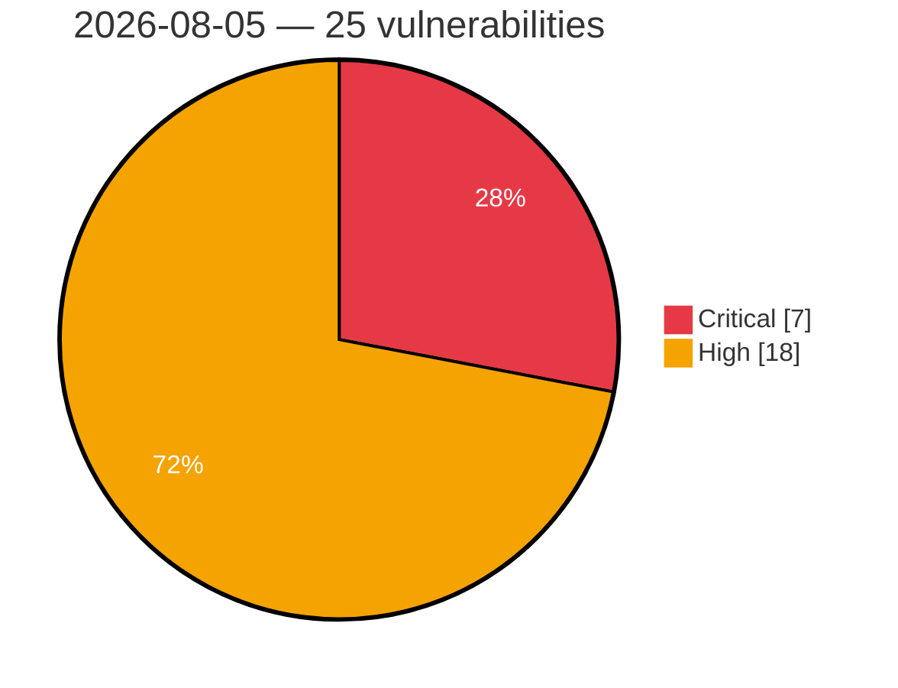

# Critical & High Severity Vulnerabilities — 2026-08-05

**Source:** cvefeed.io (High/Critical)
**KEV (actively exploited):** 0  **Watchlist matches:** 8

## Critical (7)

| CVSS | Flags | CVE / Title | Reported |
|------|-------|-------------|----------|
| 10.0 | ⭐ | [CVE-2026-48168 - PraisonAI: GitHub Actions Claude workflow command injection via unquoted PR branch name](https://cvefeed.io/vuln/detail/CVE-2026-48168) | 41 minutes ago |
| 9.9 | ⭐ | [CVE-2026-70615 - boringproxy 0.10.0 SSH authorized_keys Injection via Tunnel Creation](https://cvefeed.io/vuln/detail/CVE-2026-70615) | 25 minutes ago |
| 9.9 | ⭐ | [CVE-2026-20304 - Cisco Catalyst SD-WAN Security Hardening Release - Access Control Vulnerabilities](https://cvefeed.io/vuln/detail/CVE-2026-20304) | 2 hours, 42 minutes ago |
| 9.9 | — | [CVE-2026-20303 - Cisco Catalyst SD-WAN Security Hardening Release - Input Validation Vulnerabilities](https://cvefeed.io/vuln/detail/CVE-2026-20303) | 2 hours, 42 minutes ago |
| 9.8 | — | [CVE-2026-20272 - Cisco IOS XE Software Security Hardening Release](https://cvefeed.io/vuln/detail/CVE-2026-20272) | 2 hours, 42 minutes ago |
| 9.1 | — | [CVE-2026-20310 - Cisco SD-WAN Software Security Hardening Release - Improper Link Resolution Before File Access](https://cvefeed.io/vuln/detail/CVE-2026-20310) | 2 hours, 42 minutes ago |
| 9.0 | ⭐ | [CVE-2026-70426 - Jenkins Remoting Deserialization Filter Bypass](https://cvefeed.io/vuln/detail/CVE-2026-70426) | 1 hour, 42 minutes ago |

## High (18)

| CVSS | Flags | CVE / Title | Reported |
|------|-------|-------------|----------|
| 8.8 | — | [CVE-2026-9201 - Langflow OSS is affected by arbitrary code execution in component generation, validation, and custom component handling](https://cvefeed.io/vuln/detail/CVE-2026-9201) | 41 minutes ago |
| 8.8 | — | [CVE-2026-8478 - Langflow OSS is affected by arbitrary code execution in component generation, validation, and custom component handling](https://cvefeed.io/vuln/detail/CVE-2026-8478) | 41 minutes ago |
| 8.8 | — | [CVE-2026-8182 - Langflow OSS is affected by arbitrary code execution in component generation, validation, and custom component handling](https://cvefeed.io/vuln/detail/CVE-2026-8182) | 41 minutes ago |
| 8.8 | — | [CVE-2026-17632 - Langflow OSS is affected by arbitrary code execution in component generation, validation, and custom component handling](https://cvefeed.io/vuln/detail/CVE-2026-17632) | 42 minutes ago |
| 8.8 | ⭐ | [CVE-2026-70432 - Jenkins Multijob Plugin Cross-Site Request Forgery Vulnerability](https://cvefeed.io/vuln/detail/CVE-2026-70432) | 1 hour, 42 minutes ago |
| 8.8 | — | [CVE-2026-70431 - Jenkins Multijob Plugin Arbitrary Code Execution Vulnerability](https://cvefeed.io/vuln/detail/CVE-2026-70431) | 1 hour, 42 minutes ago |
| 8.8 | — | [CVE-2026-20312 - Cisco Catalyst SD-WAN Security Hardening Release - Information Disclosure Vulnerabilities](https://cvefeed.io/vuln/detail/CVE-2026-20312) | 2 hours, 42 minutes ago |
| 8.7 | ⭐ | [CVE-2026-69111 - Milvus 2.6.22, 3.0.0 Unauthenticated Denial of Service via /management/stop](https://cvefeed.io/vuln/detail/CVE-2026-69111) | 41 minutes ago |
| 8.6 | ⭐ | [CVE-2026-18953 - Improper limitation of a pathname to a restricted directory in aws-transform-mcp-server](https://cvefeed.io/vuln/detail/CVE-2026-18953) | 26 minutes ago |
| 8.6 | — | [CVE-2026-20301 - Cisco IOS Software and IOS XE Software Extensible Messaging Client Protocol Denial of Service Vulnerability](https://cvefeed.io/vuln/detail/CVE-2026-20301) | 2 hours, 42 minutes ago |
| 8.6 | — | [CVE-2026-20273 - Cisco IOS XE Software Security Hardening Release](https://cvefeed.io/vuln/detail/CVE-2026-20273) | 2 hours, 42 minutes ago |
| 8.6 | — | [CVE-2026-20271 - Cisco IOS XE Software Security Hardening Release](https://cvefeed.io/vuln/detail/CVE-2026-20271) | 2 hours, 42 minutes ago |
| 8.6 | — | [CVE-2026-20270 - Cisco IOS XE Software Security Hardening Release](https://cvefeed.io/vuln/detail/CVE-2026-20270) | 2 hours, 42 minutes ago |
| 8.5 | ⭐ | [CVE-2026-18485 - Local Privilege Escalation in NI-PAL](https://cvefeed.io/vuln/detail/CVE-2026-18485) | 42 minutes ago |
| 8.5 | — | [CVE-2026-17633 - Langflow OSS is affected by arbitrary code execution in component generation, validation, and custom component handling](https://cvefeed.io/vuln/detail/CVE-2026-17633) | 42 minutes ago |
| 8.5 | — | [CVE-2026-17624 - Langflow OSS is affected by arbitrary code execution in component generation, validation, and custom component handling](https://cvefeed.io/vuln/detail/CVE-2026-17624) | 42 minutes ago |
| 8.5 | — | [CVE-2026-9077 - Reliance on Untrusted Inputs in a Security Decision vulnerabilities in Model Context Protocol features](https://cvefeed.io/vuln/detail/CVE-2026-9077) | 2 hours, 42 minutes ago |
| 8.1 | — | [CVE-2026-9196 - Langflow OSS is affected by arbitrary code execution in component generation, validation, and custom component handling](https://cvefeed.io/vuln/detail/CVE-2026-9196) | 41 minutes ago |
