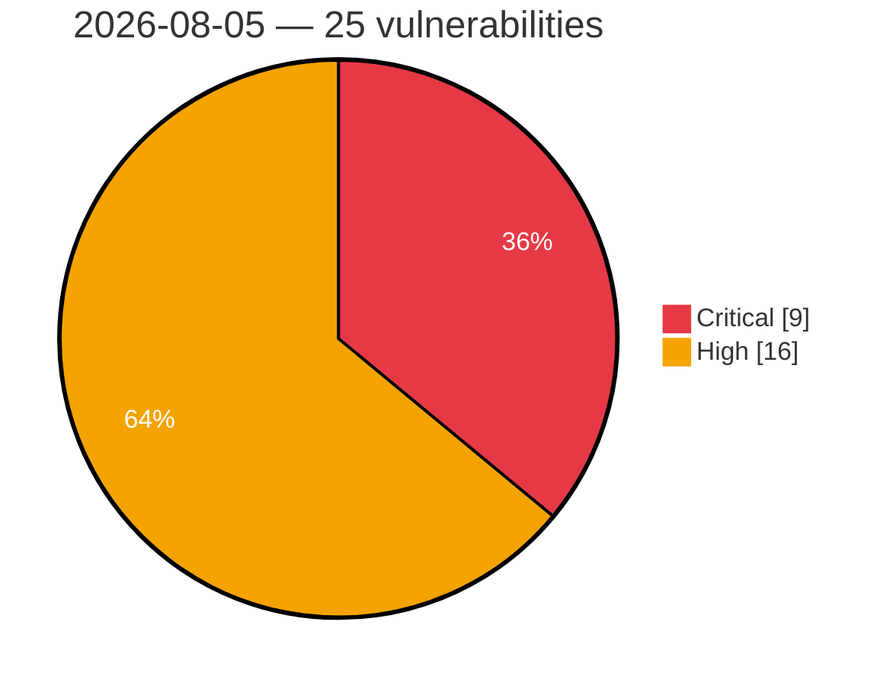

# Critical & High Severity Vulnerabilities — 2026-08-05

**Source:** cvefeed.io (High/Critical)
**KEV (actively exploited):** 0  **Watchlist matches:** 17

## Critical (9)

| CVSS | Flags | CVE / Title | Reported |
|------|-------|-------------|----------|
| 9.9 | ⭐ | [CVE-2026-10090 - Multicluster-operators-subscription: multicluster-operators-subscription: namespace edit user can deploy cluster-scoped clusterrolebinding and become cluster-admin via application subscription](https://cvefeed.io/vuln/detail/CVE-2026-10090) | 41 minutes ago |
| 9.8 | ⭐ | [CVE-2026-71214 - NASA-AMMOS plandev: Client-Supplied session_variables Bypass Hasura-Origin Authorization in sequencing-server](https://cvefeed.io/vuln/detail/CVE-2026-71214) | 1 hour, 42 minutes ago |
| 9.8 | ⭐ | [CVE-2026-71207 - Stock-Inventory-Management-System: Unauthenticated SQL Injection and Hardcoded Credentials in login.php Enable Full Authentication Bypass](https://cvefeed.io/vuln/detail/CVE-2026-71207) | 1 hour, 42 minutes ago |
| 9.6 | ⭐ | [CVE-2026-70376 - Pluck CMS: CSRF via Spoofable Missing-Referer Bypass Leads to Stored XSS and RCE](https://cvefeed.io/vuln/detail/CVE-2026-70376) | 1 hour, 42 minutes ago |
| 9.3 | — | [CVE-2026-9273 - Membership Plugin – Kadence Memberships <= 4.0.0 - Unauthenticated Password Reset Link Poisoning to Account Takeover](https://cvefeed.io/vuln/detail/CVE-2026-9273) | 3 hours, 42 minutes ago |
| 9.1 | ⭐ | [CVE-2026-10059 - Cluster-curator-controller: cluster-curator-controller: namespace admin can escalate to cluster-wide curator authority via clustercurator serviceaccount token](https://cvefeed.io/vuln/detail/CVE-2026-10059) | 41 minutes ago |
| 9.1 | ⭐ | [CVE-2026-71213 - typemill: No Rate Limiting on Login Endpoint Enables Unlimited Password Brute-Force](https://cvefeed.io/vuln/detail/CVE-2026-71213) | 1 hour, 42 minutes ago |
| 9.1 | ⭐ | [CVE-2026-5581 - Multi Uploader for Gravity Forms <= 1.1.8 - Missing Authorization to Unauthenticated Arbitrary Media Deletion](https://cvefeed.io/vuln/detail/CVE-2026-5581) | 1 hour, 42 minutes ago |
| 9.1 | — | [CVE-2026-4431 - Easy Post Submission <= 2.3.0 - Missing Authorization](https://cvefeed.io/vuln/detail/CVE-2026-4431) | 1 hour, 42 minutes ago |

## High (16)

| CVSS | Flags | CVE / Title | Reported |
|------|-------|-------------|----------|
| 9.0 | — | [CVE-2026-18898 - UTT HiPER 1200GW ConfigAdvideo strcpy stack-based overflow](https://cvefeed.io/vuln/detail/CVE-2026-18898) | 5 hours, 42 minutes ago |
| 9.0 | — | [CVE-2026-18897 - UTT HiPER 1250GW getOneApConfTempEntry strcpy stack-based overflow](https://cvefeed.io/vuln/detail/CVE-2026-18897) | 7 hours, 42 minutes ago |
| 8.8 | ⭐ | [CVE-2026-6147 - LightSync Pro <= 2.1.6 - Authenticated (Author+) Arbitrary File Upload](https://cvefeed.io/vuln/detail/CVE-2026-6147) | 1 hour, 42 minutes ago |
| 8.8 | ⭐ | [CVE-2026-55997 - Long-lived Rancher registration token exposed in plaintext](https://cvefeed.io/vuln/detail/CVE-2026-55997) | 1 hour, 42 minutes ago |
| 8.8 | ⭐ | [CVE-2026-8761 - Dokan <= 5.0.2 - Missing Authorization to Authenticated (Vendor+) Privilege Escalation](https://cvefeed.io/vuln/detail/CVE-2026-8761) | 3 hours, 42 minutes ago |
| 8.8 | ⭐ | [CVE-2026-18322 - Smart Popup by Supsystic <= 1.12.0 - Unauthenticated Privilege Escalation to Administrator](https://cvefeed.io/vuln/detail/CVE-2026-18322) | 3 hours, 42 minutes ago |
| 8.7 | — | [CVE-2026-71190 - OpenStack Swift Proxy Server Regular Expression Denial of Service](https://cvefeed.io/vuln/detail/CVE-2026-71190) | 3 hours, 42 minutes ago |
| 8.3 | ⭐ | [CVE-2026-71206 - shiori: JWT CheckToken Never Re-Validates Account State, Allowing Stale-Privilege Access After Deletion or Demotion](https://cvefeed.io/vuln/detail/CVE-2026-71206) | 1 hour, 42 minutes ago |
| 8.3 | ⭐ | [CVE-2026-55739 - Crater: Missing Tenant-Ownership Check in CustomerPolicy Allows Cross-Company Customer Data Theft and Deletion](https://cvefeed.io/vuln/detail/CVE-2026-55739) | 1 hour, 42 minutes ago |
| 8.3 | ⭐ | [CVE-2026-18902 - H3C NX15 esps repeaterproc command injection](https://cvefeed.io/vuln/detail/CVE-2026-18902) | 3 hours, 42 minutes ago |
| 8.3 | ⭐ | [CVE-2026-18901 - H3C NX15 Web API esps service.add routine](https://cvefeed.io/vuln/detail/CVE-2026-18901) | 4 hours, 42 minutes ago |
| 8.3 | ⭐ | [CVE-2026-18900 - H3C NX15 Backend RPC esps file.exec os command injection](https://cvefeed.io/vuln/detail/CVE-2026-18900) | 4 hours, 42 minutes ago |
| 8.2 | ⭐ | [CVE-2026-6627 - WPFormify <= 1.1.1 - Missing Authorization](https://cvefeed.io/vuln/detail/CVE-2026-6627) | 1 hour, 42 minutes ago |
| 8.1 | — | [CVE-2026-7520 - MailChimp Forms by MailMunch <= 3.2.7 - Missing Authorization to Authenticated (Subscriber+) MailMunch Integration Takeover via 'sign_in' AJAX Action](https://cvefeed.io/vuln/detail/CVE-2026-7520) | 1 hour, 42 minutes ago |
| 8.1 | — | [CVE-2026-7444 - Search Analytics for WP <= 1.4.16 - Cross-Site Request Forgery](https://cvefeed.io/vuln/detail/CVE-2026-7444) | 1 hour, 42 minutes ago |
| 8.1 | — | [CVE-2026-54418 - Leantime: Missing Authorization on TwoFA JSON-RPC Methods Allows Cross-Account 2FA Secret Disclosure and Bypass](https://cvefeed.io/vuln/detail/CVE-2026-54418) | 1 hour, 42 minutes ago |
