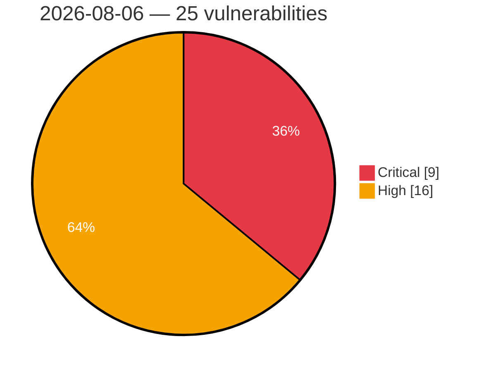

# Critical & High Severity Vulnerabilities — 2026-08-06

**Source:** cvefeed.io (High/Critical)
**KEV (actively exploited):** 0  **Watchlist matches:** 23

## Critical (9)

| CVSS | Flags | CVE / Title | Reported |
|------|-------|-------------|----------|
| 9.9 | ⭐ | [CVE-2026-67622 - Flowise 3.1.4 IDOR in OpenAI Assistants Integration](https://cvefeed.io/vuln/detail/CVE-2026-67622) | 32 minutes ago |
| 9.9 | ⭐ | [CVE-2026-48086 - OpenReception: Tenant admin self-promotes to GLOBAL_ADMIN](https://cvefeed.io/vuln/detail/CVE-2026-48086) | 33 minutes ago |
| 9.8 | ⭐ | [CVE-2026-70558 - Dinky Unauthenticated Arbitrary File Write via /download/uploadFromRsByLocal Gated Only by Hardcoded Default Token](https://cvefeed.io/vuln/detail/CVE-2026-70558) | 32 minutes ago |
| 9.8 | ⭐ | [CVE-2026-48087 - OpenReception: WebAuthn passkey injection allows account takeover](https://cvefeed.io/vuln/detail/CVE-2026-48087) | 33 minutes ago |
| 9.8 | ⭐ | [CVE-2026-48085 - OpenReception has unauthenticated GLOBAL_ADMIN account creation post-bootstrap](https://cvefeed.io/vuln/detail/CVE-2026-48085) | 33 minutes ago |
| 9.4 | ⭐ | [CVE-2026-48088 - OpenReception vulnerable to unauthenticated staff crypto poisoning that breaks E2E recipient directory](https://cvefeed.io/vuln/detail/CVE-2026-48088) | 33 minutes ago |
| 9.2 | ⭐ | [CVE-2026-5857 - Contiki-NG MQTT Client Out-of-Bounds Write in PUBLISH Topic Parser via Persistent State Between TCP Segments](https://cvefeed.io/vuln/detail/CVE-2026-5857) | 33 minutes ago |
| 9.2 | ⭐ | [CVE-2026-53983 - Ground Station prior to 0.6.0 Unauthenticated Persistent Blind Server-Side Request Forgery via Orbital Data Source URL](https://cvefeed.io/vuln/detail/CVE-2026-53983) | 33 minutes ago |
| 9.1 | ⭐ | [CVE-2026-53984 - Ground Station prior to 0.6.0 Unauthenticated Database Wipe and Arbitrary Data Injection via Socket.IO database_backup full_restore Action](https://cvefeed.io/vuln/detail/CVE-2026-53984) | 33 minutes ago |

## High (16)

| CVSS | Flags | CVE / Title | Reported |
|------|-------|-------------|----------|
| 8.8 | ⭐ | [CVE-2026-62857 - Fedify: Server-Side Request Forgery in getNodeInfo() Allows Access to Internal Network Resources](https://cvefeed.io/vuln/detail/CVE-2026-62857) | 32 minutes ago |
| 8.8 | ⭐ | [CVE-2026-48054 - OpenZeppelin Contracts Wizard has Code Injection in Generated Hardhat and Foundry Tests via Unsanitized opts.name / opts.uri](https://cvefeed.io/vuln/detail/CVE-2026-48054) | 34 minutes ago |
| 8.7 | ⭐ | [CVE-2026-71476 - Nx: Zip-Slip in the self-hosted remote cache](https://cvefeed.io/vuln/detail/CVE-2026-71476) | 32 minutes ago |
| 8.7 | ⭐ | [CVE-2026-70636 - Flowise 3.1.4 Authentication Bypass via OAuth2 Credential Refresh Endpoint](https://cvefeed.io/vuln/detail/CVE-2026-70636) | 32 minutes ago |
| 8.7 | ⭐ | [CVE-2026-70559 - Dinky Unauthenticated System Configuration and Credential Disclosure via GET /api/sysConfig/getAll](https://cvefeed.io/vuln/detail/CVE-2026-70559) | 32 minutes ago |
| 8.7 | — | [CVE-2026-5855 - Contiki-NG LwM2M TLV Parser Out-of-Bounds Read via Unchecked Buffer Length in lwm2m_tlv_read](https://cvefeed.io/vuln/detail/CVE-2026-5855) | 33 minutes ago |
| 8.6 | ⭐ | [CVE-2026-63725 - sysPass FileBackupService Authenticated OS Command Injection via Backup Path](https://cvefeed.io/vuln/detail/CVE-2026-63725) | 32 minutes ago |
| 8.6 | ⭐ | [CVE-2026-63637 - Dgraph: DQL Injection via unvalidated regexp filter argument in GraphQL query rewriter](https://cvefeed.io/vuln/detail/CVE-2026-63637) | 32 minutes ago |
| 8.5 | ⭐ | [CVE-2026-70638 - llama.cpp b1886–b7445 Integer Overflow via new_1batch() in llama-android.cpp](https://cvefeed.io/vuln/detail/CVE-2026-70638) | 32 minutes ago |
| 8.5 | ⭐ | [CVE-2026-70632 - FFmpeg 4.4 < 9.0 Heap Out-of-Bounds Write in CFHD Decoder via AVI Demuxing](https://cvefeed.io/vuln/detail/CVE-2026-70632) | 32 minutes ago |
| 8.5 | — | [CVE-2026-70628 - FFmpeg 0.5 < 9.0 DVB Subtitle Parser Heap Buffer Overflow via WTV File](https://cvefeed.io/vuln/detail/CVE-2026-70628) | 32 minutes ago |
| 8.2 | ⭐ | [CVE-2026-71445 - Authenticated Reflected Cross-Site Scripting in Tag Error Responses in ail-framework](https://cvefeed.io/vuln/detail/CVE-2026-71445) | 32 minutes ago |
| 8.1 | ⭐ | [CVE-2026-70634 - TimescaleDB 2.29.1 Out-of-Bounds Read Information Disclosure via Dictionary Compression Reverse Iterator](https://cvefeed.io/vuln/detail/CVE-2026-70634) | 32 minutes ago |
| 8.1 | ⭐ | [CVE-2026-64665 - Statamic: Account takeover via OAuth email matching without email-verification check](https://cvefeed.io/vuln/detail/CVE-2026-64665) | 32 minutes ago |
| 8.1 | ⭐ | [CVE-2026-48081 - OpenReception vulnerable to stored click-triggered XSS via javascript: tenant links rendered into patient-facing footer](https://cvefeed.io/vuln/detail/CVE-2026-48081) | 34 minutes ago |
| 8.0 | ⭐ | [CVE-2026-48080 - OpenReception's tenant detail endpoint discloses live PostgreSQL connection string, superuser-scoped in the tested official deployment](https://cvefeed.io/vuln/detail/CVE-2026-48080) | 34 minutes ago |
