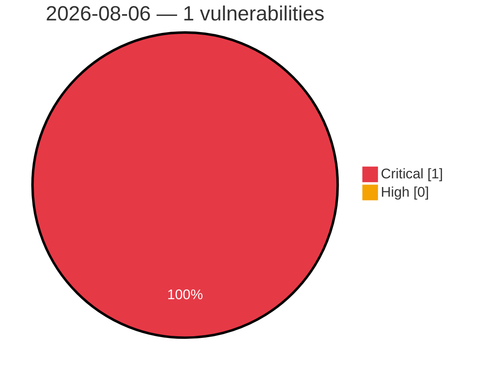

# Critical & High Severity Vulnerabilities — 2026-08-06

**Source:** cvefeed.io (High/Critical)
**KEV (actively exploited):** 0  **Watchlist matches:** 1

## Critical (1)

| CVSS | Flags | CVE / Title | Reported |
|------|-------|-------------|----------|
| 9.3 | ⭐ | [CVE-2026-67531 - FrontMCP: CodeCall sandbox escape -> host RCE via live Zod schema exposure by getTool](https://cvefeed.io/vuln/detail/CVE-2026-67531) | 1 hour, 38 minutes ago |
