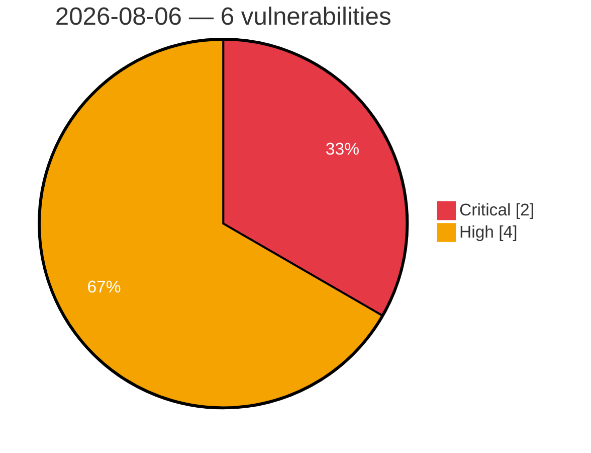

# Critical & High Severity Vulnerabilities — 2026-08-06

**Source:** cvefeed.io (High/Critical)
**KEV (actively exploited):** 0  **Watchlist matches:** 6

## Critical (2)

| CVSS | Flags | CVE / Title | Reported |
|------|-------|-------------|----------|
| 9.9 | ⭐ | [CVE-2026-67622 - Flowise 3.1.4 IDOR in OpenAI Assistants Integration](https://cvefeed.io/vuln/detail/CVE-2026-67622) | 10 hours, 33 minutes ago |
| 9.8 | ⭐ | [CVE-2026-70558 - Dinky Unauthenticated Arbitrary File Write via /download/uploadFromRsByLocal Gated Only by Hardcoded Default Token](https://cvefeed.io/vuln/detail/CVE-2026-70558) | 10 hours, 33 minutes ago |

## High (4)

| CVSS | Flags | CVE / Title | Reported |
|------|-------|-------------|----------|
| 8.7 | ⭐ | [CVE-2026-71476 - Nx: Zip-Slip in the self-hosted remote cache](https://cvefeed.io/vuln/detail/CVE-2026-71476) | 10 hours, 33 minutes ago |
| 8.2 | ⭐ | [CVE-2026-71445 - Authenticated Reflected Cross-Site Scripting in Tag Error Responses in ail-framework](https://cvefeed.io/vuln/detail/CVE-2026-71445) | 10 hours, 33 minutes ago |
| 8.1 | ⭐ | [CVE-2026-70634 - TimescaleDB 2.29.1 Out-of-Bounds Read Information Disclosure via Dictionary Compression Reverse Iterator](https://cvefeed.io/vuln/detail/CVE-2026-70634) | 10 hours, 33 minutes ago |
| 8.1 | ⭐ | [CVE-2026-64665 - Statamic: Account takeover via OAuth email matching without email-verification check](https://cvefeed.io/vuln/detail/CVE-2026-64665) | 10 hours, 33 minutes ago |
