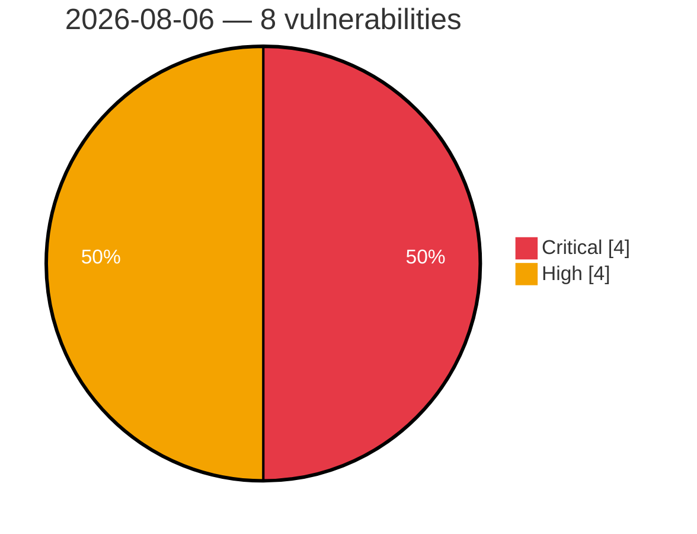

# Critical & High Severity Vulnerabilities — 2026-08-06

**Source:** cvefeed.io (High/Critical)
**KEV (actively exploited):** 0  **Watchlist matches:** 8

## Critical (4)

| CVSS | Flags | CVE / Title | Reported |
|------|-------|-------------|----------|
| 10.0 | ⭐ | [CVE-2026-5430 - Authentication Bypass via JWT Algorithm Mismatch in Multiple WSO2 Products Allows Account Takeover](https://cvefeed.io/vuln/detail/CVE-2026-5430) | 3 hours, 5 minutes ago |
| 9.8 | ⭐ | [CVE-2026-1728 - Privilege Escalation via System REST APIs in Multiple WSO2 Products Permits Admin Account Takeover](https://cvefeed.io/vuln/detail/CVE-2026-1728) | 3 hours, 5 minutes ago |
| 9.4 | ⭐ | [CVE-2025-15039 - Account Takeover via Conditional Authentication Script Logic in Multiple WSO2 Products](https://cvefeed.io/vuln/detail/CVE-2025-15039) | 3 hours, 5 minutes ago |
| 9.3 | ⭐ | [CVE-2026-67531 - FrontMCP: CodeCall sandbox escape -> host RCE via live Zod schema exposure by getTool](https://cvefeed.io/vuln/detail/CVE-2026-67531) | 11 hours, 5 minutes ago |

## High (4)

| CVSS | Flags | CVE / Title | Reported |
|------|-------|-------------|----------|
| 8.8 | ⭐ | [CVE-2026-15991 - File Manager 6.0 - 6.9 - Missing Authorization to Authenticated (Subscriber+) Arbitrary File Read and Deletion via 'cmd' Query Parameter](https://cvefeed.io/vuln/detail/CVE-2026-15991) | 6 hours, 5 minutes ago |
| 8.5 | ⭐ | [CVE-2026-18597 - Blind SSRF on Foxit PDF Services API](https://cvefeed.io/vuln/detail/CVE-2026-18597) | 3 hours, 5 minutes ago |
| 8.4 | ⭐ | [CVE-2026-55978 - Improper access control vulnerability in CatchPulse](https://cvefeed.io/vuln/detail/CVE-2026-55978) | 1 hour, 5 minutes ago |
| 8.1 | ⭐ | [CVE-2026-15459 - WPMU DEV Dashboard <= 5.0.0 - Authentication Bypass to Arbitrary Plugin Installation (Remote Code Execution) via Forged WDP_AUTH HMAC on ?wpmudev-hub= Endpoint](https://cvefeed.io/vuln/detail/CVE-2026-15459) | 5 hours, 5 minutes ago |
