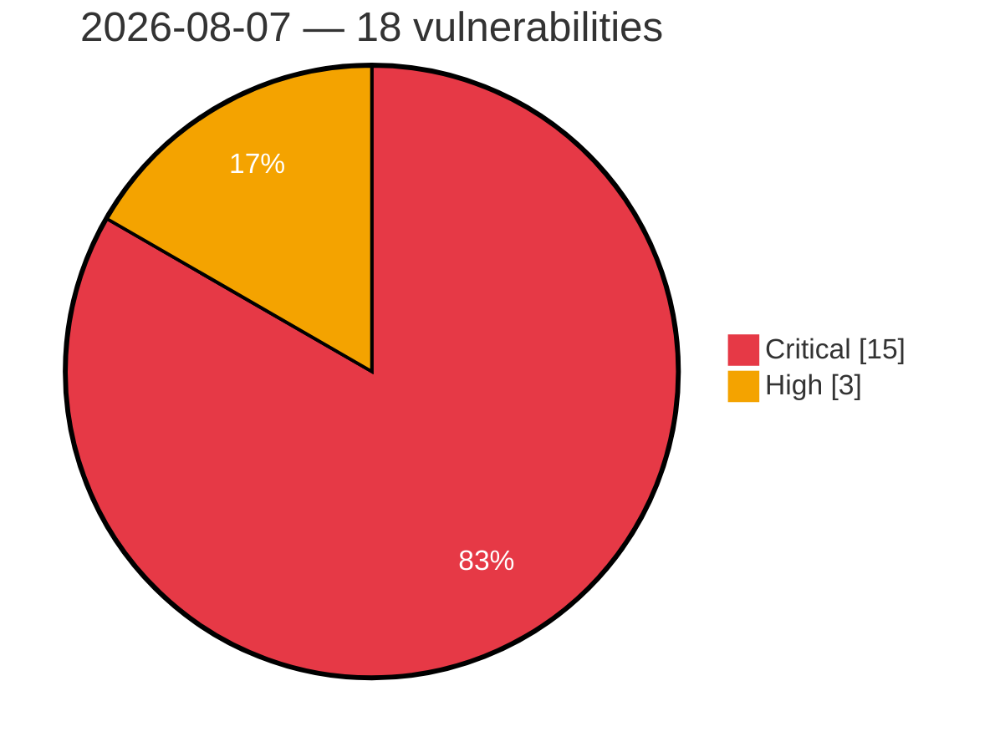

# Critical & High Severity Vulnerabilities — 2026-08-07

**Source:** cvefeed.io (High/Critical)
**KEV (actively exploited):** 0  **Watchlist matches:** 6

## Critical (15)

| CVSS | Flags | CVE / Title | Reported |
|------|-------|-------------|----------|
| 10.0 | — | [CVE-2026-65667 - Microsoft Teams Elevation of Privilege Vulnerability](https://cvefeed.io/vuln/detail/CVE-2026-65667) | 7 hours, 7 minutes ago |
| 10.0 | — | [CVE-2026-63508 - Microsoft Planetary Computer Pro Elevation of Privilege Vulnerability](https://cvefeed.io/vuln/detail/CVE-2026-63508) | 7 hours, 7 minutes ago |
| 10.0 | — | [CVE-2026-56162 - Azure SQL Database Elevation of Privilege Vulnerability](https://cvefeed.io/vuln/detail/CVE-2026-56162) | 7 hours, 7 minutes ago |
| 9.9 | — | [CVE-2026-62830 - Azure SRE Agent Elevation of Privilege Vulnerability](https://cvefeed.io/vuln/detail/CVE-2026-62830) | 7 hours, 7 minutes ago |
| 9.9 | — | [CVE-2026-59115 - Microsoft Entra Provisioning Service Elevation of Privilege Vulnerability](https://cvefeed.io/vuln/detail/CVE-2026-59115) | 7 hours, 7 minutes ago |
| 9.9 | ⭐ | [CVE-2026-50515 - Azure Service Bus Remote Code Execution Vulnerability](https://cvefeed.io/vuln/detail/CVE-2026-50515) | 7 hours, 7 minutes ago |
| 9.9 | — | [CVE-2026-50481 - Azure Active Directory Elevation of Privilege Vulnerability](https://cvefeed.io/vuln/detail/CVE-2026-50481) | 7 hours, 7 minutes ago |
| 9.8 | — | [CVE-2026-14365 - TrueBooker <= 1.2.3 - Missing Authorization to Unauthenticated Arbitrary Password Reset via 'truebooker_wp_user_id'](https://cvefeed.io/vuln/detail/CVE-2026-14365) | 2 hours, 7 minutes ago |
| 9.8 | — | [CVE-2026-14364 - TrueBooker <= 1.2.3 - Missing Authorization to Unauthenticated Arbitrary Password Reset via 'tbab-userid'](https://cvefeed.io/vuln/detail/CVE-2026-14364) | 2 hours, 7 minutes ago |
| 9.8 | — | [CVE-2026-62873 - Microsoft 365 Admin Center Elevation of Privilege Vulnerability](https://cvefeed.io/vuln/detail/CVE-2026-62873) | 7 hours, 7 minutes ago |
| 9.6 | ⭐ | [CVE-2026-70332 - Microsoft Office SharePoint Spoofing Vulnerability](https://cvefeed.io/vuln/detail/CVE-2026-70332) | 7 hours, 7 minutes ago |
| 9.6 | — | [CVE-2026-62896 - Microsoft Teams Elevation of Privilege Vulnerability](https://cvefeed.io/vuln/detail/CVE-2026-62896) | 7 hours, 7 minutes ago |
| 9.6 | ⭐ | [CVE-2026-56161 - Azure Logic Apps Information Disclosure Vulnerability](https://cvefeed.io/vuln/detail/CVE-2026-56161) | 7 hours, 7 minutes ago |
| 9.3 | — | [CVE-2026-59118 - Microsoft Power Apps Elevation of Privilege Vulnerability](https://cvefeed.io/vuln/detail/CVE-2026-59118) | 7 hours, 7 minutes ago |
| 9.1 | ⭐ | [CVE-2026-68823 - Azure Confidential Ledger Remote Code Execution Vulnerability](https://cvefeed.io/vuln/detail/CVE-2026-68823) | 7 hours, 7 minutes ago |

## High (3)

| CVSS | Flags | CVE / Title | Reported |
|------|-------|-------------|----------|
| 8.8 | ⭐ | [CVE-2026-65668 - Microsoft Purview eDiscovery Elevation of Privilege Vulnerability](https://cvefeed.io/vuln/detail/CVE-2026-65668) | 7 hours, 7 minutes ago |
| 8.8 | ⭐ | [CVE-2026-49163 - Application Insights Profiler Elevation of Privilege Vulnerability](https://cvefeed.io/vuln/detail/CVE-2026-49163) | 7 hours, 7 minutes ago |
| 8.7 | — | [CVE-2026-62836 - Azure SQL Managed Instance Elevation of Privilege Vulnerability](https://cvefeed.io/vuln/detail/CVE-2026-62836) | 7 hours, 7 minutes ago |
