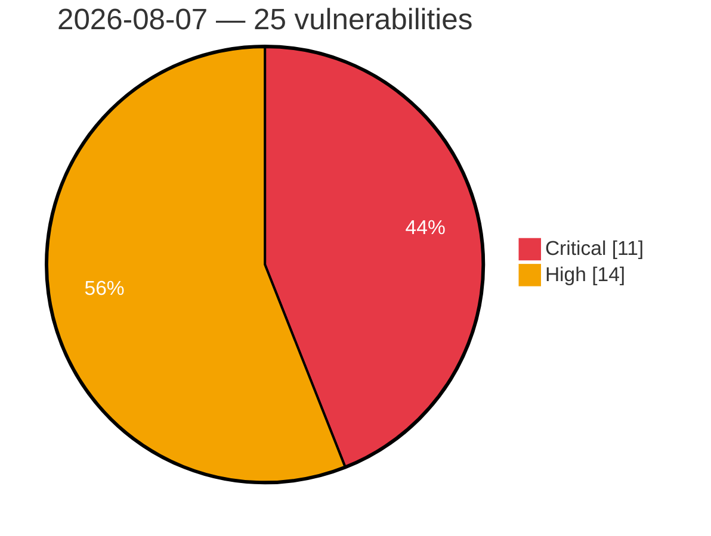

# Critical & High Severity Vulnerabilities — 2026-08-07

**Source:** cvefeed.io (High/Critical)
**KEV (actively exploited):** 0  **Watchlist matches:** 17

## Critical (11)

| CVSS | Flags | CVE / Title | Reported |
|------|-------|-------------|----------|
| 9.9 | ⭐ | [CVE-2026-64637 - Plesk XML-RPC API Privilege Escalation](https://cvefeed.io/vuln/detail/CVE-2026-64637) | 42 minutes ago |
| 9.8 | ⭐ | [CVE-2026-19264 - Unauthenticated arbitrary file read via /uploads path traversal (URL-encoded separators) leading to instance takeover](https://cvefeed.io/vuln/detail/CVE-2026-19264) | 3 hours, 43 minutes ago |
| 9.8 | ⭐ | [CVE-2022-4995 - Weaver E-cology 9.0 File Upload RCE via uploaderOperate.jsp](https://cvefeed.io/vuln/detail/CVE-2022-4995) | 3 hours, 43 minutes ago |
| 9.8 | ⭐ | [CVE-2026-71558 - Apache Fory: Heap type confusion in C++ polymorphic smart-pointer deserialization](https://cvefeed.io/vuln/detail/CVE-2026-71558) | 8 hours, 43 minutes ago |
| 9.5 | ⭐ | [CVE-2026-54212 - TeamDavid: Buffer Overflow in JSON-parsing](https://cvefeed.io/vuln/detail/CVE-2026-54212) | 8 hours, 43 minutes ago |
| 9.5 | ⭐ | [CVE-2026-54211 - TeamDavid: Buffer Overflow in multiple form data parameters](https://cvefeed.io/vuln/detail/CVE-2026-54211) | 8 hours, 43 minutes ago |
| 9.5 | ⭐ | [CVE-2026-54210 - TeamDavid: Buffer Overflow in file names of file upload functionalities](https://cvefeed.io/vuln/detail/CVE-2026-54210) | 8 hours, 43 minutes ago |
| 9.2 | ⭐ | [CVE-2026-66914 - Joomla Extension - seblod.com - Unauthenticated path traversal in SEBLOD < 3.30.0, < 4.7.0, < 6.0.1](https://cvefeed.io/vuln/detail/CVE-2026-66914) | 4 hours, 43 minutes ago |
| 9.2 | — | [CVE-2026-54213 - TeamDavid: Denial of Service via endpoint 'internalRestart'](https://cvefeed.io/vuln/detail/CVE-2026-54213) | 8 hours, 43 minutes ago |
| 9.2 | — | [CVE-2026-54203 - TeamDavid: Memory Leak leaking sensitive information](https://cvefeed.io/vuln/detail/CVE-2026-54203) | 8 hours, 43 minutes ago |
| 9.1 | ⭐ | [CVE-2026-71560 - Apache Fory: Out-of-bounds heap read in C++ struct deserializer tagged-int fast-path](https://cvefeed.io/vuln/detail/CVE-2026-71560) | 8 hours, 43 minutes ago |

## High (14)

| CVSS | Flags | CVE / Title | Reported |
|------|-------|-------------|----------|
| 8.9 | ⭐ | [CVE-2026-64638 - WordPress Reflected Cross-Site Scripting Vulnerability](https://cvefeed.io/vuln/detail/CVE-2026-64638) | 42 minutes ago |
| 8.9 | — | [CVE-2026-17601 - Nexus Repository 3 - Wildcard Privilege Update Self-Escalation to Administrator](https://cvefeed.io/vuln/detail/CVE-2026-17601) | 1 hour, 42 minutes ago |
| 8.9 | — | [CVE-2026-54209 - TeamDavid: Buffer Overflow in 'editini' function](https://cvefeed.io/vuln/detail/CVE-2026-54209) | 8 hours, 43 minutes ago |
| 8.8 | — | [CVE-2026-54218 - TeamDavid: Weak Cryptography and Insecure Password Storage](https://cvefeed.io/vuln/detail/CVE-2026-54218) | 8 hours, 43 minutes ago |
| 8.7 | ⭐ | [CVE-2026-67585 - Atom Exhaustion via _entities Representation Keys in DivvyPayHQ absinthe_federation](https://cvefeed.io/vuln/detail/CVE-2026-67585) | 1 hour, 42 minutes ago |
| 8.7 | ⭐ | [CVE-2026-17603 - Nexus Repository 3 - HikariCP connectionInitSql Injection RCE via DataStore Configuration API](https://cvefeed.io/vuln/detail/CVE-2026-17603) | 1 hour, 42 minutes ago |
| 8.7 | — | [CVE-2026-17600 - Nexus Repository 3 - Session Not Invalidated on User Account Deletion or Deactivation](https://cvefeed.io/vuln/detail/CVE-2026-17600) | 1 hour, 43 minutes ago |
| 8.7 | ⭐ | [CVE-2026-66494 - Joomla Extension - joomshaper.com - Unauthenticated stored XSS in Shapes API endpoint SP Page Builder < 6.7.0](https://cvefeed.io/vuln/detail/CVE-2026-66494) | 5 hours, 43 minutes ago |
| 8.6 | ⭐ | [CVE-2026-14644 - Nexus Repository 3 - Privilege Escalation](https://cvefeed.io/vuln/detail/CVE-2026-14644) | 1 hour, 43 minutes ago |
| 8.5 | ⭐ | [CVE-2026-68772 - ZenML 0.94.6 Remote Code Execution via CloudpickleMaterializer](https://cvefeed.io/vuln/detail/CVE-2026-68772) | 1 hour, 42 minutes ago |
| 8.5 | ⭐ | [CVE-2026-54208 - TeamDavid: Arbitrary File Write leading to Stored XSS](https://cvefeed.io/vuln/detail/CVE-2026-54208) | 8 hours, 43 minutes ago |
| 8.5 | ⭐ | [CVE-2026-54202 - TeamDavid: Path Traversal in the archive creation functionality](https://cvefeed.io/vuln/detail/CVE-2026-54202) | 8 hours, 43 minutes ago |
| 8.4 | — | [CVE-2026-54200 - TeamDavid: Local File Inclusion via the form field 'scjob'](https://cvefeed.io/vuln/detail/CVE-2026-54200) | 8 hours, 43 minutes ago |
| 8.2 | — | [CVE-2026-17594 - Nexus Repository 3 - Authorization Bypass in Repository Creation](https://cvefeed.io/vuln/detail/CVE-2026-17594) | 1 hour, 43 minutes ago |
