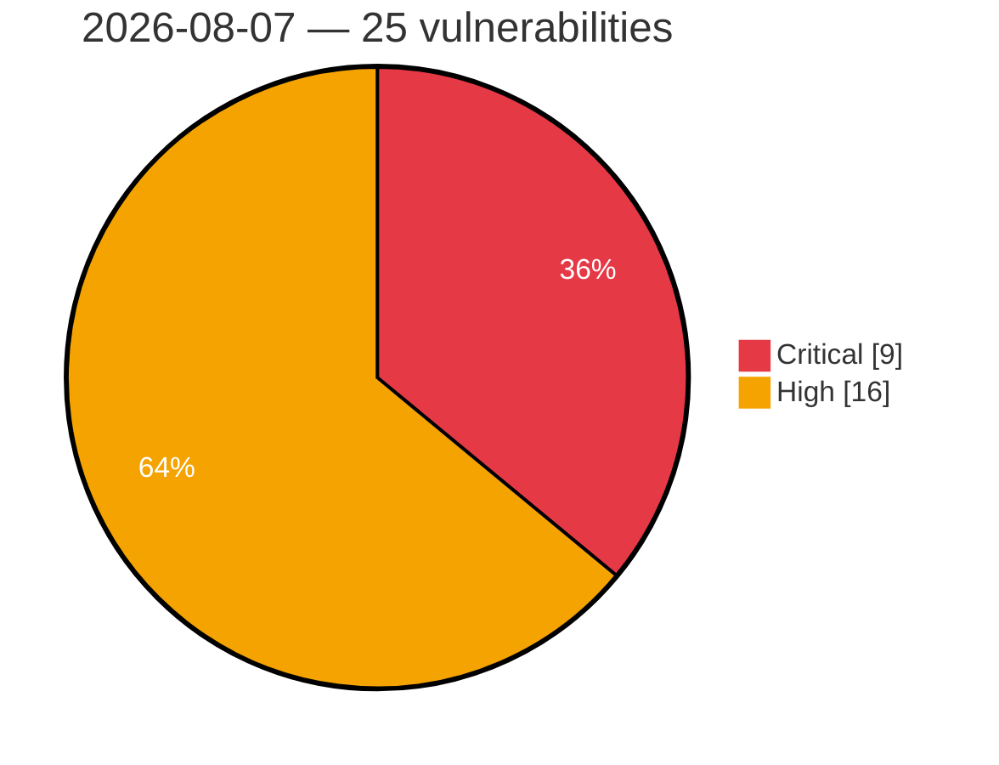

# Critical & High Severity Vulnerabilities — 2026-08-07

**Source:** cvefeed.io (High/Critical)
**KEV (actively exploited):** 0  **Watchlist matches:** 14

## Critical (9)

| CVSS | Flags | CVE / Title | Reported |
|------|-------|-------------|----------|
| 9.8 | ⭐ | [CVE-2026-19264 - Unauthenticated arbitrary file read via /uploads path traversal (URL-encoded separators) leading to instance takeover](https://cvefeed.io/vuln/detail/CVE-2026-19264) | 2 hours, 55 minutes ago |
| 9.8 | ⭐ | [CVE-2022-4995 - Weaver E-cology 9.0 File Upload RCE via uploaderOperate.jsp](https://cvefeed.io/vuln/detail/CVE-2022-4995) | 2 hours, 55 minutes ago |
| 9.8 | — | [CVE-2026-14365 - TrueBooker <= 1.2.3 - Missing Authorization to Unauthenticated Arbitrary Password Reset via 'truebooker_wp_user_id'](https://cvefeed.io/vuln/detail/CVE-2026-14365) | 12 hours, 55 minutes ago |
| 9.5 | ⭐ | [CVE-2026-54212 - TeamDavid: Buffer Overflow in JSON-parsing](https://cvefeed.io/vuln/detail/CVE-2026-54212) | 7 hours, 55 minutes ago |
| 9.5 | ⭐ | [CVE-2026-54211 - TeamDavid: Buffer Overflow in multiple form data parameters](https://cvefeed.io/vuln/detail/CVE-2026-54211) | 7 hours, 55 minutes ago |
| 9.5 | ⭐ | [CVE-2026-54210 - TeamDavid: Buffer Overflow in file names of file upload functionalities](https://cvefeed.io/vuln/detail/CVE-2026-54210) | 7 hours, 55 minutes ago |
| 9.2 | ⭐ | [CVE-2026-66914 - Joomla Extension - seblod.com - Unauthenticated path traversal in SEBLOD < 3.30.0, < 4.7.0, < 6.0.1](https://cvefeed.io/vuln/detail/CVE-2026-66914) | 3 hours, 55 minutes ago |
| 9.2 | — | [CVE-2026-54213 - TeamDavid: Denial of Service via endpoint 'internalRestart'](https://cvefeed.io/vuln/detail/CVE-2026-54213) | 7 hours, 55 minutes ago |
| 9.2 | — | [CVE-2026-54203 - TeamDavid: Memory Leak leaking sensitive information](https://cvefeed.io/vuln/detail/CVE-2026-54203) | 7 hours, 55 minutes ago |

## High (16)

| CVSS | Flags | CVE / Title | Reported |
|------|-------|-------------|----------|
| 8.9 | — | [CVE-2026-17601 - Nexus Repository 3 - Wildcard Privilege Update Self-Escalation to Administrator](https://cvefeed.io/vuln/detail/CVE-2026-17601) | 55 minutes ago |
| 8.9 | — | [CVE-2026-54209 - TeamDavid: Buffer Overflow in 'editini' function](https://cvefeed.io/vuln/detail/CVE-2026-54209) | 7 hours, 55 minutes ago |
| 8.8 | — | [CVE-2026-54218 - TeamDavid: Weak Cryptography and Insecure Password Storage](https://cvefeed.io/vuln/detail/CVE-2026-54218) | 7 hours, 55 minutes ago |
| 8.8 | — | [CVE-2026-9169 - LUCID Vision Labs: DLL Search Order Hijacking in Arena SDK 1.0.80.49 on Windows](https://cvefeed.io/vuln/detail/CVE-2026-9169) | 8 hours, 55 minutes ago |
| 8.7 | ⭐ | [CVE-2026-67585 - Atom Exhaustion via _entities Representation Keys in DivvyPayHQ absinthe_federation](https://cvefeed.io/vuln/detail/CVE-2026-67585) | 55 minutes ago |
| 8.7 | ⭐ | [CVE-2026-17603 - Nexus Repository 3 - HikariCP connectionInitSql Injection RCE via DataStore Configuration API](https://cvefeed.io/vuln/detail/CVE-2026-17603) | 55 minutes ago |
| 8.7 | — | [CVE-2026-17600 - Nexus Repository 3 - Session Not Invalidated on User Account Deletion or Deactivation](https://cvefeed.io/vuln/detail/CVE-2026-17600) | 55 minutes ago |
| 8.7 | ⭐ | [CVE-2026-66494 - Joomla Extension - joomshaper.com - Unauthenticated stored XSS in Shapes API endpoint SP Page Builder < 6.7.0](https://cvefeed.io/vuln/detail/CVE-2026-66494) | 4 hours, 55 minutes ago |
| 8.6 | ⭐ | [CVE-2026-14644 - Nexus Repository 3 - Privilege Escalation](https://cvefeed.io/vuln/detail/CVE-2026-14644) | 55 minutes ago |
| 8.5 | ⭐ | [CVE-2026-68772 - ZenML 0.94.6 Remote Code Execution via CloudpickleMaterializer](https://cvefeed.io/vuln/detail/CVE-2026-68772) | 55 minutes ago |
| 8.5 | ⭐ | [CVE-2026-54208 - TeamDavid: Arbitrary File Write leading to Stored XSS](https://cvefeed.io/vuln/detail/CVE-2026-54208) | 7 hours, 55 minutes ago |
| 8.5 | ⭐ | [CVE-2026-54202 - TeamDavid: Path Traversal in the archive creation functionality](https://cvefeed.io/vuln/detail/CVE-2026-54202) | 7 hours, 55 minutes ago |
| 8.4 | — | [CVE-2026-54200 - TeamDavid: Local File Inclusion via the form field 'scjob'](https://cvefeed.io/vuln/detail/CVE-2026-54200) | 7 hours, 55 minutes ago |
| 8.4 | — | [CVE-2026-12070 - TeamDavid: Arbitrary File Deletion via form field 'scjob'](https://cvefeed.io/vuln/detail/CVE-2026-12070) | 7 hours, 55 minutes ago |
| 8.2 | — | [CVE-2026-17594 - Nexus Repository 3 - Authorization Bypass in Repository Creation](https://cvefeed.io/vuln/detail/CVE-2026-17594) | 55 minutes ago |
| 8.2 | ⭐ | [CVE-2026-66491 - Joomla Extension - phoca.cz - Arbitrary File Read in Phoca Commander 1.0.0-6.1.3](https://cvefeed.io/vuln/detail/CVE-2026-66491) | 8 hours, 55 minutes ago |
