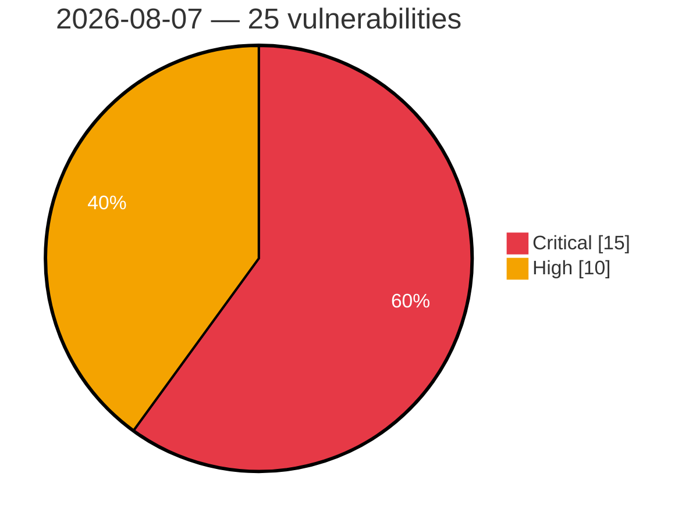

# Critical & High Severity Vulnerabilities — 2026-08-07

**Source:** cvefeed.io (High/Critical)
**KEV (actively exploited):** 0  **Watchlist matches:** 9

## Critical (15)

| CVSS | Flags | CVE / Title | Reported |
|------|-------|-------------|----------|
| 10.0 | — | [CVE-2026-65667 - Microsoft Teams Elevation of Privilege Vulnerability](https://cvefeed.io/vuln/detail/CVE-2026-65667) | 12 hours, 17 minutes ago |
| 10.0 | — | [CVE-2026-63508 - Microsoft Planetary Computer Pro Elevation of Privilege Vulnerability](https://cvefeed.io/vuln/detail/CVE-2026-63508) | 12 hours, 18 minutes ago |
| 9.9 | — | [CVE-2026-62830 - Azure SRE Agent Elevation of Privilege Vulnerability](https://cvefeed.io/vuln/detail/CVE-2026-62830) | 12 hours, 18 minutes ago |
| 9.8 | — | [CVE-2026-14365 - TrueBooker <= 1.2.3 - Missing Authorization to Unauthenticated Arbitrary Password Reset via 'truebooker_wp_user_id'](https://cvefeed.io/vuln/detail/CVE-2026-14365) | 7 hours, 17 minutes ago |
| 9.8 | — | [CVE-2026-14364 - TrueBooker <= 1.2.3 - Missing Authorization to Unauthenticated Arbitrary Password Reset via 'tbab-userid'](https://cvefeed.io/vuln/detail/CVE-2026-14364) | 7 hours, 17 minutes ago |
| 9.8 | — | [CVE-2026-62873 - Microsoft 365 Admin Center Elevation of Privilege Vulnerability](https://cvefeed.io/vuln/detail/CVE-2026-62873) | 12 hours, 18 minutes ago |
| 9.6 | ⭐ | [CVE-2026-70332 - Microsoft Office SharePoint Spoofing Vulnerability](https://cvefeed.io/vuln/detail/CVE-2026-70332) | 12 hours, 17 minutes ago |
| 9.6 | — | [CVE-2026-62896 - Microsoft Teams Elevation of Privilege Vulnerability](https://cvefeed.io/vuln/detail/CVE-2026-62896) | 12 hours, 18 minutes ago |
| 9.5 | ⭐ | [CVE-2026-54212 - TeamDavid: Buffer Overflow in JSON-parsing](https://cvefeed.io/vuln/detail/CVE-2026-54212) | 2 hours, 17 minutes ago |
| 9.5 | ⭐ | [CVE-2026-54211 - TeamDavid: Buffer Overflow in multiple form data parameters](https://cvefeed.io/vuln/detail/CVE-2026-54211) | 2 hours, 17 minutes ago |
| 9.5 | ⭐ | [CVE-2026-54210 - TeamDavid: Buffer Overflow in file names of file upload functionalities](https://cvefeed.io/vuln/detail/CVE-2026-54210) | 2 hours, 17 minutes ago |
| 9.3 | — | [CVE-2026-59118 - Microsoft Power Apps Elevation of Privilege Vulnerability](https://cvefeed.io/vuln/detail/CVE-2026-59118) | 12 hours, 18 minutes ago |
| 9.2 | — | [CVE-2026-54213 - TeamDavid: Denial of Service via endpoint 'internalRestart'](https://cvefeed.io/vuln/detail/CVE-2026-54213) | 2 hours, 17 minutes ago |
| 9.2 | — | [CVE-2026-54203 - TeamDavid: Memory Leak leaking sensitive information](https://cvefeed.io/vuln/detail/CVE-2026-54203) | 2 hours, 17 minutes ago |
| 9.1 | ⭐ | [CVE-2026-68823 - Azure Confidential Ledger Remote Code Execution Vulnerability](https://cvefeed.io/vuln/detail/CVE-2026-68823) | 12 hours, 17 minutes ago |

## High (10)

| CVSS | Flags | CVE / Title | Reported |
|------|-------|-------------|----------|
| 8.9 | — | [CVE-2026-54209 - TeamDavid: Buffer Overflow in 'editini' function](https://cvefeed.io/vuln/detail/CVE-2026-54209) | 2 hours, 17 minutes ago |
| 8.8 | — | [CVE-2026-54218 - TeamDavid: Weak Cryptography and Insecure Password Storage](https://cvefeed.io/vuln/detail/CVE-2026-54218) | 2 hours, 17 minutes ago |
| 8.8 | — | [CVE-2026-9169 - LUCID Vision Labs: DLL Search Order Hijacking in Arena SDK 1.0.80.49 on Windows](https://cvefeed.io/vuln/detail/CVE-2026-9169) | 3 hours, 17 minutes ago |
| 8.8 | ⭐ | [CVE-2026-65668 - Microsoft Purview eDiscovery Elevation of Privilege Vulnerability](https://cvefeed.io/vuln/detail/CVE-2026-65668) | 12 hours, 17 minutes ago |
| 8.7 | — | [CVE-2026-62836 - Azure SQL Managed Instance Elevation of Privilege Vulnerability](https://cvefeed.io/vuln/detail/CVE-2026-62836) | 12 hours, 18 minutes ago |
| 8.5 | ⭐ | [CVE-2026-54208 - TeamDavid: Arbitrary File Write leading to Stored XSS](https://cvefeed.io/vuln/detail/CVE-2026-54208) | 2 hours, 17 minutes ago |
| 8.5 | ⭐ | [CVE-2026-54202 - TeamDavid: Path Traversal in the archive creation functionality](https://cvefeed.io/vuln/detail/CVE-2026-54202) | 2 hours, 17 minutes ago |
| 8.4 | — | [CVE-2026-54200 - TeamDavid: Local File Inclusion via the form field 'scjob'](https://cvefeed.io/vuln/detail/CVE-2026-54200) | 2 hours, 17 minutes ago |
| 8.4 | — | [CVE-2026-12070 - TeamDavid: Arbitrary File Deletion via form field 'scjob'](https://cvefeed.io/vuln/detail/CVE-2026-12070) | 2 hours, 17 minutes ago |
| 8.2 | ⭐ | [CVE-2026-66491 - Joomla Extension - phoca.cz - Arbitrary File Read in Phoca Commander 1.0.0-6.1.3](https://cvefeed.io/vuln/detail/CVE-2026-66491) | 3 hours, 17 minutes ago |
