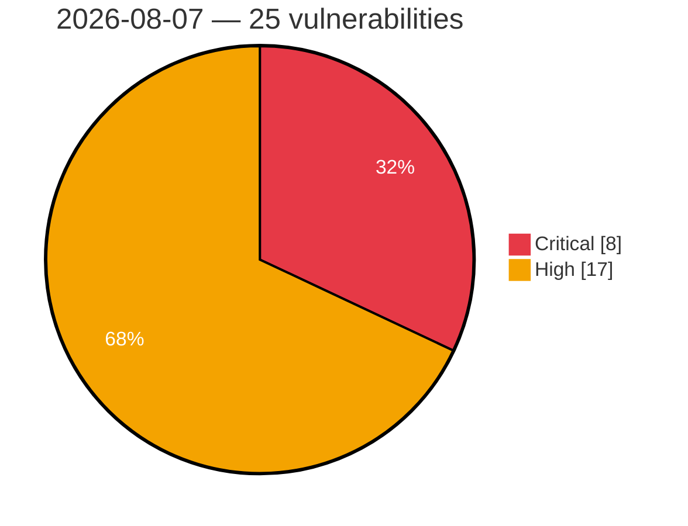

# Critical & High Severity Vulnerabilities — 2026-08-07

**Source:** cvefeed.io (High/Critical)
**KEV (actively exploited):** 0  **Watchlist matches:** 20

## Critical (8)

| CVSS | Flags | CVE / Title | Reported |
|------|-------|-------------|----------|
| 9.9 | ⭐ | [CVE-2026-64637 - Plesk XML-RPC API Privilege Escalation](https://cvefeed.io/vuln/detail/CVE-2026-64637) | 4 hours, 43 minutes ago |
| 9.8 | ⭐ | [CVE-2026-61808 - LightRAG: Missing Authentication for Critical API Functions in Default Configuration](https://cvefeed.io/vuln/detail/CVE-2026-61808) | 2 hours, 43 minutes ago |
| 9.8 | ⭐ | [CVE-2026-19264 - Unauthenticated arbitrary file read via /uploads path traversal (URL-encoded separators) leading to instance takeover](https://cvefeed.io/vuln/detail/CVE-2026-19264) | 7 hours, 43 minutes ago |
| 9.6 | ⭐ | [CVE-2026-50540 - Kata Containers: Config Path Annotation Arbitrary File Loading](https://cvefeed.io/vuln/detail/CVE-2026-50540) | 1 hour, 43 minutes ago |
| 9.2 | ⭐ | [CVE-2026-47243 - Kata guest escape: runtime-rs guest-root to host-root escape via virtiofs](https://cvefeed.io/vuln/detail/CVE-2026-47243) | 43 minutes ago |
| 9.1 | — | [CVE-2026-48170 - scimPatch vulnerable to prototype pollution via unfiltered keys in patch](https://cvefeed.io/vuln/detail/CVE-2026-48170) | 43 minutes ago |
| 9.1 | ⭐ | [CVE-2026-48039 - Meta Ads MCP: Unauthenticated HTTP MCP Tool Execution Leaks Operator Meta Access Token](https://cvefeed.io/vuln/detail/CVE-2026-48039) | 2 hours, 43 minutes ago |
| 9.0 | ⭐ | [CVE-2026-71851 - crypto-js: Insufficient Entropy in Cryptographic Secret Generation via Vulnerable CryptoJS Dependency Chain](https://cvefeed.io/vuln/detail/CVE-2026-71851) | 3 hours, 41 minutes ago |

## High (17)

| CVSS | Flags | CVE / Title | Reported |
|------|-------|-------------|----------|
| 8.9 | ⭐ | [CVE-2026-64638 - WordPress Reflected Cross-Site Scripting Vulnerability](https://cvefeed.io/vuln/detail/CVE-2026-64638) | 4 hours, 43 minutes ago |
| 8.9 | — | [CVE-2026-17601 - Nexus Repository 3 - Wildcard Privilege Update Self-Escalation to Administrator](https://cvefeed.io/vuln/detail/CVE-2026-17601) | 5 hours, 43 minutes ago |
| 8.8 | ⭐ | [CVE-2026-48169 - PraisonAI has Cross-Workspace IDOR and Privilege Escalation via Platform API](https://cvefeed.io/vuln/detail/CVE-2026-48169) | 43 minutes ago |
| 8.7 | ⭐ | [CVE-2026-47663 - Pathling: Typed CRUD/search/batch providers can lead to server-wide PHI exfiltration and cross-resource mutation](https://cvefeed.io/vuln/detail/CVE-2026-47663) | 1 hour, 43 minutes ago |
| 8.7 | ⭐ | [CVE-2026-47662 - Pathling $bulk-submit allows bearer-token exfiltration and persistent warehouse poisoning via unvalidated manifest output URLs](https://cvefeed.io/vuln/detail/CVE-2026-47662) | 1 hour, 43 minutes ago |
| 8.7 | ⭐ | [CVE-2026-47661 - Pathling has path traversal in $result endpoint that allows arbitrary warehouse file read](https://cvefeed.io/vuln/detail/CVE-2026-47661) | 2 hours, 43 minutes ago |
| 8.7 | ⭐ | [CVE-2026-47660 - Pathling: Explicit oauthMetadataUrl in bulk-submit allows OAuth client credential exfiltration](https://cvefeed.io/vuln/detail/CVE-2026-47660) | 2 hours, 43 minutes ago |
| 8.7 | ⭐ | [CVE-2026-47659 - Pathling has path traversal in $import-pnp manifest that enables read-capable SSRF via /jobs/{jobId}/{filename}](https://cvefeed.io/vuln/detail/CVE-2026-47659) | 2 hours, 43 minutes ago |
| 8.7 | — | [CVE-2026-71847 - Ruby JSON: JSON::ResumableParser#partial_value dereferences a freed input buffer and crashes on truncated duplicate-key streams](https://cvefeed.io/vuln/detail/CVE-2026-71847) | 3 hours, 41 minutes ago |
| 8.7 | ⭐ | [CVE-2026-67585 - Atom Exhaustion via _entities Representation Keys in DivvyPayHQ absinthe_federation](https://cvefeed.io/vuln/detail/CVE-2026-67585) | 5 hours, 43 minutes ago |
| 8.7 | ⭐ | [CVE-2026-17603 - Nexus Repository 3 - HikariCP connectionInitSql Injection RCE via DataStore Configuration API](https://cvefeed.io/vuln/detail/CVE-2026-17603) | 5 hours, 43 minutes ago |
| 8.7 | — | [CVE-2026-17600 - Nexus Repository 3 - Session Not Invalidated on User Account Deletion or Deactivation](https://cvefeed.io/vuln/detail/CVE-2026-17600) | 5 hours, 43 minutes ago |
| 8.6 | ⭐ | [CVE-2026-47664 - Pathling: $import-pnp operation enables authenticated SSRF, credential leakage, and warehouse data poisoning](https://cvefeed.io/vuln/detail/CVE-2026-47664) | 1 hour, 43 minutes ago |
| 8.6 | ⭐ | [CVE-2026-48007 - Element Call reports full URLs of visited pages to analytics server](https://cvefeed.io/vuln/detail/CVE-2026-48007) | 2 hours, 43 minutes ago |
| 8.6 | ⭐ | [CVE-2026-14644 - Nexus Repository 3 - Privilege Escalation](https://cvefeed.io/vuln/detail/CVE-2026-14644) | 5 hours, 43 minutes ago |
| 8.2 | — | [CVE-2026-17594 - Nexus Repository 3 - Authorization Bypass in Repository Creation](https://cvefeed.io/vuln/detail/CVE-2026-17594) | 5 hours, 43 minutes ago |
| 8.0 | ⭐ | [CVE-2026-68772 - ZenML 0.94.6 Remote Code Execution via CloudpickleMaterializer](https://cvefeed.io/vuln/detail/CVE-2026-68772) | 5 hours, 43 minutes ago |
