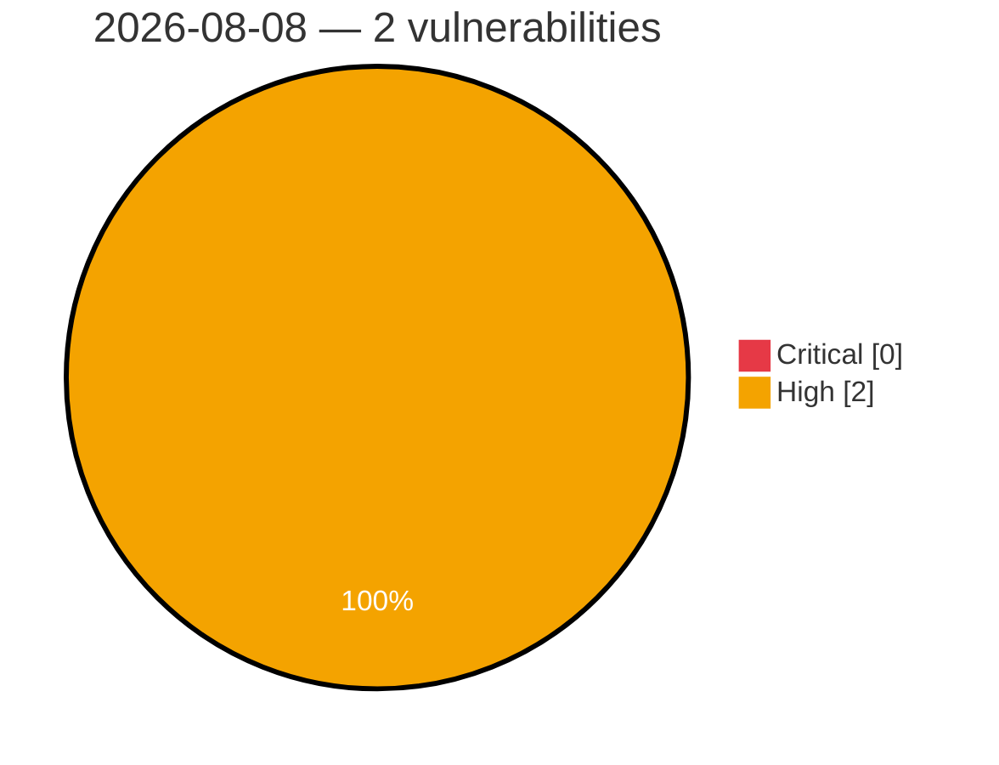

# Critical & High Severity Vulnerabilities — 2026-08-08

**Source:** cvefeed.io (High/Critical)
**KEV (actively exploited):** 0  **Watchlist matches:** 1

## High (2)

| CVSS | Flags | CVE / Title | Reported |
|------|-------|-------------|----------|
| 8.7 | — | [CVE-2026-13505 - Zeroisation of sensitive key material on garbage collection relies on finalization](https://cvefeed.io/vuln/detail/CVE-2026-13505) | 4 hours, 41 minutes ago |
| 8.7 | ⭐ | [CVE-2026-8798 - Native entropy source retries the CPU entropy instructions without limit](https://cvefeed.io/vuln/detail/CVE-2026-8798) | 5 hours, 41 minutes ago |
