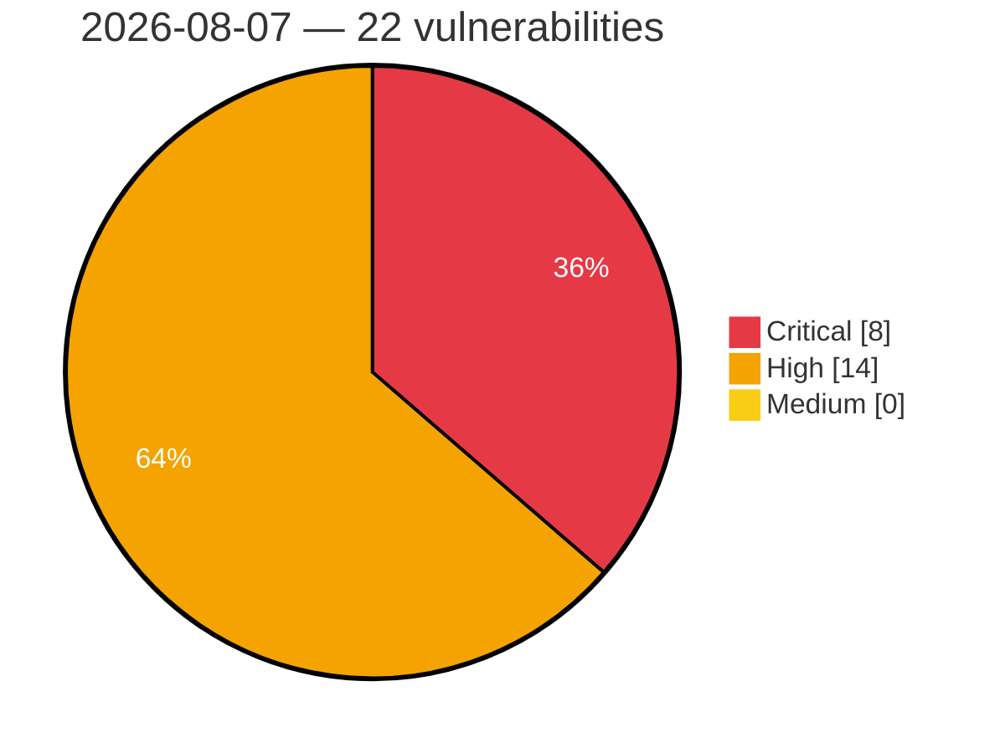

# Critical, High & Medium Severity Vulnerabilities — 2026-08-07

**Source status for this day:**

| Source | Critical | High | Medium | Total |
|--------|---------:|-----:|-------:|------:|
| cvefeed.io (High/Critical) | 8 | 14 | 0 | 22 |

**KEV (actively exploited):** 0  **Watchlist matches:** 20

## Critical (8)

| CVSS | Flags | Source | CVE / Title | Reported |
|------|-------|--------|-------------|----------|
| 9.9 | ⭐ | cvefeed.io (High/Critical) | [CVE-2026-64637 - Plesk XML-RPC API Privilege Escalation](https://cvefeed.io/vuln/detail/CVE-2026-64637) | 17 hours, 39 minutes ago |
| 9.8 | ⭐ | cvefeed.io (High/Critical) | [CVE-2026-61808 - LightRAG: Missing Authentication for Critical API Functions in Default Configuration](https://cvefeed.io/vuln/detail/CVE-2026-61808) | 15 hours, 39 minutes ago |
| 9.6 | ⭐ | cvefeed.io (High/Critical) | [CVE-2026-46409 - OpenYak local API: unauthenticated CSRF chain leads to Remote Code Execution](https://cvefeed.io/vuln/detail/CVE-2026-46409) | 12 hours, 39 minutes ago |
| 9.6 | ⭐ | cvefeed.io (High/Critical) | [CVE-2026-50540 - Kata Containers: Config Path Annotation Arbitrary File Loading](https://cvefeed.io/vuln/detail/CVE-2026-50540) | 14 hours, 39 minutes ago |
| 9.2 | ⭐ | cvefeed.io (High/Critical) | [CVE-2026-47243 - Kata guest escape: runtime-rs guest-root to host-root escape via virtiofs](https://cvefeed.io/vuln/detail/CVE-2026-47243) | 13 hours, 39 minutes ago |
| 9.1 | — | cvefeed.io (High/Critical) | [CVE-2026-48170 - scimPatch vulnerable to prototype pollution via unfiltered keys in patch](https://cvefeed.io/vuln/detail/CVE-2026-48170) | 13 hours, 39 minutes ago |
| 9.1 | ⭐ | cvefeed.io (High/Critical) | [CVE-2026-48039 - Meta Ads MCP: Unauthenticated HTTP MCP Tool Execution Leaks Operator Meta Access Token](https://cvefeed.io/vuln/detail/CVE-2026-48039) | 15 hours, 39 minutes ago |
| 9.0 | ⭐ | cvefeed.io (High/Critical) | [CVE-2026-71851 - crypto-js: Insufficient Entropy in Cryptographic Secret Generation via Vulnerable CryptoJS Dependency Chain](https://cvefeed.io/vuln/detail/CVE-2026-71851) | 16 hours, 37 minutes ago |

## High (14)

| CVSS | Flags | Source | CVE / Title | Reported |
|------|-------|--------|-------------|----------|
| 8.9 | ⭐ | cvefeed.io (High/Critical) | [CVE-2026-64638 - WordPress Reflected Cross-Site Scripting Vulnerability](https://cvefeed.io/vuln/detail/CVE-2026-64638) | 17 hours, 39 minutes ago |
| 8.8 | ⭐ | cvefeed.io (High/Critical) | [CVE-2026-48169 - PraisonAI has Cross-Workspace IDOR and Privilege Escalation via Platform API](https://cvefeed.io/vuln/detail/CVE-2026-48169) | 13 hours, 39 minutes ago |
| 8.7 | ⭐ | cvefeed.io (High/Critical) | [CVE-2026-48026 - lakeFS vulnerable to stored XSS in rendered markdown previews via raw HTML](https://cvefeed.io/vuln/detail/CVE-2026-48026) | 12 hours, 39 minutes ago |
| 8.7 | ⭐ | cvefeed.io (High/Critical) | [CVE-2026-47663 - Pathling: Typed CRUD/search/batch providers can lead to server-wide PHI exfiltration and cross-resource mutation](https://cvefeed.io/vuln/detail/CVE-2026-47663) | 14 hours, 39 minutes ago |
| 8.7 | ⭐ | cvefeed.io (High/Critical) | [CVE-2026-47662 - Pathling $bulk-submit allows bearer-token exfiltration and persistent warehouse poisoning via unvalidated manifest output URLs](https://cvefeed.io/vuln/detail/CVE-2026-47662) | 14 hours, 39 minutes ago |
| 8.7 | ⭐ | cvefeed.io (High/Critical) | [CVE-2026-47661 - Pathling has path traversal in $result endpoint that allows arbitrary warehouse file read](https://cvefeed.io/vuln/detail/CVE-2026-47661) | 15 hours, 39 minutes ago |
| 8.7 | ⭐ | cvefeed.io (High/Critical) | [CVE-2026-47660 - Pathling: Explicit oauthMetadataUrl in bulk-submit allows OAuth client credential exfiltration](https://cvefeed.io/vuln/detail/CVE-2026-47660) | 15 hours, 39 minutes ago |
| 8.7 | ⭐ | cvefeed.io (High/Critical) | [CVE-2026-47659 - Pathling has path traversal in $import-pnp manifest that enables read-capable SSRF via /jobs/{jobId}/{filename}](https://cvefeed.io/vuln/detail/CVE-2026-47659) | 15 hours, 39 minutes ago |
| 8.7 | — | cvefeed.io (High/Critical) | [CVE-2026-71847 - Ruby JSON: JSON::ResumableParser#partial_value dereferences a freed input buffer and crashes on truncated duplicate-key streams](https://cvefeed.io/vuln/detail/CVE-2026-71847) | 16 hours, 37 minutes ago |
| 8.7 | ⭐ | cvefeed.io (High/Critical) | [CVE-2026-67585 - Atom Exhaustion via _entities Representation Keys in DivvyPayHQ absinthe_federation](https://cvefeed.io/vuln/detail/CVE-2026-67585) | 18 hours, 39 minutes ago |
| 8.6 | ⭐ | cvefeed.io (High/Critical) | [CVE-2026-48120 - Kakoune has a Critical RCE via Autorestore Backup Filename Injection](https://cvefeed.io/vuln/detail/CVE-2026-48120) | 12 hours, 39 minutes ago |
| 8.6 | ⭐ | cvefeed.io (High/Critical) | [CVE-2026-47664 - Pathling: $import-pnp operation enables authenticated SSRF, credential leakage, and warehouse data poisoning](https://cvefeed.io/vuln/detail/CVE-2026-47664) | 14 hours, 39 minutes ago |
| 8.6 | ⭐ | cvefeed.io (High/Critical) | [CVE-2026-48007 - Element Call reports full URLs of visited pages to analytics server](https://cvefeed.io/vuln/detail/CVE-2026-48007) | 15 hours, 39 minutes ago |
| 8.5 | ⭐ | cvefeed.io (High/Critical) | [CVE-2026-68772 - ZenML 0.94.6 Remote Code Execution via CloudpickleMaterializer](https://cvefeed.io/vuln/detail/CVE-2026-68772) | 18 hours, 39 minutes ago |
