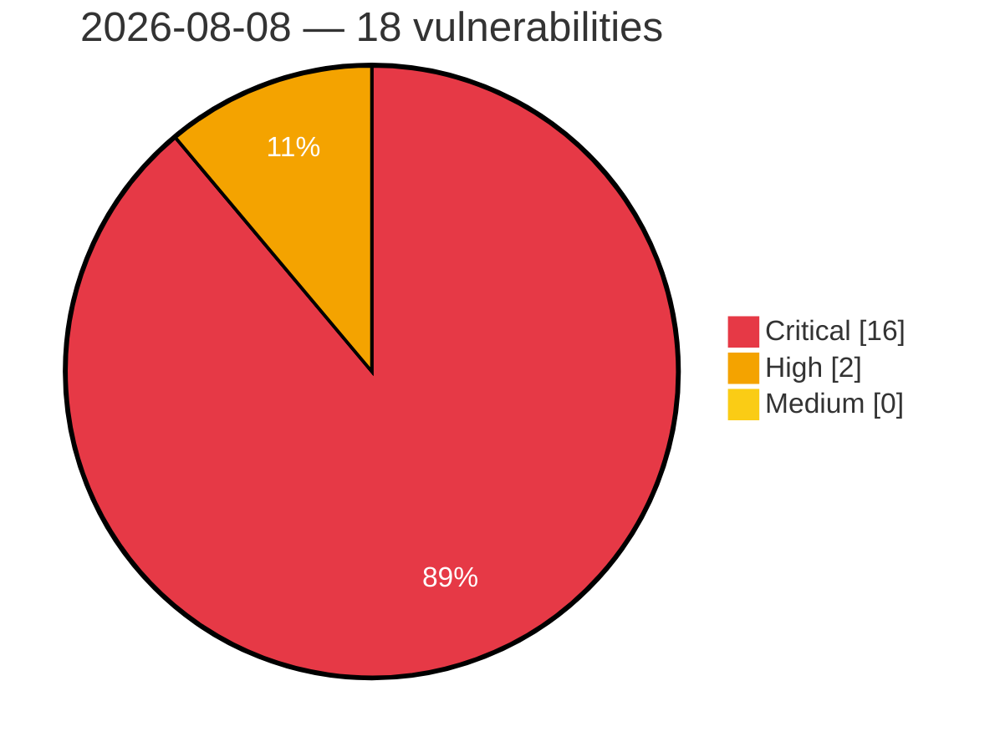

# Critical, High & Medium Severity Vulnerabilities — 2026-08-08

**Source status for this day:**

| Source | Critical | High | Medium | Total |
|--------|---------:|-----:|-------:|------:|
| cvefeed.io (High/Critical) | 16 | 2 | 0 | 18 |

**KEV (actively exploited):** 0  **Watchlist matches:** 15

## Critical (16)

| CVSS | Flags | Source | CVE / Title | Reported |
|------|-------|--------|-------------|----------|
| 9.8 | ⭐ | cvefeed.io (High/Critical) | [CVE-2026-14526 - AI Copilot – Content Generator <= 1.5.6 - Unauthenticated Privilege Escalation via Custom Workflow Route](https://cvefeed.io/vuln/detail/CVE-2026-14526) | 4 hours, 39 minutes ago |
| 9.8 | ⭐ | cvefeed.io (High/Critical) | [CVE-2026-71955 - D-Link DWR-M961 Command Injection via /boafrm/formWsc](https://cvefeed.io/vuln/detail/CVE-2026-71955) | 56 minutes ago |
| 9.8 | ⭐ | cvefeed.io (High/Critical) | [CVE-2026-71954 - D-Link DWR-M961 Command Injection via /boafrm/formL2tpv3ConfigSetup](https://cvefeed.io/vuln/detail/CVE-2026-71954) | 56 minutes ago |
| 9.8 | ⭐ | cvefeed.io (High/Critical) | [CVE-2026-71953 - D-Link DWR-M961 Command Injection via /boafrm/formNtp](https://cvefeed.io/vuln/detail/CVE-2026-71953) | 56 minutes ago |
| 9.8 | ⭐ | cvefeed.io (High/Critical) | [CVE-2026-71952 - D-Link DWR-M961 Command Injection via /boafrm/formPinManageSetup](https://cvefeed.io/vuln/detail/CVE-2026-71952) | 56 minutes ago |
| 9.8 | ⭐ | cvefeed.io (High/Critical) | [CVE-2026-71951 - D-Link DWR-M961 Command Injection via /boafrm/formIMEISetup](https://cvefeed.io/vuln/detail/CVE-2026-71951) | 56 minutes ago |
| 9.8 | ⭐ | cvefeed.io (High/Critical) | [CVE-2026-71950 - D-Link DWR-M961 Command Injection via /boafrm/formSmsManage](https://cvefeed.io/vuln/detail/CVE-2026-71950) | 56 minutes ago |
| 9.8 | ⭐ | cvefeed.io (High/Critical) | [CVE-2026-71949 - D-Link DWR-M961 Command Injection via /boafrm/formUSSDSetup](https://cvefeed.io/vuln/detail/CVE-2026-71949) | 56 minutes ago |
| 9.8 | ⭐ | cvefeed.io (High/Critical) | [CVE-2026-71948 - D-Link DWR-M961 Command Injection via /boafrm/formDebugDiagnosticRun](https://cvefeed.io/vuln/detail/CVE-2026-71948) | 56 minutes ago |
| 9.8 | ⭐ | cvefeed.io (High/Critical) | [CVE-2026-71947 - D-Link DWR-M961 Command Injection via /boafrm/formTracerouteDiagnosticRun](https://cvefeed.io/vuln/detail/CVE-2026-71947) | 56 minutes ago |
| 9.8 | ⭐ | cvefeed.io (High/Critical) | [CVE-2026-71946 - D-Link DWR-M961 Command Injection via /boafrm/formPingDiagnosticRun](https://cvefeed.io/vuln/detail/CVE-2026-71946) | 56 minutes ago |
| 9.8 | ⭐ | cvefeed.io (High/Critical) | [CVE-2026-71945 - D-Link DWR-M961 Command Injection via /boafrm/formLtefotaUpgradeFibocom](https://cvefeed.io/vuln/detail/CVE-2026-71945) | 56 minutes ago |
| 9.8 | ⭐ | cvefeed.io (High/Critical) | [CVE-2026-71944 - D-Link DWR-M961 Command Injection via /boafrm/formLtefotaUpgradeQuectel](https://cvefeed.io/vuln/detail/CVE-2026-71944) | 56 minutes ago |
| 9.8 | — | cvefeed.io (High/Critical) | [CVE-2026-71958 - D-Link DWR-M961 Buffer Overflow via quicksetup.cgi](https://cvefeed.io/vuln/detail/CVE-2026-71958) | 1 hour, 5 minutes ago |
| 9.8 | — | cvefeed.io (High/Critical) | [CVE-2026-71957 - D-Link DWR-M961 Buffer Overflow via app.cgi](https://cvefeed.io/vuln/detail/CVE-2026-71957) | 1 hour, 6 minutes ago |
| 9.8 | ⭐ | cvefeed.io (High/Critical) | [CVE-2026-71956 - D-Link DWR-M961 Command Injection via app.cgi](https://cvefeed.io/vuln/detail/CVE-2026-71956) | 1 hour, 7 minutes ago |

## High (2)

| CVSS | Flags | Source | CVE / Title | Reported |
|------|-------|--------|-------------|----------|
| 8.7 | — | cvefeed.io (High/Critical) | [CVE-2026-13505 - Zeroisation of sensitive key material on garbage collection relies on finalization](https://cvefeed.io/vuln/detail/CVE-2026-13505) | 9 hours, 39 minutes ago |
| 8.7 | ⭐ | cvefeed.io (High/Critical) | [CVE-2026-8798 - Native entropy source retries the CPU entropy instructions without limit](https://cvefeed.io/vuln/detail/CVE-2026-8798) | 10 hours, 40 minutes ago |
