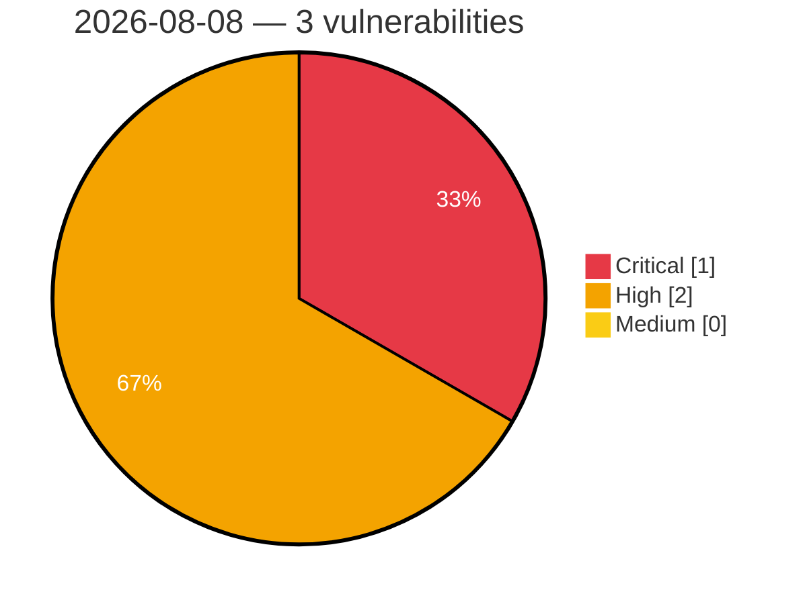

# Critical, High & Medium Severity Vulnerabilities — 2026-08-08

**Source status for this day:**

| Source | Critical | High | Medium | Total |
|--------|---------:|-----:|-------:|------:|
| cvefeed.io (High/Critical) | 1 | 2 | 0 | 3 |

**KEV (actively exploited):** 0  **Watchlist matches:** 2

## Critical (1)

| CVSS | Flags | Source | CVE / Title | Reported |
|------|-------|--------|-------------|----------|
| 9.8 | ⭐ | cvefeed.io (High/Critical) | [CVE-2026-14526 - AI Copilot – Content Generator <= 1.5.6 - Unauthenticated Privilege Escalation via Custom Workflow Route](https://cvefeed.io/vuln/detail/CVE-2026-14526) | 4 hours, 39 minutes ago |

## High (2)

| CVSS | Flags | Source | CVE / Title | Reported |
|------|-------|--------|-------------|----------|
| 8.7 | — | cvefeed.io (High/Critical) | [CVE-2026-13505 - Zeroisation of sensitive key material on garbage collection relies on finalization](https://cvefeed.io/vuln/detail/CVE-2026-13505) | 9 hours, 39 minutes ago |
| 8.7 | ⭐ | cvefeed.io (High/Critical) | [CVE-2026-8798 - Native entropy source retries the CPU entropy instructions without limit](https://cvefeed.io/vuln/detail/CVE-2026-8798) | 10 hours, 40 minutes ago |
