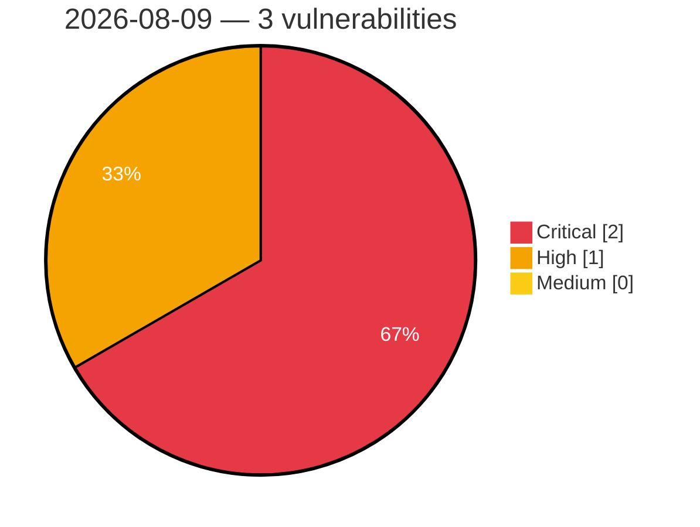

# Critical, High & Medium Severity Vulnerabilities — 2026-08-09

**Source status for this day:**

| Source | Critical | High | Medium | Total |
|--------|---------:|-----:|-------:|------:|
| cvefeed.io (High/Critical) | 2 | 1 | 0 | 3 |

**KEV (actively exploited):** 0  **Watchlist matches:** 2

## Critical (2)

| CVSS | Flags | Source | CVE / Title | Reported |
|------|-------|--------|-------------|----------|
| 9.8 | ⭐ | cvefeed.io (High/Critical) | [CVE-2026-71993 - MSI Radix AXE6600 v781521 Command Injection via openvpn function](https://cvefeed.io/vuln/detail/CVE-2026-71993) | 1 hour, 40 minutes ago |
| 9.8 | ⭐ | cvefeed.io (High/Critical) | [CVE-2026-71992 - MSI Radix AXE6600 v781521 Command Injection via macfilter](https://cvefeed.io/vuln/detail/CVE-2026-71992) | 1 hour, 40 minutes ago |

## High (1)

| CVSS | Flags | Source | CVE / Title | Reported |
|------|-------|--------|-------------|----------|
| 9.0 | — | cvefeed.io (High/Critical) | [CVE-2026-19341 - UTT HiPER 1200GW pptpSrvGlobalConfig strcpy stack-based overflow](https://cvefeed.io/vuln/detail/CVE-2026-19341) | 39 minutes ago |
