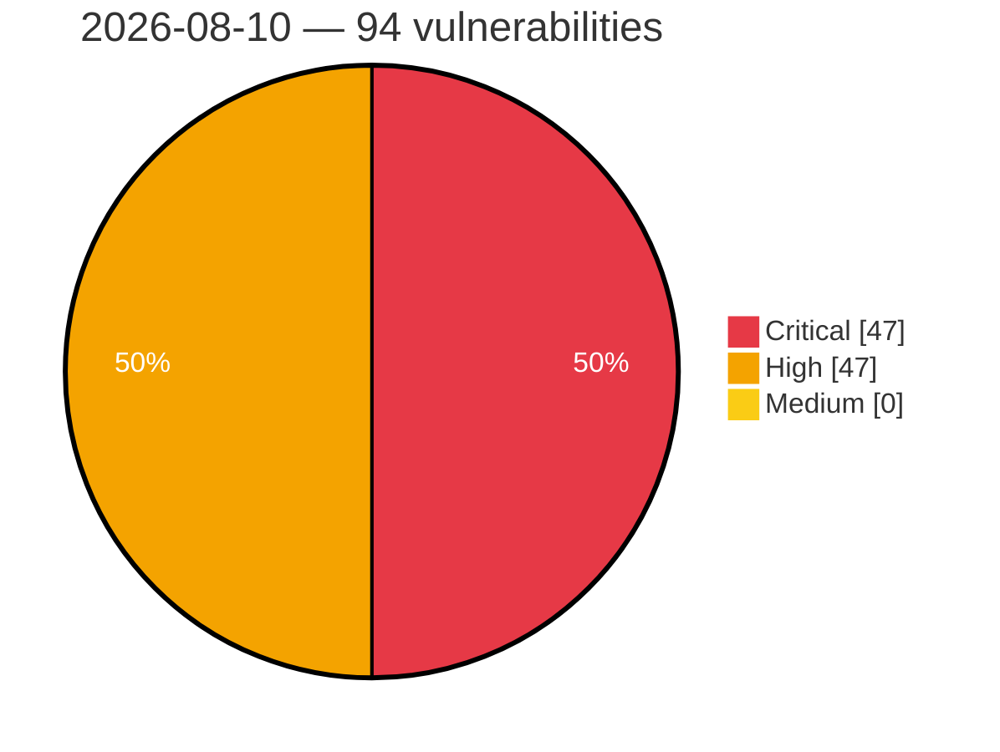

# Critical, High & Medium Severity Vulnerabilities — 2026-08-10

**Source status for this day:**

| Source | Critical | High | Medium | Total |
|--------|---------:|-----:|-------:|------:|
| cvefeed.io (High/Critical) | 47 | 47 | 0 | 94 |

**KEV (actively exploited):** 0  **Watchlist matches:** 79

## Critical (47)

| CVSS | Flags | Source | CVE / Title | Reported |
|------|-------|--------|-------------|----------|
| 10.0 | ⭐ | cvefeed.io (High/Critical) | [CVE-2026-66915 - Joomla Extension - fabrikar.com - Unauthenticated remote code execution in Fabrik < 4.6.7](https://cvefeed.io/vuln/detail/CVE-2026-66915) | 27 minutes ago |
| 10.0 | ⭐ | cvefeed.io (High/Critical) | [CVE-2026-72899 - Metabase SQL injection via public card or dashboard](https://cvefeed.io/vuln/detail/CVE-2026-72899) | 1 hour, 55 minutes ago |
| 10.0 | ⭐ | cvefeed.io (High/Critical) | [CVE-2026-72898 - Metabase SQL injection via password reset endpoint](https://cvefeed.io/vuln/detail/CVE-2026-72898) | 1 hour, 55 minutes ago |
| 9.9 | ⭐ | cvefeed.io (High/Critical) | [CVE-2026-72872 - Dokploy: OS Command Injection via Bitbucket `owner`/`repository` in `git clone`](https://cvefeed.io/vuln/detail/CVE-2026-72872) | 56 minutes ago |
| 9.9 | ⭐ | cvefeed.io (High/Critical) | [CVE-2026-72869 - Dokploy: Authenticated OS command injection in backup.restoreBackupWithLogs (databaseName) leading to host RCE](https://cvefeed.io/vuln/detail/CVE-2026-72869) | 56 minutes ago |
| 9.9 | ⭐ | cvefeed.io (High/Critical) | [CVE-2026-72868 - Dokploy: Member-role RCE as host root via destination.testConnection rclone shell injection](https://cvefeed.io/vuln/detail/CVE-2026-72868) | 56 minutes ago |
| 9.9 | ⭐ | cvefeed.io (High/Critical) | [CVE-2026-72867 - Dokploy: Incomplete fix of CVE-2026-45628: Command Injection via Unvalidated Branch Fields in Compose Deployment Pipeline (server-side regex missing in compose.ts)](https://cvefeed.io/vuln/detail/CVE-2026-72867) | 56 minutes ago |
| 9.9 | ⭐ | cvefeed.io (High/Critical) | [CVE-2026-72865 - Dokploy: OS Command Injection via compose `composePath`](https://cvefeed.io/vuln/detail/CVE-2026-72865) | 56 minutes ago |
| 9.9 | ⭐ | cvefeed.io (High/Critical) | [CVE-2026-72864 - Dokploy Broken Access Control on docker-container-terminal WebSocket (Member -> Root in Arbitrary Containers)](https://cvefeed.io/vuln/detail/CVE-2026-72864) | 56 minutes ago |
| 9.9 | ⭐ | cvefeed.io (High/Critical) | [CVE-2026-72863 - Dokploy: Missing authorization in WebSocket handlers allows a low-privilege member to gain root on the Docker host](https://cvefeed.io/vuln/detail/CVE-2026-72863) | 56 minutes ago |
| 9.9 | ⭐ | cvefeed.io (High/Critical) | [CVE-2026-72862 - Dokploy: OS Command Injection via dockerImage field in database service deployment functions → HOST RCE](https://cvefeed.io/vuln/detail/CVE-2026-72862) | 1 hour, 55 minutes ago |
| 9.9 | ⭐ | cvefeed.io (High/Critical) | [CVE-2026-72740 - Dokploy: OS Command Injection via SSH-form `customGitUrl` domain in `ssh-keyscan`](https://cvefeed.io/vuln/detail/CVE-2026-72740) | 1 hour, 55 minutes ago |
| 9.9 | ⭐ | cvefeed.io (High/Critical) | [CVE-2026-72911 - ERPNext: Possibility of server-side template injection due to missing validation](https://cvefeed.io/vuln/detail/CVE-2026-72911) | 40 minutes ago |
| 9.9 | ⭐ | cvefeed.io (High/Critical) | [CVE-2026-18948 - Feast: feast: unsafe dill deserialization of registry-stored udfs — rce on feature server and registry server](https://cvefeed.io/vuln/detail/CVE-2026-18948) | 40 minutes ago |
| 9.9 | ⭐ | cvefeed.io (High/Critical) | [CVE-2026-14450 - Maas-billing: maas api: privilege escalation via forged http headers due to missing authentication](https://cvefeed.io/vuln/detail/CVE-2026-14450) | 40 minutes ago |
| 9.9 | ⭐ | cvefeed.io (High/Critical) | [CVE-2026-72902 - Dokploy: Authenticated RCE via Command Injection in registry.testRegistry / registry.testRegistryById](https://cvefeed.io/vuln/detail/CVE-2026-72902) | 1 hour, 40 minutes ago |
| 9.9 | ⭐ | cvefeed.io (High/Critical) | [CVE-2026-72901 - Dokploy: Remote Code Execution via volume-backup](https://cvefeed.io/vuln/detail/CVE-2026-72901) | 1 hour, 40 minutes ago |
| 9.9 | ⭐ | cvefeed.io (High/Critical) | [CVE-2026-72886 - Dokploy: Non-admin member gains root on the host by bypassing the owner/admin check on server-level schedules (incomplete fix of CVE-2026-45632)](https://cvefeed.io/vuln/detail/CVE-2026-72886) | 1 hour, 40 minutes ago |
| 9.9 | ⭐ | cvefeed.io (High/Critical) | [CVE-2026-72882 - Dokploy: Authenticated blind command injection via file mounts leads to direct remote host RCE on managed servers](https://cvefeed.io/vuln/detail/CVE-2026-72882) | 1 hour, 40 minutes ago |
| 9.9 | ⭐ | cvefeed.io (High/Critical) | [CVE-2026-72880 - Dokploy: Arbitrary File Write + Remote OS Command Injection via `certificatePath`](https://cvefeed.io/vuln/detail/CVE-2026-72880) | 1 hour, 40 minutes ago |
| 9.9 | ⭐ | cvefeed.io (High/Critical) | [CVE-2026-72876 - Dokploy: Cross-organization IDOR leads to root RCE on another tenant's server via swarm.*](https://cvefeed.io/vuln/detail/CVE-2026-72876) | 1 hour, 6 minutes ago |
| 9.8 | ⭐ | cvefeed.io (High/Critical) | [CVE-2026-13206 - Multiple Vulnerabilities in Zyxel's WAH7601 - OS Command Injection](https://cvefeed.io/vuln/detail/CVE-2026-13206) | 34 minutes ago |
| 9.8 | — | cvefeed.io (High/Critical) | [CVE-2026-72593 - dulldusk phpfm - Missing Authentication by Default Allows Full Filesystem Access](https://cvefeed.io/vuln/detail/CVE-2026-72593) | 1 hour, 42 minutes ago |
| 9.8 | ⭐ | cvefeed.io (High/Critical) | [CVE-2026-72592 - dulldusk phpfm - Unauthenticated Remote Code Execution via Unrestricted PHP File Upload](https://cvefeed.io/vuln/detail/CVE-2026-72592) | 1 hour, 42 minutes ago |
| 9.8 | ⭐ | cvefeed.io (High/Critical) | [CVE-2026-72590 - alseambusher crontab-ui - Unauthenticated RCE via Newline Injection in env_vars Parameter](https://cvefeed.io/vuln/detail/CVE-2026-72590) | 1 hour, 42 minutes ago |
| 9.8 | ⭐ | cvefeed.io (High/Critical) | [CVE-2026-72589 - alseambusher crontab-ui - Unauthenticated RCE via Shell Injection in Imported Database hook Field](https://cvefeed.io/vuln/detail/CVE-2026-72589) | 1 hour, 42 minutes ago |
| 9.8 | ⭐ | cvefeed.io (High/Critical) | [CVE-2026-72580 - duhow xiaoai-patch - OS Command Injection in /mute and /unmute Endpoints](https://cvefeed.io/vuln/detail/CVE-2026-72580) | 1 hour, 42 minutes ago |
| 9.8 | ⭐ | cvefeed.io (High/Critical) | [CVE-2026-72577 - NASA fprime-gds - Missing Authentication and Path Traversal Enable Unauthenticated RCE and Spacecraft Command Injection](https://cvefeed.io/vuln/detail/CVE-2026-72577) | 1 hour, 42 minutes ago |
| 9.8 | ⭐ | cvefeed.io (High/Critical) | [CVE-2026-72567 - deepwiki-open - Unauthenticated Path Traversal Leading to Arbitrary File Write and Delete](https://cvefeed.io/vuln/detail/CVE-2026-72567) | 1 hour, 42 minutes ago |
| 9.8 | ⭐ | cvefeed.io (High/Critical) | [CVE-2026-72565 - Tencent APIJSON - Unauthenticated SQL Injection via @having Operator Map-Form Bypass](https://cvefeed.io/vuln/detail/CVE-2026-72565) | 1 hour, 42 minutes ago |
| 9.8 | ⭐ | cvefeed.io (High/Critical) | [CVE-2026-63106 - ReadyEcommerce < 4.5.2 Unauthenticated SQL Injection via ProductController.php](https://cvefeed.io/vuln/detail/CVE-2026-63106) | 1 hour, 4 minutes ago |
| 9.8 | ⭐ | cvefeed.io (High/Critical) | [CVE-2026-66738 - SPIP < 4.4.18 Code Injection via Navigation Endpoint on SQLite](https://cvefeed.io/vuln/detail/CVE-2026-66738) | 34 minutes ago |
| 9.6 | ⭐ | cvefeed.io (High/Critical) | [CVE-2026-72564 - fosrl Pangolin - Access Token Scope Bypass Allows Cross-Resource Authentication](https://cvefeed.io/vuln/detail/CVE-2026-72564) | 1 hour, 42 minutes ago |
| 9.6 | ⭐ | cvefeed.io (High/Critical) | [CVE-2026-72878 - Dokploy: OS Command Injection in backup/restore pipeline via unescaped user-controlled shell arguments](https://cvefeed.io/vuln/detail/CVE-2026-72878) | 1 hour, 6 minutes ago |
| 9.6 | ⭐ | cvefeed.io (High/Critical) | [CVE-2026-72877 - Dokploy: Command Injection via dockerImage in buildRemoteDocker](https://cvefeed.io/vuln/detail/CVE-2026-72877) | 1 hour, 6 minutes ago |
| 9.4 | ⭐ | cvefeed.io (High/Critical) | [CVE-2026-19429 - Jenkins Project Jenkins - Symlink Target Validation Bypass Arbitrary File Read](https://cvefeed.io/vuln/detail/CVE-2026-19429) | 2 hours, 57 minutes ago |
| 9.4 | ⭐ | cvefeed.io (High/Critical) | [CVE-2026-72879 - Dokploy: Command Injection via Registry Credentials in Swarm Upload](https://cvefeed.io/vuln/detail/CVE-2026-72879) | 1 hour, 40 minutes ago |
| 9.3 | ⭐ | cvefeed.io (High/Critical) | [CVE-2026-48158 - use-context-selector was vulnerable to malicious code execution via compromised commits](https://cvefeed.io/vuln/detail/CVE-2026-48158) | 1 hour, 37 minutes ago |
| 9.3 | ⭐ | cvefeed.io (High/Critical) | [CVE-2026-47754 - unauthenticated path traversal in Metacat 2.x](https://cvefeed.io/vuln/detail/CVE-2026-47754) | 1 hour, 37 minutes ago |
| 9.3 | ⭐ | cvefeed.io (High/Critical) | [CVE-2025-13294 - Unauthenticated SQL Injection](https://cvefeed.io/vuln/detail/CVE-2025-13294) | 48 minutes ago |
| 9.3 | — | cvefeed.io (High/Critical) | [CVE-2025-13293 - Backdoor / default root credentials](https://cvefeed.io/vuln/detail/CVE-2025-13293) | 49 minutes ago |
| 9.3 | ⭐ | cvefeed.io (High/Critical) | [CVE-2026-72904 - Firecrawl: Arbitrary file read via JSON Schema $ref expansion](https://cvefeed.io/vuln/detail/CVE-2026-72904) | 40 minutes ago |
| 9.3 | ⭐ | cvefeed.io (High/Critical) | [CVE-2026-48160 - react-tracked was vulnerable to malicious code execution via compromised commits](https://cvefeed.io/vuln/detail/CVE-2026-48160) | 40 minutes ago |
| 9.3 | ⭐ | cvefeed.io (High/Critical) | [CVE-2026-48161 - react18-use was vulnerable to malicious code execution via compromised commits](https://cvefeed.io/vuln/detail/CVE-2026-48161) | 3 hours, 3 minutes ago |
| 9.2 | ⭐ | cvefeed.io (High/Critical) | [CVE-2025-15681 - Insufficient Webserver Authentication](https://cvefeed.io/vuln/detail/CVE-2025-15681) | 43 minutes ago |
| 9.1 | ⭐ | cvefeed.io (High/Critical) | [CVE-2026-72575 - daptin - Authentication Bypass via Null Owner Permission Check on usergroup Objects](https://cvefeed.io/vuln/detail/CVE-2026-72575) | 1 hour, 42 minutes ago |
| 9.1 | ⭐ | cvefeed.io (High/Critical) | [CVE-2026-72569 - cube-root directory-serve - Unauthenticated Path Traversal Arbitrary File Deletion](https://cvefeed.io/vuln/detail/CVE-2026-72569) | 1 hour, 42 minutes ago |

## High (47)

| CVSS | Flags | Source | CVE / Title | Reported |
|------|-------|--------|-------------|----------|
| 8.8 | ⭐ | cvefeed.io (High/Critical) | [CVE-2026-64940 - Nishishi Factory Tegalog Authentication Bypass Vulnerability](https://cvefeed.io/vuln/detail/CVE-2026-64940) | 47 minutes ago |
| 8.8 | — | cvefeed.io (High/Critical) | [CVE-2026-66405 - Ecovacs DEEBOT Unauthorized Telnet Access Vulnerability](https://cvefeed.io/vuln/detail/CVE-2026-66405) | 1 hour, 17 minutes ago |
| 8.8 | ⭐ | cvefeed.io (High/Critical) | [CVE-2026-72578 - FreePBX Framework - Missing CSRF Protection in Admin Panel Ajax Dispatcher](https://cvefeed.io/vuln/detail/CVE-2026-72578) | 1 hour, 42 minutes ago |
| 8.8 | ⭐ | cvefeed.io (High/Critical) | [CVE-2026-72573 - 4xmen pm2panel - Authenticated OS Command Injection via id Query Parameter](https://cvefeed.io/vuln/detail/CVE-2026-72573) | 1 hour, 42 minutes ago |
| 8.8 | ⭐ | cvefeed.io (High/Critical) | [CVE-2026-69118 - Cachet 2.4.1 Authenticated Server-Side Template Injection RCE](https://cvefeed.io/vuln/detail/CVE-2026-69118) | 31 minutes ago |
| 8.8 | — | cvefeed.io (High/Critical) | [CVE-2025-15683 - Multiple Unauthenticated Denial-of-Service Conditions](https://cvefeed.io/vuln/detail/CVE-2025-15683) | 35 minutes ago |
| 8.8 | ⭐ | cvefeed.io (High/Critical) | [CVE-2026-72866 - WebSocket Terminal Auth Bypass](https://cvefeed.io/vuln/detail/CVE-2026-72866) | 56 minutes ago |
| 8.8 | ⭐ | cvefeed.io (High/Critical) | [CVE-2026-71966 - CyberPanel 2.4.3 Authenticated Command Injection via starRemoteTransfer](https://cvefeed.io/vuln/detail/CVE-2026-71966) | 1 hour, 20 minutes ago |
| 8.8 | ⭐ | cvefeed.io (High/Critical) | [CVE-2026-71965 - CyberPanel 2.4.3 Authenticated RCE via Remote Backup Feature](https://cvefeed.io/vuln/detail/CVE-2026-71965) | 1 hour, 21 minutes ago |
| 8.8 | ⭐ | cvefeed.io (High/Critical) | [CVE-2026-18982 - Odh-training-operator-rhel9: rhoai fork aggregates training job create onto native edit/admin clusterroles](https://cvefeed.io/vuln/detail/CVE-2026-18982) | 40 minutes ago |
| 8.8 | ⭐ | cvefeed.io (High/Critical) | [CVE-2026-18951 - Odh-training-operator-rhel9: [trainer v2 security] trn-02: rhoai overlay aggregates trainjobs crud into standard edit clusterrole](https://cvefeed.io/vuln/detail/CVE-2026-18951) | 40 minutes ago |
| 8.8 | ⭐ | cvefeed.io (High/Critical) | [CVE-2026-18950 - Odh-dashboard: odh-dashboard: confused-deputy privilege escalation via unchecked roleref in rolebinding creation](https://cvefeed.io/vuln/detail/CVE-2026-18950) | 40 minutes ago |
| 8.8 | ⭐ | cvefeed.io (High/Critical) | [CVE-2026-18949 - Odh-dashboard: odh-dashboard: clusterrole grants cluster-wide crud on secrets and rbac management resources](https://cvefeed.io/vuln/detail/CVE-2026-18949) | 40 minutes ago |
| 8.8 | ⭐ | cvefeed.io (High/Critical) | [CVE-2026-18617 - Data-science-pipelines-operator: dspo: mysql dsn parameter injection via customextraparams enables local infile file exfiltration from operator pod](https://cvefeed.io/vuln/detail/CVE-2026-18617) | 40 minutes ago |
| 8.8 | ⭐ | cvefeed.io (High/Critical) | [CVE-2026-13717 - Rhoai maas: llm-d: maas/llm-d inference gateway: default allowedroutes.namespaces.from: all allows namespace users to hijack shared model-serving traffic (tokens, prompts, outputs)](https://cvefeed.io/vuln/detail/CVE-2026-13717) | 40 minutes ago |
| 8.8 | ⭐ | cvefeed.io (High/Critical) | [CVE-2026-72883 - Dokploy: WebSocket Terminal Missing Service-Level Access Control](https://cvefeed.io/vuln/detail/CVE-2026-72883) | 1 hour, 40 minutes ago |
| 8.8 | ⭐ | cvefeed.io (High/Critical) | [CVE-2026-72875 - Dokploy: Remote Code Execution (RCE) via Command Injection in settings.readTraefikFile](https://cvefeed.io/vuln/detail/CVE-2026-72875) | 1 hour, 6 minutes ago |
| 8.7 | — | cvefeed.io (High/Critical) | [CVE-2026-66403 - ECOVACS DEEBOT PRO Information Disclosure Vulnerability](https://cvefeed.io/vuln/detail/CVE-2026-66403) | 1 hour, 18 minutes ago |
| 8.7 | ⭐ | cvefeed.io (High/Critical) | [CVE-2026-59233 - Missing Authorization in Prospero Flow CRM permission save endpoint allows privilege escalation](https://cvefeed.io/vuln/detail/CVE-2026-59233) | 45 minutes ago |
| 8.7 | ⭐ | cvefeed.io (High/Critical) | [CVE-2026-72730 - Discourse: Stored XSS chat-transcript username unescaped in Rich Text Editor](https://cvefeed.io/vuln/detail/CVE-2026-72730) | 39 minutes ago |
| 8.7 | ⭐ | cvefeed.io (High/Critical) | [CVE-2025-15682 - Unauthenticated Resource Exhaustion](https://cvefeed.io/vuln/detail/CVE-2025-15682) | 40 minutes ago |
| 8.7 | ⭐ | cvefeed.io (High/Critical) | [CVE-2026-72870 - Dokploy: Command Injection via Docker Credentials in buildRemoteDocker](https://cvefeed.io/vuln/detail/CVE-2026-72870) | 56 minutes ago |
| 8.7 | ⭐ | cvefeed.io (High/Critical) | [CVE-2026-71962 - Flowise 2.2.4 - 3.1.4 Missing Authorization via openai-assistants-file/download](https://cvefeed.io/vuln/detail/CVE-2026-71962) | 56 minutes ago |
| 8.7 | ⭐ | cvefeed.io (High/Critical) | [CVE-2026-18608 - Data-science-pipelines-operator: dspo: operator clusterrole grants pods/exec:*, kubeflow.org */*, and clusterrole/binding crud cluster-wide](https://cvefeed.io/vuln/detail/CVE-2026-18608) | 40 minutes ago |
| 8.7 | ⭐ | cvefeed.io (High/Critical) | [CVE-2026-72884 - Dokploy: Command Injection via Compose Custom Command](https://cvefeed.io/vuln/detail/CVE-2026-72884) | 1 hour, 40 minutes ago |
| 8.7 | ⭐ | cvefeed.io (High/Critical) | [CVE-2026-72874 - Dokploy: Command Injection via Unescaped Git URL in Clone Commands](https://cvefeed.io/vuln/detail/CVE-2026-72874) | 1 hour, 6 minutes ago |
| 8.7 | ⭐ | cvefeed.io (High/Critical) | [CVE-2025-30237 - Authentication Bypass via Broken Access Control in Web Server in Multiple TP-Link Aginet Devices](https://cvefeed.io/vuln/detail/CVE-2025-30237) | 3 hours, 4 minutes ago |
| 8.6 | ⭐ | cvefeed.io (High/Critical) | [CVE-2026-72581 - duhow xiaoai-patch - Server-Side Request Forgery in /auth Endpoint](https://cvefeed.io/vuln/detail/CVE-2026-72581) | 1 hour, 42 minutes ago |
| 8.6 | — | cvefeed.io (High/Critical) | [CVE-2026-19433 - Authorization Bypass Through User-Controlled Key in Prospero Flow CRM contact save and vCard export](https://cvefeed.io/vuln/detail/CVE-2026-19433) | 1 hour, 17 minutes ago |
| 8.6 | ⭐ | cvefeed.io (High/Critical) | [CVE-2025-30241 - OS Command Injection in Web Interface in Multiple TP-Link Aginet Devices](https://cvefeed.io/vuln/detail/CVE-2025-30241) | 3 hours, 3 minutes ago |
| 8.6 | ⭐ | cvefeed.io (High/Critical) | [CVE-2025-30238 - Privilege Escalation via Improper Authorization in User Management in multiple TP-Link Aginet Devices](https://cvefeed.io/vuln/detail/CVE-2025-30238) | 3 hours, 3 minutes ago |
| 8.5 | ⭐ | cvefeed.io (High/Critical) | [CVE-2026-71576 - Multicluster-global-hub: multicluster-global-hub: manager trusts self-asserted evt.source() for leaf-hub identity in all status handlers](https://cvefeed.io/vuln/detail/CVE-2026-71576) | 39 minutes ago |
| 8.5 | ⭐ | cvefeed.io (High/Critical) | [CVE-2026-18947 - Feast: feast: authorization bypass in /materialize endpoints enables dos via unauthorized full re-materialization](https://cvefeed.io/vuln/detail/CVE-2026-18947) | 40 minutes ago |
| 8.5 | — | cvefeed.io (High/Critical) | [CVE-2025-30239 - Sensitive Data Exposure due to Hardcoded Cryptographic Keys in Multiple TP-Link Aginet Devices](https://cvefeed.io/vuln/detail/CVE-2025-30239) | 3 hours, 3 minutes ago |
| 8.4 | — | cvefeed.io (High/Critical) | [CVE-2026-13133 - LINE for Windows DLL Hijacking Vulnerability](https://cvefeed.io/vuln/detail/CVE-2026-13133) | 40 minutes ago |
| 8.4 | — | cvefeed.io (High/Critical) | [CVE-2026-21068 - Samsung libril_sem.so Stack-based Buffer Overflow](https://cvefeed.io/vuln/detail/CVE-2026-21068) | 1 hour, 35 minutes ago |
| 8.4 | ⭐ | cvefeed.io (High/Critical) | [CVE-2026-59090 - Gimp: gimp: arbitrary code execution in psd plugin due to unsigned underflow](https://cvefeed.io/vuln/detail/CVE-2026-59090) | 49 minutes ago |
| 8.4 | — | cvefeed.io (High/Critical) | [CVE-2026-71969 - OP-TEE OS 4.10.0 Buffer Underwrite via RSA NOPAD Encrypt/Decrypt Operations](https://cvefeed.io/vuln/detail/CVE-2026-71969) | 56 minutes ago |
| 8.4 | — | cvefeed.io (High/Critical) | [CVE-2026-71968 - OP-TEE OS 4.10.0 Use-After-Free via Trusted Application Loader TA_FLAG_CONCURRENT](https://cvefeed.io/vuln/detail/CVE-2026-71968) | 56 minutes ago |
| 8.4 | — | cvefeed.io (High/Critical) | [CVE-2026-8718 - Out-of-bounds write in DTLS peer Connection ID getsockopt (`TLS_DTLS_PEER_CID_VALUE`) in Zephyr net sockets/TLS](https://cvefeed.io/vuln/detail/CVE-2026-8718) | 3 hours, 3 minutes ago |
| 8.2 | — | cvefeed.io (High/Critical) | [CVE-2026-12984 - Exposure of Sensitive Information to an Unauthorized Actor in Zyxel's WAH7601](https://cvefeed.io/vuln/detail/CVE-2026-12984) | 56 minutes ago |
| 8.2 | — | cvefeed.io (High/Critical) | [CVE-2026-14886 - Vault Enterprise vulnerable to cross-namespace entity deletion](https://cvefeed.io/vuln/detail/CVE-2026-14886) | 1 hour, 16 minutes ago |
| 8.1 | ⭐ | cvefeed.io (High/Critical) | [CVE-2026-66407 - ECOVACS DEEBOT PRO WebSocket Authentication Bypass](https://cvefeed.io/vuln/detail/CVE-2026-66407) | 1 hour, 16 minutes ago |
| 8.1 | ⭐ | cvefeed.io (High/Critical) | [CVE-2026-73030 - unearth 0.18.2 Path Traversal via Unnormalized Paths and Symlink Escape](https://cvefeed.io/vuln/detail/CVE-2026-73030) | 40 minutes ago |
| 8.1 | ⭐ | cvefeed.io (High/Critical) | [CVE-2026-72903 - Tabby: Windows SFTP path traversal allows a malicious server to write files outside the selected download directory](https://cvefeed.io/vuln/detail/CVE-2026-72903) | 40 minutes ago |
| 8.1 | — | cvefeed.io (High/Critical) | [CVE-2026-15467 - Trustyai-service-operator: trustyai-service-operator: lmevaljob sidecar containers bypass protected environment variable filtering, allowing trust_remote_code policy override](https://cvefeed.io/vuln/detail/CVE-2026-15467) | 40 minutes ago |
| 8.0 | ⭐ | cvefeed.io (High/Critical) | [CVE-2026-15581 - Trustyai-service-operator: trustyai-service-operator: tas internal service bypasses kube-rbac-proxy, exposing unauthenticated quarkus api cluster-wide](https://cvefeed.io/vuln/detail/CVE-2026-15581) | 40 minutes ago |
