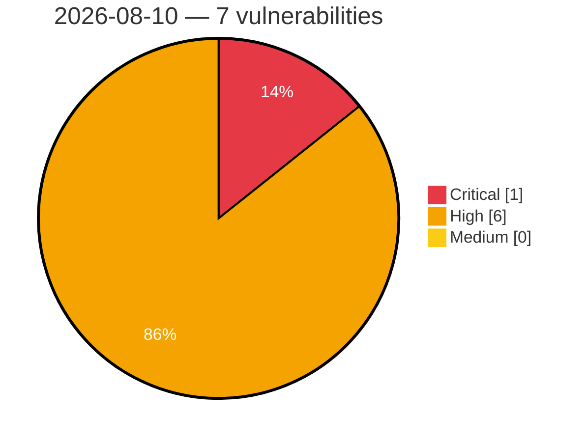

# Critical, High & Medium Severity Vulnerabilities — 2026-08-10

**Source status for this day:**

| Source | Critical | High | Medium | Total |
|--------|---------:|-----:|-------:|------:|
| cvefeed.io (High/Critical) | 1 | 6 | 0 | 7 |

**KEV (actively exploited):** 0  **Watchlist matches:** 3

## Critical (1)

| CVSS | Flags | Source | CVE / Title | Reported |
|------|-------|--------|-------------|----------|
| 10.0 | ⭐ | cvefeed.io (High/Critical) | [CVE-2026-66915 - Joomla Extension - fabrikar.com - Unauthenticated remote code execution in Fabrik < 4.6.7](https://cvefeed.io/vuln/detail/CVE-2026-66915) | 27 minutes ago |

## High (6)

| CVSS | Flags | Source | CVE / Title | Reported |
|------|-------|--------|-------------|----------|
| 8.8 | ⭐ | cvefeed.io (High/Critical) | [CVE-2026-64940 - Nishishi Factory Tegalog Authentication Bypass Vulnerability](https://cvefeed.io/vuln/detail/CVE-2026-64940) | 47 minutes ago |
| 8.8 | — | cvefeed.io (High/Critical) | [CVE-2026-66405 - Ecovacs DEEBOT Unauthorized Telnet Access Vulnerability](https://cvefeed.io/vuln/detail/CVE-2026-66405) | 1 hour, 17 minutes ago |
| 8.7 | — | cvefeed.io (High/Critical) | [CVE-2026-66403 - ECOVACS DEEBOT PRO Information Disclosure Vulnerability](https://cvefeed.io/vuln/detail/CVE-2026-66403) | 1 hour, 18 minutes ago |
| 8.4 | — | cvefeed.io (High/Critical) | [CVE-2026-13133 - LINE for Windows DLL Hijacking Vulnerability](https://cvefeed.io/vuln/detail/CVE-2026-13133) | 40 minutes ago |
| 8.4 | — | cvefeed.io (High/Critical) | [CVE-2026-21068 - Samsung libril_sem.so Stack-based Buffer Overflow](https://cvefeed.io/vuln/detail/CVE-2026-21068) | 1 hour, 35 minutes ago |
| 8.1 | ⭐ | cvefeed.io (High/Critical) | [CVE-2026-66407 - ECOVACS DEEBOT PRO WebSocket Authentication Bypass](https://cvefeed.io/vuln/detail/CVE-2026-66407) | 1 hour, 16 minutes ago |
