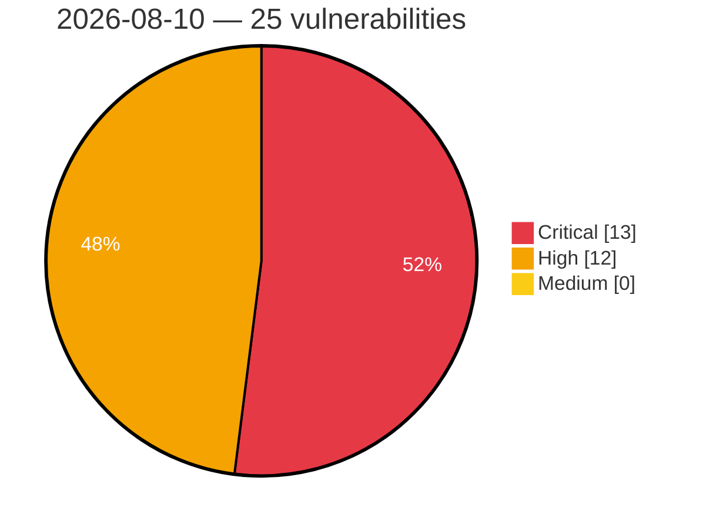

# Critical, High & Medium Severity Vulnerabilities — 2026-08-10

**Source status for this day:**

| Source | Critical | High | Medium | Total |
|--------|---------:|-----:|-------:|------:|
| cvefeed.io (High/Critical) | 13 | 12 | 0 | 25 |

**KEV (actively exploited):** 0  **Watchlist matches:** 19

## Critical (13)

| CVSS | Flags | Source | CVE / Title | Reported |
|------|-------|--------|-------------|----------|
| 10.0 | ⭐ | cvefeed.io (High/Critical) | [CVE-2026-66915 - Joomla Extension - fabrikar.com - Unauthenticated remote code execution in Fabrik < 4.6.7](https://cvefeed.io/vuln/detail/CVE-2026-66915) | 27 minutes ago |
| 9.8 | ⭐ | cvefeed.io (High/Critical) | [CVE-2026-13206 - Multiple Vulnerabilities in Zyxel's WAH7601 - OS Command Injection](https://cvefeed.io/vuln/detail/CVE-2026-13206) | 34 minutes ago |
| 9.8 | — | cvefeed.io (High/Critical) | [CVE-2026-72593 - dulldusk phpfm - Missing Authentication by Default Allows Full Filesystem Access](https://cvefeed.io/vuln/detail/CVE-2026-72593) | 1 hour, 42 minutes ago |
| 9.8 | ⭐ | cvefeed.io (High/Critical) | [CVE-2026-72592 - dulldusk phpfm - Unauthenticated Remote Code Execution via Unrestricted PHP File Upload](https://cvefeed.io/vuln/detail/CVE-2026-72592) | 1 hour, 42 minutes ago |
| 9.8 | ⭐ | cvefeed.io (High/Critical) | [CVE-2026-72590 - alseambusher crontab-ui - Unauthenticated RCE via Newline Injection in env_vars Parameter](https://cvefeed.io/vuln/detail/CVE-2026-72590) | 1 hour, 42 minutes ago |
| 9.8 | ⭐ | cvefeed.io (High/Critical) | [CVE-2026-72589 - alseambusher crontab-ui - Unauthenticated RCE via Shell Injection in Imported Database hook Field](https://cvefeed.io/vuln/detail/CVE-2026-72589) | 1 hour, 42 minutes ago |
| 9.8 | ⭐ | cvefeed.io (High/Critical) | [CVE-2026-72580 - duhow xiaoai-patch - OS Command Injection in /mute and /unmute Endpoints](https://cvefeed.io/vuln/detail/CVE-2026-72580) | 1 hour, 42 minutes ago |
| 9.8 | ⭐ | cvefeed.io (High/Critical) | [CVE-2026-72577 - NASA fprime-gds - Missing Authentication and Path Traversal Enable Unauthenticated RCE and Spacecraft Command Injection](https://cvefeed.io/vuln/detail/CVE-2026-72577) | 1 hour, 42 minutes ago |
| 9.8 | ⭐ | cvefeed.io (High/Critical) | [CVE-2026-72567 - deepwiki-open - Unauthenticated Path Traversal Leading to Arbitrary File Write and Delete](https://cvefeed.io/vuln/detail/CVE-2026-72567) | 1 hour, 42 minutes ago |
| 9.8 | ⭐ | cvefeed.io (High/Critical) | [CVE-2026-72565 - Tencent APIJSON - Unauthenticated SQL Injection via @having Operator Map-Form Bypass](https://cvefeed.io/vuln/detail/CVE-2026-72565) | 1 hour, 42 minutes ago |
| 9.6 | ⭐ | cvefeed.io (High/Critical) | [CVE-2026-72564 - fosrl Pangolin - Access Token Scope Bypass Allows Cross-Resource Authentication](https://cvefeed.io/vuln/detail/CVE-2026-72564) | 1 hour, 42 minutes ago |
| 9.1 | ⭐ | cvefeed.io (High/Critical) | [CVE-2026-72575 - daptin - Authentication Bypass via Null Owner Permission Check on usergroup Objects](https://cvefeed.io/vuln/detail/CVE-2026-72575) | 1 hour, 42 minutes ago |
| 9.1 | ⭐ | cvefeed.io (High/Critical) | [CVE-2026-72569 - cube-root directory-serve - Unauthenticated Path Traversal Arbitrary File Deletion](https://cvefeed.io/vuln/detail/CVE-2026-72569) | 1 hour, 42 minutes ago |

## High (12)

| CVSS | Flags | Source | CVE / Title | Reported |
|------|-------|--------|-------------|----------|
| 8.8 | ⭐ | cvefeed.io (High/Critical) | [CVE-2026-64940 - Nishishi Factory Tegalog Authentication Bypass Vulnerability](https://cvefeed.io/vuln/detail/CVE-2026-64940) | 47 minutes ago |
| 8.8 | — | cvefeed.io (High/Critical) | [CVE-2026-66405 - Ecovacs DEEBOT Unauthorized Telnet Access Vulnerability](https://cvefeed.io/vuln/detail/CVE-2026-66405) | 1 hour, 17 minutes ago |
| 8.8 | ⭐ | cvefeed.io (High/Critical) | [CVE-2026-72578 - FreePBX Framework - Missing CSRF Protection in Admin Panel Ajax Dispatcher](https://cvefeed.io/vuln/detail/CVE-2026-72578) | 1 hour, 42 minutes ago |
| 8.8 | ⭐ | cvefeed.io (High/Critical) | [CVE-2026-72573 - 4xmen pm2panel - Authenticated OS Command Injection via id Query Parameter](https://cvefeed.io/vuln/detail/CVE-2026-72573) | 1 hour, 42 minutes ago |
| 8.7 | — | cvefeed.io (High/Critical) | [CVE-2026-66403 - ECOVACS DEEBOT PRO Information Disclosure Vulnerability](https://cvefeed.io/vuln/detail/CVE-2026-66403) | 1 hour, 18 minutes ago |
| 8.7 | ⭐ | cvefeed.io (High/Critical) | [CVE-2026-59233 - Missing Authorization in Prospero Flow CRM permission save endpoint allows privilege escalation](https://cvefeed.io/vuln/detail/CVE-2026-59233) | 45 minutes ago |
| 8.6 | ⭐ | cvefeed.io (High/Critical) | [CVE-2026-72581 - duhow xiaoai-patch - Server-Side Request Forgery in /auth Endpoint](https://cvefeed.io/vuln/detail/CVE-2026-72581) | 1 hour, 42 minutes ago |
| 8.4 | — | cvefeed.io (High/Critical) | [CVE-2026-13133 - LINE for Windows DLL Hijacking Vulnerability](https://cvefeed.io/vuln/detail/CVE-2026-13133) | 40 minutes ago |
| 8.4 | — | cvefeed.io (High/Critical) | [CVE-2026-21068 - Samsung libril_sem.so Stack-based Buffer Overflow](https://cvefeed.io/vuln/detail/CVE-2026-21068) | 1 hour, 35 minutes ago |
| 8.4 | ⭐ | cvefeed.io (High/Critical) | [CVE-2026-59090 - Gimp: gimp: arbitrary code execution in psd plugin due to unsigned underflow](https://cvefeed.io/vuln/detail/CVE-2026-59090) | 49 minutes ago |
| 8.2 | — | cvefeed.io (High/Critical) | [CVE-2026-12984 - Exposure of Sensitive Information to an Unauthorized Actor in Zyxel's WAH7601](https://cvefeed.io/vuln/detail/CVE-2026-12984) | 56 minutes ago |
| 8.1 | ⭐ | cvefeed.io (High/Critical) | [CVE-2026-66407 - ECOVACS DEEBOT PRO WebSocket Authentication Bypass](https://cvefeed.io/vuln/detail/CVE-2026-66407) | 1 hour, 16 minutes ago |
