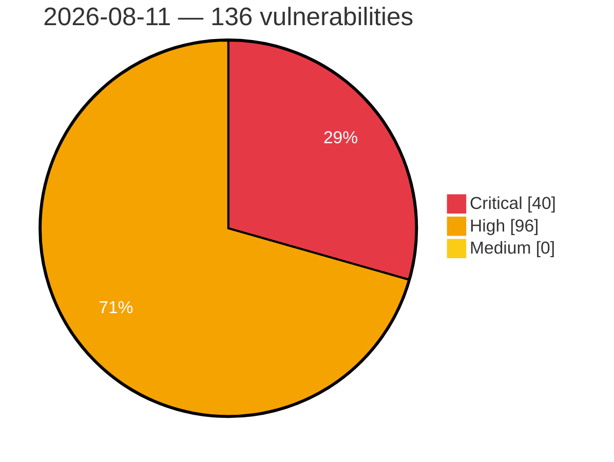

# Critical, High & Medium Severity Vulnerabilities — 2026-08-11

**Source status for this day:**

| Source | Critical | High | Medium | Total |
|--------|---------:|-----:|-------:|------:|
| cvefeed.io (High/Critical) | 40 | 96 | 0 | 136 |

**KEV (actively exploited):** 0  **Watchlist matches:** 108

## Critical (40)

| CVSS | Flags | Source | CVE / Title | Reported |
|------|-------|--------|-------------|----------|
| 10.0 | ⭐ | cvefeed.io (High/Critical) | [CVE-2026-58231 - Improper Authorization in SAP Commerce Cloud (Data Hub Adapter)](https://cvefeed.io/vuln/detail/CVE-2026-58231) | 23 minutes ago |
| 10.0 | ⭐ | cvefeed.io (High/Critical) | [CVE-2026-58115 - Siemens SIMATIC IoT2050 Node-RED Authentication Bypass and Remote Code Execution Vulnerability](https://cvefeed.io/vuln/detail/CVE-2026-58115) | 38 minutes ago |
| 10.0 | ⭐ | cvefeed.io (High/Critical) | [CVE-2026-17061 - Deserialization of Untrusted Data Vulnerability in SIMULIA Execution Engine from Release 2023 through Release 2026](https://cvefeed.io/vuln/detail/CVE-2026-17061) | 24 minutes ago |
| 10.0 | — | cvefeed.io (High/Critical) | [CVE-2026-48056 - Streambert Vulnerable to Arbitrary Binary Execution via Downloader IPC Handler](https://cvefeed.io/vuln/detail/CVE-2026-48056) | 28 minutes ago |
| 10.0 | — | cvefeed.io (High/Critical) | [CVE-2026-71398 - Adobe Campaign Classic (ACC) \| Incorrect Authorization (CWE-863)](https://cvefeed.io/vuln/detail/CVE-2026-71398) | 1 hour, 14 minutes ago |
| 10.0 | ⭐ | cvefeed.io (High/Critical) | [CVE-2026-45618 - LiquidJS is Vulnerable to Remote Code Execution](https://cvefeed.io/vuln/detail/CVE-2026-45618) | 1 hour, 15 minutes ago |
| 9.9 | ⭐ | cvefeed.io (High/Critical) | [CVE-2026-72603 - wg-easy wg-easy - OS Command Injection](https://cvefeed.io/vuln/detail/CVE-2026-72603) | 27 minutes ago |
| 9.9 | ⭐ | cvefeed.io (High/Critical) | [CVE-2026-48765 - TypeBot vulnerable to cross-workspace OAuth credential takeover in updateOAuthCredentials via missing object binding](https://cvefeed.io/vuln/detail/CVE-2026-48765) | 15 minutes ago |
| 9.8 | — | cvefeed.io (High/Critical) | [CVE-2026-34265 - Memory Corruption vulnerability in Application Server ABAP for SAP NetWeaver and ABAP Platform](https://cvefeed.io/vuln/detail/CVE-2026-34265) | 1 hour, 3 minutes ago |
| 9.8 | ⭐ | cvefeed.io (High/Critical) | [CVE-2026-19425 - Win Men Intermational｜Travel Agency Management System - SQL Injection](https://cvefeed.io/vuln/detail/CVE-2026-19425) | 40 minutes ago |
| 9.8 | ⭐ | cvefeed.io (High/Critical) | [CVE-2026-10579 - Picketlink-federation: auth bypass in picketlink saml unsolicited-response](https://cvefeed.io/vuln/detail/CVE-2026-10579) | 40 minutes ago |
| 9.8 | ⭐ | cvefeed.io (High/Critical) | [CVE-2026-72599 - e107 e107 - SQL Injection](https://cvefeed.io/vuln/detail/CVE-2026-72599) | 27 minutes ago |
| 9.8 | ⭐ | cvefeed.io (High/Critical) | [CVE-2026-72550 - Friendica Friendica - SQL Injection](https://cvefeed.io/vuln/detail/CVE-2026-72550) | 27 minutes ago |
| 9.8 | ⭐ | cvefeed.io (High/Critical) | [CVE-2026-46670 - YesWiki: Unauthenticated SQL Injection](https://cvefeed.io/vuln/detail/CVE-2026-46670) | 28 minutes ago |
| 9.8 | ⭐ | cvefeed.io (High/Critical) | [CVE-2026-72920 - SeaweedFS: Unauthenticated filer IAM gRPC service grants S3 administrative control](https://cvefeed.io/vuln/detail/CVE-2026-72920) | 40 minutes ago |
| 9.8 | ⭐ | cvefeed.io (High/Critical) | [CVE-2026-65791 - Windows iSCSI Target Service Remote Code Execution Vulnerability](https://cvefeed.io/vuln/detail/CVE-2026-65791) | 38 minutes ago |
| 9.8 | ⭐ | cvefeed.io (High/Critical) | [CVE-2026-73211 - PeerTube: Unauthenticated remote SQL injection in ActorFollowModel.updateScore()](https://cvefeed.io/vuln/detail/CVE-2026-73211) | 1 hour, 14 minutes ago |
| 9.8 | ⭐ | cvefeed.io (High/Critical) | [CVE-2026-69102 - MaxKey Hard-coded JWT Secret Unauthorized Access via /login/jwt/trust](https://cvefeed.io/vuln/detail/CVE-2026-69102) | 1 hour, 14 minutes ago |
| 9.8 | ⭐ | cvefeed.io (High/Critical) | [CVE-2026-68067 - Mira Hormone Monitor, Mira Android App Weak Authentication](https://cvefeed.io/vuln/detail/CVE-2026-68067) | 9 minutes ago |
| 9.8 | ⭐ | cvefeed.io (High/Critical) | [CVE-2026-73034 - DB-GPT v0.8.1 Path Traversal Arbitrary File Write via user_id Header](https://cvefeed.io/vuln/detail/CVE-2026-73034) | 1 hour, 14 minutes ago |
| 9.8 | — | cvefeed.io (High/Critical) | [CVE-2026-16230 - Formidable Digital Signatures <= 3.0.6 - Unauthenticated Arbitrary File Deletion via Signature Field](https://cvefeed.io/vuln/detail/CVE-2026-16230) | 1 hour, 15 minutes ago |
| 9.6 | — | cvefeed.io (High/Critical) | [CVE-2026-18972 - Velociraptor authenticated identity-spoofing vulnerability](https://cvefeed.io/vuln/detail/CVE-2026-18972) | 14 minutes ago |
| 9.6 | — | cvefeed.io (High/Critical) | [CVE-2026-71384 - ColdFusion \| Incorrect Authorization (CWE-863)](https://cvefeed.io/vuln/detail/CVE-2026-71384) | 38 minutes ago |
| 9.6 | ⭐ | cvefeed.io (High/Critical) | [CVE-2026-73032 - PapersGPT for Zotero 0.6.1 RCE via Unsanitized LLM Response eval()](https://cvefeed.io/vuln/detail/CVE-2026-73032) | 13 minutes ago |
| 9.6 | ⭐ | cvefeed.io (High/Critical) | [CVE-2026-5917 - libgit2 v0.27.0-v1.9.0 Shell Command Injection via ssh_libssh2 Backend](https://cvefeed.io/vuln/detail/CVE-2026-5917) | 34 minutes ago |
| 9.3 | — | cvefeed.io (High/Critical) | [CVE-2026-72785 - Craft CMS before 5.10.6 Authorization Bypass via structures/move-element](https://cvefeed.io/vuln/detail/CVE-2026-72785) | 28 minutes ago |
| 9.3 | ⭐ | cvefeed.io (High/Critical) | [CVE-2026-48046 - Streambert Vulnerable to Remote Code Execution (RCE) via Unvalidated Auto-Updater IPC Handler](https://cvefeed.io/vuln/detail/CVE-2026-48046) | 28 minutes ago |
| 9.3 | ⭐ | cvefeed.io (High/Critical) | [CVE-2026-70306 - Microsoft Office SharePoint Spoofing Vulnerability](https://cvefeed.io/vuln/detail/CVE-2026-70306) | 38 minutes ago |
| 9.3 | — | cvefeed.io (High/Critical) | [CVE-2026-73090 - PeerTube: Cross-origin remote video takeover via Update activity](https://cvefeed.io/vuln/detail/CVE-2026-73090) | 1 hour, 14 minutes ago |
| 9.3 | ⭐ | cvefeed.io (High/Critical) | [CVE-2026-67568 - Mira Hormone Monitor, Mira Android App Use of Hard-coded Credentials](https://cvefeed.io/vuln/detail/CVE-2026-67568) | 49 minutes ago |
| 9.2 | — | cvefeed.io (High/Critical) | [CVE-2026-13738 - Improper Authorization Validation](https://cvefeed.io/vuln/detail/CVE-2026-13738) | 27 minutes ago |
| 9.2 | — | cvefeed.io (High/Critical) | [CVE-2026-13737 - Command Restriction Bypass](https://cvefeed.io/vuln/detail/CVE-2026-13737) | 27 minutes ago |
| 9.2 | — | cvefeed.io (High/Critical) | [CVE-2026-72742 - DSPy 3.3.0b1 Local File Read via Image/Audio Output Field Parsing](https://cvefeed.io/vuln/detail/CVE-2026-72742) | 13 minutes ago |
| 9.1 | — | cvefeed.io (High/Critical) | [CVE-2026-44758 - Code Injection vulnerability in Manufacturing Integration and Intelligence](https://cvefeed.io/vuln/detail/CVE-2026-44758) | 1 hour, 3 minutes ago |
| 9.1 | ⭐ | cvefeed.io (High/Critical) | [CVE-2026-19516 - CVE-2026-19516 CVE Record](https://cvefeed.io/vuln/detail/CVE-2026-19516) | 1 hour, 57 minutes ago |
| 9.1 | ⭐ | cvefeed.io (High/Critical) | [CVE-2026-13716 - Path Traversal: '.../...//' in Crafty Controller](https://cvefeed.io/vuln/detail/CVE-2026-13716) | 1 hour, 57 minutes ago |
| 9.1 | ⭐ | cvefeed.io (High/Critical) | [CVE-2026-72748 - AVideo Unauthenticated Arbitrary File Write via aVideoEncoderChunk.json.php](https://cvefeed.io/vuln/detail/CVE-2026-72748) | 38 minutes ago |
| 9.1 | ⭐ | cvefeed.io (High/Critical) | [CVE-2026-47702 - TypeBot API tokens stored in plaintext](https://cvefeed.io/vuln/detail/CVE-2026-47702) | 40 minutes ago |
| 9.1 | ⭐ | cvefeed.io (High/Critical) | [CVE-2026-71362 - Adobe Commerce \| Incorrect Authorization (CWE-863)](https://cvefeed.io/vuln/detail/CVE-2026-71362) | 1 hour, 14 minutes ago |
| 9.0 | — | cvefeed.io (High/Critical) | [CVE-2026-18691 - Improper Authentication in MongoDB Intra-Cluster Connections Allows Credential Exposure](https://cvefeed.io/vuln/detail/CVE-2026-18691) | 15 minutes ago |

## High (96)

| CVSS | Flags | Source | CVE / Title | Reported |
|------|-------|--------|-------------|----------|
| 8.9 | ⭐ | cvefeed.io (High/Critical) | [CVE-2026-72772 - n8n before 2.32.1 Authentication Bypass via Token Exchange](https://cvefeed.io/vuln/detail/CVE-2026-72772) | 38 minutes ago |
| 8.8 | ⭐ | cvefeed.io (High/Critical) | [CVE-2026-58243 - Privilege Escalation vulnerability in SAP ABAP Developer Tools](https://cvefeed.io/vuln/detail/CVE-2026-58243) | 1 hour, 3 minutes ago |
| 8.8 | ⭐ | cvefeed.io (High/Critical) | [CVE-2026-15555 - Jboss-marshalling-river: wildfly-clustering-infinispan-marshalling: jboss deserialization rce via unfiltered river unmarshaller](https://cvefeed.io/vuln/detail/CVE-2026-15555) | 40 minutes ago |
| 8.8 | ⭐ | cvefeed.io (High/Critical) | [CVE-2026-72562 - Pimcore pimcore admin-ui-classic-bundle - SQL Injection](https://cvefeed.io/vuln/detail/CVE-2026-72562) | 27 minutes ago |
| 8.8 | ⭐ | cvefeed.io (High/Critical) | [CVE-2026-72561 - Peppermint Lab Peppermint - Broken Access Control](https://cvefeed.io/vuln/detail/CVE-2026-72561) | 27 minutes ago |
| 8.8 | ⭐ | cvefeed.io (High/Critical) | [CVE-2026-72558 - CiviCRM CiviCRM - SQL Injection](https://cvefeed.io/vuln/detail/CVE-2026-72558) | 27 minutes ago |
| 8.8 | ⭐ | cvefeed.io (High/Critical) | [CVE-2026-72557 - Cockpit CMS Cockpit CMS - Unrestricted File Upload](https://cvefeed.io/vuln/detail/CVE-2026-72557) | 27 minutes ago |
| 8.8 | ⭐ | cvefeed.io (High/Critical) | [CVE-2026-72556 - ZoneMinder ZoneMinder - Remote Code Execution](https://cvefeed.io/vuln/detail/CVE-2026-72556) | 27 minutes ago |
| 8.8 | ⭐ | cvefeed.io (High/Critical) | [CVE-2026-72551 - Apioo Fusio - Remote Code Execution](https://cvefeed.io/vuln/detail/CVE-2026-72551) | 27 minutes ago |
| 8.8 | ⭐ | cvefeed.io (High/Critical) | [CVE-2026-72538 - PrefectHQ Prefect - Argument Injection](https://cvefeed.io/vuln/detail/CVE-2026-72538) | 27 minutes ago |
| 8.8 | ⭐ | cvefeed.io (High/Critical) | [CVE-2026-72537 - Authentik Security authentik - Privilege Escalation](https://cvefeed.io/vuln/detail/CVE-2026-72537) | 27 minutes ago |
| 8.8 | ⭐ | cvefeed.io (High/Critical) | [CVE-2026-72534 - Authentik Security authentik - Privilege Escalation](https://cvefeed.io/vuln/detail/CVE-2026-72534) | 27 minutes ago |
| 8.8 | ⭐ | cvefeed.io (High/Critical) | [CVE-2026-72533 - Portainer Portainer CE - Authentication Bypass](https://cvefeed.io/vuln/detail/CVE-2026-72533) | 27 minutes ago |
| 8.8 | ⭐ | cvefeed.io (High/Critical) | [CVE-2026-13739 - Server-Side Request Forgery (SSRF)](https://cvefeed.io/vuln/detail/CVE-2026-13739) | 27 minutes ago |
| 8.8 | ⭐ | cvefeed.io (High/Critical) | [CVE-2026-72781 - Craft CMS 5.0.0-RC1 before 5.10.7 Remote Code Execution via Twig Sandbox Escape](https://cvefeed.io/vuln/detail/CVE-2026-72781) | 28 minutes ago |
| 8.8 | ⭐ | cvefeed.io (High/Critical) | [CVE-2026-72778 - Craft CMS 5.0.0-RC1 before 5.10.6 Authenticated RCE via condition.config](https://cvefeed.io/vuln/detail/CVE-2026-72778) | 38 minutes ago |
| 8.8 | — | cvefeed.io (High/Critical) | [CVE-2026-19546 - Dbi: incomplete fix for cve-2026-14380 dbi: arbitrary code execution via caller-influenced profile attribute](https://cvefeed.io/vuln/detail/CVE-2026-19546) | 50 minutes ago |
| 8.8 | — | cvefeed.io (High/Critical) | [CVE-2026-71387 - ColdFusion \| Incorrect Authorization (CWE-863)](https://cvefeed.io/vuln/detail/CVE-2026-71387) | 38 minutes ago |
| 8.8 | ⭐ | cvefeed.io (High/Critical) | [CVE-2026-71386 - ColdFusion \| Cross-site Scripting (XSS) (CWE-79)](https://cvefeed.io/vuln/detail/CVE-2026-71386) | 38 minutes ago |
| 8.8 | ⭐ | cvefeed.io (High/Critical) | [CVE-2026-70337 - Microsoft PowerShell Remote Code Execution Vulnerability](https://cvefeed.io/vuln/detail/CVE-2026-70337) | 38 minutes ago |
| 8.8 | ⭐ | cvefeed.io (High/Critical) | [CVE-2026-70336 - Visual Studio Code Remote Code Execution Vulnerability](https://cvefeed.io/vuln/detail/CVE-2026-70336) | 38 minutes ago |
| 8.8 | ⭐ | cvefeed.io (High/Critical) | [CVE-2026-70329 - Microsoft Outlook Remote Code Execution Vulnerability](https://cvefeed.io/vuln/detail/CVE-2026-70329) | 38 minutes ago |
| 8.8 | ⭐ | cvefeed.io (High/Critical) | [CVE-2026-70326 - Microsoft SharePoint Server Elevation of Privilege Vulnerability](https://cvefeed.io/vuln/detail/CVE-2026-70326) | 38 minutes ago |
| 8.8 | ⭐ | cvefeed.io (High/Critical) | [CVE-2026-70324 - Microsoft SharePoint Elevation of Privilege Vulnerability](https://cvefeed.io/vuln/detail/CVE-2026-70324) | 38 minutes ago |
| 8.8 | ⭐ | cvefeed.io (High/Critical) | [CVE-2026-70321 - Microsoft SharePoint Remote Code Execution Vulnerability](https://cvefeed.io/vuln/detail/CVE-2026-70321) | 38 minutes ago |
| 8.8 | ⭐ | cvefeed.io (High/Critical) | [CVE-2026-69320 - Visual Studio Code Remote Code Execution Vulnerability](https://cvefeed.io/vuln/detail/CVE-2026-69320) | 38 minutes ago |
| 8.8 | ⭐ | cvefeed.io (High/Critical) | [CVE-2026-66808 - Microsoft SharePoint Server Remote Code Execution Vulnerability](https://cvefeed.io/vuln/detail/CVE-2026-66808) | 38 minutes ago |
| 8.8 | ⭐ | cvefeed.io (High/Critical) | [CVE-2026-66805 - Microsoft SharePoint Server Remote Code Execution Vulnerability](https://cvefeed.io/vuln/detail/CVE-2026-66805) | 38 minutes ago |
| 8.8 | ⭐ | cvefeed.io (High/Critical) | [CVE-2026-65815 - Microsoft Dynamics 365 On-Premises Remote Code Execution Vulnerability](https://cvefeed.io/vuln/detail/CVE-2026-65815) | 38 minutes ago |
| 8.8 | ⭐ | cvefeed.io (High/Critical) | [CVE-2026-65811 - Power BI Remote Code Execution Vulnerability](https://cvefeed.io/vuln/detail/CVE-2026-65811) | 38 minutes ago |
| 8.8 | ⭐ | cvefeed.io (High/Critical) | [CVE-2026-65807 - Microsoft Excel Remote Code Execution Vulnerability](https://cvefeed.io/vuln/detail/CVE-2026-65807) | 38 minutes ago |
| 8.8 | ⭐ | cvefeed.io (High/Critical) | [CVE-2026-65768 - Microsoft Teams Remote Code Execution Vulnerability](https://cvefeed.io/vuln/detail/CVE-2026-65768) | 39 minutes ago |
| 8.8 | ⭐ | cvefeed.io (High/Critical) | [CVE-2026-73226 - Electerm WebSocket `upgrade-func` and `fs` handlers allow arbitrary method/function invocation due to missing method-name allowlist](https://cvefeed.io/vuln/detail/CVE-2026-73226) | 13 minutes ago |
| 8.8 | ⭐ | cvefeed.io (High/Critical) | [CVE-2026-73224 - Electerm check folder size function may get attacked by unsafe folder name](https://cvefeed.io/vuln/detail/CVE-2026-73224) | 13 minutes ago |
| 8.8 | ⭐ | cvefeed.io (High/Critical) | [CVE-2026-73222 - Claude Code Templates: Unauthenticated OS command injection (RCE) in Claude Code Studio server (--studio)](https://cvefeed.io/vuln/detail/CVE-2026-73222) | 13 minutes ago |
| 8.8 | ⭐ | cvefeed.io (High/Critical) | [CVE-2026-18692 - Use-After-Free in MongoDB Timeseries Bucket Handling Leads to Denial of Service and Potential Remote Code Execution](https://cvefeed.io/vuln/detail/CVE-2026-18692) | 15 minutes ago |
| 8.8 | — | cvefeed.io (High/Critical) | [CVE-2026-15426 - AcyMailing <= 10.11.1 - Authenticated (Subscriber+) Missing Authorization to Account Takeover via Notification Template Update](https://cvefeed.io/vuln/detail/CVE-2026-15426) | 15 minutes ago |
| 8.8 | ⭐ | cvefeed.io (High/Critical) | [CVE-2026-55676 - Malcolm vulnerable to RCE via unrestricted .php upload to the file-upload component](https://cvefeed.io/vuln/detail/CVE-2026-55676) | 15 minutes ago |
| 8.8 | — | cvefeed.io (High/Critical) | [CVE-2026-15606 - Frontend Admin by DynamiApps <= 3.29.9 - Authenticated (Subscriber+) Arbitrary Password Reset via Encrypted Object Token](https://cvefeed.io/vuln/detail/CVE-2026-15606) | 15 minutes ago |
| 8.8 | ⭐ | cvefeed.io (High/Critical) | [CVE-2026-14863 - FileRun 2026.2.0 RCE via Thumbnail Generation Command Injection](https://cvefeed.io/vuln/detail/CVE-2026-14863) | 15 minutes ago |
| 8.8 | ⭐ | cvefeed.io (High/Critical) | [CVE-2026-66875 - Mira Hormone Monitor, Mira Android App Missing authentication for critical function](https://cvefeed.io/vuln/detail/CVE-2026-66875) | 42 minutes ago |
| 8.7 | ⭐ | cvefeed.io (High/Critical) | [CVE-2026-19424 - Inventec Appliances｜Chiline Cloud - Insecure Direct Object Reference](https://cvefeed.io/vuln/detail/CVE-2026-19424) | 49 minutes ago |
| 8.7 | ⭐ | cvefeed.io (High/Critical) | [CVE-2026-73160 - cti-transmute Unauthenticated SSRF via Hostnames Resolving to Internal IP Addresses](https://cvefeed.io/vuln/detail/CVE-2026-73160) | 40 minutes ago |
| 8.7 | — | cvefeed.io (High/Critical) | [CVE-2026-72779 - Craft CMS 5.0.0-RC1 before 5.10.6 Arbitrary File Read via SplFileObject](https://cvefeed.io/vuln/detail/CVE-2026-72779) | 38 minutes ago |
| 8.7 | ⭐ | cvefeed.io (High/Critical) | [CVE-2026-72767 - n8n before 1.123.67 Remote Code Execution via Git node](https://cvefeed.io/vuln/detail/CVE-2026-72767) | 38 minutes ago |
| 8.7 | ⭐ | cvefeed.io (High/Critical) | [CVE-2026-72765 - n8n before 2.32.1 Remote Code Execution via Expression Sandbox Escape](https://cvefeed.io/vuln/detail/CVE-2026-72765) | 38 minutes ago |
| 8.7 | ⭐ | cvefeed.io (High/Critical) | [CVE-2026-72746 - FreeRDP before 3.30.0 RDSTLS Server Authentication Bypass via PDU-type Confusion](https://cvefeed.io/vuln/detail/CVE-2026-72746) | 38 minutes ago |
| 8.7 | — | cvefeed.io (High/Critical) | [CVE-2026-72745 - FreeRDP before 3.30.0 Out-of-Bounds Read via Kerberos GSS Wrap-token EC](https://cvefeed.io/vuln/detail/CVE-2026-72745) | 38 minutes ago |
| 8.7 | ⭐ | cvefeed.io (High/Critical) | [CVE-2026-69109 - Siemens License Server Path Traversal Vulnerability](https://cvefeed.io/vuln/detail/CVE-2026-69109) | 38 minutes ago |
| 8.7 | — | cvefeed.io (High/Critical) | [CVE-2026-18860 - Velociraptor incorrect Org deletion permissions check](https://cvefeed.io/vuln/detail/CVE-2026-18860) | 40 minutes ago |
| 8.7 | ⭐ | cvefeed.io (High/Critical) | [CVE-2026-73081 - Activepieces: Remote Code Execution via Command Injection in Code Step Name](https://cvefeed.io/vuln/detail/CVE-2026-73081) | 38 minutes ago |
| 8.7 | — | cvefeed.io (High/Critical) | [CVE-2026-18697 - Improper Input Validation in MongoDB Aggregation Framework Allows Unauthenticated Denial of Service on mongos](https://cvefeed.io/vuln/detail/CVE-2026-18697) | 15 minutes ago |
| 8.7 | ⭐ | cvefeed.io (High/Critical) | [CVE-2026-73031 - telegram-search Stored XSS via v-html in MessageList.vue](https://cvefeed.io/vuln/detail/CVE-2026-73031) | 29 minutes ago |
| 8.7 | ⭐ | cvefeed.io (High/Critical) | [CVE-2026-72713 - XAgent Path Traversal Arbitrary File Read via /workspace/file](https://cvefeed.io/vuln/detail/CVE-2026-72713) | 1 hour, 14 minutes ago |
| 8.7 | ⭐ | cvefeed.io (High/Critical) | [CVE-2026-48813 - Flawfinder output manipulation via untrusted filenames and source text](https://cvefeed.io/vuln/detail/CVE-2026-48813) | 1 hour, 15 minutes ago |
| 8.7 | — | cvefeed.io (High/Critical) | [CVE-2026-29036 - cJSON 1.7.19 Wrong-Key Modification via JSON Pointer Escape Decoding](https://cvefeed.io/vuln/detail/CVE-2026-29036) | 44 minutes ago |
| 8.6 | ⭐ | cvefeed.io (High/Critical) | [CVE-2026-19539 - IDOR in Prospero Flow CRM allows cross-tenant ticket read, hijacking, and deletion](https://cvefeed.io/vuln/detail/CVE-2026-19539) | 28 minutes ago |
| 8.6 | ⭐ | cvefeed.io (High/Critical) | [CVE-2026-48441 - Lightroom Classic \| Improper Limitation of a Pathname to a Restricted Directory ('Path Traversal') (CWE-22)](https://cvefeed.io/vuln/detail/CVE-2026-48441) | 1 hour, 15 minutes ago |
| 8.5 | ⭐ | cvefeed.io (High/Critical) | [CVE-2026-16053 - Path Traversal](https://cvefeed.io/vuln/detail/CVE-2026-16053) | 56 minutes ago |
| 8.5 | ⭐ | cvefeed.io (High/Critical) | [CVE-2026-73233 - FreeCAD: FEM formula incomplete escape](https://cvefeed.io/vuln/detail/CVE-2026-73233) | 1 hour, 14 minutes ago |
| 8.4 | ⭐ | cvefeed.io (High/Critical) | [CVE-2026-8917 - ASUS Software Arbitrary Memory Write Vulnerability](https://cvefeed.io/vuln/detail/CVE-2026-8917) | 45 minutes ago |
| 8.4 | ⭐ | cvefeed.io (High/Critical) | [CVE-2026-70130 - Microsoft Office Remote Code Execution Vulnerability](https://cvefeed.io/vuln/detail/CVE-2026-70130) | 38 minutes ago |
| 8.3 | ⭐ | cvefeed.io (High/Critical) | [CVE-2026-69108 - Siemens License Server Local Privilege Escalation](https://cvefeed.io/vuln/detail/CVE-2026-69108) | 38 minutes ago |
| 8.3 | ⭐ | cvefeed.io (High/Critical) | [CVE-2026-69119 - Taubyte Tau v1.1.10 Missing Authorization via POST /projects/{id}](https://cvefeed.io/vuln/detail/CVE-2026-69119) | 13 minutes ago |
| 8.3 | — | cvefeed.io (High/Critical) | [CVE-2026-29035 - CivetWeb Heap/Stack Buffer Overflow via WebSocket permessage-deflate Decompression](https://cvefeed.io/vuln/detail/CVE-2026-29035) | 15 minutes ago |
| 8.3 | — | cvefeed.io (High/Critical) | [CVE-2026-73242 - FreeRDP: Kerberos GSS Wrap-token `EC` field is unbounded, causing an out-of-bounds decrypt in `kerberos_DecryptMessage`](https://cvefeed.io/vuln/detail/CVE-2026-73242) | 1 hour, 14 minutes ago |
| 8.3 | ⭐ | cvefeed.io (High/Critical) | [CVE-2026-73241 - FreeRDP: RDSTLS server authentication bypass: a credential-less Capabilities PDU is accepted at the auth step (fail-open `resultCode`)](https://cvefeed.io/vuln/detail/CVE-2026-73241) | 1 hour, 14 minutes ago |
| 8.3 | ⭐ | cvefeed.io (High/Critical) | [CVE-2026-66145 - GMS Arbitrary File Write Vulnerability](https://cvefeed.io/vuln/detail/CVE-2026-66145) | 1 hour, 14 minutes ago |
| 8.2 | ⭐ | cvefeed.io (High/Critical) | [CVE-2026-72536 - Chaskiq Chaskiq - Missing Authentication](https://cvefeed.io/vuln/detail/CVE-2026-72536) | 27 minutes ago |
| 8.2 | ⭐ | cvefeed.io (High/Critical) | [CVE-2026-72535 - Chaskiq Chaskiq - Missing Authentication](https://cvefeed.io/vuln/detail/CVE-2026-72535) | 27 minutes ago |
| 8.2 | ⭐ | cvefeed.io (High/Critical) | [CVE-2026-72766 - n8n before 1.123.67 Arbitrary File Read via Send Email Node](https://cvefeed.io/vuln/detail/CVE-2026-72766) | 38 minutes ago |
| 8.2 | ⭐ | cvefeed.io (High/Critical) | [CVE-2026-72922 - AutoGPT: Webhook provider path confusion bypasses generic webhook secret verification](https://cvefeed.io/vuln/detail/CVE-2026-72922) | 40 minutes ago |
| 8.2 | — | cvefeed.io (High/Critical) | [CVE-2026-69306 - Visual Studio Code Security Feature Bypass Vulnerability](https://cvefeed.io/vuln/detail/CVE-2026-69306) | 38 minutes ago |
| 8.2 | ⭐ | cvefeed.io (High/Critical) | [CVE-2026-73214 - coturn allocates a full per-peer SSL/session before verifying the DTLS cookie, enabling source-spoofing/botnet state-exhaustion DoS](https://cvefeed.io/vuln/detail/CVE-2026-73214) | 1 hour, 14 minutes ago |
| 8.2 | ⭐ | cvefeed.io (High/Critical) | [CVE-2026-48771 - ishankportfolio: Stored Contact Form Submission Exposure via Public Client-Side Database Configuration](https://cvefeed.io/vuln/detail/CVE-2026-48771) | 1 hour, 15 minutes ago |
| 8.2 | ⭐ | cvefeed.io (High/Critical) | [CVE-2026-48763 - TypeBot has Arbitrary S3 Object Write in deprecated public upload endpoint via attacker-controlled filePath](https://cvefeed.io/vuln/detail/CVE-2026-48763) | 15 minutes ago |
| 8.2 | ⭐ | cvefeed.io (High/Critical) | [CVE-2026-67558 - Mira Hormone Monitor, Mira Android App Authentication bypass by spoofing](https://cvefeed.io/vuln/detail/CVE-2026-67558) | 47 minutes ago |
| 8.1 | ⭐ | cvefeed.io (High/Critical) | [CVE-2026-15560 - Openjdk-orb: unauthed class loading via iiop in eap](https://cvefeed.io/vuln/detail/CVE-2026-15560) | 40 minutes ago |
| 8.1 | ⭐ | cvefeed.io (High/Critical) | [CVE-2026-15556 - Picketlink-federation: picketlink saml 2.0 auth bypass via missing assertions](https://cvefeed.io/vuln/detail/CVE-2026-15556) | 40 minutes ago |
| 8.1 | ⭐ | cvefeed.io (High/Critical) | [CVE-2026-72596 - Ghost Foundation Ghost - Broken Access Control](https://cvefeed.io/vuln/detail/CVE-2026-72596) | 27 minutes ago |
| 8.1 | ⭐ | cvefeed.io (High/Critical) | [CVE-2026-72595 - BadChoice Handesk - Broken Access Control](https://cvefeed.io/vuln/detail/CVE-2026-72595) | 27 minutes ago |
| 8.1 | ⭐ | cvefeed.io (High/Critical) | [CVE-2026-72563 - BadChoice Handesk - Broken Access Control](https://cvefeed.io/vuln/detail/CVE-2026-72563) | 27 minutes ago |
| 8.1 | ⭐ | cvefeed.io (High/Critical) | [CVE-2026-72555 - Peppermint Lab Peppermint - Broken Access Control](https://cvefeed.io/vuln/detail/CVE-2026-72555) | 27 minutes ago |
| 8.1 | — | cvefeed.io (High/Critical) | [CVE-2026-18129 - Ivanti Endpoint Manager Cleartext Transmission of Credentials](https://cvefeed.io/vuln/detail/CVE-2026-18129) | 18 minutes ago |
| 8.1 | ⭐ | cvefeed.io (High/Critical) | [CVE-2026-72921 - SeaweedFS: Filer JWT allowed_prefixes literal prefix match allows cross-tenant access to sibling paths](https://cvefeed.io/vuln/detail/CVE-2026-72921) | 40 minutes ago |
| 8.1 | ⭐ | cvefeed.io (High/Critical) | [CVE-2026-71331 - Windows Device Health Attestation (DHA) Remote Code Execution Vulnerability](https://cvefeed.io/vuln/detail/CVE-2026-71331) | 38 minutes ago |
| 8.1 | ⭐ | cvefeed.io (High/Critical) | [CVE-2026-70340 - Azure CycleCloud Elevation of Privilege Vulnerability](https://cvefeed.io/vuln/detail/CVE-2026-70340) | 38 minutes ago |
| 8.1 | ⭐ | cvefeed.io (High/Critical) | [CVE-2026-66802 - Windows Device Health Attestation (DHA) Remote Code Execution Vulnerability](https://cvefeed.io/vuln/detail/CVE-2026-66802) | 38 minutes ago |
| 8.1 | ⭐ | cvefeed.io (High/Critical) | [CVE-2026-65789 - Windows DNS Server Remote Code Execution Vulnerability](https://cvefeed.io/vuln/detail/CVE-2026-65789) | 38 minutes ago |
| 8.1 | ⭐ | cvefeed.io (High/Critical) | [CVE-2026-73227 - electerm's RDP clipboard file download may parse unsafe file name](https://cvefeed.io/vuln/detail/CVE-2026-73227) | 13 minutes ago |
| 8.1 | ⭐ | cvefeed.io (High/Critical) | [CVE-2026-73225 - electerm: Path traversal in FTP/SFTP recursive folder download via unsanitized server filename](https://cvefeed.io/vuln/detail/CVE-2026-73225) | 13 minutes ago |
| 8.1 | ⭐ | cvefeed.io (High/Critical) | [CVE-2026-73223 - electerm: Path traversal in editWithSystemEditor temp file path via unsanitized SFTP filename](https://cvefeed.io/vuln/detail/CVE-2026-73223) | 13 minutes ago |
| 8.1 | — | cvefeed.io (High/Critical) | [CVE-2026-18712 - Improper Authorization in MongoDB Queryable Encryption Maintenance Operations Allows Unauthorized Modification of Other Collections](https://cvefeed.io/vuln/detail/CVE-2026-18712) | 15 minutes ago |
| 8.1 | — | cvefeed.io (High/Critical) | [CVE-2026-18690 - Improper Authorization in MongoDB Server Allows Unauthorized Actions on System Collections](https://cvefeed.io/vuln/detail/CVE-2026-18690) | 15 minutes ago |
| 8.1 | ⭐ | cvefeed.io (High/Critical) | [CVE-2026-19091 - GeoDirectory <= 2.8.169 - Authenticated (Subscriber+) Arbitrary File Deletion via 'post_type' Parameter via Query-String Bypass in geodir_save_post + geodir_delete_revision](https://cvefeed.io/vuln/detail/CVE-2026-19091) | 1 hour, 15 minutes ago |
| 8.1 | ⭐ | cvefeed.io (High/Critical) | [CVE-2026-18844 - Pulsetto Vagus Nerve Stimulator Hidden Functionality](https://cvefeed.io/vuln/detail/CVE-2026-18844) | 1 hour, 15 minutes ago |
