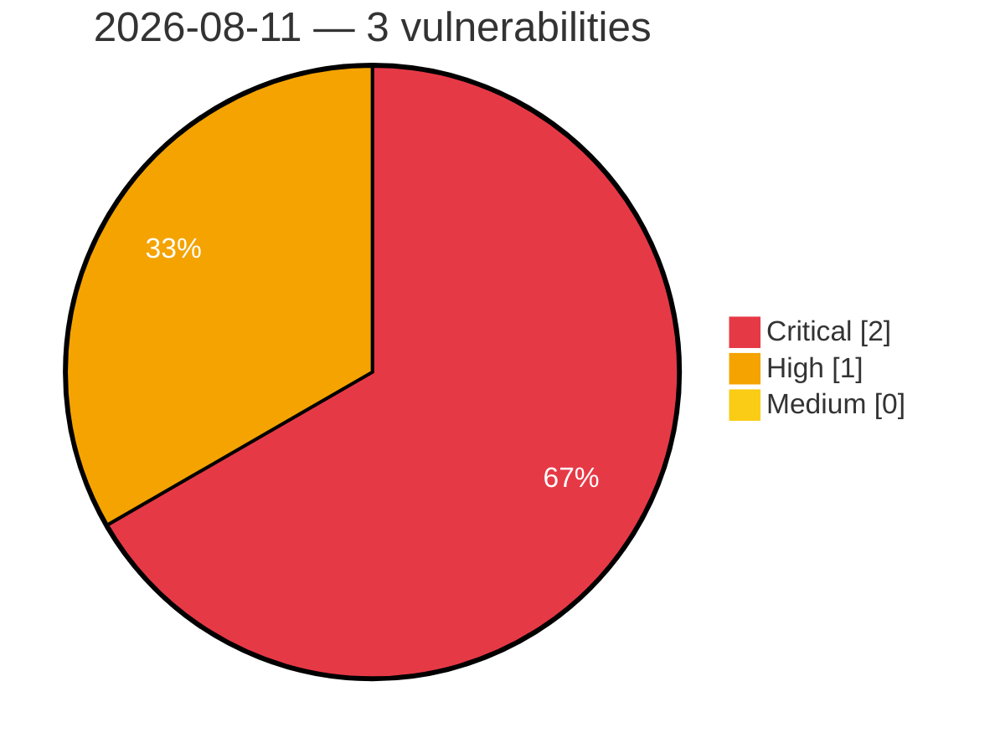

# Critical, High & Medium Severity Vulnerabilities — 2026-08-11

**Source status for this day:**

| Source | Critical | High | Medium | Total |
|--------|---------:|-----:|-------:|------:|
| cvefeed.io (High/Critical) | 2 | 1 | 0 | 3 |

**KEV (actively exploited):** 0  **Watchlist matches:** 1

## Critical (2)

| CVSS | Flags | Source | CVE / Title | Reported |
|------|-------|--------|-------------|----------|
| 9.8 | — | cvefeed.io (High/Critical) | [CVE-2026-34265 - Memory Corruption vulnerability in Application Server ABAP for SAP NetWeaver and ABAP Platform](https://cvefeed.io/vuln/detail/CVE-2026-34265) | 1 hour, 3 minutes ago |
| 9.1 | — | cvefeed.io (High/Critical) | [CVE-2026-44758 - Code Injection vulnerability in Manufacturing Integration and Intelligence](https://cvefeed.io/vuln/detail/CVE-2026-44758) | 1 hour, 3 minutes ago |

## High (1)

| CVSS | Flags | Source | CVE / Title | Reported |
|------|-------|--------|-------------|----------|
| 8.8 | ⭐ | cvefeed.io (High/Critical) | [CVE-2026-58243 - Privilege Escalation vulnerability in SAP ABAP Developer Tools](https://cvefeed.io/vuln/detail/CVE-2026-58243) | 1 hour, 3 minutes ago |
