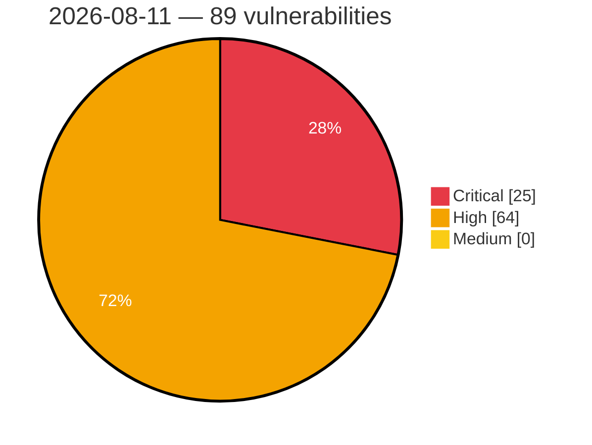

# Critical, High & Medium Severity Vulnerabilities — 2026-08-11

**Source status for this day:**

| Source | Critical | High | Medium | Total |
|--------|---------:|-----:|-------:|------:|
| cvefeed.io (High/Critical) | 25 | 64 | 0 | 89 |

**KEV (actively exploited):** 0  **Watchlist matches:** 74

## Critical (25)

| CVSS | Flags | Source | CVE / Title | Reported |
|------|-------|--------|-------------|----------|
| 10.0 | ⭐ | cvefeed.io (High/Critical) | [CVE-2026-58231 - Improper Authorization in SAP Commerce Cloud (Data Hub Adapter)](https://cvefeed.io/vuln/detail/CVE-2026-58231) | 23 minutes ago |
| 10.0 | ⭐ | cvefeed.io (High/Critical) | [CVE-2026-58115 - Siemens SIMATIC IoT2050 Node-RED Authentication Bypass and Remote Code Execution Vulnerability](https://cvefeed.io/vuln/detail/CVE-2026-58115) | 38 minutes ago |
| 10.0 | ⭐ | cvefeed.io (High/Critical) | [CVE-2026-17061 - Deserialization of Untrusted Data Vulnerability in SIMULIA Execution Engine from Release 2023 through Release 2026](https://cvefeed.io/vuln/detail/CVE-2026-17061) | 24 minutes ago |
| 10.0 | — | cvefeed.io (High/Critical) | [CVE-2026-48056 - Streambert Vulnerable to Arbitrary Binary Execution via Downloader IPC Handler](https://cvefeed.io/vuln/detail/CVE-2026-48056) | 28 minutes ago |
| 9.9 | ⭐ | cvefeed.io (High/Critical) | [CVE-2026-72603 - wg-easy wg-easy - OS Command Injection](https://cvefeed.io/vuln/detail/CVE-2026-72603) | 27 minutes ago |
| 9.8 | — | cvefeed.io (High/Critical) | [CVE-2026-34265 - Memory Corruption vulnerability in Application Server ABAP for SAP NetWeaver and ABAP Platform](https://cvefeed.io/vuln/detail/CVE-2026-34265) | 1 hour, 3 minutes ago |
| 9.8 | ⭐ | cvefeed.io (High/Critical) | [CVE-2026-19425 - Win Men Intermational｜Travel Agency Management System - SQL Injection](https://cvefeed.io/vuln/detail/CVE-2026-19425) | 40 minutes ago |
| 9.8 | ⭐ | cvefeed.io (High/Critical) | [CVE-2026-10579 - Picketlink-federation: auth bypass in picketlink saml unsolicited-response](https://cvefeed.io/vuln/detail/CVE-2026-10579) | 40 minutes ago |
| 9.8 | ⭐ | cvefeed.io (High/Critical) | [CVE-2026-72599 - e107 e107 - SQL Injection](https://cvefeed.io/vuln/detail/CVE-2026-72599) | 27 minutes ago |
| 9.8 | ⭐ | cvefeed.io (High/Critical) | [CVE-2026-72550 - Friendica Friendica - SQL Injection](https://cvefeed.io/vuln/detail/CVE-2026-72550) | 27 minutes ago |
| 9.8 | ⭐ | cvefeed.io (High/Critical) | [CVE-2026-46670 - YesWiki: Unauthenticated SQL Injection](https://cvefeed.io/vuln/detail/CVE-2026-46670) | 28 minutes ago |
| 9.8 | ⭐ | cvefeed.io (High/Critical) | [CVE-2026-72920 - SeaweedFS: Unauthenticated filer IAM gRPC service grants S3 administrative control](https://cvefeed.io/vuln/detail/CVE-2026-72920) | 40 minutes ago |
| 9.8 | ⭐ | cvefeed.io (High/Critical) | [CVE-2026-65791 - Windows iSCSI Target Service Remote Code Execution Vulnerability](https://cvefeed.io/vuln/detail/CVE-2026-65791) | 38 minutes ago |
| 9.6 | — | cvefeed.io (High/Critical) | [CVE-2026-18972 - Velociraptor authenticated identity-spoofing vulnerability](https://cvefeed.io/vuln/detail/CVE-2026-18972) | 14 minutes ago |
| 9.6 | — | cvefeed.io (High/Critical) | [CVE-2026-71384 - ColdFusion \| Incorrect Authorization (CWE-863)](https://cvefeed.io/vuln/detail/CVE-2026-71384) | 38 minutes ago |
| 9.3 | — | cvefeed.io (High/Critical) | [CVE-2026-72785 - Craft CMS before 5.10.6 Authorization Bypass via structures/move-element](https://cvefeed.io/vuln/detail/CVE-2026-72785) | 28 minutes ago |
| 9.3 | ⭐ | cvefeed.io (High/Critical) | [CVE-2026-48046 - Streambert Vulnerable to Remote Code Execution (RCE) via Unvalidated Auto-Updater IPC Handler](https://cvefeed.io/vuln/detail/CVE-2026-48046) | 28 minutes ago |
| 9.3 | ⭐ | cvefeed.io (High/Critical) | [CVE-2026-70306 - Microsoft Office SharePoint Spoofing Vulnerability](https://cvefeed.io/vuln/detail/CVE-2026-70306) | 38 minutes ago |
| 9.2 | — | cvefeed.io (High/Critical) | [CVE-2026-13738 - Improper Authorization Validation](https://cvefeed.io/vuln/detail/CVE-2026-13738) | 27 minutes ago |
| 9.2 | — | cvefeed.io (High/Critical) | [CVE-2026-13737 - Command Restriction Bypass](https://cvefeed.io/vuln/detail/CVE-2026-13737) | 27 minutes ago |
| 9.1 | — | cvefeed.io (High/Critical) | [CVE-2026-44758 - Code Injection vulnerability in Manufacturing Integration and Intelligence](https://cvefeed.io/vuln/detail/CVE-2026-44758) | 1 hour, 3 minutes ago |
| 9.1 | ⭐ | cvefeed.io (High/Critical) | [CVE-2026-19516 - CVE-2026-19516 CVE Record](https://cvefeed.io/vuln/detail/CVE-2026-19516) | 1 hour, 57 minutes ago |
| 9.1 | ⭐ | cvefeed.io (High/Critical) | [CVE-2026-13716 - Path Traversal: '.../...//' in Crafty Controller](https://cvefeed.io/vuln/detail/CVE-2026-13716) | 1 hour, 57 minutes ago |
| 9.1 | ⭐ | cvefeed.io (High/Critical) | [CVE-2026-72748 - AVideo Unauthenticated Arbitrary File Write via aVideoEncoderChunk.json.php](https://cvefeed.io/vuln/detail/CVE-2026-72748) | 38 minutes ago |
| 9.1 | ⭐ | cvefeed.io (High/Critical) | [CVE-2026-47702 - TypeBot API tokens stored in plaintext](https://cvefeed.io/vuln/detail/CVE-2026-47702) | 40 minutes ago |

## High (64)

| CVSS | Flags | Source | CVE / Title | Reported |
|------|-------|--------|-------------|----------|
| 8.9 | ⭐ | cvefeed.io (High/Critical) | [CVE-2026-72772 - n8n before 2.32.1 Authentication Bypass via Token Exchange](https://cvefeed.io/vuln/detail/CVE-2026-72772) | 38 minutes ago |
| 8.8 | ⭐ | cvefeed.io (High/Critical) | [CVE-2026-58243 - Privilege Escalation vulnerability in SAP ABAP Developer Tools](https://cvefeed.io/vuln/detail/CVE-2026-58243) | 1 hour, 3 minutes ago |
| 8.8 | ⭐ | cvefeed.io (High/Critical) | [CVE-2026-15555 - Jboss-marshalling-river: wildfly-clustering-infinispan-marshalling: jboss deserialization rce via unfiltered river unmarshaller](https://cvefeed.io/vuln/detail/CVE-2026-15555) | 40 minutes ago |
| 8.8 | ⭐ | cvefeed.io (High/Critical) | [CVE-2026-72562 - Pimcore pimcore admin-ui-classic-bundle - SQL Injection](https://cvefeed.io/vuln/detail/CVE-2026-72562) | 27 minutes ago |
| 8.8 | ⭐ | cvefeed.io (High/Critical) | [CVE-2026-72561 - Peppermint Lab Peppermint - Broken Access Control](https://cvefeed.io/vuln/detail/CVE-2026-72561) | 27 minutes ago |
| 8.8 | ⭐ | cvefeed.io (High/Critical) | [CVE-2026-72558 - CiviCRM CiviCRM - SQL Injection](https://cvefeed.io/vuln/detail/CVE-2026-72558) | 27 minutes ago |
| 8.8 | ⭐ | cvefeed.io (High/Critical) | [CVE-2026-72557 - Cockpit CMS Cockpit CMS - Unrestricted File Upload](https://cvefeed.io/vuln/detail/CVE-2026-72557) | 27 minutes ago |
| 8.8 | ⭐ | cvefeed.io (High/Critical) | [CVE-2026-72556 - ZoneMinder ZoneMinder - Remote Code Execution](https://cvefeed.io/vuln/detail/CVE-2026-72556) | 27 minutes ago |
| 8.8 | ⭐ | cvefeed.io (High/Critical) | [CVE-2026-72551 - Apioo Fusio - Remote Code Execution](https://cvefeed.io/vuln/detail/CVE-2026-72551) | 27 minutes ago |
| 8.8 | ⭐ | cvefeed.io (High/Critical) | [CVE-2026-72538 - PrefectHQ Prefect - Argument Injection](https://cvefeed.io/vuln/detail/CVE-2026-72538) | 27 minutes ago |
| 8.8 | ⭐ | cvefeed.io (High/Critical) | [CVE-2026-72537 - Authentik Security authentik - Privilege Escalation](https://cvefeed.io/vuln/detail/CVE-2026-72537) | 27 minutes ago |
| 8.8 | ⭐ | cvefeed.io (High/Critical) | [CVE-2026-72534 - Authentik Security authentik - Privilege Escalation](https://cvefeed.io/vuln/detail/CVE-2026-72534) | 27 minutes ago |
| 8.8 | ⭐ | cvefeed.io (High/Critical) | [CVE-2026-72533 - Portainer Portainer CE - Authentication Bypass](https://cvefeed.io/vuln/detail/CVE-2026-72533) | 27 minutes ago |
| 8.8 | ⭐ | cvefeed.io (High/Critical) | [CVE-2026-13739 - Server-Side Request Forgery (SSRF)](https://cvefeed.io/vuln/detail/CVE-2026-13739) | 27 minutes ago |
| 8.8 | ⭐ | cvefeed.io (High/Critical) | [CVE-2026-72781 - Craft CMS 5.0.0-RC1 before 5.10.7 Remote Code Execution via Twig Sandbox Escape](https://cvefeed.io/vuln/detail/CVE-2026-72781) | 28 minutes ago |
| 8.8 | ⭐ | cvefeed.io (High/Critical) | [CVE-2026-72778 - Craft CMS 5.0.0-RC1 before 5.10.6 Authenticated RCE via condition.config](https://cvefeed.io/vuln/detail/CVE-2026-72778) | 38 minutes ago |
| 8.8 | — | cvefeed.io (High/Critical) | [CVE-2026-19546 - Dbi: incomplete fix for cve-2026-14380 dbi: arbitrary code execution via caller-influenced profile attribute](https://cvefeed.io/vuln/detail/CVE-2026-19546) | 50 minutes ago |
| 8.8 | — | cvefeed.io (High/Critical) | [CVE-2026-71387 - ColdFusion \| Incorrect Authorization (CWE-863)](https://cvefeed.io/vuln/detail/CVE-2026-71387) | 38 minutes ago |
| 8.8 | ⭐ | cvefeed.io (High/Critical) | [CVE-2026-71386 - ColdFusion \| Cross-site Scripting (XSS) (CWE-79)](https://cvefeed.io/vuln/detail/CVE-2026-71386) | 38 minutes ago |
| 8.8 | ⭐ | cvefeed.io (High/Critical) | [CVE-2026-70337 - Microsoft PowerShell Remote Code Execution Vulnerability](https://cvefeed.io/vuln/detail/CVE-2026-70337) | 38 minutes ago |
| 8.8 | ⭐ | cvefeed.io (High/Critical) | [CVE-2026-70336 - Visual Studio Code Remote Code Execution Vulnerability](https://cvefeed.io/vuln/detail/CVE-2026-70336) | 38 minutes ago |
| 8.8 | ⭐ | cvefeed.io (High/Critical) | [CVE-2026-70329 - Microsoft Outlook Remote Code Execution Vulnerability](https://cvefeed.io/vuln/detail/CVE-2026-70329) | 38 minutes ago |
| 8.8 | ⭐ | cvefeed.io (High/Critical) | [CVE-2026-70326 - Microsoft SharePoint Server Elevation of Privilege Vulnerability](https://cvefeed.io/vuln/detail/CVE-2026-70326) | 38 minutes ago |
| 8.8 | ⭐ | cvefeed.io (High/Critical) | [CVE-2026-70324 - Microsoft SharePoint Elevation of Privilege Vulnerability](https://cvefeed.io/vuln/detail/CVE-2026-70324) | 38 minutes ago |
| 8.8 | ⭐ | cvefeed.io (High/Critical) | [CVE-2026-70321 - Microsoft SharePoint Remote Code Execution Vulnerability](https://cvefeed.io/vuln/detail/CVE-2026-70321) | 38 minutes ago |
| 8.8 | ⭐ | cvefeed.io (High/Critical) | [CVE-2026-69320 - Visual Studio Code Remote Code Execution Vulnerability](https://cvefeed.io/vuln/detail/CVE-2026-69320) | 38 minutes ago |
| 8.8 | ⭐ | cvefeed.io (High/Critical) | [CVE-2026-66808 - Microsoft SharePoint Server Remote Code Execution Vulnerability](https://cvefeed.io/vuln/detail/CVE-2026-66808) | 38 minutes ago |
| 8.8 | ⭐ | cvefeed.io (High/Critical) | [CVE-2026-66805 - Microsoft SharePoint Server Remote Code Execution Vulnerability](https://cvefeed.io/vuln/detail/CVE-2026-66805) | 38 minutes ago |
| 8.8 | ⭐ | cvefeed.io (High/Critical) | [CVE-2026-65815 - Microsoft Dynamics 365 On-Premises Remote Code Execution Vulnerability](https://cvefeed.io/vuln/detail/CVE-2026-65815) | 38 minutes ago |
| 8.8 | ⭐ | cvefeed.io (High/Critical) | [CVE-2026-65811 - Power BI Remote Code Execution Vulnerability](https://cvefeed.io/vuln/detail/CVE-2026-65811) | 38 minutes ago |
| 8.8 | ⭐ | cvefeed.io (High/Critical) | [CVE-2026-65807 - Microsoft Excel Remote Code Execution Vulnerability](https://cvefeed.io/vuln/detail/CVE-2026-65807) | 38 minutes ago |
| 8.8 | ⭐ | cvefeed.io (High/Critical) | [CVE-2026-65768 - Microsoft Teams Remote Code Execution Vulnerability](https://cvefeed.io/vuln/detail/CVE-2026-65768) | 39 minutes ago |
| 8.7 | ⭐ | cvefeed.io (High/Critical) | [CVE-2026-19424 - Inventec Appliances｜Chiline Cloud - Insecure Direct Object Reference](https://cvefeed.io/vuln/detail/CVE-2026-19424) | 49 minutes ago |
| 8.7 | ⭐ | cvefeed.io (High/Critical) | [CVE-2026-73160 - cti-transmute Unauthenticated SSRF via Hostnames Resolving to Internal IP Addresses](https://cvefeed.io/vuln/detail/CVE-2026-73160) | 40 minutes ago |
| 8.7 | — | cvefeed.io (High/Critical) | [CVE-2026-72779 - Craft CMS 5.0.0-RC1 before 5.10.6 Arbitrary File Read via SplFileObject](https://cvefeed.io/vuln/detail/CVE-2026-72779) | 38 minutes ago |
| 8.7 | ⭐ | cvefeed.io (High/Critical) | [CVE-2026-72767 - n8n before 1.123.67 Remote Code Execution via Git node](https://cvefeed.io/vuln/detail/CVE-2026-72767) | 38 minutes ago |
| 8.7 | ⭐ | cvefeed.io (High/Critical) | [CVE-2026-72765 - n8n before 2.32.1 Remote Code Execution via Expression Sandbox Escape](https://cvefeed.io/vuln/detail/CVE-2026-72765) | 38 minutes ago |
| 8.7 | ⭐ | cvefeed.io (High/Critical) | [CVE-2026-72746 - FreeRDP before 3.30.0 RDSTLS Server Authentication Bypass via PDU-type Confusion](https://cvefeed.io/vuln/detail/CVE-2026-72746) | 38 minutes ago |
| 8.7 | — | cvefeed.io (High/Critical) | [CVE-2026-72745 - FreeRDP before 3.30.0 Out-of-Bounds Read via Kerberos GSS Wrap-token EC](https://cvefeed.io/vuln/detail/CVE-2026-72745) | 38 minutes ago |
| 8.7 | ⭐ | cvefeed.io (High/Critical) | [CVE-2026-69109 - Siemens License Server Path Traversal Vulnerability](https://cvefeed.io/vuln/detail/CVE-2026-69109) | 38 minutes ago |
| 8.7 | — | cvefeed.io (High/Critical) | [CVE-2026-18860 - Velociraptor incorrect Org deletion permissions check](https://cvefeed.io/vuln/detail/CVE-2026-18860) | 40 minutes ago |
| 8.7 | ⭐ | cvefeed.io (High/Critical) | [CVE-2026-73081 - Activepieces: Remote Code Execution via Command Injection in Code Step Name](https://cvefeed.io/vuln/detail/CVE-2026-73081) | 38 minutes ago |
| 8.6 | ⭐ | cvefeed.io (High/Critical) | [CVE-2026-19539 - IDOR in Prospero Flow CRM allows cross-tenant ticket read, hijacking, and deletion](https://cvefeed.io/vuln/detail/CVE-2026-19539) | 28 minutes ago |
| 8.5 | ⭐ | cvefeed.io (High/Critical) | [CVE-2026-16053 - Path Traversal](https://cvefeed.io/vuln/detail/CVE-2026-16053) | 56 minutes ago |
| 8.4 | ⭐ | cvefeed.io (High/Critical) | [CVE-2026-8917 - ASUS Software Arbitrary Memory Write Vulnerability](https://cvefeed.io/vuln/detail/CVE-2026-8917) | 45 minutes ago |
| 8.4 | ⭐ | cvefeed.io (High/Critical) | [CVE-2026-70130 - Microsoft Office Remote Code Execution Vulnerability](https://cvefeed.io/vuln/detail/CVE-2026-70130) | 38 minutes ago |
| 8.3 | ⭐ | cvefeed.io (High/Critical) | [CVE-2026-69108 - Siemens License Server Local Privilege Escalation](https://cvefeed.io/vuln/detail/CVE-2026-69108) | 38 minutes ago |
| 8.2 | ⭐ | cvefeed.io (High/Critical) | [CVE-2026-72536 - Chaskiq Chaskiq - Missing Authentication](https://cvefeed.io/vuln/detail/CVE-2026-72536) | 27 minutes ago |
| 8.2 | ⭐ | cvefeed.io (High/Critical) | [CVE-2026-72535 - Chaskiq Chaskiq - Missing Authentication](https://cvefeed.io/vuln/detail/CVE-2026-72535) | 27 minutes ago |
| 8.2 | ⭐ | cvefeed.io (High/Critical) | [CVE-2026-72766 - n8n before 1.123.67 Arbitrary File Read via Send Email Node](https://cvefeed.io/vuln/detail/CVE-2026-72766) | 38 minutes ago |
| 8.2 | ⭐ | cvefeed.io (High/Critical) | [CVE-2026-72922 - AutoGPT: Webhook provider path confusion bypasses generic webhook secret verification](https://cvefeed.io/vuln/detail/CVE-2026-72922) | 40 minutes ago |
| 8.2 | — | cvefeed.io (High/Critical) | [CVE-2026-69306 - Visual Studio Code Security Feature Bypass Vulnerability](https://cvefeed.io/vuln/detail/CVE-2026-69306) | 38 minutes ago |
| 8.1 | ⭐ | cvefeed.io (High/Critical) | [CVE-2026-15560 - Openjdk-orb: unauthed class loading via iiop in eap](https://cvefeed.io/vuln/detail/CVE-2026-15560) | 40 minutes ago |
| 8.1 | ⭐ | cvefeed.io (High/Critical) | [CVE-2026-15556 - Picketlink-federation: picketlink saml 2.0 auth bypass via missing assertions](https://cvefeed.io/vuln/detail/CVE-2026-15556) | 40 minutes ago |
| 8.1 | ⭐ | cvefeed.io (High/Critical) | [CVE-2026-72596 - Ghost Foundation Ghost - Broken Access Control](https://cvefeed.io/vuln/detail/CVE-2026-72596) | 27 minutes ago |
| 8.1 | ⭐ | cvefeed.io (High/Critical) | [CVE-2026-72595 - BadChoice Handesk - Broken Access Control](https://cvefeed.io/vuln/detail/CVE-2026-72595) | 27 minutes ago |
| 8.1 | ⭐ | cvefeed.io (High/Critical) | [CVE-2026-72563 - BadChoice Handesk - Broken Access Control](https://cvefeed.io/vuln/detail/CVE-2026-72563) | 27 minutes ago |
| 8.1 | ⭐ | cvefeed.io (High/Critical) | [CVE-2026-72555 - Peppermint Lab Peppermint - Broken Access Control](https://cvefeed.io/vuln/detail/CVE-2026-72555) | 27 minutes ago |
| 8.1 | — | cvefeed.io (High/Critical) | [CVE-2026-18129 - Ivanti Endpoint Manager Cleartext Transmission of Credentials](https://cvefeed.io/vuln/detail/CVE-2026-18129) | 18 minutes ago |
| 8.1 | ⭐ | cvefeed.io (High/Critical) | [CVE-2026-72921 - SeaweedFS: Filer JWT allowed_prefixes literal prefix match allows cross-tenant access to sibling paths](https://cvefeed.io/vuln/detail/CVE-2026-72921) | 40 minutes ago |
| 8.1 | ⭐ | cvefeed.io (High/Critical) | [CVE-2026-71331 - Windows Device Health Attestation (DHA) Remote Code Execution Vulnerability](https://cvefeed.io/vuln/detail/CVE-2026-71331) | 38 minutes ago |
| 8.1 | ⭐ | cvefeed.io (High/Critical) | [CVE-2026-70340 - Azure CycleCloud Elevation of Privilege Vulnerability](https://cvefeed.io/vuln/detail/CVE-2026-70340) | 38 minutes ago |
| 8.1 | ⭐ | cvefeed.io (High/Critical) | [CVE-2026-66802 - Windows Device Health Attestation (DHA) Remote Code Execution Vulnerability](https://cvefeed.io/vuln/detail/CVE-2026-66802) | 38 minutes ago |
| 8.1 | ⭐ | cvefeed.io (High/Critical) | [CVE-2026-65789 - Windows DNS Server Remote Code Execution Vulnerability](https://cvefeed.io/vuln/detail/CVE-2026-65789) | 38 minutes ago |
