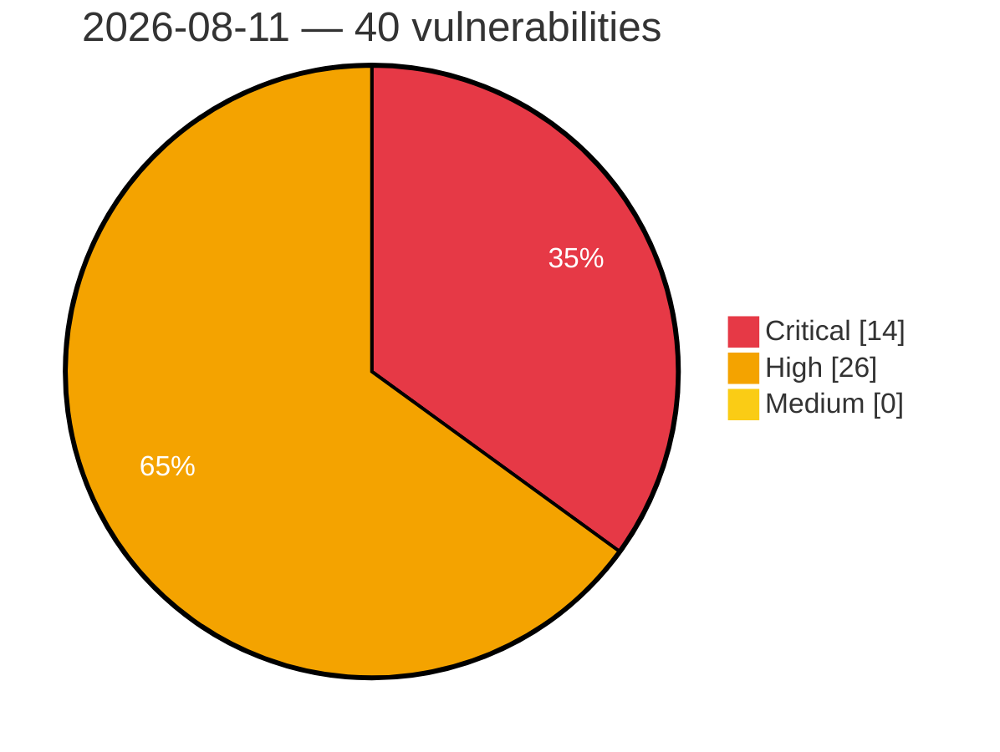

# Critical, High & Medium Severity Vulnerabilities — 2026-08-11

**Source status for this day:**

| Source | Critical | High | Medium | Total |
|--------|---------:|-----:|-------:|------:|
| cvefeed.io (High/Critical) | 14 | 26 | 0 | 40 |

**KEV (actively exploited):** 0  **Watchlist matches:** 34

## Critical (14)

| CVSS | Flags | Source | CVE / Title | Reported |
|------|-------|--------|-------------|----------|
| 10.0 | ⭐ | cvefeed.io (High/Critical) | [CVE-2026-58231 - Improper Authorization in SAP Commerce Cloud (Data Hub Adapter)](https://cvefeed.io/vuln/detail/CVE-2026-58231) | 23 minutes ago |
| 9.9 | ⭐ | cvefeed.io (High/Critical) | [CVE-2026-72603 - wg-easy wg-easy - OS Command Injection](https://cvefeed.io/vuln/detail/CVE-2026-72603) | 27 minutes ago |
| 9.8 | — | cvefeed.io (High/Critical) | [CVE-2026-34265 - Memory Corruption vulnerability in Application Server ABAP for SAP NetWeaver and ABAP Platform](https://cvefeed.io/vuln/detail/CVE-2026-34265) | 1 hour, 3 minutes ago |
| 9.8 | ⭐ | cvefeed.io (High/Critical) | [CVE-2026-19425 - Win Men Intermational｜Travel Agency Management System - SQL Injection](https://cvefeed.io/vuln/detail/CVE-2026-19425) | 40 minutes ago |
| 9.8 | ⭐ | cvefeed.io (High/Critical) | [CVE-2026-10579 - Picketlink-federation: auth bypass in picketlink saml unsolicited-response](https://cvefeed.io/vuln/detail/CVE-2026-10579) | 40 minutes ago |
| 9.8 | ⭐ | cvefeed.io (High/Critical) | [CVE-2026-72599 - e107 e107 - SQL Injection](https://cvefeed.io/vuln/detail/CVE-2026-72599) | 27 minutes ago |
| 9.8 | ⭐ | cvefeed.io (High/Critical) | [CVE-2026-72550 - Friendica Friendica - SQL Injection](https://cvefeed.io/vuln/detail/CVE-2026-72550) | 27 minutes ago |
| 9.6 | — | cvefeed.io (High/Critical) | [CVE-2026-18972 - Velociraptor authenticated identity-spoofing vulnerability](https://cvefeed.io/vuln/detail/CVE-2026-18972) | 14 minutes ago |
| 9.3 | — | cvefeed.io (High/Critical) | [CVE-2026-72785 - Craft CMS before 5.10.6 Authorization Bypass via structures/move-element](https://cvefeed.io/vuln/detail/CVE-2026-72785) | 28 minutes ago |
| 9.2 | — | cvefeed.io (High/Critical) | [CVE-2026-13738 - Improper Authorization Validation](https://cvefeed.io/vuln/detail/CVE-2026-13738) | 27 minutes ago |
| 9.2 | — | cvefeed.io (High/Critical) | [CVE-2026-13737 - Command Restriction Bypass](https://cvefeed.io/vuln/detail/CVE-2026-13737) | 27 minutes ago |
| 9.1 | — | cvefeed.io (High/Critical) | [CVE-2026-44758 - Code Injection vulnerability in Manufacturing Integration and Intelligence](https://cvefeed.io/vuln/detail/CVE-2026-44758) | 1 hour, 3 minutes ago |
| 9.1 | ⭐ | cvefeed.io (High/Critical) | [CVE-2026-19516 - CVE-2026-19516 CVE Record](https://cvefeed.io/vuln/detail/CVE-2026-19516) | 1 hour, 57 minutes ago |
| 9.1 | ⭐ | cvefeed.io (High/Critical) | [CVE-2026-13716 - Path Traversal: '.../...//' in Crafty Controller](https://cvefeed.io/vuln/detail/CVE-2026-13716) | 1 hour, 57 minutes ago |

## High (26)

| CVSS | Flags | Source | CVE / Title | Reported |
|------|-------|--------|-------------|----------|
| 8.8 | ⭐ | cvefeed.io (High/Critical) | [CVE-2026-58243 - Privilege Escalation vulnerability in SAP ABAP Developer Tools](https://cvefeed.io/vuln/detail/CVE-2026-58243) | 1 hour, 3 minutes ago |
| 8.8 | ⭐ | cvefeed.io (High/Critical) | [CVE-2026-15555 - Jboss-marshalling-river: wildfly-clustering-infinispan-marshalling: jboss deserialization rce via unfiltered river unmarshaller](https://cvefeed.io/vuln/detail/CVE-2026-15555) | 40 minutes ago |
| 8.8 | ⭐ | cvefeed.io (High/Critical) | [CVE-2026-72562 - Pimcore pimcore admin-ui-classic-bundle - SQL Injection](https://cvefeed.io/vuln/detail/CVE-2026-72562) | 27 minutes ago |
| 8.8 | ⭐ | cvefeed.io (High/Critical) | [CVE-2026-72561 - Peppermint Lab Peppermint - Broken Access Control](https://cvefeed.io/vuln/detail/CVE-2026-72561) | 27 minutes ago |
| 8.8 | ⭐ | cvefeed.io (High/Critical) | [CVE-2026-72558 - CiviCRM CiviCRM - SQL Injection](https://cvefeed.io/vuln/detail/CVE-2026-72558) | 27 minutes ago |
| 8.8 | ⭐ | cvefeed.io (High/Critical) | [CVE-2026-72557 - Cockpit CMS Cockpit CMS - Unrestricted File Upload](https://cvefeed.io/vuln/detail/CVE-2026-72557) | 27 minutes ago |
| 8.8 | ⭐ | cvefeed.io (High/Critical) | [CVE-2026-72556 - ZoneMinder ZoneMinder - Remote Code Execution](https://cvefeed.io/vuln/detail/CVE-2026-72556) | 27 minutes ago |
| 8.8 | ⭐ | cvefeed.io (High/Critical) | [CVE-2026-72551 - Apioo Fusio - Remote Code Execution](https://cvefeed.io/vuln/detail/CVE-2026-72551) | 27 minutes ago |
| 8.8 | ⭐ | cvefeed.io (High/Critical) | [CVE-2026-72538 - PrefectHQ Prefect - Argument Injection](https://cvefeed.io/vuln/detail/CVE-2026-72538) | 27 minutes ago |
| 8.8 | ⭐ | cvefeed.io (High/Critical) | [CVE-2026-72537 - Authentik Security authentik - Privilege Escalation](https://cvefeed.io/vuln/detail/CVE-2026-72537) | 27 minutes ago |
| 8.8 | ⭐ | cvefeed.io (High/Critical) | [CVE-2026-72534 - Authentik Security authentik - Privilege Escalation](https://cvefeed.io/vuln/detail/CVE-2026-72534) | 27 minutes ago |
| 8.8 | ⭐ | cvefeed.io (High/Critical) | [CVE-2026-72533 - Portainer Portainer CE - Authentication Bypass](https://cvefeed.io/vuln/detail/CVE-2026-72533) | 27 minutes ago |
| 8.8 | ⭐ | cvefeed.io (High/Critical) | [CVE-2026-13739 - Server-Side Request Forgery (SSRF)](https://cvefeed.io/vuln/detail/CVE-2026-13739) | 27 minutes ago |
| 8.8 | ⭐ | cvefeed.io (High/Critical) | [CVE-2026-72781 - Craft CMS 5.0.0-RC1 before 5.10.7 Remote Code Execution via Twig Sandbox Escape](https://cvefeed.io/vuln/detail/CVE-2026-72781) | 28 minutes ago |
| 8.7 | ⭐ | cvefeed.io (High/Critical) | [CVE-2026-19424 - Inventec Appliances｜Chiline Cloud - Insecure Direct Object Reference](https://cvefeed.io/vuln/detail/CVE-2026-19424) | 49 minutes ago |
| 8.7 | ⭐ | cvefeed.io (High/Critical) | [CVE-2026-73160 - cti-transmute Unauthenticated SSRF via Hostnames Resolving to Internal IP Addresses](https://cvefeed.io/vuln/detail/CVE-2026-73160) | 40 minutes ago |
| 8.5 | ⭐ | cvefeed.io (High/Critical) | [CVE-2026-16053 - Path Traversal](https://cvefeed.io/vuln/detail/CVE-2026-16053) | 56 minutes ago |
| 8.4 | ⭐ | cvefeed.io (High/Critical) | [CVE-2026-8917 - ASUS Software Arbitrary Memory Write Vulnerability](https://cvefeed.io/vuln/detail/CVE-2026-8917) | 45 minutes ago |
| 8.2 | ⭐ | cvefeed.io (High/Critical) | [CVE-2026-72536 - Chaskiq Chaskiq - Missing Authentication](https://cvefeed.io/vuln/detail/CVE-2026-72536) | 27 minutes ago |
| 8.2 | ⭐ | cvefeed.io (High/Critical) | [CVE-2026-72535 - Chaskiq Chaskiq - Missing Authentication](https://cvefeed.io/vuln/detail/CVE-2026-72535) | 27 minutes ago |
| 8.1 | ⭐ | cvefeed.io (High/Critical) | [CVE-2026-15560 - Openjdk-orb: unauthed class loading via iiop in eap](https://cvefeed.io/vuln/detail/CVE-2026-15560) | 40 minutes ago |
| 8.1 | ⭐ | cvefeed.io (High/Critical) | [CVE-2026-15556 - Picketlink-federation: picketlink saml 2.0 auth bypass via missing assertions](https://cvefeed.io/vuln/detail/CVE-2026-15556) | 40 minutes ago |
| 8.1 | ⭐ | cvefeed.io (High/Critical) | [CVE-2026-72596 - Ghost Foundation Ghost - Broken Access Control](https://cvefeed.io/vuln/detail/CVE-2026-72596) | 27 minutes ago |
| 8.1 | ⭐ | cvefeed.io (High/Critical) | [CVE-2026-72595 - BadChoice Handesk - Broken Access Control](https://cvefeed.io/vuln/detail/CVE-2026-72595) | 27 minutes ago |
| 8.1 | ⭐ | cvefeed.io (High/Critical) | [CVE-2026-72563 - BadChoice Handesk - Broken Access Control](https://cvefeed.io/vuln/detail/CVE-2026-72563) | 27 minutes ago |
| 8.1 | ⭐ | cvefeed.io (High/Critical) | [CVE-2026-72555 - Peppermint Lab Peppermint - Broken Access Control](https://cvefeed.io/vuln/detail/CVE-2026-72555) | 27 minutes ago |
