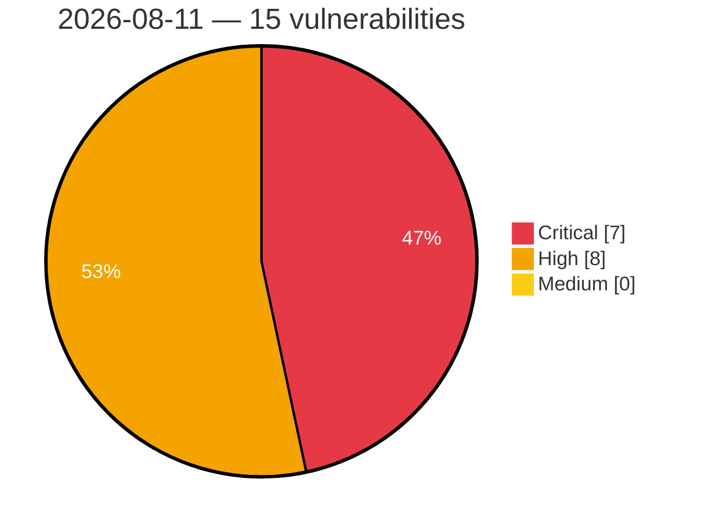

# Critical, High & Medium Severity Vulnerabilities — 2026-08-11

**Source status for this day:**

| Source | Critical | High | Medium | Total |
|--------|---------:|-----:|-------:|------:|
| cvefeed.io (High/Critical) | 7 | 8 | 0 | 15 |

**KEV (actively exploited):** 0  **Watchlist matches:** 13

## Critical (7)

| CVSS | Flags | Source | CVE / Title | Reported |
|------|-------|--------|-------------|----------|
| 10.0 | ⭐ | cvefeed.io (High/Critical) | [CVE-2026-58231 - Improper Authorization in SAP Commerce Cloud (Data Hub Adapter)](https://cvefeed.io/vuln/detail/CVE-2026-58231) | 23 minutes ago |
| 9.8 | — | cvefeed.io (High/Critical) | [CVE-2026-34265 - Memory Corruption vulnerability in Application Server ABAP for SAP NetWeaver and ABAP Platform](https://cvefeed.io/vuln/detail/CVE-2026-34265) | 1 hour, 3 minutes ago |
| 9.8 | ⭐ | cvefeed.io (High/Critical) | [CVE-2026-19425 - Win Men Intermational｜Travel Agency Management System - SQL Injection](https://cvefeed.io/vuln/detail/CVE-2026-19425) | 40 minutes ago |
| 9.8 | ⭐ | cvefeed.io (High/Critical) | [CVE-2026-10579 - Picketlink-federation: auth bypass in picketlink saml unsolicited-response](https://cvefeed.io/vuln/detail/CVE-2026-10579) | 40 minutes ago |
| 9.1 | — | cvefeed.io (High/Critical) | [CVE-2026-44758 - Code Injection vulnerability in Manufacturing Integration and Intelligence](https://cvefeed.io/vuln/detail/CVE-2026-44758) | 1 hour, 3 minutes ago |
| 9.1 | ⭐ | cvefeed.io (High/Critical) | [CVE-2026-19516 - CVE-2026-19516 CVE Record](https://cvefeed.io/vuln/detail/CVE-2026-19516) | 1 hour, 57 minutes ago |
| 9.1 | ⭐ | cvefeed.io (High/Critical) | [CVE-2026-13716 - Path Traversal: '.../...//' in Crafty Controller](https://cvefeed.io/vuln/detail/CVE-2026-13716) | 1 hour, 57 minutes ago |

## High (8)

| CVSS | Flags | Source | CVE / Title | Reported |
|------|-------|--------|-------------|----------|
| 8.8 | ⭐ | cvefeed.io (High/Critical) | [CVE-2026-58243 - Privilege Escalation vulnerability in SAP ABAP Developer Tools](https://cvefeed.io/vuln/detail/CVE-2026-58243) | 1 hour, 3 minutes ago |
| 8.8 | ⭐ | cvefeed.io (High/Critical) | [CVE-2026-15555 - Jboss-marshalling-river: wildfly-clustering-infinispan-marshalling: jboss deserialization rce via unfiltered river unmarshaller](https://cvefeed.io/vuln/detail/CVE-2026-15555) | 40 minutes ago |
| 8.7 | ⭐ | cvefeed.io (High/Critical) | [CVE-2026-19424 - Inventec Appliances｜Chiline Cloud - Insecure Direct Object Reference](https://cvefeed.io/vuln/detail/CVE-2026-19424) | 49 minutes ago |
| 8.7 | ⭐ | cvefeed.io (High/Critical) | [CVE-2026-73160 - cti-transmute Unauthenticated SSRF via Hostnames Resolving to Internal IP Addresses](https://cvefeed.io/vuln/detail/CVE-2026-73160) | 40 minutes ago |
| 8.5 | ⭐ | cvefeed.io (High/Critical) | [CVE-2026-16053 - Path Traversal](https://cvefeed.io/vuln/detail/CVE-2026-16053) | 56 minutes ago |
| 8.4 | ⭐ | cvefeed.io (High/Critical) | [CVE-2026-8917 - ASUS Software Arbitrary Memory Write Vulnerability](https://cvefeed.io/vuln/detail/CVE-2026-8917) | 45 minutes ago |
| 8.1 | ⭐ | cvefeed.io (High/Critical) | [CVE-2026-15560 - Openjdk-orb: unauthed class loading via iiop in eap](https://cvefeed.io/vuln/detail/CVE-2026-15560) | 40 minutes ago |
| 8.1 | ⭐ | cvefeed.io (High/Critical) | [CVE-2026-15556 - Picketlink-federation: picketlink saml 2.0 auth bypass via missing assertions](https://cvefeed.io/vuln/detail/CVE-2026-15556) | 40 minutes ago |
