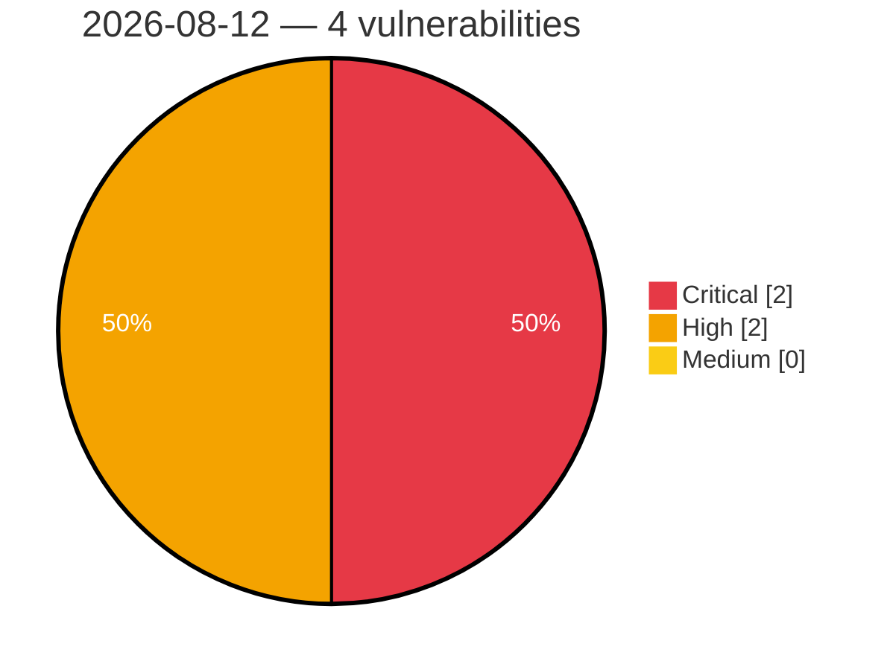

# Critical, High & Medium Severity Vulnerabilities — 2026-08-12

**Source status for this day:**

| Source | Critical | High | Medium | Total |
|--------|---------:|-----:|-------:|------:|
| cvefeed.io (High/Critical) | 2 | 2 | 0 | 4 |

**KEV (actively exploited):** 0  **Watchlist matches:** 3

## Critical (2)

| CVSS | Flags | Source | CVE / Title | Reported |
|------|-------|--------|-------------|----------|
| 9.9 | ⭐ | cvefeed.io (High/Critical) | [CVE-2026-72526 - Multicloud-integrations: multicloud-integrations: pull-model propagation allows hub tenant to target arbitrary spoke cluster via unvalidated ocm-managed-cluster annotation](https://cvefeed.io/vuln/detail/CVE-2026-72526) | 1 hour, 4 minutes ago |
| 9.6 | ⭐ | cvefeed.io (High/Critical) | [CVE-2026-70398 - Multicloud-integrations: multicloud-integrations: gitopscluster.spec.argoserver.argonamespace writes spoke bearer tokens to attacker-chosen namespace](https://cvefeed.io/vuln/detail/CVE-2026-70398) | 1 hour, 4 minutes ago |

## High (2)

| CVSS | Flags | Source | CVE / Title | Reported |
|------|-------|--------|-------------|----------|
| 8.2 | — | cvefeed.io (High/Critical) | [CVE-2026-6484 - Lack of verified boot to certain FV may cause arbitrary code execution](https://cvefeed.io/vuln/detail/CVE-2026-6484) | 57 minutes ago |
| 8.1 | ⭐ | cvefeed.io (High/Critical) | [CVE-2026-18961 - Social Login, Passkeys, Magic Link & Email OTP – Passwordless Login by VentraConnect <= 1.4.3 - Unauthenticated Authentication Bypass via Spotify OAuth Callback](https://cvefeed.io/vuln/detail/CVE-2026-18961) | 1 hour, 29 minutes ago |
