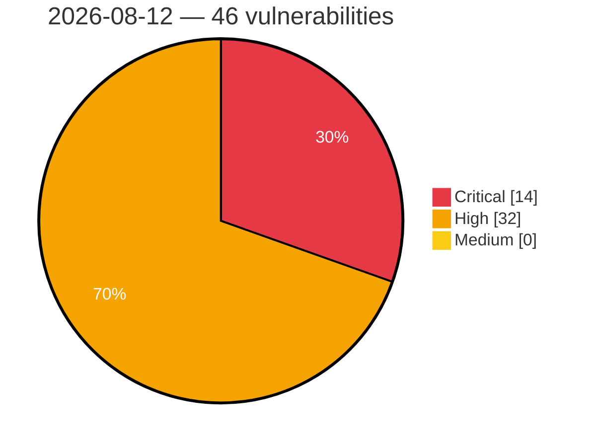

# Critical, High & Medium Severity Vulnerabilities — 2026-08-12

**Source status for this day:**

| Source | Critical | High | Medium | Total |
|--------|---------:|-----:|-------:|------:|
| cvefeed.io (High/Critical) | 14 | 32 | 0 | 46 |

**KEV (actively exploited):** 0  **Watchlist matches:** 27

## Critical (14)

| CVSS | Flags | Source | CVE / Title | Reported |
|------|-------|--------|-------------|----------|
| 10.0 | ⭐ | cvefeed.io (High/Critical) | [CVE-2026-67282 - Joomla Extension - fabrikar.com - Unauthenticated remote code execution in Fabrik < 4.6.8](https://cvefeed.io/vuln/detail/CVE-2026-67282) | 39 minutes ago |
| 9.9 | ⭐ | cvefeed.io (High/Critical) | [CVE-2026-72526 - Multicloud-integrations: multicloud-integrations: pull-model propagation allows hub tenant to target arbitrary spoke cluster via unvalidated ocm-managed-cluster annotation](https://cvefeed.io/vuln/detail/CVE-2026-72526) | 1 hour, 4 minutes ago |
| 9.9 | ⭐ | cvefeed.io (High/Critical) | [CVE-2026-73263 - Prowler: RCE on Prowler App workers via kubeconfig auth-provider cmd-path](https://cvefeed.io/vuln/detail/CVE-2026-73263) | 56 minutes ago |
| 9.9 | ⭐ | cvefeed.io (High/Critical) | [CVE-2026-73294 - Semaphore U: OS Command Injection](https://cvefeed.io/vuln/detail/CVE-2026-73294) | 1 hour, 17 minutes ago |
| 9.8 | — | cvefeed.io (High/Critical) | [CVE-2025-41769 - Unauthenticated Buffer Overflow in PROFINET Service](https://cvefeed.io/vuln/detail/CVE-2025-41769) | 1 hour, 39 minutes ago |
| 9.8 | — | cvefeed.io (High/Critical) | [CVE-2026-26035 - Fortinet FortiWeb Improper Authentication Vulnerability](https://cvefeed.io/vuln/detail/CVE-2026-26035) | 57 minutes ago |
| 9.6 | ⭐ | cvefeed.io (High/Critical) | [CVE-2026-70398 - Multicloud-integrations: multicloud-integrations: gitopscluster.spec.argoserver.argonamespace writes spoke bearer tokens to attacker-chosen namespace](https://cvefeed.io/vuln/detail/CVE-2026-70398) | 1 hour, 4 minutes ago |
| 9.6 | — | cvefeed.io (High/Critical) | [CVE-2026-17276 - IBM i is Affected By Multiple Vulnerabilities in Navigator for i](https://cvefeed.io/vuln/detail/CVE-2026-17276) | 14 minutes ago |
| 9.4 | ⭐ | cvefeed.io (High/Critical) | [CVE-2026-50561 - Yuxi has a JWT Authentication Bypass Leading to Cross-Instance Administrator Token Reuse](https://cvefeed.io/vuln/detail/CVE-2026-50561) | 57 minutes ago |
| 9.4 | ⭐ | cvefeed.io (High/Critical) | [CVE-2026-73296 - Microsoft UFO: Unauthenticated Mobile MCP access allows remote Android device control and screen disclosure](https://cvefeed.io/vuln/detail/CVE-2026-73296) | 17 minutes ago |
| 9.3 | ⭐ | cvefeed.io (High/Critical) | [CVE-2026-66659 - WordPress Tablesome Table plugin <= 1.2.9 - SQL Injection vulnerability](https://cvefeed.io/vuln/detail/CVE-2026-66659) | 1 hour, 52 minutes ago |
| 9.3 | ⭐ | cvefeed.io (High/Critical) | [CVE-2026-57858 - Cal.com Cal.diy 6.2.0 Stored XSS via BookingPageTagManager Analytics Tracking ID](https://cvefeed.io/vuln/detail/CVE-2026-57858) | 57 minutes ago |
| 9.3 | — | cvefeed.io (High/Critical) | [CVE-2026-64639 - Plesk Database Cloning Arbitrary Code Execution Vulnerability](https://cvefeed.io/vuln/detail/CVE-2026-64639) | 1 hour, 17 minutes ago |
| 9.2 | — | cvefeed.io (High/Critical) | [CVE-2026-67285 - Joomla Extension - joomshaper.com - Unauthenticated arbitrary local PHP file inclusion in SP Page Builder < 6.8.0](https://cvefeed.io/vuln/detail/CVE-2026-67285) | 20 minutes ago |

## High (32)

| CVSS | Flags | Source | CVE / Title | Reported |
|------|-------|--------|-------------|----------|
| 8.8 | — | cvefeed.io (High/Critical) | [CVE-2026-19426 - FitSoft｜POS Sytstem - Missing Authentication](https://cvefeed.io/vuln/detail/CVE-2026-19426) | 1 hour, 7 minutes ago |
| 8.8 | ⭐ | cvefeed.io (High/Critical) | [CVE-2026-11325 - cloudflare/pages-action is deprecated — migration required by September 18th, 2026](https://cvefeed.io/vuln/detail/CVE-2026-11325) | 43 minutes ago |
| 8.8 | ⭐ | cvefeed.io (High/Critical) | [CVE-2026-65941 - WhatsUp Gold versions prior to 26.0.2 contain an unauthenticated remote code execution vulnerability in an internal report scheduling service.](https://cvefeed.io/vuln/detail/CVE-2026-65941) | 51 minutes ago |
| 8.8 | — | cvefeed.io (High/Critical) | [CVE-2026-73431 - Reusable Account Activation and Recovery Tokens Allow Repeated Account Takeover in vulnerability-lookup](https://cvefeed.io/vuln/detail/CVE-2026-73431) | 56 minutes ago |
| 8.8 | — | cvefeed.io (High/Critical) | [CVE-2026-73284 - RustFS: AddServiceAccount Handler Allows Creation of Root-Parent Service Accounts](https://cvefeed.io/vuln/detail/CVE-2026-73284) | 56 minutes ago |
| 8.8 | ⭐ | cvefeed.io (High/Critical) | [CVE-2026-18713 - IBM i is Affected By Multiple Vulnerabilities in Navigator for i](https://cvefeed.io/vuln/detail/CVE-2026-18713) | 15 minutes ago |
| 8.8 | — | cvefeed.io (High/Critical) | [CVE-2026-18847 - IBM i is Affected By Multiple Vulnerabilities in Navigator for i](https://cvefeed.io/vuln/detail/CVE-2026-18847) | 17 minutes ago |
| 8.8 | ⭐ | cvefeed.io (High/Critical) | [CVE-2026-18683 - IBM i is Affected By privilege escalation in Navigator for i](https://cvefeed.io/vuln/detail/CVE-2026-18683) | 17 minutes ago |
| 8.8 | ⭐ | cvefeed.io (High/Critical) | [CVE-2026-73293 - Semaphore UI: Manager-to-owner privilege escalation via custom-role slug collision](https://cvefeed.io/vuln/detail/CVE-2026-73293) | 1 hour, 17 minutes ago |
| 8.7 | — | cvefeed.io (High/Critical) | [CVE-2025-41770 - Unauthenticated Denial of Service](https://cvefeed.io/vuln/detail/CVE-2025-41770) | 1 hour, 39 minutes ago |
| 8.7 | ⭐ | cvefeed.io (High/Critical) | [CVE-2026-15803 - Eclipse RDF4J XML External Entity Injection](https://cvefeed.io/vuln/detail/CVE-2026-15803) | 36 minutes ago |
| 8.6 | ⭐ | cvefeed.io (High/Critical) | [CVE-2026-18474 - WP Directory Kit < 1.5.6 - Unauthenticated SQL Injection via search_location and search_category](https://cvefeed.io/vuln/detail/CVE-2026-18474) | 7 hours, 54 minutes ago |
| 8.5 | — | cvefeed.io (High/Critical) | [CVE-2026-17418 - IBM i is Affected By Multiple Vulnerabilities in SQL](https://cvefeed.io/vuln/detail/CVE-2026-17418) | 12 minutes ago |
| 8.4 | ⭐ | cvefeed.io (High/Critical) | [CVE-2026-73325 - Fujitsu OneCompression 1.2.0 Arbitrary Code Execution via torch.load Deserialization](https://cvefeed.io/vuln/detail/CVE-2026-73325) | 39 minutes ago |
| 8.3 | — | cvefeed.io (High/Critical) | [CVE-2026-18235 - IBM i is Affected By Multiple Vulnerabilities in Navigator for i](https://cvefeed.io/vuln/detail/CVE-2026-18235) | 13 minutes ago |
| 8.3 | — | cvefeed.io (High/Critical) | [CVE-2026-17095 - IBM i is Affected By Multiple Vulnerabilities in Navigator for i](https://cvefeed.io/vuln/detail/CVE-2026-17095) | 17 minutes ago |
| 8.3 | ⭐ | cvefeed.io (High/Critical) | [CVE-2026-73292 - Semaphore UI: CSRF vulnerability on password change endpoint - No CSRF token or password confirmation](https://cvefeed.io/vuln/detail/CVE-2026-73292) | 1 hour, 17 minutes ago |
| 8.2 | — | cvefeed.io (High/Critical) | [CVE-2026-6484 - Lack of verified boot to certain FV may cause arbitrary code execution](https://cvefeed.io/vuln/detail/CVE-2026-6484) | 57 minutes ago |
| 8.2 | ⭐ | cvefeed.io (High/Critical) | [CVE-2026-64954 - Velociraptor collect_client() Permissions Bypass](https://cvefeed.io/vuln/detail/CVE-2026-64954) | 55 minutes ago |
| 8.1 | ⭐ | cvefeed.io (High/Critical) | [CVE-2026-18961 - Social Login, Passkeys, Magic Link & Email OTP – Passwordless Login by VentraConnect <= 1.4.3 - Unauthenticated Authentication Bypass via Spotify OAuth Callback](https://cvefeed.io/vuln/detail/CVE-2026-18961) | 1 hour, 29 minutes ago |
| 8.1 | ⭐ | cvefeed.io (High/Critical) | [CVE-2026-19594 - Path Traversal and HTTP Parameter Pollution in Snowflake Python API (snowflake.core) Allow Confused-Deputy Privilege Escalation](https://cvefeed.io/vuln/detail/CVE-2026-19594) | 52 minutes ago |
| 8.1 | ⭐ | cvefeed.io (High/Critical) | [CVE-2026-70468 - Fortinet FortiManager Authentication Bypass Vulnerability](https://cvefeed.io/vuln/detail/CVE-2026-70468) | 57 minutes ago |
| 8.1 | — | cvefeed.io (High/Critical) | [CVE-2026-70465 - Fortinet FortiClient Buffer Overflow Vulnerability](https://cvefeed.io/vuln/detail/CVE-2026-70465) | 1 hour, 55 minutes ago |
| 8.1 | — | cvefeed.io (High/Critical) | [CVE-2026-69105 - Potential package cache integrity issue in JFrog Artifactory](https://cvefeed.io/vuln/detail/CVE-2026-69105) | 55 minutes ago |
| 8.1 | ⭐ | cvefeed.io (High/Critical) | [CVE-2026-73289 - RustFS: ForAllValues/ForAnyValue negated string conditions are transposed, inverting IAM and bucket-policy decisions](https://cvefeed.io/vuln/detail/CVE-2026-73289) | 56 minutes ago |
| 8.1 | ⭐ | cvefeed.io (High/Critical) | [CVE-2026-73286 - RustF: Request headers can populate server-derived IAM condition keys, letting a caller satisfy identity-based policy conditions](https://cvefeed.io/vuln/detail/CVE-2026-73286) | 56 minutes ago |
| 8.1 | — | cvefeed.io (High/Critical) | [CVE-2026-66375 - Low-privilege users may remove protected Artifactory metadata](https://cvefeed.io/vuln/detail/CVE-2026-66375) | 56 minutes ago |
| 8.1 | ⭐ | cvefeed.io (High/Critical) | [CVE-2026-47231 - Admidio has IDOR in `documents-files.php` `mode=move_save` that lets any folder-uploader exfiltrate files from private folders](https://cvefeed.io/vuln/detail/CVE-2026-47231) | 1 hour, 57 minutes ago |
| 8.1 | — | cvefeed.io (High/Critical) | [CVE-2026-16904 - IBM i is Affected By improper privilege management in Navigator for i](https://cvefeed.io/vuln/detail/CVE-2026-16904) | 16 minutes ago |
| 8.1 | ⭐ | cvefeed.io (High/Critical) | [CVE-2026-18499 - IBM WebSphere Application Server Liberty is affected by a privilege escalation](https://cvefeed.io/vuln/detail/CVE-2026-18499) | 17 minutes ago |
| 8.1 | — | cvefeed.io (High/Critical) | [CVE-2026-18098 - IBM i is Affected By XML injection flaw in Navigator for i](https://cvefeed.io/vuln/detail/CVE-2026-18098) | 17 minutes ago |
| 8.0 | ⭐ | cvefeed.io (High/Critical) | [CVE-2026-65937 - WhatsUp Gold versions prior to 26.0.2 contain multiple stored cross-site scripting (XSS) vulnerabilities across the web UI](https://cvefeed.io/vuln/detail/CVE-2026-65937) | 53 minutes ago |
