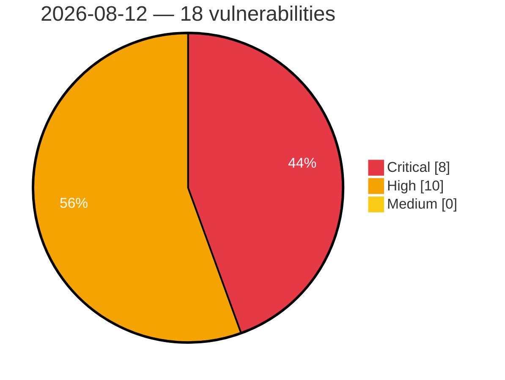

# Critical, High & Medium Severity Vulnerabilities — 2026-08-12

**Source status for this day:**

| Source | Critical | High | Medium | Total |
|--------|---------:|-----:|-------:|------:|
| cvefeed.io (High/Critical) | 8 | 10 | 0 | 18 |

**KEV (actively exploited):** 0  **Watchlist matches:** 11

## Critical (8)

| CVSS | Flags | Source | CVE / Title | Reported |
|------|-------|--------|-------------|----------|
| 10.0 | ⭐ | cvefeed.io (High/Critical) | [CVE-2026-67282 - Joomla Extension - fabrikar.com - Unauthenticated remote code execution in Fabrik < 4.6.8](https://cvefeed.io/vuln/detail/CVE-2026-67282) | 39 minutes ago |
| 9.9 | ⭐ | cvefeed.io (High/Critical) | [CVE-2026-72526 - Multicloud-integrations: multicloud-integrations: pull-model propagation allows hub tenant to target arbitrary spoke cluster via unvalidated ocm-managed-cluster annotation](https://cvefeed.io/vuln/detail/CVE-2026-72526) | 1 hour, 4 minutes ago |
| 9.8 | — | cvefeed.io (High/Critical) | [CVE-2025-41769 - Unauthenticated Buffer Overflow in PROFINET Service](https://cvefeed.io/vuln/detail/CVE-2025-41769) | 1 hour, 39 minutes ago |
| 9.8 | — | cvefeed.io (High/Critical) | [CVE-2026-26035 - Fortinet FortiWeb Improper Authentication Vulnerability](https://cvefeed.io/vuln/detail/CVE-2026-26035) | 57 minutes ago |
| 9.6 | ⭐ | cvefeed.io (High/Critical) | [CVE-2026-70398 - Multicloud-integrations: multicloud-integrations: gitopscluster.spec.argoserver.argonamespace writes spoke bearer tokens to attacker-chosen namespace](https://cvefeed.io/vuln/detail/CVE-2026-70398) | 1 hour, 4 minutes ago |
| 9.3 | ⭐ | cvefeed.io (High/Critical) | [CVE-2026-66659 - WordPress Tablesome Table plugin <= 1.2.9 - SQL Injection vulnerability](https://cvefeed.io/vuln/detail/CVE-2026-66659) | 1 hour, 52 minutes ago |
| 9.3 | ⭐ | cvefeed.io (High/Critical) | [CVE-2026-57858 - Cal.com Cal.diy 6.2.0 Stored XSS via BookingPageTagManager Analytics Tracking ID](https://cvefeed.io/vuln/detail/CVE-2026-57858) | 57 minutes ago |
| 9.2 | — | cvefeed.io (High/Critical) | [CVE-2026-67285 - Joomla Extension - joomshaper.com - Unauthenticated arbitrary local PHP file inclusion in SP Page Builder < 6.8.0](https://cvefeed.io/vuln/detail/CVE-2026-67285) | 20 minutes ago |

## High (10)

| CVSS | Flags | Source | CVE / Title | Reported |
|------|-------|--------|-------------|----------|
| 8.8 | — | cvefeed.io (High/Critical) | [CVE-2026-19426 - FitSoft｜POS Sytstem - Missing Authentication](https://cvefeed.io/vuln/detail/CVE-2026-19426) | 1 hour, 7 minutes ago |
| 8.8 | ⭐ | cvefeed.io (High/Critical) | [CVE-2026-11325 - cloudflare/pages-action is deprecated — migration required by September 18th, 2026](https://cvefeed.io/vuln/detail/CVE-2026-11325) | 43 minutes ago |
| 8.7 | — | cvefeed.io (High/Critical) | [CVE-2025-41770 - Unauthenticated Denial of Service](https://cvefeed.io/vuln/detail/CVE-2025-41770) | 1 hour, 39 minutes ago |
| 8.6 | ⭐ | cvefeed.io (High/Critical) | [CVE-2026-18474 - WP Directory Kit < 1.5.6 - Unauthenticated SQL Injection via search_location and search_category](https://cvefeed.io/vuln/detail/CVE-2026-18474) | 7 hours, 54 minutes ago |
| 8.2 | — | cvefeed.io (High/Critical) | [CVE-2026-6484 - Lack of verified boot to certain FV may cause arbitrary code execution](https://cvefeed.io/vuln/detail/CVE-2026-6484) | 57 minutes ago |
| 8.2 | ⭐ | cvefeed.io (High/Critical) | [CVE-2026-64954 - Velociraptor collect_client() Permissions Bypass](https://cvefeed.io/vuln/detail/CVE-2026-64954) | 55 minutes ago |
| 8.1 | ⭐ | cvefeed.io (High/Critical) | [CVE-2026-18961 - Social Login, Passkeys, Magic Link & Email OTP – Passwordless Login by VentraConnect <= 1.4.3 - Unauthenticated Authentication Bypass via Spotify OAuth Callback](https://cvefeed.io/vuln/detail/CVE-2026-18961) | 1 hour, 29 minutes ago |
| 8.1 | ⭐ | cvefeed.io (High/Critical) | [CVE-2026-19594 - Path Traversal and HTTP Parameter Pollution in Snowflake Python API (snowflake.core) Allow Confused-Deputy Privilege Escalation](https://cvefeed.io/vuln/detail/CVE-2026-19594) | 52 minutes ago |
| 8.1 | ⭐ | cvefeed.io (High/Critical) | [CVE-2026-70468 - Fortinet FortiManager Authentication Bypass Vulnerability](https://cvefeed.io/vuln/detail/CVE-2026-70468) | 57 minutes ago |
| 8.1 | — | cvefeed.io (High/Critical) | [CVE-2026-70465 - Fortinet FortiClient Buffer Overflow Vulnerability](https://cvefeed.io/vuln/detail/CVE-2026-70465) | 1 hour, 55 minutes ago |
