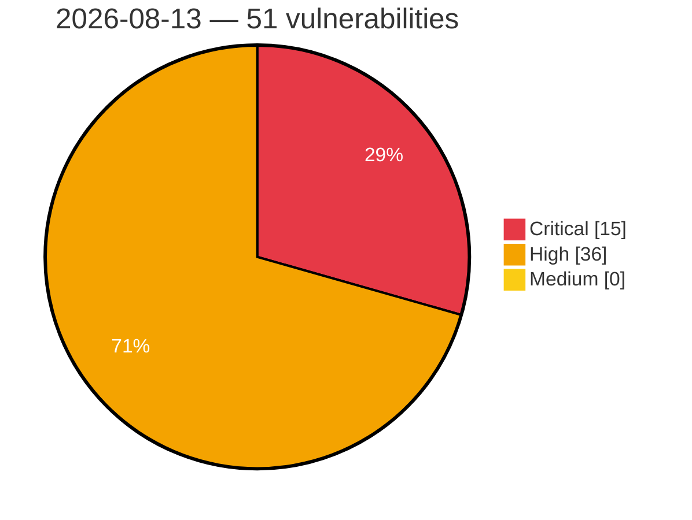

# Critical, High & Medium Severity Vulnerabilities — 2026-08-13

**Source status for this day:**

| Source | Critical | High | Medium | Total |
|--------|---------:|-----:|-------:|------:|
| cvefeed.io (High/Critical) | 15 | 36 | 0 | 51 |

**KEV (actively exploited):** 0  **Watchlist matches:** 23

## Critical (15)

| CVSS | Flags | Source | CVE / Title | Reported |
|------|-------|--------|-------------|----------|
| 10.0 | — | cvefeed.io (High/Critical) | [CVE-2026-59500 - Priority - CWE-287: Improper Authentication](https://cvefeed.io/vuln/detail/CVE-2026-59500) | 56 minutes ago |
| 10.0 | ⭐ | cvefeed.io (High/Critical) | [CVE-2026-15413 - Link Factory - Backdoor](https://cvefeed.io/vuln/detail/CVE-2026-15413) | 58 minutes ago |
| 9.8 | ⭐ | cvefeed.io (High/Critical) | [CVE-2026-49819 - UpSnap - Unauthenticated Initial-Superuser Takeover Chains to Root RCE via wake_cmd](https://cvefeed.io/vuln/detail/CVE-2026-49819) | 48 minutes ago |
| 9.8 | ⭐ | cvefeed.io (High/Critical) | [CVE-2026-49827 - WebErpMesv2 has Unauthenticated RCE via Unrestricted File Upload in HR Expense scan_file (CWE-434)](https://cvefeed.io/vuln/detail/CVE-2026-49827) | 16 minutes ago |
| 9.4 | ⭐ | cvefeed.io (High/Critical) | [CVE-2026-73483 - Flowise before 3.1.3 Sandbox Escape via Puppeteer](https://cvefeed.io/vuln/detail/CVE-2026-73483) | 28 minutes ago |
| 9.3 | ⭐ | cvefeed.io (High/Critical) | [CVE-2026-59507 - Priority –   CWE-798: Use of Hard-coded Credentials CWE-200: Exposure of Sensitive Information to an Unauthorized Actor CWE-284: Improper Access Control](https://cvefeed.io/vuln/detail/CVE-2026-59507) | 30 minutes ago |
| 9.3 | — | cvefeed.io (High/Critical) | [CVE-2026-59506 - Priority –   CWE-306: Missing Authentication for Critical Function](https://cvefeed.io/vuln/detail/CVE-2026-59506) | 34 minutes ago |
| 9.2 | ⭐ | cvefeed.io (High/Critical) | [CVE-2026-73608 - SiYuan before v3.7.4 Authorization Bypass via getAttributeViewSearchTarget](https://cvefeed.io/vuln/detail/CVE-2026-73608) | 28 minutes ago |
| 9.1 | ⭐ | cvefeed.io (High/Critical) | [CVE-2026-59504 - Priority –   CWE-602: Client-Side Enforcement of Server-Side Security](https://cvefeed.io/vuln/detail/CVE-2026-59504) | 41 minutes ago |
| 9.1 | — | cvefeed.io (High/Critical) | [CVE-2026-59503 - Priority –  CWE-200: Exposure of Sensitive Information to an Unauthorized Actor CWE-359: Exposure of Private Personal Information to an Unauthorized Actor](https://cvefeed.io/vuln/detail/CVE-2026-59503) | 44 minutes ago |
| 9.0 | ⭐ | cvefeed.io (High/Critical) | [CVE-2026-73602 - Flowise before 3.1.3 Sandbox Escape to RCE](https://cvefeed.io/vuln/detail/CVE-2026-73602) | 28 minutes ago |
| 9.0 | ⭐ | cvefeed.io (High/Critical) | [CVE-2026-73601 - Flowise before 3.1.3 Remote Code Execution via Custom MCP](https://cvefeed.io/vuln/detail/CVE-2026-73601) | 28 minutes ago |
| 9.0 | ⭐ | cvefeed.io (High/Critical) | [CVE-2026-73487 - Flowise before 3.1.3 Prompt Injection RCE via CSV Agent](https://cvefeed.io/vuln/detail/CVE-2026-73487) | 28 minutes ago |
| 9.0 | — | cvefeed.io (High/Critical) | [CVE-2026-73486 - Flowise before 3.1.3 Code Injection via CSV Agent customReadCSV](https://cvefeed.io/vuln/detail/CVE-2026-73486) | 28 minutes ago |
| 9.0 | ⭐ | cvefeed.io (High/Critical) | [CVE-2026-73485 - Flowise before 3.1.3 Remote Code Execution via Airtable Agent](https://cvefeed.io/vuln/detail/CVE-2026-73485) | 28 minutes ago |

## High (36)

| CVSS | Flags | Source | CVE / Title | Reported |
|------|-------|--------|-------------|----------|
| 8.8 | ⭐ | cvefeed.io (High/Critical) | [CVE-2026-49473 - @cedar-policy/authorization-for-expressjs has an authorization bypass via query string manipulation](https://cvefeed.io/vuln/detail/CVE-2026-49473) | 48 minutes ago |
| 8.8 | ⭐ | cvefeed.io (High/Critical) | [CVE-2026-11840 - SQL Injection](https://cvefeed.io/vuln/detail/CVE-2026-11840) | 39 minutes ago |
| 8.8 | ⭐ | cvefeed.io (High/Critical) | [CVE-2026-73625 - GitPython before 3.1.54 Remote Code Execution via kwarg value smuggling](https://cvefeed.io/vuln/detail/CVE-2026-73625) | 28 minutes ago |
| 8.8 | — | cvefeed.io (High/Critical) | [CVE-2026-73615 - Network-AI SandboxPolicy before 5.15.1 Blocklist Bypass via Quote Mismatch](https://cvefeed.io/vuln/detail/CVE-2026-73615) | 28 minutes ago |
| 8.8 | — | cvefeed.io (High/Critical) | [CVE-2026-73614 - Network-AI ClaudeHookBridge Deny Pattern Bypass via Truncation](https://cvefeed.io/vuln/detail/CVE-2026-73614) | 28 minutes ago |
| 8.8 | ⭐ | cvefeed.io (High/Critical) | [CVE-2026-12263 - Authentication Bypass](https://cvefeed.io/vuln/detail/CVE-2026-12263) | 1 hour, 28 minutes ago |
| 8.8 | — | cvefeed.io (High/Critical) | [CVE-2026-19385 - PostgreSQL pg_dump heap buffer overflow executes arbitrary code](https://cvefeed.io/vuln/detail/CVE-2026-19385) | 18 minutes ago |
| 8.8 | — | cvefeed.io (High/Critical) | [CVE-2026-18408 - PostgreSQL psql \unrestrict lets superuser of pg_dump origin server execute arbitrary code in psql client](https://cvefeed.io/vuln/detail/CVE-2026-18408) | 18 minutes ago |
| 8.8 | — | cvefeed.io (High/Critical) | [CVE-2026-16239 - PostgreSQL type confusion in cursor CLOSE + DECLARE executes arbitrary code](https://cvefeed.io/vuln/detail/CVE-2026-16239) | 18 minutes ago |
| 8.8 | — | cvefeed.io (High/Critical) | [CVE-2026-16238 - PostgreSQL type confusion in pg_restore_attribute_stats() executes arbitrary code](https://cvefeed.io/vuln/detail/CVE-2026-16238) | 18 minutes ago |
| 8.8 | — | cvefeed.io (High/Critical) | [CVE-2026-15742 - PostgreSQL fuzzystrmatch writes effectively-arbitrary addresses, via integer wraparound](https://cvefeed.io/vuln/detail/CVE-2026-15742) | 18 minutes ago |
| 8.8 | ⭐ | cvefeed.io (High/Critical) | [CVE-2026-15741 - PostgreSQL expression deparse allows SQL injection via EXTRACT argument](https://cvefeed.io/vuln/detail/CVE-2026-15741) | 18 minutes ago |
| 8.8 | — | cvefeed.io (High/Critical) | [CVE-2026-14680 - PostgreSQL type confusion via "internal" arguments](https://cvefeed.io/vuln/detail/CVE-2026-14680) | 18 minutes ago |
| 8.8 | — | cvefeed.io (High/Critical) | [CVE-2026-14677 - PostgreSQL 32-bit pltcl and plperl undersize allocations, via integer wraparound](https://cvefeed.io/vuln/detail/CVE-2026-14677) | 18 minutes ago |
| 8.8 | — | cvefeed.io (High/Critical) | [CVE-2026-14676 - PostgreSQL pg_stat_statements heap buffer overflow executes arbitrary code](https://cvefeed.io/vuln/detail/CVE-2026-14676) | 18 minutes ago |
| 8.8 | — | cvefeed.io (High/Critical) | [CVE-2026-14671 - PostgreSQL refint plan cache type confusion executes arbitrary code](https://cvefeed.io/vuln/detail/CVE-2026-14671) | 18 minutes ago |
| 8.8 | — | cvefeed.io (High/Critical) | [CVE-2026-14670 - PostgreSQL plperl tied object heap buffer overflow executes arbitrary code](https://cvefeed.io/vuln/detail/CVE-2026-14670) | 18 minutes ago |
| 8.8 | — | cvefeed.io (High/Critical) | [CVE-2026-14669 - PostgreSQL to_char heap buffer overflow executes arbitrary code](https://cvefeed.io/vuln/detail/CVE-2026-14669) | 18 minutes ago |
| 8.8 | — | cvefeed.io (High/Critical) | [CVE-2026-14664 - PostgreSQL regexp heap buffer overflow executes arbitrary code](https://cvefeed.io/vuln/detail/CVE-2026-14664) | 18 minutes ago |
| 8.8 | ⭐ | cvefeed.io (High/Critical) | [CVE-2026-14662 - PostgreSQL tsvector and tsquery undersize allocations, via integer wraparound](https://cvefeed.io/vuln/detail/CVE-2026-14662) | 18 minutes ago |
| 8.7 | — | cvefeed.io (High/Critical) | [CVE-2026-46382 - Meeting Room Booking System has server-side request forgery in import functionality](https://cvefeed.io/vuln/detail/CVE-2026-46382) | 48 minutes ago |
| 8.7 | — | cvefeed.io (High/Critical) | [CVE-2026-73622 - GitPython before 3.1.55 Environment Variable Exfiltration via Remote.add()](https://cvefeed.io/vuln/detail/CVE-2026-73622) | 28 minutes ago |
| 8.7 | ⭐ | cvefeed.io (High/Critical) | [CVE-2026-73618 - Budibase Server before 3.40.0 NoSQL Injection via JSON Parameter](https://cvefeed.io/vuln/detail/CVE-2026-73618) | 28 minutes ago |
| 8.7 | ⭐ | cvefeed.io (High/Critical) | [CVE-2026-49478 - Fulcio has OIDC Discovery Redirect Following Allows SSRF and JWKS Substitution for Meta-Issuer Paths, with Kubernetes Service-Account Token Leakage](https://cvefeed.io/vuln/detail/CVE-2026-49478) | 16 minutes ago |
| 8.6 | ⭐ | cvefeed.io (High/Critical) | [CVE-2026-59505 - Priority - CWE-284: Improper Access Control](https://cvefeed.io/vuln/detail/CVE-2026-59505) | 38 minutes ago |
| 8.6 | — | cvefeed.io (High/Critical) | [CVE-2026-59499 - Priority –  CWE-200: Exposure of Sensitive Information to an Unauthorized Actor](https://cvefeed.io/vuln/detail/CVE-2026-59499) | 1 hour, 3 minutes ago |
| 8.6 | ⭐ | cvefeed.io (High/Critical) | [CVE-2026-73612 - File Browser before v2.63.22 Authorization Bypass via Recursive Operations](https://cvefeed.io/vuln/detail/CVE-2026-73612) | 28 minutes ago |
| 8.6 | — | cvefeed.io (High/Critical) | [CVE-2026-73484 - Flowise before 3.1.3 Sandbox Escape via Pandas Methods](https://cvefeed.io/vuln/detail/CVE-2026-73484) | 28 minutes ago |
| 8.5 | ⭐ | cvefeed.io (High/Critical) | [CVE-2026-73629 - Serendipity before 2.6.0 SSRF via hex IPv4 and IPv6 addresses](https://cvefeed.io/vuln/detail/CVE-2026-73629) | 28 minutes ago |
| 8.2 | ⭐ | cvefeed.io (High/Critical) | [CVE-2026-59501 - Priority –   CWE-284: Improper Access Control](https://cvefeed.io/vuln/detail/CVE-2026-59501) | 51 minutes ago |
| 8.2 | — | cvefeed.io (High/Critical) | [CVE-2026-73613 - filebrowser before 2.63.19 Out-of-Scope File Deletion via Symlink](https://cvefeed.io/vuln/detail/CVE-2026-73613) | 28 minutes ago |
| 8.2 | — | cvefeed.io (High/Critical) | [CVE-2026-14679 - PostgreSQL stack buffer overflow in argument match writes 0x0 and 0x1 to server memory](https://cvefeed.io/vuln/detail/CVE-2026-14679) | 18 minutes ago |
| 8.1 | — | cvefeed.io (High/Critical) | [CVE-2026-73624 - GitPython before 3.1.54 Arbitrary File Overwrite via diff](https://cvefeed.io/vuln/detail/CVE-2026-73624) | 28 minutes ago |
| 8.1 | — | cvefeed.io (High/Critical) | [CVE-2026-73620 - GitPython before 3.1.57 Arbitrary File Overwrite and Read](https://cvefeed.io/vuln/detail/CVE-2026-73620) | 28 minutes ago |
| 8.1 | — | cvefeed.io (High/Critical) | [CVE-2026-6464 - PostgreSQL psql COPY FROM STDIN early failure processes data lines as psql commands](https://cvefeed.io/vuln/detail/CVE-2026-6464) | 16 minutes ago |
| 8.1 | — | cvefeed.io (High/Critical) | [CVE-2026-14668 - PostgreSQL ctid type confusion in selectivity estimator discloses derivative of arbitrary read](https://cvefeed.io/vuln/detail/CVE-2026-14668) | 18 minutes ago |
