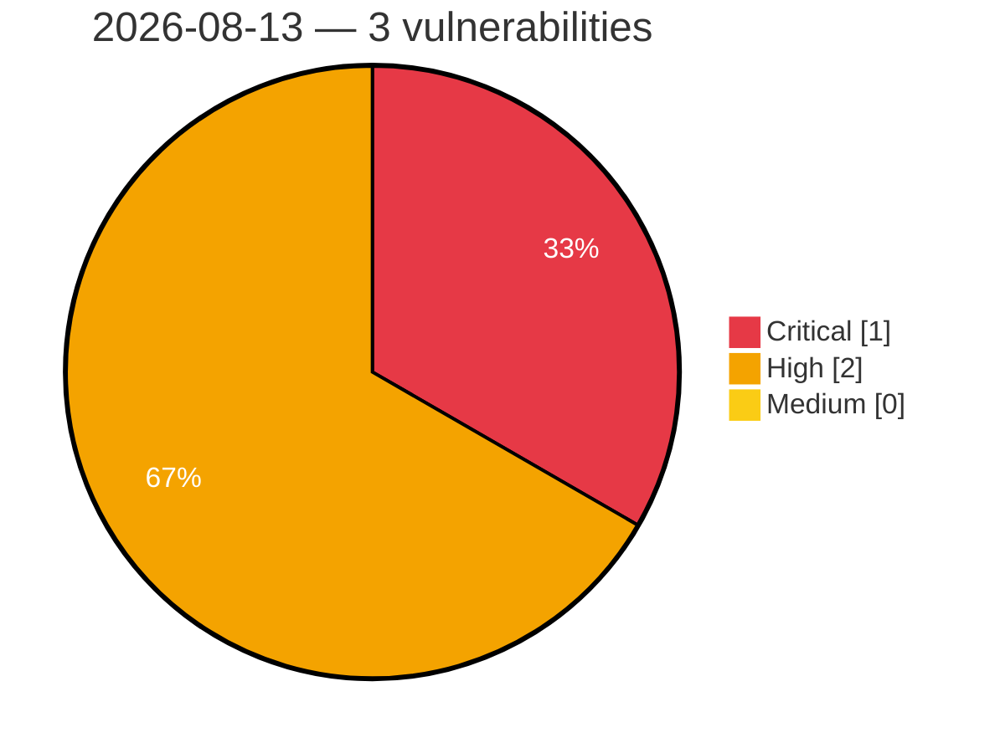

# Critical, High & Medium Severity Vulnerabilities — 2026-08-13

**Source status for this day:**

| Source | Critical | High | Medium | Total |
|--------|---------:|-----:|-------:|------:|
| cvefeed.io (High/Critical) | 1 | 2 | 0 | 3 |

**KEV (actively exploited):** 0  **Watchlist matches:** 2

## Critical (1)

| CVSS | Flags | Source | CVE / Title | Reported |
|------|-------|--------|-------------|----------|
| 9.8 | ⭐ | cvefeed.io (High/Critical) | [CVE-2026-49819 - UpSnap - Unauthenticated Initial-Superuser Takeover Chains to Root RCE via wake_cmd](https://cvefeed.io/vuln/detail/CVE-2026-49819) | 48 minutes ago |

## High (2)

| CVSS | Flags | Source | CVE / Title | Reported |
|------|-------|--------|-------------|----------|
| 8.8 | ⭐ | cvefeed.io (High/Critical) | [CVE-2026-49473 - @cedar-policy/authorization-for-expressjs has an authorization bypass via query string manipulation](https://cvefeed.io/vuln/detail/CVE-2026-49473) | 48 minutes ago |
| 8.7 | — | cvefeed.io (High/Critical) | [CVE-2026-46382 - Meeting Room Booking System has server-side request forgery in import functionality](https://cvefeed.io/vuln/detail/CVE-2026-46382) | 48 minutes ago |
