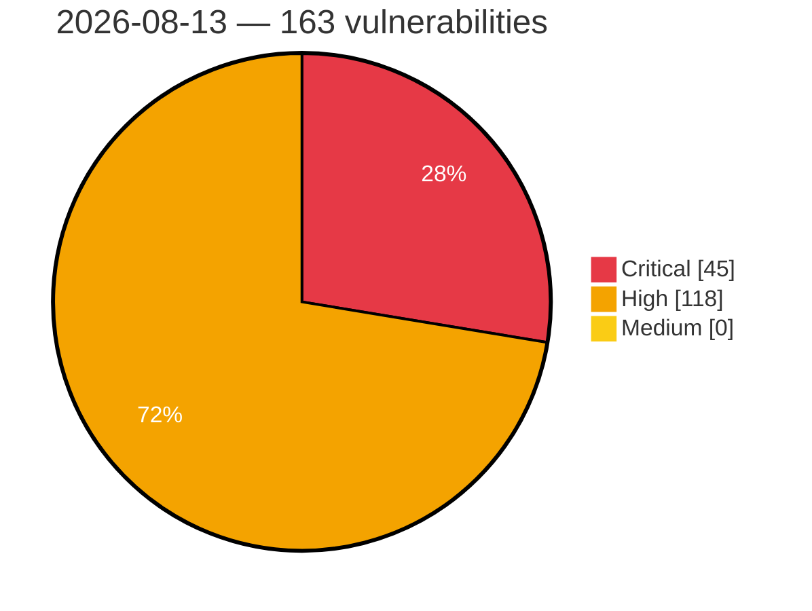

# Critical, High & Medium Severity Vulnerabilities — 2026-08-13

**Source status for this day:**

| Source | Critical | High | Medium | Total |
|--------|---------:|-----:|-------:|------:|
| cvefeed.io (High/Critical) | 45 | 118 | 0 | 163 |

**KEV (actively exploited):** 0  **Watchlist matches:** 90

## Critical (45)

| CVSS | Flags | Source | CVE / Title | Reported |
|------|-------|--------|-------------|----------|
| 10.0 | — | cvefeed.io (High/Critical) | [CVE-2026-59500 - Priority - CWE-287: Improper Authentication](https://cvefeed.io/vuln/detail/CVE-2026-59500) | 56 minutes ago |
| 10.0 | ⭐ | cvefeed.io (High/Critical) | [CVE-2026-15413 - Link Factory - Backdoor](https://cvefeed.io/vuln/detail/CVE-2026-15413) | 58 minutes ago |
| 10.0 | ⭐ | cvefeed.io (High/Critical) | [CVE-2026-72851 - Budibase before 3.40.0 SQL Injection via Unauthenticated Webhook](https://cvefeed.io/vuln/detail/CVE-2026-72851) | 20 minutes ago |
| 9.9 | ⭐ | cvefeed.io (High/Critical) | [CVE-2026-73656 - Trigger.dev: Cross-project deployment worker registration can modify another project's deployment state](https://cvefeed.io/vuln/detail/CVE-2026-73656) | 28 minutes ago |
| 9.9 | ⭐ | cvefeed.io (High/Critical) | [CVE-2026-72842 - OpenWrt luci-app-lxc ACL Inconsistency Authentication Bypass](https://cvefeed.io/vuln/detail/CVE-2026-72842) | 20 minutes ago |
| 9.9 | ⭐ | cvefeed.io (High/Critical) | [CVE-2026-72841 - luci-app-openvpn Path Traversal RCE via instance_name2](https://cvefeed.io/vuln/detail/CVE-2026-72841) | 20 minutes ago |
| 9.8 | ⭐ | cvefeed.io (High/Critical) | [CVE-2026-49819 - UpSnap - Unauthenticated Initial-Superuser Takeover Chains to Root RCE via wake_cmd](https://cvefeed.io/vuln/detail/CVE-2026-49819) | 48 minutes ago |
| 9.8 | ⭐ | cvefeed.io (High/Critical) | [CVE-2026-49827 - WebErpMesv2 has Unauthenticated RCE via Unrestricted File Upload in HR Expense scan_file (CWE-434)](https://cvefeed.io/vuln/detail/CVE-2026-49827) | 16 minutes ago |
| 9.8 | ⭐ | cvefeed.io (High/Critical) | [CVE-2026-73533 - Ninja Tables Pro 5.2.11 Embedded Malicious Code via Tampered Plugin Build](https://cvefeed.io/vuln/detail/CVE-2026-73533) | 27 minutes ago |
| 9.8 | ⭐ | cvefeed.io (High/Critical) | [CVE-2026-73532 - Fluent Forms Pro 6.2.7 Embedded Malicious Code via Tampered Plugin Build](https://cvefeed.io/vuln/detail/CVE-2026-73532) | 27 minutes ago |
| 9.8 | ⭐ | cvefeed.io (High/Critical) | [CVE-2026-67614 - CyberPanel < 3.0.0 Hard-coded JWT Secret Authentication Bypass via WebTerminal](https://cvefeed.io/vuln/detail/CVE-2026-67614) | 50 minutes ago |
| 9.8 | ⭐ | cvefeed.io (High/Critical) | [CVE-2026-73649 - Velocity.js: Remote Code Execution via property-read to Function constructor (bypass of CVE-2026-44966 fix)](https://cvefeed.io/vuln/detail/CVE-2026-73649) | 1 hour, 40 minutes ago |
| 9.8 | ⭐ | cvefeed.io (High/Critical) | [CVE-2026-72839 - filebrowser through 2.63.16 Privilege Escalation via Signup](https://cvefeed.io/vuln/detail/CVE-2026-72839) | 20 minutes ago |
| 9.8 | ⭐ | cvefeed.io (High/Critical) | [CVE-2026-17482 - IBM Documentation Offline is vulnerable to information disclosure, session forgery and remote code execution](https://cvefeed.io/vuln/detail/CVE-2026-17482) | 57 minutes ago |
| 9.8 | ⭐ | cvefeed.io (High/Critical) | [CVE-2026-72776 - AgenticSeek Unauthenticated RCE via /query API Endpoint](https://cvefeed.io/vuln/detail/CVE-2026-72776) | 1 hour, 1 minute ago |
| 9.6 | — | cvefeed.io (High/Critical) | [CVE-2026-73644 - OpenDJ: Authorization bypass in SASL PLAIN allowing a `proxied-auth` holder to impersonate any resolvable non-root user without an ACI proxy grant](https://cvefeed.io/vuln/detail/CVE-2026-73644) | 1 hour, 40 minutes ago |
| 9.6 | ⭐ | cvefeed.io (High/Critical) | [CVE-2026-8715 - Vault Secrets Operator vulnerable to arbitrary file read and credential exfiltration via AppRole secretIDPath](https://cvefeed.io/vuln/detail/CVE-2026-8715) | 18 minutes ago |
| 9.6 | ⭐ | cvefeed.io (High/Critical) | [CVE-2026-73843 - OpenChoreo: Unauthenticated access to data-plane operations via OpenChoreo cluster-gateway management APIs](https://cvefeed.io/vuln/detail/CVE-2026-73843) | 1 hour, 22 minutes ago |
| 9.4 | ⭐ | cvefeed.io (High/Critical) | [CVE-2026-73483 - Flowise before 3.1.3 Sandbox Escape via Puppeteer](https://cvefeed.io/vuln/detail/CVE-2026-73483) | 28 minutes ago |
| 9.4 | ⭐ | cvefeed.io (High/Critical) | [CVE-2026-14525 - IBM WebSphere Application Server Liberty is affected by an authenication bypass](https://cvefeed.io/vuln/detail/CVE-2026-14525) | 21 minutes ago |
| 9.4 | ⭐ | cvefeed.io (High/Critical) | [CVE-2026-73653 - Vitest: Browser Mode provider commands bypass the file-access permission gate](https://cvefeed.io/vuln/detail/CVE-2026-73653) | 41 minutes ago |
| 9.4 | ⭐ | cvefeed.io (High/Critical) | [CVE-2026-72850 - Budibase before 3.40.0 Arbitrary File Write via Path Traversal](https://cvefeed.io/vuln/detail/CVE-2026-72850) | 20 minutes ago |
| 9.3 | ⭐ | cvefeed.io (High/Critical) | [CVE-2026-59507 - Priority –   CWE-798: Use of Hard-coded Credentials CWE-200: Exposure of Sensitive Information to an Unauthorized Actor CWE-284: Improper Access Control](https://cvefeed.io/vuln/detail/CVE-2026-59507) | 30 minutes ago |
| 9.3 | — | cvefeed.io (High/Critical) | [CVE-2026-59506 - Priority –   CWE-306: Missing Authentication for Critical Function](https://cvefeed.io/vuln/detail/CVE-2026-59506) | 34 minutes ago |
| 9.3 | ⭐ | cvefeed.io (High/Critical) | [CVE-2026-73665 - FreePBX UCP: Unauthenticated remote code execution via socket.io namespace auth bypass and AMI action injection](https://cvefeed.io/vuln/detail/CVE-2026-73665) | 1 hour, 22 minutes ago |
| 9.3 | ⭐ | cvefeed.io (High/Critical) | [CVE-2026-73663 - FreePBX: Unauthenticated SQL injection in FreePBX missedcall via inbound Caller ID name leads to administrator takeover](https://cvefeed.io/vuln/detail/CVE-2026-73663) | 1 hour, 22 minutes ago |
| 9.2 | ⭐ | cvefeed.io (High/Critical) | [CVE-2026-73608 - SiYuan before v3.7.4 Authorization Bypass via getAttributeViewSearchTarget](https://cvefeed.io/vuln/detail/CVE-2026-73608) | 28 minutes ago |
| 9.2 | ⭐ | cvefeed.io (High/Critical) | [CVE-2026-70460 - rsync 2.3.3 < 3.5.0 Path Traversal via --partial-dir/--backup-dir Symlink](https://cvefeed.io/vuln/detail/CVE-2026-70460) | 16 minutes ago |
| 9.2 | ⭐ | cvefeed.io (High/Critical) | [CVE-2026-53790 - rsync < 3.5.0 Command Injection via Multiple Code Paths](https://cvefeed.io/vuln/detail/CVE-2026-53790) | 16 minutes ago |
| 9.1 | ⭐ | cvefeed.io (High/Critical) | [CVE-2026-59504 - Priority –   CWE-602: Client-Side Enforcement of Server-Side Security](https://cvefeed.io/vuln/detail/CVE-2026-59504) | 41 minutes ago |
| 9.1 | — | cvefeed.io (High/Critical) | [CVE-2026-59503 - Priority –  CWE-200: Exposure of Sensitive Information to an Unauthorized Actor CWE-359: Exposure of Private Personal Information to an Unauthorized Actor](https://cvefeed.io/vuln/detail/CVE-2026-59503) | 44 minutes ago |
| 9.1 | ⭐ | cvefeed.io (High/Critical) | [CVE-2026-70452 - rsync 3.1.0 < 3.5.0 Access Control Bypass via DNS Resolution Failure](https://cvefeed.io/vuln/detail/CVE-2026-70452) | 16 minutes ago |
| 9.1 | — | cvefeed.io (High/Critical) | [CVE-2026-53793 - rsync < 3.5.0 Path Confinement Bypass via /./ Boundary Marker in Chroot Mode](https://cvefeed.io/vuln/detail/CVE-2026-53793) | 16 minutes ago |
| 9.1 | ⭐ | cvefeed.io (High/Critical) | [CVE-2026-53791 - rsync < 3.5.0 Daemon IP Spoofing via PROXY Protocol Header](https://cvefeed.io/vuln/detail/CVE-2026-53791) | 16 minutes ago |
| 9.1 | — | cvefeed.io (High/Critical) | [CVE-2026-73567 - sm-crypto: Predictable SM2 key generation in Node.js: default RNG uses Math.random + wall clock](https://cvefeed.io/vuln/detail/CVE-2026-73567) | 1 hour, 40 minutes ago |
| 9.1 | ⭐ | cvefeed.io (High/Critical) | [CVE-2026-19297 - Insufficient Authentication Brute Force Protection on Login Endpoint](https://cvefeed.io/vuln/detail/CVE-2026-19297) | 57 minutes ago |
| 9.1 | — | cvefeed.io (High/Critical) | [CVE-2026-73421 - NextAuth.js: Configuration errors can cause existence-based auth checks to fail open (auth object populated with an error)](https://cvefeed.io/vuln/detail/CVE-2026-73421) | 1 hour, 22 minutes ago |
| 9.1 | — | cvefeed.io (High/Critical) | [CVE-2026-73420 - NextAuth.js: Email normalizer validates the address before Unicode normalization, allowing a homoglyph @ bypass](https://cvefeed.io/vuln/detail/CVE-2026-73420) | 1 hour, 22 minutes ago |
| 9.0 | ⭐ | cvefeed.io (High/Critical) | [CVE-2026-73602 - Flowise before 3.1.3 Sandbox Escape to RCE](https://cvefeed.io/vuln/detail/CVE-2026-73602) | 28 minutes ago |
| 9.0 | ⭐ | cvefeed.io (High/Critical) | [CVE-2026-73601 - Flowise before 3.1.3 Remote Code Execution via Custom MCP](https://cvefeed.io/vuln/detail/CVE-2026-73601) | 28 minutes ago |
| 9.0 | ⭐ | cvefeed.io (High/Critical) | [CVE-2026-73487 - Flowise before 3.1.3 Prompt Injection RCE via CSV Agent](https://cvefeed.io/vuln/detail/CVE-2026-73487) | 28 minutes ago |
| 9.0 | — | cvefeed.io (High/Critical) | [CVE-2026-73486 - Flowise before 3.1.3 Code Injection via CSV Agent customReadCSV](https://cvefeed.io/vuln/detail/CVE-2026-73486) | 28 minutes ago |
| 9.0 | ⭐ | cvefeed.io (High/Critical) | [CVE-2026-73485 - Flowise before 3.1.3 Remote Code Execution via Airtable Agent](https://cvefeed.io/vuln/detail/CVE-2026-73485) | 28 minutes ago |
| 9.0 | ⭐ | cvefeed.io (High/Critical) | [CVE-2026-73842 - OpenChoreo: cluster-gateway internal proxy performs no caller authentication and is not read-only — data-plane Secret disclosure and arbitrary Kubernetes mutation](https://cvefeed.io/vuln/detail/CVE-2026-73842) | 1 hour, 22 minutes ago |
| 9.0 | ⭐ | cvefeed.io (High/Critical) | [CVE-2026-73302 - Budibase: OIDC SSO account takeover: incoming identity linked by email without checking email_verified](https://cvefeed.io/vuln/detail/CVE-2026-73302) | 1 hour, 22 minutes ago |

## High (118)

| CVSS | Flags | Source | CVE / Title | Reported |
|------|-------|--------|-------------|----------|
| 10.0 | ⭐ | cvefeed.io (High/Critical) | [CVE-2026-19747 - Tenda CH7 ATE Module Kylin HandleCmd command injection](https://cvefeed.io/vuln/detail/CVE-2026-19747) | 29 minutes ago |
| 8.9 | ⭐ | cvefeed.io (High/Critical) | [CVE-2026-73570 - Zimbra Collaboration Remote Code Execution Vulnerability](https://cvefeed.io/vuln/detail/CVE-2026-73570) | 27 minutes ago |
| 8.9 | — | cvefeed.io (High/Critical) | [CVE-2026-18193 - IBM i Is Affected By Multiple Vulnerabilities in IBM Java SDK and IBM Java Runtime](https://cvefeed.io/vuln/detail/CVE-2026-18193) | 57 minutes ago |
| 8.8 | ⭐ | cvefeed.io (High/Critical) | [CVE-2026-49473 - @cedar-policy/authorization-for-expressjs has an authorization bypass via query string manipulation](https://cvefeed.io/vuln/detail/CVE-2026-49473) | 48 minutes ago |
| 8.8 | ⭐ | cvefeed.io (High/Critical) | [CVE-2026-11840 - SQL Injection](https://cvefeed.io/vuln/detail/CVE-2026-11840) | 39 minutes ago |
| 8.8 | ⭐ | cvefeed.io (High/Critical) | [CVE-2026-73625 - GitPython before 3.1.54 Remote Code Execution via kwarg value smuggling](https://cvefeed.io/vuln/detail/CVE-2026-73625) | 28 minutes ago |
| 8.8 | — | cvefeed.io (High/Critical) | [CVE-2026-73615 - Network-AI SandboxPolicy before 5.15.1 Blocklist Bypass via Quote Mismatch](https://cvefeed.io/vuln/detail/CVE-2026-73615) | 28 minutes ago |
| 8.8 | — | cvefeed.io (High/Critical) | [CVE-2026-73614 - Network-AI ClaudeHookBridge Deny Pattern Bypass via Truncation](https://cvefeed.io/vuln/detail/CVE-2026-73614) | 28 minutes ago |
| 8.8 | ⭐ | cvefeed.io (High/Critical) | [CVE-2026-12263 - Authentication Bypass](https://cvefeed.io/vuln/detail/CVE-2026-12263) | 1 hour, 28 minutes ago |
| 8.8 | — | cvefeed.io (High/Critical) | [CVE-2026-19385 - PostgreSQL pg_dump heap buffer overflow executes arbitrary code](https://cvefeed.io/vuln/detail/CVE-2026-19385) | 18 minutes ago |
| 8.8 | — | cvefeed.io (High/Critical) | [CVE-2026-18408 - PostgreSQL psql \unrestrict lets superuser of pg_dump origin server execute arbitrary code in psql client](https://cvefeed.io/vuln/detail/CVE-2026-18408) | 18 minutes ago |
| 8.8 | — | cvefeed.io (High/Critical) | [CVE-2026-16239 - PostgreSQL type confusion in cursor CLOSE + DECLARE executes arbitrary code](https://cvefeed.io/vuln/detail/CVE-2026-16239) | 18 minutes ago |
| 8.8 | — | cvefeed.io (High/Critical) | [CVE-2026-16238 - PostgreSQL type confusion in pg_restore_attribute_stats() executes arbitrary code](https://cvefeed.io/vuln/detail/CVE-2026-16238) | 18 minutes ago |
| 8.8 | — | cvefeed.io (High/Critical) | [CVE-2026-15742 - PostgreSQL fuzzystrmatch writes effectively-arbitrary addresses, via integer wraparound](https://cvefeed.io/vuln/detail/CVE-2026-15742) | 18 minutes ago |
| 8.8 | ⭐ | cvefeed.io (High/Critical) | [CVE-2026-15741 - PostgreSQL expression deparse allows SQL injection via EXTRACT argument](https://cvefeed.io/vuln/detail/CVE-2026-15741) | 18 minutes ago |
| 8.8 | — | cvefeed.io (High/Critical) | [CVE-2026-14680 - PostgreSQL type confusion via "internal" arguments](https://cvefeed.io/vuln/detail/CVE-2026-14680) | 18 minutes ago |
| 8.8 | — | cvefeed.io (High/Critical) | [CVE-2026-14677 - PostgreSQL 32-bit pltcl and plperl undersize allocations, via integer wraparound](https://cvefeed.io/vuln/detail/CVE-2026-14677) | 18 minutes ago |
| 8.8 | — | cvefeed.io (High/Critical) | [CVE-2026-14676 - PostgreSQL pg_stat_statements heap buffer overflow executes arbitrary code](https://cvefeed.io/vuln/detail/CVE-2026-14676) | 18 minutes ago |
| 8.8 | — | cvefeed.io (High/Critical) | [CVE-2026-14671 - PostgreSQL refint plan cache type confusion executes arbitrary code](https://cvefeed.io/vuln/detail/CVE-2026-14671) | 18 minutes ago |
| 8.8 | — | cvefeed.io (High/Critical) | [CVE-2026-14670 - PostgreSQL plperl tied object heap buffer overflow executes arbitrary code](https://cvefeed.io/vuln/detail/CVE-2026-14670) | 18 minutes ago |
| 8.8 | — | cvefeed.io (High/Critical) | [CVE-2026-14669 - PostgreSQL to_char heap buffer overflow executes arbitrary code](https://cvefeed.io/vuln/detail/CVE-2026-14669) | 18 minutes ago |
| 8.8 | — | cvefeed.io (High/Critical) | [CVE-2026-14664 - PostgreSQL regexp heap buffer overflow executes arbitrary code](https://cvefeed.io/vuln/detail/CVE-2026-14664) | 18 minutes ago |
| 8.8 | ⭐ | cvefeed.io (High/Critical) | [CVE-2026-14662 - PostgreSQL tsvector and tsquery undersize allocations, via integer wraparound](https://cvefeed.io/vuln/detail/CVE-2026-14662) | 18 minutes ago |
| 8.8 | — | cvefeed.io (High/Critical) | [CVE-2026-70461 - rsync 3.2.5 < 3.5.0 Heap Out-of-Bounds Write via files-from Entry](https://cvefeed.io/vuln/detail/CVE-2026-70461) | 16 minutes ago |
| 8.8 | — | cvefeed.io (High/Critical) | [CVE-2026-70458 - rsync 3.0.0 < 3.5.0 Out-of-Bounds Write via FLAG_HLINKED Handling](https://cvefeed.io/vuln/detail/CVE-2026-70458) | 16 minutes ago |
| 8.8 | — | cvefeed.io (High/Critical) | [CVE-2026-70456 - rsync 3.0.1 < 3.5.0 Heap Out-of-Bounds Write via read_args()](https://cvefeed.io/vuln/detail/CVE-2026-70456) | 16 minutes ago |
| 8.8 | — | cvefeed.io (High/Critical) | [CVE-2026-19293 - SMP security request](https://cvefeed.io/vuln/detail/CVE-2026-19293) | 16 minutes ago |
| 8.8 | — | cvefeed.io (High/Critical) | [CVE-2026-19292 - Bluetooth re-pairing with legitimate device can use lower security level](https://cvefeed.io/vuln/detail/CVE-2026-19292) | 16 minutes ago |
| 8.8 | — | cvefeed.io (High/Critical) | [CVE-2026-73514 - PostGIS address_standardizer Out-of-Bounds Write via standardize_address()](https://cvefeed.io/vuln/detail/CVE-2026-73514) | 27 minutes ago |
| 8.8 | ⭐ | cvefeed.io (High/Critical) | [CVE-2026-59109 - Zalktis: SQL injection via partner-controlled fields in imported e-invoices](https://cvefeed.io/vuln/detail/CVE-2026-59109) | 41 minutes ago |
| 8.8 | — | cvefeed.io (High/Critical) | [CVE-2026-19291 - Bluetooth re-pairing can use a lower security level than previous](https://cvefeed.io/vuln/detail/CVE-2026-19291) | 2 hours, 39 minutes ago |
| 8.8 | ⭐ | cvefeed.io (High/Critical) | [CVE-2026-16101 - forced re-pairing with already bonded device](https://cvefeed.io/vuln/detail/CVE-2026-16101) | 2 hours, 39 minutes ago |
| 8.8 | — | cvefeed.io (High/Critical) | [CVE-2026-18428 - SQL Query Validation Bypass in OpenSearch Direct Query](https://cvefeed.io/vuln/detail/CVE-2026-18428) | 42 minutes ago |
| 8.8 | — | cvefeed.io (High/Critical) | [CVE-2026-16722 - IBM i is Affected By An Unauthorized Privileges Vulnerability in SQL []](https://cvefeed.io/vuln/detail/CVE-2026-16722) | 18 minutes ago |
| 8.8 | — | cvefeed.io (High/Critical) | [CVE-2026-16674 - IBM i is Affected By Multiple Vulnerabilities in WebSphere Application Server Liberty](https://cvefeed.io/vuln/detail/CVE-2026-16674) | 19 minutes ago |
| 8.8 | — | cvefeed.io (High/Critical) | [CVE-2026-72642 - Use of Out-of-range Pointer Offset in the Elasticsearch Machine Learning Native Inference Process](https://cvefeed.io/vuln/detail/CVE-2026-72642) | 44 minutes ago |
| 8.8 | — | cvefeed.io (High/Critical) | [CVE-2026-17223 - IBM i is Affected By Multiple Vulnerabilities in Host Servers](https://cvefeed.io/vuln/detail/CVE-2026-17223) | 1 hour, 2 minutes ago |
| 8.8 | — | cvefeed.io (High/Critical) | [CVE-2026-17029 - IBM i is Affected By Multiple Vulnerabilities in Java Secure Sockets Extension](https://cvefeed.io/vuln/detail/CVE-2026-17029) | 29 minutes ago |
| 8.8 | — | cvefeed.io (High/Critical) | [CVE-2026-16987 - IBM i is Affected By An Improper Validation Vulnerability in PASE []](https://cvefeed.io/vuln/detail/CVE-2026-16987) | 29 minutes ago |
| 8.8 | ⭐ | cvefeed.io (High/Critical) | [CVE-2026-16975 - IBM i is Affected By A Remote Code Execution Vulnerability []](https://cvefeed.io/vuln/detail/CVE-2026-16975) | 29 minutes ago |
| 8.8 | ⭐ | cvefeed.io (High/Critical) | [CVE-2026-72853 - Budibase before 3.40.0 SQL Injection via Oracle connector](https://cvefeed.io/vuln/detail/CVE-2026-72853) | 20 minutes ago |
| 8.8 | ⭐ | cvefeed.io (High/Critical) | [CVE-2026-72840 - OpenWrt LuCI luci-mod-system-mounts ACL Root RCE via Crontab Write](https://cvefeed.io/vuln/detail/CVE-2026-72840) | 20 minutes ago |
| 8.8 | — | cvefeed.io (High/Critical) | [CVE-2026-18101 - IBM i is Affected By Multiple Vulnerabilities in WebSphere Application Server Liberty](https://cvefeed.io/vuln/detail/CVE-2026-18101) | 57 minutes ago |
| 8.8 | ⭐ | cvefeed.io (High/Critical) | [CVE-2026-17481 - IBM Documentation Offline is vulnerable to information disclosure, session forgery and remote code execution](https://cvefeed.io/vuln/detail/CVE-2026-17481) | 57 minutes ago |
| 8.8 | ⭐ | cvefeed.io (High/Critical) | [CVE-2026-73841 - OpenChoreo: Cross-project command execution and wirelog view access via OpenChoreo openchoreo-api exec and wirelogs endpoints](https://cvefeed.io/vuln/detail/CVE-2026-73841) | 1 hour, 22 minutes ago |
| 8.8 | ⭐ | cvefeed.io (High/Critical) | [CVE-2026-73667 - OpenChoreo: Authenticated OS command injection via OpenChoreo Workflow Plane templates enables code execution in privileged pods](https://cvefeed.io/vuln/detail/CVE-2026-73667) | 1 hour, 22 minutes ago |
| 8.8 | ⭐ | cvefeed.io (High/Critical) | [CVE-2026-73305 - Budibase: Privilege escalation via public role assignment API missing app-level authorization](https://cvefeed.io/vuln/detail/CVE-2026-73305) | 1 hour, 22 minutes ago |
| 8.7 | — | cvefeed.io (High/Critical) | [CVE-2026-46382 - Meeting Room Booking System has server-side request forgery in import functionality](https://cvefeed.io/vuln/detail/CVE-2026-46382) | 48 minutes ago |
| 8.7 | — | cvefeed.io (High/Critical) | [CVE-2026-73622 - GitPython before 3.1.55 Environment Variable Exfiltration via Remote.add()](https://cvefeed.io/vuln/detail/CVE-2026-73622) | 28 minutes ago |
| 8.7 | ⭐ | cvefeed.io (High/Critical) | [CVE-2026-73618 - Budibase Server before 3.40.0 NoSQL Injection via JSON Parameter](https://cvefeed.io/vuln/detail/CVE-2026-73618) | 28 minutes ago |
| 8.7 | ⭐ | cvefeed.io (High/Critical) | [CVE-2026-49478 - Fulcio has OIDC Discovery Redirect Following Allows SSRF and JWKS Substitution for Meta-Issuer Paths, with Kubernetes Service-Account Token Leakage](https://cvefeed.io/vuln/detail/CVE-2026-49478) | 16 minutes ago |
| 8.7 | — | cvefeed.io (High/Critical) | [CVE-2026-70464 - rsync 2.0.0 < 3.5.0 Connection Slot Exhaustion DoS via Handshake Stall](https://cvefeed.io/vuln/detail/CVE-2026-70464) | 16 minutes ago |
| 8.7 | ⭐ | cvefeed.io (High/Critical) | [CVE-2026-70455 - rsync 3.4.2 < 3.5.0 DoS via --zt Zstandard Compression Thread Exhaustion](https://cvefeed.io/vuln/detail/CVE-2026-70455) | 16 minutes ago |
| 8.7 | ⭐ | cvefeed.io (High/Critical) | [CVE-2026-70453 - rsync < 3.5.0 Algorithmic Complexity DoS via hash_search()](https://cvefeed.io/vuln/detail/CVE-2026-70453) | 16 minutes ago |
| 8.7 | — | cvefeed.io (High/Critical) | [CVE-2026-55402 - Secure Access Out-of-Bounds Read Vulnerability](https://cvefeed.io/vuln/detail/CVE-2026-55402) | 30 minutes ago |
| 8.7 | ⭐ | cvefeed.io (High/Critical) | [CVE-2024-58374 - Hongjing e-HR Unauthenticated SQL Injection via getSdutyTree](https://cvefeed.io/vuln/detail/CVE-2024-58374) | 37 minutes ago |
| 8.7 | ⭐ | cvefeed.io (High/Critical) | [CVE-2019-25765 - ASP-CMS SQL Injection via commentList.asp id Parameter](https://cvefeed.io/vuln/detail/CVE-2019-25765) | 53 minutes ago |
| 8.7 | — | cvefeed.io (High/Critical) | [CVE-2026-73569 - fast-xml-parser: Repeated DOCTYPE declarations reset entity expansion limits](https://cvefeed.io/vuln/detail/CVE-2026-73569) | 1 hour, 40 minutes ago |
| 8.7 | — | cvefeed.io (High/Critical) | [CVE-2026-73564 - frp: Unauthenticated Remote Denial of Service in the frp SSH Tunnel Gateway via Integer Overflow](https://cvefeed.io/vuln/detail/CVE-2026-73564) | 1 hour, 40 minutes ago |
| 8.7 | ⭐ | cvefeed.io (High/Critical) | [CVE-2026-72849 - Budibase before 3.40.0 Identity Confusion via Chat-Link Handoff CSRF](https://cvefeed.io/vuln/detail/CVE-2026-72849) | 20 minutes ago |
| 8.6 | ⭐ | cvefeed.io (High/Critical) | [CVE-2026-59505 - Priority - CWE-284: Improper Access Control](https://cvefeed.io/vuln/detail/CVE-2026-59505) | 38 minutes ago |
| 8.6 | — | cvefeed.io (High/Critical) | [CVE-2026-59499 - Priority –  CWE-200: Exposure of Sensitive Information to an Unauthorized Actor](https://cvefeed.io/vuln/detail/CVE-2026-59499) | 1 hour, 3 minutes ago |
| 8.6 | ⭐ | cvefeed.io (High/Critical) | [CVE-2026-73612 - File Browser before v2.63.22 Authorization Bypass via Recursive Operations](https://cvefeed.io/vuln/detail/CVE-2026-73612) | 28 minutes ago |
| 8.6 | — | cvefeed.io (High/Critical) | [CVE-2026-73484 - Flowise before 3.1.3 Sandbox Escape via Pandas Methods](https://cvefeed.io/vuln/detail/CVE-2026-73484) | 28 minutes ago |
| 8.6 | — | cvefeed.io (High/Critical) | [CVE-2026-70463 - rsync 3.1.0 < 3.5.0 Authorization Bypass via auth users Directive Parsing](https://cvefeed.io/vuln/detail/CVE-2026-70463) | 16 minutes ago |
| 8.6 | ⭐ | cvefeed.io (High/Critical) | [CVE-2026-53783 - rsync < 3.5.0 TOCTOU Race Condition Directory Escape via rrsync](https://cvefeed.io/vuln/detail/CVE-2026-53783) | 16 minutes ago |
| 8.6 | ⭐ | cvefeed.io (High/Critical) | [CVE-2026-19734 - IDOR in Prospero Flow CRM allows cross-tenant product disclosure and hijacking](https://cvefeed.io/vuln/detail/CVE-2026-19734) | 16 minutes ago |
| 8.6 | ⭐ | cvefeed.io (High/Critical) | [CVE-2026-73670 - CMS Admin SQL Injection via db_data.php table_name Parameter](https://cvefeed.io/vuln/detail/CVE-2026-73670) | 27 minutes ago |
| 8.6 | ⭐ | cvefeed.io (High/Critical) | [CVE-2026-72741 - Rainbond 6.9.7 Region API Cross-Enterprise IDOR via Tenant Access](https://cvefeed.io/vuln/detail/CVE-2026-72741) | 16 minutes ago |
| 8.6 | — | cvefeed.io (High/Critical) | [CVE-2026-16815 - IBM i is Affected By Multiple Vulnerabilities in Simple Mail Transfer Protocol](https://cvefeed.io/vuln/detail/CVE-2026-16815) | 18 minutes ago |
| 8.6 | ⭐ | cvefeed.io (High/Critical) | [CVE-2026-72777 - Next AI Draw.io 0.4.16 SSRF via DNS Rebinding in parse-url](https://cvefeed.io/vuln/detail/CVE-2026-72777) | 41 minutes ago |
| 8.6 | ⭐ | cvefeed.io (High/Critical) | [CVE-2026-49864 - wetty vulnerable to DOM XSS via file-download filename](https://cvefeed.io/vuln/detail/CVE-2026-49864) | 29 minutes ago |
| 8.6 | ⭐ | cvefeed.io (High/Critical) | [CVE-2026-72856 - Budibase before 3.40.0 Authentication Bypass via Tenant Owner Email](https://cvefeed.io/vuln/detail/CVE-2026-72856) | 20 minutes ago |
| 8.6 | — | cvefeed.io (High/Critical) | [CVE-2026-17502 - IBM i is Affected By Multiple Vulnerabilities in NetServer](https://cvefeed.io/vuln/detail/CVE-2026-17502) | 57 minutes ago |
| 8.6 | ⭐ | cvefeed.io (High/Critical) | [CVE-2026-73664 - FreePBX: Authenticated Arbitrary SSH Key Injection via Backup Module](https://cvefeed.io/vuln/detail/CVE-2026-73664) | 1 hour, 22 minutes ago |
| 8.6 | ⭐ | cvefeed.io (High/Critical) | [CVE-2026-73661 - FreePBX: Authenticated Framework AUTHTYPE Can Be Restored From a Crafted Backup](https://cvefeed.io/vuln/detail/CVE-2026-73661) | 1 hour, 22 minutes ago |
| 8.6 | ⭐ | cvefeed.io (High/Critical) | [CVE-2026-73417 - JupyterLab: Cross-site scripting (XSS) via crafted settings file (`overrides.json`)](https://cvefeed.io/vuln/detail/CVE-2026-73417) | 1 hour, 22 minutes ago |
| 8.5 | ⭐ | cvefeed.io (High/Critical) | [CVE-2026-73629 - Serendipity before 2.6.0 SSRF via hex IPv4 and IPv6 addresses](https://cvefeed.io/vuln/detail/CVE-2026-73629) | 28 minutes ago |
| 8.5 | ⭐ | cvefeed.io (High/Critical) | [CVE-2026-63425 - Lenovo Dock Manager Improper Permissions Privilege Escalation](https://cvefeed.io/vuln/detail/CVE-2026-63425) | 16 minutes ago |
| 8.5 | ⭐ | cvefeed.io (High/Critical) | [CVE-2026-63423 - Lenovo Accessories and Display Manager for Enterprise Local Privilege Escalation](https://cvefeed.io/vuln/detail/CVE-2026-63423) | 16 minutes ago |
| 8.5 | ⭐ | cvefeed.io (High/Critical) | [CVE-2026-53803 - rsync < 3.5.0 Symlink Following Arbitrary File Overwrite](https://cvefeed.io/vuln/detail/CVE-2026-53803) | 16 minutes ago |
| 8.5 | ⭐ | cvefeed.io (High/Critical) | [CVE-2026-73654 - Trigger.dev: Prototype pollution via run metadata operations → process-wide cross-tenant DoS](https://cvefeed.io/vuln/detail/CVE-2026-73654) | 28 minutes ago |
| 8.5 | — | cvefeed.io (High/Critical) | [CVE-2026-16967 - IBM i is Affected By Multiple SQL Vulnerabilities [, ]](https://cvefeed.io/vuln/detail/CVE-2026-16967) | 29 minutes ago |
| 8.5 | ⭐ | cvefeed.io (High/Critical) | [CVE-2026-16908 - IBM i is Affected By Multiple SQL Vulnerabilities [, ]](https://cvefeed.io/vuln/detail/CVE-2026-16908) | 29 minutes ago |
| 8.5 | ⭐ | cvefeed.io (High/Critical) | [CVE-2026-72855 - Budibase before 3.40.0 DNS Rebinding SSRF via OpenAPI and REST](https://cvefeed.io/vuln/detail/CVE-2026-72855) | 20 minutes ago |
| 8.4 | — | cvefeed.io (High/Critical) | [CVE-2026-53802 - rsync < 3.5.0 Arbitrary File Read via Symlink Following](https://cvefeed.io/vuln/detail/CVE-2026-53802) | 16 minutes ago |
| 8.4 | ⭐ | cvefeed.io (High/Critical) | [CVE-2026-53784 - rsync < 3.5.0 Path Traversal via Symlink Module Root](https://cvefeed.io/vuln/detail/CVE-2026-53784) | 16 minutes ago |
| 8.4 | — | cvefeed.io (High/Critical) | [CVE-2026-18249 - IBM i Is Affected By Multiple Vulnerabilities in IBM Java SDK and IBM Java Runtime](https://cvefeed.io/vuln/detail/CVE-2026-18249) | 57 minutes ago |
| 8.3 | — | cvefeed.io (High/Critical) | [CVE-2026-70457 - rsync 3.2.3 < 3.5.0 Out-of-Bounds Write via parse_size_arg()](https://cvefeed.io/vuln/detail/CVE-2026-70457) | 16 minutes ago |
| 8.3 | — | cvefeed.io (High/Critical) | [CVE-2026-17101 - IBM i is Affected By Multiple Vulnerabilities in Navigator for i](https://cvefeed.io/vuln/detail/CVE-2026-17101) | 18 minutes ago |
| 8.3 | ⭐ | cvefeed.io (High/Critical) | [CVE-2026-72857 - Budibase before 3.40.0 Credential Exposure via STRING Fields](https://cvefeed.io/vuln/detail/CVE-2026-72857) | 20 minutes ago |
| 8.2 | ⭐ | cvefeed.io (High/Critical) | [CVE-2026-59501 - Priority –   CWE-284: Improper Access Control](https://cvefeed.io/vuln/detail/CVE-2026-59501) | 51 minutes ago |
| 8.2 | — | cvefeed.io (High/Critical) | [CVE-2026-73613 - filebrowser before 2.63.19 Out-of-Scope File Deletion via Symlink](https://cvefeed.io/vuln/detail/CVE-2026-73613) | 28 minutes ago |
| 8.2 | — | cvefeed.io (High/Critical) | [CVE-2026-14679 - PostgreSQL stack buffer overflow in argument match writes 0x0 and 0x1 to server memory](https://cvefeed.io/vuln/detail/CVE-2026-14679) | 18 minutes ago |
| 8.2 | — | cvefeed.io (High/Critical) | [CVE-2026-53801 - rsync < 3.5.0 Symlink Race Condition Directory Traversal](https://cvefeed.io/vuln/detail/CVE-2026-53801) | 16 minutes ago |
| 8.2 | — | cvefeed.io (High/Critical) | [CVE-2026-73650 - SVGO: removeScripts plugin leaves some executable scripts intact](https://cvefeed.io/vuln/detail/CVE-2026-73650) | 41 minutes ago |
| 8.2 | — | cvefeed.io (High/Critical) | [CVE-2026-17220 - IBM i is Affected By Multiple Vulnerabilities in Host Servers](https://cvefeed.io/vuln/detail/CVE-2026-17220) | 41 minutes ago |
| 8.2 | — | cvefeed.io (High/Critical) | [CVE-2026-17272 - IBM i is Affected By a Denial of Service in HTTP Server []](https://cvefeed.io/vuln/detail/CVE-2026-17272) | 17 minutes ago |
| 8.2 | ⭐ | cvefeed.io (High/Critical) | [CVE-2026-18509 - IBM i is Affected By A Prvilege Escalation Vulnerability []](https://cvefeed.io/vuln/detail/CVE-2026-18509) | 57 minutes ago |
| 8.2 | ⭐ | cvefeed.io (High/Critical) | [CVE-2026-73666 - OpenChoreo: Unauthenticated Backstage developer-portal API exposes OpenChoreo catalog data, scaffolder logs, and allows unauthenticated catalog write/delete](https://cvefeed.io/vuln/detail/CVE-2026-73666) | 1 hour, 22 minutes ago |
| 8.2 | ⭐ | cvefeed.io (High/Critical) | [CVE-2026-73658 - Trigger.dev: Cross-tenant object store read and write via URL path traversal](https://cvefeed.io/vuln/detail/CVE-2026-73658) | 1 hour, 22 minutes ago |
| 8.1 | — | cvefeed.io (High/Critical) | [CVE-2026-73624 - GitPython before 3.1.54 Arbitrary File Overwrite via diff](https://cvefeed.io/vuln/detail/CVE-2026-73624) | 28 minutes ago |
| 8.1 | — | cvefeed.io (High/Critical) | [CVE-2026-73620 - GitPython before 3.1.57 Arbitrary File Overwrite and Read](https://cvefeed.io/vuln/detail/CVE-2026-73620) | 28 minutes ago |
| 8.1 | — | cvefeed.io (High/Critical) | [CVE-2026-6464 - PostgreSQL psql COPY FROM STDIN early failure processes data lines as psql commands](https://cvefeed.io/vuln/detail/CVE-2026-6464) | 16 minutes ago |
| 8.1 | — | cvefeed.io (High/Critical) | [CVE-2026-14668 - PostgreSQL ctid type confusion in selectivity estimator discloses derivative of arbitrary read](https://cvefeed.io/vuln/detail/CVE-2026-14668) | 18 minutes ago |
| 8.1 | — | cvefeed.io (High/Critical) | [CVE-2026-53795 - rsync < 3.5.0 Arbitrary File Write via --temp-dir/--link-dest](https://cvefeed.io/vuln/detail/CVE-2026-53795) | 16 minutes ago |
| 8.1 | — | cvefeed.io (High/Critical) | [CVE-2026-73515 - PostGIS < 3.7.0beta2 Out-of-Bounds Read via FlatGeobuf Buffer](https://cvefeed.io/vuln/detail/CVE-2026-73515) | 27 minutes ago |
| 8.1 | ⭐ | cvefeed.io (High/Critical) | [CVE-2026-73482 - phpList < 3.7.0-RC5 Cross-Site Request Forgery via admins.php](https://cvefeed.io/vuln/detail/CVE-2026-73482) | 41 minutes ago |
| 8.1 | — | cvefeed.io (High/Critical) | [CVE-2026-17197 - IBM i is Affected By Multiple Vulnerabilities in Host Servers](https://cvefeed.io/vuln/detail/CVE-2026-17197) | 41 minutes ago |
| 8.1 | — | cvefeed.io (High/Critical) | [CVE-2026-18164 - Flow Neuroscience FL-100 Use of Hard-coded Credentials](https://cvefeed.io/vuln/detail/CVE-2026-18164) | 45 minutes ago |
| 8.1 | — | cvefeed.io (High/Critical) | [CVE-2026-72665 - Missing Authorization in Kibana Leading to Unauthorized Execution of Host Response Actions](https://cvefeed.io/vuln/detail/CVE-2026-72665) | 47 minutes ago |
| 8.1 | — | cvefeed.io (High/Critical) | [CVE-2026-17206 - IBM i is Affected By Multiple Vulnerabilities in Host Servers](https://cvefeed.io/vuln/detail/CVE-2026-17206) | 1 hour, 3 minutes ago |
| 8.1 | ⭐ | cvefeed.io (High/Critical) | [CVE-2026-17069 - IBM i is Affected By Multiple Vulnerabilities in Digital Certificate Manager](https://cvefeed.io/vuln/detail/CVE-2026-17069) | 29 minutes ago |
| 8.1 | — | cvefeed.io (High/Critical) | [CVE-2026-17045 - IBM i is Affected By Multiple Vulnerabilities in Digital Certificate Manager](https://cvefeed.io/vuln/detail/CVE-2026-17045) | 29 minutes ago |
| 8.1 | — | cvefeed.io (High/Critical) | [CVE-2026-16868 - IBM i is Affected By Multiple Vulnerabilities in NetServer](https://cvefeed.io/vuln/detail/CVE-2026-16868) | 29 minutes ago |
| 8.1 | ⭐ | cvefeed.io (High/Critical) | [CVE-2026-16867 - IBM i is Affected By Multiple Vulnerabilities in NetServer](https://cvefeed.io/vuln/detail/CVE-2026-16867) | 29 minutes ago |
| 8.1 | ⭐ | cvefeed.io (High/Critical) | [CVE-2026-73659 - Trigger.dev: Cross-tenant object read/write via path traversal in packet presign API](https://cvefeed.io/vuln/detail/CVE-2026-73659) | 1 hour, 22 minutes ago |
| 8.0 | ⭐ | cvefeed.io (High/Critical) | [CVE-2026-70454 - rsync < 3.5.0 TLS Certificate Validation Bypass via SSL/OpenSSL Mode](https://cvefeed.io/vuln/detail/CVE-2026-70454) | 16 minutes ago |
