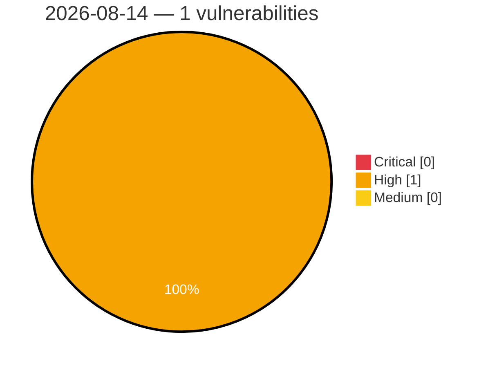

# Critical, High & Medium Severity Vulnerabilities — 2026-08-14

**Source status for this day:**

| Source | Critical | High | Medium | Total |
|--------|---------:|-----:|-------:|------:|
| cvefeed.io (High/Critical) | 0 | 1 | 0 | 1 |

**KEV (actively exploited):** 0  **Watchlist matches:** 1

## High (1)

| CVSS | Flags | Source | CVE / Title | Reported |
|------|-------|--------|-------------|----------|
| 8.3 | ⭐ | cvefeed.io (High/Critical) | [CVE-2026-19771 - Baicells EG3661M LuCI Web luci os command injection](https://cvefeed.io/vuln/detail/CVE-2026-19771) | 1 hour, 42 minutes ago |
