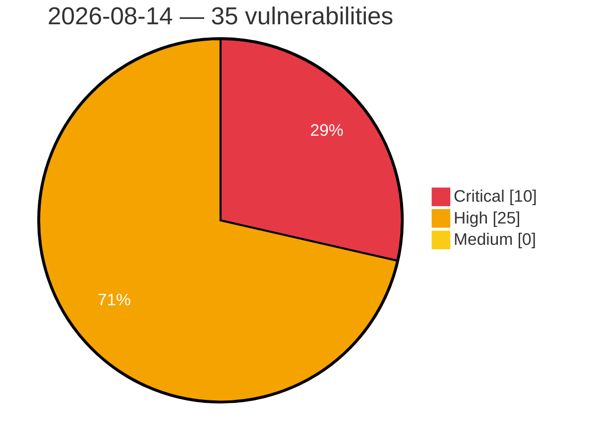

# Critical, High & Medium Severity Vulnerabilities — 2026-08-14

**Source status for this day:**

| Source | Critical | High | Medium | Total |
|--------|---------:|-----:|-------:|------:|
| cvefeed.io (High/Critical) | 10 | 25 | 0 | 35 |

**KEV (actively exploited):** 0  **Watchlist matches:** 20

## Critical (10)

| CVSS | Flags | Source | CVE / Title | Reported |
|------|-------|--------|-------------|----------|
| 10.0 | ⭐ | cvefeed.io (High/Critical) | [CVE-2026-72811 - SiYuan before v3.7.4 SQL Injection via backlink search](https://cvefeed.io/vuln/detail/CVE-2026-72811) | 23 minutes ago |
| 9.8 | ⭐ | cvefeed.io (High/Critical) | [CVE-2026-12949 - Wishlist Member X <= 3.34.1 - Unauthenticated Account Takeover via 'mergewith' Parameter](https://cvefeed.io/vuln/detail/CVE-2026-12949) | 1 hour, 42 minutes ago |
| 9.8 | ⭐ | cvefeed.io (High/Critical) | [CVE-2026-72830 - Grav API Plugin before 1.0.13 RCE via ConfigController scope bypass](https://cvefeed.io/vuln/detail/CVE-2026-72830) | 23 minutes ago |
| 9.8 | ⭐ | cvefeed.io (High/Critical) | [CVE-2026-72829 - Grav before 1.0.13 API Key Scope Bypass via UsersController](https://cvefeed.io/vuln/detail/CVE-2026-72829) | 23 minutes ago |
| 9.8 | ⭐ | cvefeed.io (High/Critical) | [CVE-2026-72826 - Grav before 1.0.13 Scope Bypass via createApiKey](https://cvefeed.io/vuln/detail/CVE-2026-72826) | 23 minutes ago |
| 9.8 | ⭐ | cvefeed.io (High/Critical) | [CVE-2026-72824 - Grav before 1.0.13 API Key Scope Bypass via PagesController](https://cvefeed.io/vuln/detail/CVE-2026-72824) | 23 minutes ago |
| 9.8 | ⭐ | cvefeed.io (High/Critical) | [CVE-2026-72822 - Grav before 1.0.13 Authentication Bypass via disable2fa](https://cvefeed.io/vuln/detail/CVE-2026-72822) | 23 minutes ago |
| 9.3 | ⭐ | cvefeed.io (High/Critical) | [CVE-2026-19871 - Use of hard-coded credentials in Prospero Flow CRM employee onboarding](https://cvefeed.io/vuln/detail/CVE-2026-19871) | 15 minutes ago |
| 9.2 | ⭐ | cvefeed.io (High/Critical) | [CVE-2026-72836 - FileBrowser before 2.63.19 Case Sensitivity Authentication Bypass](https://cvefeed.io/vuln/detail/CVE-2026-72836) | 23 minutes ago |
| 9.2 | — | cvefeed.io (High/Critical) | [CVE-2026-72810 - SiYuan before v3.7.4 Publish-Boundary Bypass via WebSocket](https://cvefeed.io/vuln/detail/CVE-2026-72810) | 23 minutes ago |

## High (25)

| CVSS | Flags | Source | CVE / Title | Reported |
|------|-------|--------|-------------|----------|
| 9.0 | — | cvefeed.io (High/Critical) | [CVE-2026-19792 - Tenda G0 httpd web management interface module setPortMapping buffer overflow](https://cvefeed.io/vuln/detail/CVE-2026-19792) | 38 minutes ago |
| 9.0 | — | cvefeed.io (High/Critical) | [CVE-2026-19791 - Tenda G0 httpd web management interface module addStaticRoute stack-based overflow](https://cvefeed.io/vuln/detail/CVE-2026-19791) | 38 minutes ago |
| 9.0 | — | cvefeed.io (High/Critical) | [CVE-2026-19790 - Tenda G0 httpd Web Management module formSetPortMirror stack-based overflow](https://cvefeed.io/vuln/detail/CVE-2026-19790) | 1 hour, 38 minutes ago |
| 9.0 | — | cvefeed.io (High/Critical) | [CVE-2026-19789 - Tenda AC1206 httpd web management interface WifiGuestSet set_wl_guest_iplist stack-based overflow](https://cvefeed.io/vuln/detail/CVE-2026-19789) | 1 hour, 38 minutes ago |
| 9.0 | — | cvefeed.io (High/Critical) | [CVE-2026-19788 - Tenda AC1206 httpd web management interface SetOnlineDevName set_device_name stack-based overflow](https://cvefeed.io/vuln/detail/CVE-2026-19788) | 1 hour, 38 minutes ago |
| 9.0 | — | cvefeed.io (High/Critical) | [CVE-2026-19811 - TOTOLINK A800R firewall.so cstecgi.cgi setIpQosRules stack-based overflow](https://cvefeed.io/vuln/detail/CVE-2026-19811) | 42 minutes ago |
| 9.0 | — | cvefeed.io (High/Critical) | [CVE-2026-19815 - TOTOLINK A800R firewall.so cstecgi.cgi setParentalRules stack-based overflow](https://cvefeed.io/vuln/detail/CVE-2026-19815) | 1 hour, 20 minutes ago |
| 9.0 | — | cvefeed.io (High/Critical) | [CVE-2026-19814 - TOTOLINK A800R firewall.so cstecgi.cgi setMacQos stack-based overflow](https://cvefeed.io/vuln/detail/CVE-2026-19814) | 1 hour, 20 minutes ago |
| 9.0 | — | cvefeed.io (High/Critical) | [CVE-2026-19813 - TOTOLINK A800R firewall.so cstecgi.cgi setMacFilterRules stack-based overflow](https://cvefeed.io/vuln/detail/CVE-2026-19813) | 2 hours, 19 minutes ago |
| 9.0 | — | cvefeed.io (High/Critical) | [CVE-2026-19812 - TOTOLINK A800R product.so cstecgi.cgi UploadCustomModule stack-based overflow](https://cvefeed.io/vuln/detail/CVE-2026-19812) | 2 hours, 19 minutes ago |
| 9.0 | — | cvefeed.io (High/Critical) | [CVE-2026-19821 - Tenda AC12 httpd web management interface SetSysAutoRebbotCfg formSetRebootTimer buffer overflow](https://cvefeed.io/vuln/detail/CVE-2026-19821) | 42 minutes ago |
| 9.0 | — | cvefeed.io (High/Critical) | [CVE-2026-19822 - Tenda W20E QoS Edit editQos lstAdd stack-based overflow](https://cvefeed.io/vuln/detail/CVE-2026-19822) | 30 minutes ago |
| 9.0 | — | cvefeed.io (High/Critical) | [CVE-2026-19824 - Tenda W20E addIpMacBind ipMacBindListStore stack-based overflow](https://cvefeed.io/vuln/detail/CVE-2026-19824) | 58 minutes ago |
| 9.0 | — | cvefeed.io (High/Critical) | [CVE-2026-19823 - Tenda W20E QoS Rule Deletion delQos formQOSRuleDel stack-based overflow](https://cvefeed.io/vuln/detail/CVE-2026-19823) | 58 minutes ago |
| 8.8 | ⭐ | cvefeed.io (High/Critical) | [CVE-2026-72837 - File Browser before 2.63.20 Privilege Escalation via Proxy Authentication](https://cvefeed.io/vuln/detail/CVE-2026-72837) | 23 minutes ago |
| 8.8 | ⭐ | cvefeed.io (High/Critical) | [CVE-2026-72833 - Grav 1.0.6 through 1.0.11 Privilege Escalation via Scoped API Keys](https://cvefeed.io/vuln/detail/CVE-2026-72833) | 23 minutes ago |
| 8.8 | ⭐ | cvefeed.io (High/Critical) | [CVE-2026-72831 - Grav through 2.0.11 Authentication Bypass via Flex Objects](https://cvefeed.io/vuln/detail/CVE-2026-72831) | 23 minutes ago |
| 8.8 | ⭐ | cvefeed.io (High/Critical) | [CVE-2026-72827 - Grav CMS before 2.0.13 Remote Code Execution via Twig](https://cvefeed.io/vuln/detail/CVE-2026-72827) | 23 minutes ago |
| 8.8 | ⭐ | cvefeed.io (High/Critical) | [CVE-2026-72819 - Grav CMS before 2.0.13 Remote Code Execution via ZIP Upload](https://cvefeed.io/vuln/detail/CVE-2026-72819) | 23 minutes ago |
| 8.8 | ⭐ | cvefeed.io (High/Critical) | [CVE-2026-73673 - Netis NC63 V3.0.0.3327 Unauthenticated Firmware Update with Missing Cryptographic Firmware Authentication](https://cvefeed.io/vuln/detail/CVE-2026-73673) | 25 minutes ago |
| 8.6 | ⭐ | cvefeed.io (High/Critical) | [CVE-2026-72828 - Grav before 1.0.13 API Key Scope Bypass via InvitationsController](https://cvefeed.io/vuln/detail/CVE-2026-72828) | 23 minutes ago |
| 8.6 | ⭐ | cvefeed.io (High/Critical) | [CVE-2026-19870 - IDOR in Prospero Flow CRM allows cross-tenant payroll disclosure and creation](https://cvefeed.io/vuln/detail/CVE-2026-19870) | 38 minutes ago |
| 8.3 | ⭐ | cvefeed.io (High/Critical) | [CVE-2026-19771 - Baicells EG3661M LuCI Web luci os command injection](https://cvefeed.io/vuln/detail/CVE-2026-19771) | 1 hour, 42 minutes ago |
| 8.3 | ⭐ | cvefeed.io (High/Critical) | [CVE-2026-72859 - Budibase 3.39.4 before 3.40.0 Authorization Regression via S3 Presigned URL](https://cvefeed.io/vuln/detail/CVE-2026-72859) | 23 minutes ago |
| 8.3 | ⭐ | cvefeed.io (High/Critical) | [CVE-2026-69101 - Datavane TIS v5.0.0 XXE Injection via doEditWorkflow Endpoint](https://cvefeed.io/vuln/detail/CVE-2026-69101) | 13 minutes ago |
