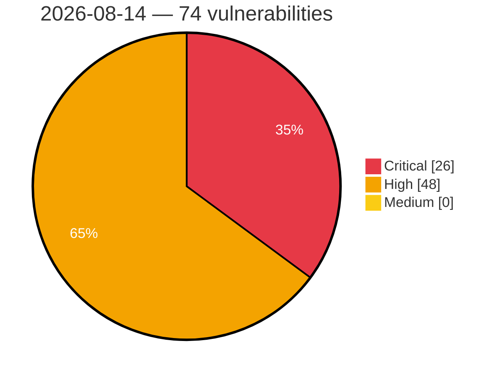

# Critical, High & Medium Severity Vulnerabilities — 2026-08-14

**Source status for this day:**

| Source | Critical | High | Medium | Total |
|--------|---------:|-----:|-------:|------:|
| cvefeed.io (High/Critical) | 26 | 48 | 0 | 74 |

**KEV (actively exploited):** 0  **Watchlist matches:** 47

## Critical (26)

| CVSS | Flags | Source | CVE / Title | Reported |
|------|-------|--------|-------------|----------|
| 10.0 | ⭐ | cvefeed.io (High/Critical) | [CVE-2026-72811 - SiYuan before v3.7.4 SQL Injection via backlink search](https://cvefeed.io/vuln/detail/CVE-2026-72811) | 23 minutes ago |
| 10.0 | ⭐ | cvefeed.io (High/Critical) | [CVE-2026-19188 - Haiwell IoT Cloud HMI Gateway OS Command Injection](https://cvefeed.io/vuln/detail/CVE-2026-19188) | 29 minutes ago |
| 10.0 | ⭐ | cvefeed.io (High/Critical) | [CVE-2026-73678 - MindsDB Minds Platform v26.1.0 Unauthenticated RCE via scratchpad exec()](https://cvefeed.io/vuln/detail/CVE-2026-73678) | 1 hour, 28 minutes ago |
| 10.0 | ⭐ | cvefeed.io (High/Critical) | [CVE-2025-7639 - AVEVA Enterprise SCADA Deserialization of Untrusted Data](https://cvefeed.io/vuln/detail/CVE-2025-7639) | 1 hour, 29 minutes ago |
| 9.9 | ⭐ | cvefeed.io (High/Critical) | [CVE-2026-19682 - Command Injection](https://cvefeed.io/vuln/detail/CVE-2026-19682) | 32 minutes ago |
| 9.9 | ⭐ | cvefeed.io (High/Critical) | [CVE-2026-19681 - Command Injection](https://cvefeed.io/vuln/detail/CVE-2026-19681) | 32 minutes ago |
| 9.9 | ⭐ | cvefeed.io (High/Critical) | [CVE-2026-19626 - Remote Code Execution](https://cvefeed.io/vuln/detail/CVE-2026-19626) | 1 hour, 32 minutes ago |
| 9.9 | — | cvefeed.io (High/Critical) | [CVE-2026-17186 - IBM Db2 Mirror for i is affected by multiple vulnerabilities](https://cvefeed.io/vuln/detail/CVE-2026-17186) | 30 minutes ago |
| 9.8 | ⭐ | cvefeed.io (High/Critical) | [CVE-2026-12949 - Wishlist Member X <= 3.34.1 - Unauthenticated Account Takeover via 'mergewith' Parameter](https://cvefeed.io/vuln/detail/CVE-2026-12949) | 1 hour, 42 minutes ago |
| 9.8 | ⭐ | cvefeed.io (High/Critical) | [CVE-2026-72830 - Grav API Plugin before 1.0.13 RCE via ConfigController scope bypass](https://cvefeed.io/vuln/detail/CVE-2026-72830) | 23 minutes ago |
| 9.8 | ⭐ | cvefeed.io (High/Critical) | [CVE-2026-72829 - Grav before 1.0.13 API Key Scope Bypass via UsersController](https://cvefeed.io/vuln/detail/CVE-2026-72829) | 23 minutes ago |
| 9.8 | ⭐ | cvefeed.io (High/Critical) | [CVE-2026-72826 - Grav before 1.0.13 Scope Bypass via createApiKey](https://cvefeed.io/vuln/detail/CVE-2026-72826) | 23 minutes ago |
| 9.8 | ⭐ | cvefeed.io (High/Critical) | [CVE-2026-72824 - Grav before 1.0.13 API Key Scope Bypass via PagesController](https://cvefeed.io/vuln/detail/CVE-2026-72824) | 23 minutes ago |
| 9.8 | ⭐ | cvefeed.io (High/Critical) | [CVE-2026-72822 - Grav before 1.0.13 Authentication Bypass via disable2fa](https://cvefeed.io/vuln/detail/CVE-2026-72822) | 23 minutes ago |
| 9.8 | ⭐ | cvefeed.io (High/Critical) | [CVE-2026-73849 - emlog allows unauthenticated reinstallation via `install.php?action=reinstall`.](https://cvefeed.io/vuln/detail/CVE-2026-73849) | 31 minutes ago |
| 9.8 | ⭐ | cvefeed.io (High/Critical) | [CVE-2026-48528 - Metacat has an unauthenticated SQL injection vulnerability](https://cvefeed.io/vuln/detail/CVE-2026-48528) | 32 minutes ago |
| 9.8 | — | cvefeed.io (High/Critical) | [CVE-2026-17184 - IBM Db2 Mirror for i is affected by multiple vulnerabilities](https://cvefeed.io/vuln/detail/CVE-2026-17184) | 30 minutes ago |
| 9.8 | — | cvefeed.io (High/Critical) | [CVE-2026-17182 - IBM Db2 Mirror for i is affected by multiple vulnerabilities](https://cvefeed.io/vuln/detail/CVE-2026-17182) | 30 minutes ago |
| 9.8 | ⭐ | cvefeed.io (High/Critical) | [CVE-2026-50027 - mcp-memory-service: Missing Authentication on Document API Endpoints Allows Unauthenticated Memory Read/Write/Delete](https://cvefeed.io/vuln/detail/CVE-2026-50027) | 1 hour, 29 minutes ago |
| 9.3 | ⭐ | cvefeed.io (High/Critical) | [CVE-2026-19871 - Use of hard-coded credentials in Prospero Flow CRM employee onboarding](https://cvefeed.io/vuln/detail/CVE-2026-19871) | 15 minutes ago |
| 9.3 | ⭐ | cvefeed.io (High/Critical) | [CVE-2026-17181 - IBM Db2 Mirror for i is affected by multiple vulnerabilities](https://cvefeed.io/vuln/detail/CVE-2026-17181) | 30 minutes ago |
| 9.2 | ⭐ | cvefeed.io (High/Critical) | [CVE-2026-72836 - FileBrowser before 2.63.19 Case Sensitivity Authentication Bypass](https://cvefeed.io/vuln/detail/CVE-2026-72836) | 23 minutes ago |
| 9.2 | — | cvefeed.io (High/Critical) | [CVE-2026-72810 - SiYuan before v3.7.4 Publish-Boundary Bypass via WebSocket](https://cvefeed.io/vuln/detail/CVE-2026-72810) | 23 minutes ago |
| 9.2 | ⭐ | cvefeed.io (High/Critical) | [CVE-2026-67365 - Joomla Extension - icagenda.com - Unauthenticated SQL injection in iCagenda < 4.0.0-4.0.11](https://cvefeed.io/vuln/detail/CVE-2026-67365) | 30 minutes ago |
| 9.2 | ⭐ | cvefeed.io (High/Critical) | [CVE-2026-73683 - Laravel Socialite Facebook Provider Authentication Bypass via Nonce Replay](https://cvefeed.io/vuln/detail/CVE-2026-73683) | 26 minutes ago |
| 9.1 | — | cvefeed.io (High/Critical) | [CVE-2026-49457 - QUIC has Broken TLS verification](https://cvefeed.io/vuln/detail/CVE-2026-49457) | 1 hour, 29 minutes ago |

## High (48)

| CVSS | Flags | Source | CVE / Title | Reported |
|------|-------|--------|-------------|----------|
| 9.0 | — | cvefeed.io (High/Critical) | [CVE-2026-19792 - Tenda G0 httpd web management interface module setPortMapping buffer overflow](https://cvefeed.io/vuln/detail/CVE-2026-19792) | 38 minutes ago |
| 9.0 | — | cvefeed.io (High/Critical) | [CVE-2026-19791 - Tenda G0 httpd web management interface module addStaticRoute stack-based overflow](https://cvefeed.io/vuln/detail/CVE-2026-19791) | 38 minutes ago |
| 9.0 | — | cvefeed.io (High/Critical) | [CVE-2026-19790 - Tenda G0 httpd Web Management module formSetPortMirror stack-based overflow](https://cvefeed.io/vuln/detail/CVE-2026-19790) | 1 hour, 38 minutes ago |
| 9.0 | — | cvefeed.io (High/Critical) | [CVE-2026-19789 - Tenda AC1206 httpd web management interface WifiGuestSet set_wl_guest_iplist stack-based overflow](https://cvefeed.io/vuln/detail/CVE-2026-19789) | 1 hour, 38 minutes ago |
| 9.0 | — | cvefeed.io (High/Critical) | [CVE-2026-19788 - Tenda AC1206 httpd web management interface SetOnlineDevName set_device_name stack-based overflow](https://cvefeed.io/vuln/detail/CVE-2026-19788) | 1 hour, 38 minutes ago |
| 9.0 | — | cvefeed.io (High/Critical) | [CVE-2026-19811 - TOTOLINK A800R firewall.so cstecgi.cgi setIpQosRules stack-based overflow](https://cvefeed.io/vuln/detail/CVE-2026-19811) | 42 minutes ago |
| 9.0 | — | cvefeed.io (High/Critical) | [CVE-2026-19815 - TOTOLINK A800R firewall.so cstecgi.cgi setParentalRules stack-based overflow](https://cvefeed.io/vuln/detail/CVE-2026-19815) | 1 hour, 20 minutes ago |
| 9.0 | — | cvefeed.io (High/Critical) | [CVE-2026-19814 - TOTOLINK A800R firewall.so cstecgi.cgi setMacQos stack-based overflow](https://cvefeed.io/vuln/detail/CVE-2026-19814) | 1 hour, 20 minutes ago |
| 9.0 | — | cvefeed.io (High/Critical) | [CVE-2026-19813 - TOTOLINK A800R firewall.so cstecgi.cgi setMacFilterRules stack-based overflow](https://cvefeed.io/vuln/detail/CVE-2026-19813) | 2 hours, 19 minutes ago |
| 9.0 | — | cvefeed.io (High/Critical) | [CVE-2026-19812 - TOTOLINK A800R product.so cstecgi.cgi UploadCustomModule stack-based overflow](https://cvefeed.io/vuln/detail/CVE-2026-19812) | 2 hours, 19 minutes ago |
| 9.0 | — | cvefeed.io (High/Critical) | [CVE-2026-19821 - Tenda AC12 httpd web management interface SetSysAutoRebbotCfg formSetRebootTimer buffer overflow](https://cvefeed.io/vuln/detail/CVE-2026-19821) | 42 minutes ago |
| 9.0 | — | cvefeed.io (High/Critical) | [CVE-2026-19822 - Tenda W20E QoS Edit editQos lstAdd stack-based overflow](https://cvefeed.io/vuln/detail/CVE-2026-19822) | 30 minutes ago |
| 9.0 | — | cvefeed.io (High/Critical) | [CVE-2026-19824 - Tenda W20E addIpMacBind ipMacBindListStore stack-based overflow](https://cvefeed.io/vuln/detail/CVE-2026-19824) | 58 minutes ago |
| 9.0 | — | cvefeed.io (High/Critical) | [CVE-2026-19823 - Tenda W20E QoS Rule Deletion delQos formQOSRuleDel stack-based overflow](https://cvefeed.io/vuln/detail/CVE-2026-19823) | 58 minutes ago |
| 9.0 | — | cvefeed.io (High/Critical) | [CVE-2026-19847 - TOTOLINK A800R wps.so cstecgi.cgi setWiFiWpsConfig stack-based overflow](https://cvefeed.io/vuln/detail/CVE-2026-19847) | 32 minutes ago |
| 9.0 | — | cvefeed.io (High/Critical) | [CVE-2026-19846 - TOTOLINK A800R firewall.so cstecgi.cgi setUrlFilterRules stack-based overflow](https://cvefeed.io/vuln/detail/CVE-2026-19846) | 32 minutes ago |
| 9.0 | — | cvefeed.io (High/Critical) | [CVE-2026-19845 - TOTOLINK A800R lan.so cstecgi.cgi setStaticDhcpConfig stack-based overflow](https://cvefeed.io/vuln/detail/CVE-2026-19845) | 1 hour, 32 minutes ago |
| 9.0 | — | cvefeed.io (High/Critical) | [CVE-2026-19844 - TOTOLINK A800R ipv6.so cstecgi.cgi setRadvdCfg stack-based overflow](https://cvefeed.io/vuln/detail/CVE-2026-19844) | 1 hour, 32 minutes ago |
| 8.8 | ⭐ | cvefeed.io (High/Critical) | [CVE-2026-72837 - File Browser before 2.63.20 Privilege Escalation via Proxy Authentication](https://cvefeed.io/vuln/detail/CVE-2026-72837) | 23 minutes ago |
| 8.8 | ⭐ | cvefeed.io (High/Critical) | [CVE-2026-72833 - Grav 1.0.6 through 1.0.11 Privilege Escalation via Scoped API Keys](https://cvefeed.io/vuln/detail/CVE-2026-72833) | 23 minutes ago |
| 8.8 | ⭐ | cvefeed.io (High/Critical) | [CVE-2026-72831 - Grav through 2.0.11 Authentication Bypass via Flex Objects](https://cvefeed.io/vuln/detail/CVE-2026-72831) | 23 minutes ago |
| 8.8 | ⭐ | cvefeed.io (High/Critical) | [CVE-2026-72827 - Grav CMS before 2.0.13 Remote Code Execution via Twig](https://cvefeed.io/vuln/detail/CVE-2026-72827) | 23 minutes ago |
| 8.8 | ⭐ | cvefeed.io (High/Critical) | [CVE-2026-72819 - Grav CMS before 2.0.13 Remote Code Execution via ZIP Upload](https://cvefeed.io/vuln/detail/CVE-2026-72819) | 23 minutes ago |
| 8.8 | ⭐ | cvefeed.io (High/Critical) | [CVE-2026-73673 - Netis NC63 V3.0.0.3327 Unauthenticated Firmware Update with Missing Cryptographic Firmware Authentication](https://cvefeed.io/vuln/detail/CVE-2026-73673) | 25 minutes ago |
| 8.8 | ⭐ | cvefeed.io (High/Critical) | [CVE-2026-19679 - Improper Input Validation](https://cvefeed.io/vuln/detail/CVE-2026-19679) | 32 minutes ago |
| 8.8 | ⭐ | cvefeed.io (High/Critical) | [CVE-2026-19635 - Local Privilege Escalation](https://cvefeed.io/vuln/detail/CVE-2026-19635) | 32 minutes ago |
| 8.8 | ⭐ | cvefeed.io (High/Critical) | [CVE-2026-12366 - Use-after-free freeing an armed dynamically-allocated k_timer in Zephyr userspace object disposal](https://cvefeed.io/vuln/detail/CVE-2026-12366) | 33 minutes ago |
| 8.8 | ⭐ | cvefeed.io (High/Critical) | [CVE-2026-73680 - Cockpit CMS 2.14.0 Authenticated Command Injection via FFmpeg Filename](https://cvefeed.io/vuln/detail/CVE-2026-73680) | 30 minutes ago |
| 8.8 | — | cvefeed.io (High/Critical) | [CVE-2026-16879 - IBM Db2 Mirror for i is affected by multiple vulnerabilities](https://cvefeed.io/vuln/detail/CVE-2026-16879) | 30 minutes ago |
| 8.8 | ⭐ | cvefeed.io (High/Critical) | [CVE-2026-73682 - Semaphore prior to version 2.18.20 OS Command Injection via git_url Repository Handling](https://cvefeed.io/vuln/detail/CVE-2026-73682) | 41 minutes ago |
| 8.6 | ⭐ | cvefeed.io (High/Critical) | [CVE-2026-72828 - Grav before 1.0.13 API Key Scope Bypass via InvitationsController](https://cvefeed.io/vuln/detail/CVE-2026-72828) | 23 minutes ago |
| 8.6 | ⭐ | cvefeed.io (High/Critical) | [CVE-2026-19870 - IDOR in Prospero Flow CRM allows cross-tenant payroll disclosure and creation](https://cvefeed.io/vuln/detail/CVE-2026-19870) | 38 minutes ago |
| 8.6 | ⭐ | cvefeed.io (High/Critical) | [CVE-2026-73850 - Emlog: Arbitrary SQL Execution Vulnerability in ai.php within queryDatabase() Function](https://cvefeed.io/vuln/detail/CVE-2026-73850) | 31 minutes ago |
| 8.6 | ⭐ | cvefeed.io (High/Critical) | [CVE-2026-19629 - Privilege Escalation](https://cvefeed.io/vuln/detail/CVE-2026-19629) | 33 minutes ago |
| 8.6 | ⭐ | cvefeed.io (High/Critical) | [CVE-2026-19628 - Remote Code Execution](https://cvefeed.io/vuln/detail/CVE-2026-19628) | 1 hour, 32 minutes ago |
| 8.6 | ⭐ | cvefeed.io (High/Critical) | [CVE-2026-71571 - Joomla Extension - icagenda.com - Authenticated SQL injection via unescaped numeric filter in iCagenda < 2.0.0-4.0.11](https://cvefeed.io/vuln/detail/CVE-2026-71571) | 30 minutes ago |
| 8.6 | ⭐ | cvefeed.io (High/Critical) | [CVE-2026-73679 - ImpressCMS Authenticated RCE via PHP Custom Tag eval()](https://cvefeed.io/vuln/detail/CVE-2026-73679) | 1 hour, 28 minutes ago |
| 8.5 | ⭐ | cvefeed.io (High/Critical) | [CVE-2026-63361 - LimeSurvey Community Edition 7.0.5+260623 - Reflected XSS in HTML editor popup](https://cvefeed.io/vuln/detail/CVE-2026-63361) | 31 minutes ago |
| 8.5 | ⭐ | cvefeed.io (High/Critical) | [CVE-2026-17179 - IBM Db2 Mirror for i is affected by multiple vulnerabilities](https://cvefeed.io/vuln/detail/CVE-2026-17179) | 30 minutes ago |
| 8.4 | ⭐ | cvefeed.io (High/Critical) | [CVE-2026-19884 - Eclipse Theia Git Extension Arbitrary Command Execution Vulnerability](https://cvefeed.io/vuln/detail/CVE-2026-19884) | 26 minutes ago |
| 8.4 | ⭐ | cvefeed.io (High/Critical) | [CVE-2026-12364 - Missing user-space pointer validation in logging syscall z_log_msg_static_create allows kernel memory disclosure and denial of service](https://cvefeed.io/vuln/detail/CVE-2026-12364) | 33 minutes ago |
| 8.3 | ⭐ | cvefeed.io (High/Critical) | [CVE-2026-19771 - Baicells EG3661M LuCI Web luci os command injection](https://cvefeed.io/vuln/detail/CVE-2026-19771) | 1 hour, 42 minutes ago |
| 8.3 | ⭐ | cvefeed.io (High/Critical) | [CVE-2026-72859 - Budibase 3.39.4 before 3.40.0 Authorization Regression via S3 Presigned URL](https://cvefeed.io/vuln/detail/CVE-2026-72859) | 23 minutes ago |
| 8.3 | ⭐ | cvefeed.io (High/Critical) | [CVE-2026-69101 - Datavane TIS v5.0.0 XXE Injection via doEditWorkflow Endpoint](https://cvefeed.io/vuln/detail/CVE-2026-69101) | 13 minutes ago |
| 8.3 | ⭐ | cvefeed.io (High/Critical) | [CVE-2026-72970 - Microsoft Edge (Chromium-based) Remote Code Execution Vulnerability](https://cvefeed.io/vuln/detail/CVE-2026-72970) | 31 minutes ago |
| 8.3 | — | cvefeed.io (High/Critical) | [CVE-2026-16708 - IBM Db2 Mirror for i is affected by multiple vulnerabilities](https://cvefeed.io/vuln/detail/CVE-2026-16708) | 30 minutes ago |
| 8.2 | — | cvefeed.io (High/Critical) | [CVE-2026-17081 - IBM Db2 Mirror for i is affected by multiple vulnerabilities](https://cvefeed.io/vuln/detail/CVE-2026-17081) | 30 minutes ago |
| 8.1 | — | cvefeed.io (High/Critical) | [CVE-2026-19768 - Devolutions PowerShell Universal Code Injection Vulnerability](https://cvefeed.io/vuln/detail/CVE-2026-19768) | 1 hour, 42 minutes ago |
