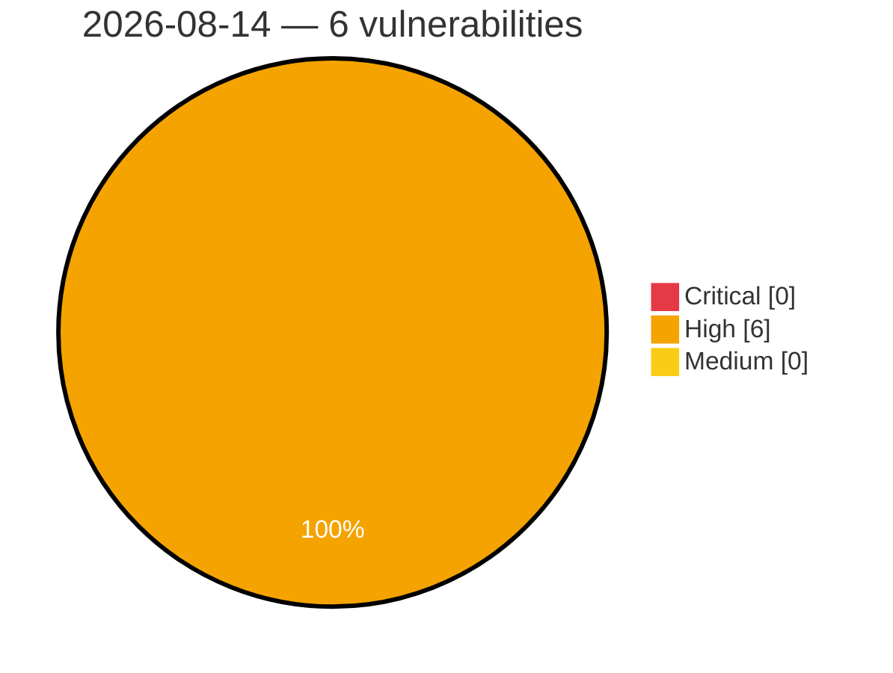

# Critical, High & Medium Severity Vulnerabilities — 2026-08-14

**Source status for this day:**

| Source | Critical | High | Medium | Total |
|--------|---------:|-----:|-------:|------:|
| cvefeed.io (High/Critical) | 0 | 6 | 0 | 6 |

**KEV (actively exploited):** 0  **Watchlist matches:** 1

## High (6)

| CVSS | Flags | Source | CVE / Title | Reported |
|------|-------|--------|-------------|----------|
| 9.0 | — | cvefeed.io (High/Critical) | [CVE-2026-19792 - Tenda G0 httpd web management interface module setPortMapping buffer overflow](https://cvefeed.io/vuln/detail/CVE-2026-19792) | 38 minutes ago |
| 9.0 | — | cvefeed.io (High/Critical) | [CVE-2026-19791 - Tenda G0 httpd web management interface module addStaticRoute stack-based overflow](https://cvefeed.io/vuln/detail/CVE-2026-19791) | 38 minutes ago |
| 9.0 | — | cvefeed.io (High/Critical) | [CVE-2026-19790 - Tenda G0 httpd Web Management module formSetPortMirror stack-based overflow](https://cvefeed.io/vuln/detail/CVE-2026-19790) | 1 hour, 38 minutes ago |
| 9.0 | — | cvefeed.io (High/Critical) | [CVE-2026-19789 - Tenda AC1206 httpd web management interface WifiGuestSet set_wl_guest_iplist stack-based overflow](https://cvefeed.io/vuln/detail/CVE-2026-19789) | 1 hour, 38 minutes ago |
| 9.0 | — | cvefeed.io (High/Critical) | [CVE-2026-19788 - Tenda AC1206 httpd web management interface SetOnlineDevName set_device_name stack-based overflow](https://cvefeed.io/vuln/detail/CVE-2026-19788) | 1 hour, 38 minutes ago |
| 8.3 | ⭐ | cvefeed.io (High/Critical) | [CVE-2026-19771 - Baicells EG3661M LuCI Web luci os command injection](https://cvefeed.io/vuln/detail/CVE-2026-19771) | 1 hour, 42 minutes ago |
