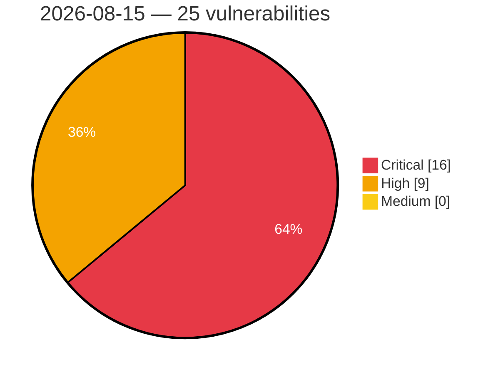

# Critical, High & Medium Severity Vulnerabilities — 2026-08-15

**Source status for this day:**

| Source | Critical | High | Medium | Total |
|--------|---------:|-----:|-------:|------:|
| cvefeed.io (High/Critical) | 16 | 9 | 0 | 25 |

**KEV (actively exploited):** 0  **Watchlist matches:** 21

## Critical (16)

| CVSS | Flags | Source | CVE / Title | Reported |
|------|-------|--------|-------------|----------|
| 10.0 | ⭐ | cvefeed.io (High/Critical) | [CVE-2026-74764 - Path Traversal in TAR Archive Extraction Allows Arbitrary File Write in Pandora](https://cvefeed.io/vuln/detail/CVE-2026-74764) | 3 hours, 59 minutes ago |
| 9.8 | ⭐ | cvefeed.io (High/Critical) | [CVE-2026-15341 - User Session Synchronizer <= 1.4.0 - Unauthenticated Authentication Bypass to Account Takeover via 'ussync-key', 'ussync-token', and 'ussync-ref' Parameters](https://cvefeed.io/vuln/detail/CVE-2026-15341) | 42 minutes ago |
| 9.8 | ⭐ | cvefeed.io (High/Critical) | [CVE-2026-15303 - 6Storage Rentals <= 2.27.0 - Unauthenticated Account Takeover via 'email' Parameter](https://cvefeed.io/vuln/detail/CVE-2026-15303) | 42 minutes ago |
| 9.8 | ⭐ | cvefeed.io (High/Critical) | [CVE-2026-15826 - User Profile Builder <= 3.16.4 - Unauthenticated Authentication Bypass via Type Confusion to Administrator Account Takeover via 'username' Parameter](https://cvefeed.io/vuln/detail/CVE-2026-15826) | 42 minutes ago |
| 9.8 | — | cvefeed.io (High/Critical) | [CVE-2026-16142 - TrueBooker <= 1.2.6 - Unauthenticated Account Takeover via Insecure Direct Object Reference in 'truebooker_wp_user_id' Parameter](https://cvefeed.io/vuln/detail/CVE-2026-16142) | 40 minutes ago |
| 9.8 | ⭐ | cvefeed.io (High/Critical) | [CVE-2026-19598 - Pods <= 3.3.9 - Unauthenticated Privilege Escalation via Authorization Bypass to Admin Methods via 'pods_admin' AJAX Router](https://cvefeed.io/vuln/detail/CVE-2026-19598) | 4 hours, 22 minutes ago |
| 9.8 | ⭐ | cvefeed.io (High/Critical) | [CVE-2026-73046 - SiYuan before v3.7.4 Authentication Bypass via HTTP Basic Auth](https://cvefeed.io/vuln/detail/CVE-2026-73046) | 3 hours, 59 minutes ago |
| 9.1 | ⭐ | cvefeed.io (High/Critical) | [CVE-2026-14484 - RapiSafe <= 1.0.4 - Unauthenticated Arbitrary File Deletion via 'rsmfcf7_session' and 'file_name' Parameters](https://cvefeed.io/vuln/detail/CVE-2026-14484) | 42 minutes ago |
| 9.1 | ⭐ | cvefeed.io (High/Critical) | [CVE-2026-18855 - The Link Library plugin for WordPress is vulnerabl](https://cvefeed.io/vuln/detail/CVE-2026-18855) | 1 hour, 35 minutes ago |
| 9.0 | ⭐ | cvefeed.io (High/Critical) | [CVE-2026-73053 - SiYuan before v3.7.4 Cross-Site Scripting via unicode2Emoji](https://cvefeed.io/vuln/detail/CVE-2026-73053) | 3 hours, 59 minutes ago |
| 9.0 | ⭐ | cvefeed.io (High/Critical) | [CVE-2026-73052 - SiYuan before v3.7.4 Stored XSS via Attribute-View Field Names](https://cvefeed.io/vuln/detail/CVE-2026-73052) | 3 hours, 59 minutes ago |
| 9.0 | ⭐ | cvefeed.io (High/Critical) | [CVE-2026-73050 - SiYuan before v3.7.4 Stored XSS via select option color](https://cvefeed.io/vuln/detail/CVE-2026-73050) | 3 hours, 59 minutes ago |
| 9.0 | ⭐ | cvefeed.io (High/Critical) | [CVE-2026-73044 - SiYuan before v3.7.4 Stored Cross-Site Scripting via Column Width](https://cvefeed.io/vuln/detail/CVE-2026-73044) | 4 hours ago |
| 9.0 | ⭐ | cvefeed.io (High/Critical) | [CVE-2026-73043 - SiYuan before v3.7.4 Remote Code Execution via Template Calculation](https://cvefeed.io/vuln/detail/CVE-2026-73043) | 4 hours ago |
| 9.0 | ⭐ | cvefeed.io (High/Critical) | [CVE-2026-73042 - SiYuan before v3.7.4 Remote Code Execution via Menu Metadata](https://cvefeed.io/vuln/detail/CVE-2026-73042) | 4 hours ago |
| 9.0 | ⭐ | cvefeed.io (High/Critical) | [CVE-2026-73041 - SiYuan before v3.7.4 Remote Code Execution via PDF Annotations](https://cvefeed.io/vuln/detail/CVE-2026-73041) | 4 hours ago |

## High (9)

| CVSS | Flags | Source | CVE / Title | Reported |
|------|-------|--------|-------------|----------|
| 8.8 | ⭐ | cvefeed.io (High/Critical) | [CVE-2026-15965 - MaxUpload <= 1.4.0 - Unauthenticated Arbitrary File Upload via 'resumableFilename' Parameter](https://cvefeed.io/vuln/detail/CVE-2026-15965) | 42 minutes ago |
| 8.8 | ⭐ | cvefeed.io (High/Critical) | [CVE-2026-15312 - Propovoice: All-in-One Client Management System <= 1.7.8 - Authenticated (ndpv_manager+) Privilege Escalation via 'role' Parameter](https://cvefeed.io/vuln/detail/CVE-2026-15312) | 42 minutes ago |
| 8.8 | ⭐ | cvefeed.io (High/Critical) | [CVE-2026-15001 - bLoyal: Loyalty & Promotions by bLoyal <= 3.1.611.78 - Authenticated (Subscriber+) Privilege Escalation via Unprotected AJAX API URL Settings](https://cvefeed.io/vuln/detail/CVE-2026-15001) | 42 minutes ago |
| 8.8 | ⭐ | cvefeed.io (High/Critical) | [CVE-2026-14279 - Wholesale Market <= 2.2.2 - Authenticated (Subscriber+) Privilege Escalation via 'role_required' Parameter](https://cvefeed.io/vuln/detail/CVE-2026-14279) | 42 minutes ago |
| 8.8 | ⭐ | cvefeed.io (High/Critical) | [CVE-2026-18438 - Templately <= 3.7.1 - Authenticated (Contributor+) Arbitrary File Upload to Remote Code Execution via Gutenberg Cloud Import Attachment Filename Mismatch](https://cvefeed.io/vuln/detail/CVE-2026-18438) | 1 hour, 42 minutes ago |
| 8.7 | — | cvefeed.io (High/Critical) | [CVE-2026-74767 - Unbounded DAA Decompression in Pandora Allows Denial of Service via Decompression Bomb](https://cvefeed.io/vuln/detail/CVE-2026-74767) | 3 hours, 59 minutes ago |
| 8.2 | — | cvefeed.io (High/Critical) | [CVE-2026-19900 - LB-LINK X-PRO shadow hard-coded credentials](https://cvefeed.io/vuln/detail/CVE-2026-19900) | 1 hour ago |
| 8.2 | — | cvefeed.io (High/Critical) | [CVE-2026-19901 - LB-LINK X-PRO easycwmp hard-coded credentials](https://cvefeed.io/vuln/detail/CVE-2026-19901) | 6 hours, 44 minutes ago |
| 8.1 | ⭐ | cvefeed.io (High/Critical) | [CVE-2026-18500 - @fastify/jwt vulnerable to authorization bypass via global secret overriding the per-request key](https://cvefeed.io/vuln/detail/CVE-2026-18500) | 1 hour, 59 minutes ago |
