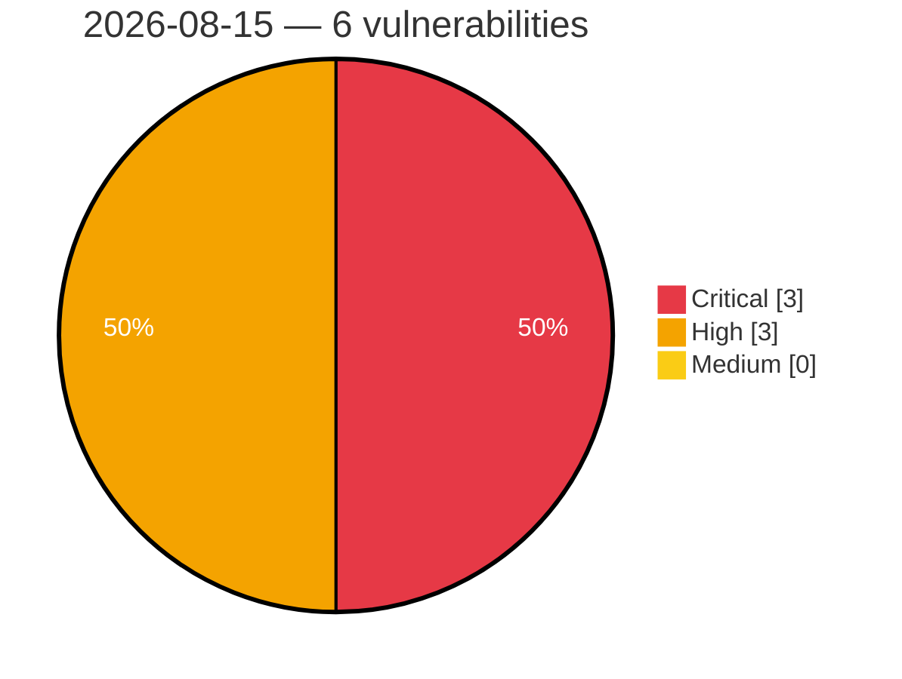

# Critical, High & Medium Severity Vulnerabilities — 2026-08-15

**Source status for this day:**

| Source | Critical | High | Medium | Total |
|--------|---------:|-----:|-------:|------:|
| cvefeed.io (High/Critical) | 3 | 3 | 0 | 6 |

**KEV (actively exploited):** 0  **Watchlist matches:** 6

## Critical (3)

| CVSS | Flags | Source | CVE / Title | Reported |
|------|-------|--------|-------------|----------|
| 9.8 | ⭐ | cvefeed.io (High/Critical) | [CVE-2026-15341 - User Session Synchronizer <= 1.4.0 - Unauthenticated Authentication Bypass to Account Takeover via 'ussync-key', 'ussync-token', and 'ussync-ref' Parameters](https://cvefeed.io/vuln/detail/CVE-2026-15341) | 42 minutes ago |
| 9.8 | ⭐ | cvefeed.io (High/Critical) | [CVE-2026-15303 - 6Storage Rentals <= 2.27.0 - Unauthenticated Account Takeover via 'email' Parameter](https://cvefeed.io/vuln/detail/CVE-2026-15303) | 42 minutes ago |
| 9.1 | ⭐ | cvefeed.io (High/Critical) | [CVE-2026-14484 - RapiSafe <= 1.0.4 - Unauthenticated Arbitrary File Deletion via 'rsmfcf7_session' and 'file_name' Parameters](https://cvefeed.io/vuln/detail/CVE-2026-14484) | 42 minutes ago |

## High (3)

| CVSS | Flags | Source | CVE / Title | Reported |
|------|-------|--------|-------------|----------|
| 8.8 | ⭐ | cvefeed.io (High/Critical) | [CVE-2026-15965 - MaxUpload <= 1.4.0 - Unauthenticated Arbitrary File Upload via 'resumableFilename' Parameter](https://cvefeed.io/vuln/detail/CVE-2026-15965) | 42 minutes ago |
| 8.8 | ⭐ | cvefeed.io (High/Critical) | [CVE-2026-15312 - Propovoice: All-in-One Client Management System <= 1.7.8 - Authenticated (ndpv_manager+) Privilege Escalation via 'role' Parameter](https://cvefeed.io/vuln/detail/CVE-2026-15312) | 42 minutes ago |
| 8.8 | ⭐ | cvefeed.io (High/Critical) | [CVE-2026-15001 - bLoyal: Loyalty & Promotions by bLoyal <= 3.1.611.78 - Authenticated (Subscriber+) Privilege Escalation via Unprotected AJAX API URL Settings](https://cvefeed.io/vuln/detail/CVE-2026-15001) | 42 minutes ago |
