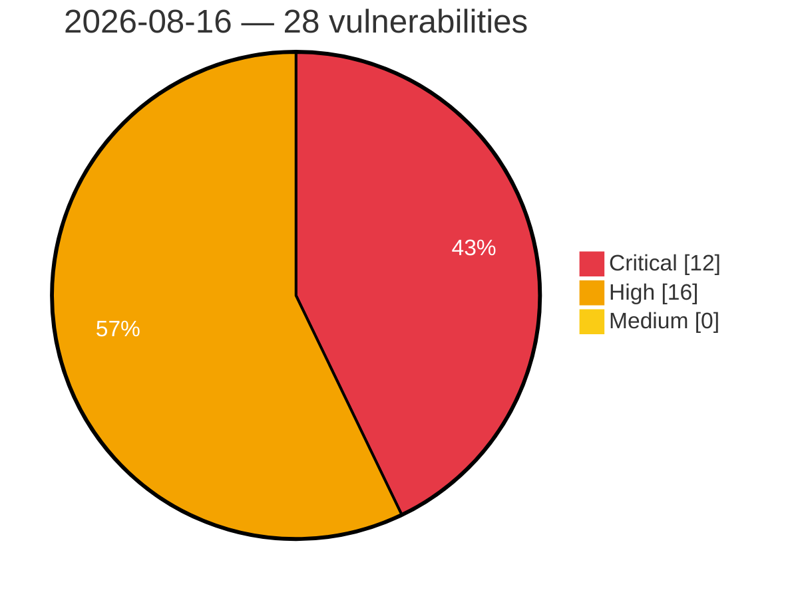

# Critical, High & Medium Severity Vulnerabilities — 2026-08-16

**Source status for this day:**

| Source | Critical | High | Medium | Total |
|--------|---------:|-----:|-------:|------:|
| cvefeed.io (High/Critical) | 12 | 16 | 0 | 28 |

**KEV (actively exploited):** 0  **Watchlist matches:** 14

## Critical (12)

| CVSS | Flags | Source | CVE / Title | Reported |
|------|-------|--------|-------------|----------|
| 9.9 | — | cvefeed.io (High/Critical) | [CVE-2026-19961 - Edimax EW-7478APC formWlSiteSurvey buffer overflow](https://cvefeed.io/vuln/detail/CVE-2026-19961) | 1 hour ago |
| 9.9 | — | cvefeed.io (High/Critical) | [CVE-2026-19959 - Edimax EW-7478APC formWanTcpipSetup stack-based overflow](https://cvefeed.io/vuln/detail/CVE-2026-19959) | 1 hour ago |
| 9.8 | ⭐ | cvefeed.io (High/Critical) | [CVE-2026-18432 - Frontend Admin by DynamiApps <= 3.29.9 - Unauthenticated Privilege Escalation via 'item_id' Parameter](https://cvefeed.io/vuln/detail/CVE-2026-18432) | 42 minutes ago |
| 9.8 | ⭐ | cvefeed.io (High/Critical) | [CVE-2026-16098 - ProSolution WP Client <= 2.0.10 - Unauthenticated Arbitrary File Upload via Content-Disposition Header Filename Override](https://cvefeed.io/vuln/detail/CVE-2026-16098) | 42 minutes ago |
| 9.8 | ⭐ | cvefeed.io (High/Critical) | [CVE-2024-13784 - Contact Form, Survey, Quiz & Popup Form Builder – ARForms <= 1.8.5 - Unauthenticated PHP Object Injection](https://cvefeed.io/vuln/detail/CVE-2024-13784) | 43 minutes ago |
| 9.8 | — | cvefeed.io (High/Critical) | [CVE-2026-73061 - Scriban before 7.2.2 Arbitrary Property Write via TypedObjectAccessor](https://cvefeed.io/vuln/detail/CVE-2026-73061) | 45 minutes ago |
| 9.8 | ⭐ | cvefeed.io (High/Critical) | [CVE-2026-73056 - SiYuan kernel before 3.7.4 Unthrottled Brute-Force via API Token](https://cvefeed.io/vuln/detail/CVE-2026-73056) | 45 minutes ago |
| 9.3 | ⭐ | cvefeed.io (High/Critical) | [CVE-2026-74251 - Joomla Extension - phoca.cz -  Unauthenticated SQL injection via attribute filter in Phoca Cart 5.0.0-6.1.16](https://cvefeed.io/vuln/detail/CVE-2026-74251) | 42 minutes ago |
| 9.3 | — | cvefeed.io (High/Critical) | [CVE-2026-74790 - Scriban before 7.0.0 MemberFilter Bypass via TemplateContext Cache](https://cvefeed.io/vuln/detail/CVE-2026-74790) | 45 minutes ago |
| 9.2 | — | cvefeed.io (High/Critical) | [CVE-2026-74791 - Scriban before 7.0.0 Authorization Bypass via Stale Include Cache](https://cvefeed.io/vuln/detail/CVE-2026-74791) | 45 minutes ago |
| 9.1 | ⭐ | cvefeed.io (High/Critical) | [CVE-2026-14524 - ProSolution WP Client <= 2.0.8 - Unauthenticated Arbitrary File Deletion via 'newfilename' and 'filename' Parameters](https://cvefeed.io/vuln/detail/CVE-2026-14524) | 42 minutes ago |
| 9.1 | — | cvefeed.io (High/Critical) | [CVE-2026-18316 - Solace Extra <= 1.6.0 - Missing Authorization to Unauthenticated Site Content Deletion and Unauthorized Demo Import via action-import-zip AJAX Action](https://cvefeed.io/vuln/detail/CVE-2026-18316) | 24 minutes ago |

## High (16)

| CVSS | Flags | Source | CVE / Title | Reported |
|------|-------|--------|-------------|----------|
| 10.0 | — | cvefeed.io (High/Critical) | [CVE-2026-19924 - Tenda AC10 httpd R7WebsSecurityHandler improper authentication](https://cvefeed.io/vuln/detail/CVE-2026-19924) | 22 minutes ago |
| 8.8 | — | cvefeed.io (High/Critical) | [CVE-2026-17123 - Royal Addons for Elementor <= 1.7.1064 - Authenticated (Contributor+) Server-Side Request Forgery via Form Builder Widget 'webhook_url' Setting](https://cvefeed.io/vuln/detail/CVE-2026-17123) | 42 minutes ago |
| 8.8 | ⭐ | cvefeed.io (High/Critical) | [CVE-2026-16099 - Podlove Podcast Publisher <= 4.5.3 - Authenticated (Contributor+) PHP Object Injection to Arbitrary File Deletion via 'unfurl_data' Parameter](https://cvefeed.io/vuln/detail/CVE-2026-16099) | 42 minutes ago |
| 8.8 | ⭐ | cvefeed.io (High/Critical) | [CVE-2026-14498 - Query Wrangler <= 1.5.57 - Authenticated (Subscriber+) Remote Code Execution via 'options' Parameter](https://cvefeed.io/vuln/detail/CVE-2026-14498) | 42 minutes ago |
| 8.7 | ⭐ | cvefeed.io (High/Critical) | [CVE-2026-74795 - Scriban before 6.6.0 Denial of Service via Uncontrolled Recursion](https://cvefeed.io/vuln/detail/CVE-2026-74795) | 45 minutes ago |
| 8.7 | — | cvefeed.io (High/Critical) | [CVE-2026-74794 - Scriban before 6.6.0 Denial of Service via Infinite Recursion](https://cvefeed.io/vuln/detail/CVE-2026-74794) | 45 minutes ago |
| 8.7 | — | cvefeed.io (High/Critical) | [CVE-2026-74792 - Scriban before 7.0.0 Stack Overflow via nested array initializers](https://cvefeed.io/vuln/detail/CVE-2026-74792) | 45 minutes ago |
| 8.7 | ⭐ | cvefeed.io (High/Critical) | [CVE-2026-74789 - Scriban before 7.0.0 LoopLimit Bypass via Built-in Operations](https://cvefeed.io/vuln/detail/CVE-2026-74789) | 45 minutes ago |
| 8.7 | ⭐ | cvefeed.io (High/Critical) | [CVE-2026-74788 - Scriban before 7.0.0 Denial of Service via string.pad_left/pad_right](https://cvefeed.io/vuln/detail/CVE-2026-74788) | 45 minutes ago |
| 8.7 | — | cvefeed.io (High/Critical) | [CVE-2026-74787 - Scriban before 7.0.0 Uncontrolled Recursion via object.to_json](https://cvefeed.io/vuln/detail/CVE-2026-74787) | 45 minutes ago |
| 8.7 | — | cvefeed.io (High/Critical) | [CVE-2026-74784 - Scriban before 7.2.0 Denial of Service via array.insert_at](https://cvefeed.io/vuln/detail/CVE-2026-74784) | 45 minutes ago |
| 8.7 | — | cvefeed.io (High/Critical) | [CVE-2026-74783 - Scriban 6.6.0 through 7.2.0 Parser Recursion Denial of Service](https://cvefeed.io/vuln/detail/CVE-2026-74783) | 45 minutes ago |
| 8.7 | ⭐ | cvefeed.io (High/Critical) | [CVE-2026-73062 - Scriban 3.0.0 through 7.2.0 Denial of Service via Array Multiplication](https://cvefeed.io/vuln/detail/CVE-2026-73062) | 45 minutes ago |
| 8.7 | ⭐ | cvefeed.io (High/Critical) | [CVE-2026-73060 - Scriban 3.0.0 through 7.2.5 Denial of Service via ScriptRange.Multiply](https://cvefeed.io/vuln/detail/CVE-2026-73060) | 45 minutes ago |
| 8.7 | — | cvefeed.io (High/Critical) | [CVE-2026-73057 - stoatchat before 0.15.0 Uncapped SVG Rendering Denial of Service](https://cvefeed.io/vuln/detail/CVE-2026-73057) | 45 minutes ago |
| 8.7 | ⭐ | cvefeed.io (High/Critical) | [CVE-2024-58375 - OpenTofu before 1.8.3 Secret Variable Leaking via Static Evaluation](https://cvefeed.io/vuln/detail/CVE-2024-58375) | 45 minutes ago |
