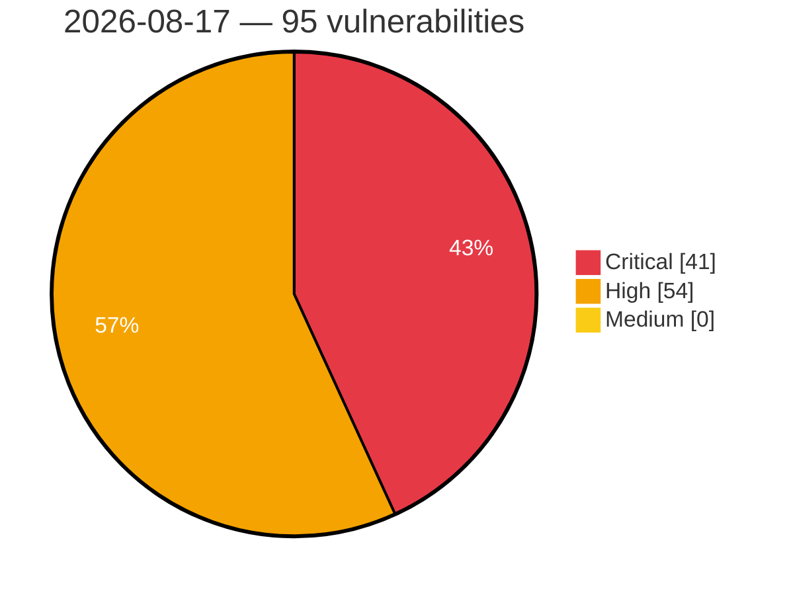

# Critical, High & Medium Severity Vulnerabilities — 2026-08-17

**Source status for this day:**

| Source | Critical | High | Medium | Total |
|--------|---------:|-----:|-------:|------:|
| cvefeed.io (High/Critical) | 41 | 54 | 0 | 95 |

**KEV (actively exploited):** 0  **Watchlist matches:** 51

## Critical (41)

| CVSS | Flags | Source | CVE / Title | Reported |
|------|-------|--------|-------------|----------|
| 10.0 | — | cvefeed.io (High/Critical) | [CVE-2026-19977 - EFM ipTIME A3004T Session Validation httpcon_check_session_url improper authentication](https://cvefeed.io/vuln/detail/CVE-2026-19977) | 1 hour, 8 minutes ago |
| 10.0 | — | cvefeed.io (High/Critical) | [CVE-2026-74843 - Wavlink WN531P3/WN535M1 Export Pingortrace CGI export_pingortrace.cgi strcpy stack-based overflow](https://cvefeed.io/vuln/detail/CVE-2026-74843) | 2 hours, 11 minutes ago |
| 10.0 | ⭐ | cvefeed.io (High/Critical) | [CVE-2026-74253 - Joomla Extension - regularlabs.com - Unauthenticated RCE through unverified reflected user input in Sourcerer < 14.0.0](https://cvefeed.io/vuln/detail/CVE-2026-74253) | 47 minutes ago |
| 9.9 | ⭐ | cvefeed.io (High/Critical) | [CVE-2026-66792 - Multicloud-operators-subscription: multicloud-operators-subscription: isclusteradmin() trusts user-settable annotations on managed clusters](https://cvefeed.io/vuln/detail/CVE-2026-66792) | 1 hour, 15 minutes ago |
| 9.9 | ⭐ | cvefeed.io (High/Critical) | [CVE-2026-65974 - ERPNext: Server-Side Template Injection leading to Remote Code Execution](https://cvefeed.io/vuln/detail/CVE-2026-65974) | 1 hour, 1 minute ago |
| 9.9 | ⭐ | cvefeed.io (High/Critical) | [CVE-2026-47686 - vm2: Missing Error.cause Sanitization Enables VM2 Sandbox Escape to RCE](https://cvefeed.io/vuln/detail/CVE-2026-47686) | 1 hour, 1 minute ago |
| 9.8 | ⭐ | cvefeed.io (High/Critical) | [CVE-2026-74901 - openssl_encrypt before 1.4.0 Authentication Bypass via AES-CTR Fallback](https://cvefeed.io/vuln/detail/CVE-2026-74901) | 17 minutes ago |
| 9.8 | — | cvefeed.io (High/Critical) | [CVE-2026-74900 - openssl_encrypt before 1.4.0 Weak Shared Secret via PQC Simulation Mode](https://cvefeed.io/vuln/detail/CVE-2026-74900) | 17 minutes ago |
| 9.8 | — | cvefeed.io (High/Critical) | [CVE-2026-74899 - openssl_encrypt before 1.4.0 Sandbox Escape via Type Hierarchy](https://cvefeed.io/vuln/detail/CVE-2026-74899) | 17 minutes ago |
| 9.8 | — | cvefeed.io (High/Critical) | [CVE-2026-74896 - openssl_encrypt before 1.4.0 Sandbox Escape via Dunder Attribute Traversal](https://cvefeed.io/vuln/detail/CVE-2026-74896) | 17 minutes ago |
| 9.8 | — | cvefeed.io (High/Critical) | [CVE-2026-74895 - openssl_encrypt before 1.4.0 Plugin Sandbox Bypass via Process Isolation](https://cvefeed.io/vuln/detail/CVE-2026-74895) | 17 minutes ago |
| 9.8 | ⭐ | cvefeed.io (High/Critical) | [CVE-2026-74894 - openssl_encrypt before 1.4.0 Authentication Bypass via Bearer Token](https://cvefeed.io/vuln/detail/CVE-2026-74894) | 17 minutes ago |
| 9.8 | — | cvefeed.io (High/Critical) | [CVE-2026-74891 - openssl_encrypt before 1.4.0 Hardcoded Database Credentials](https://cvefeed.io/vuln/detail/CVE-2026-74891) | 17 minutes ago |
| 9.8 | — | cvefeed.io (High/Critical) | [CVE-2026-74889 - openssl_encrypt before 1.4.0 Weak Key Derivation via HKDF](https://cvefeed.io/vuln/detail/CVE-2026-74889) | 17 minutes ago |
| 9.8 | — | cvefeed.io (High/Critical) | [CVE-2026-74886 - openssl_encrypt before 1.4.0 Plugin Import Guard Bypass](https://cvefeed.io/vuln/detail/CVE-2026-74886) | 17 minutes ago |
| 9.8 | — | cvefeed.io (High/Critical) | [CVE-2026-74880 - openssl_encrypt before 1.4.0 Token Leakage via Query Parameters](https://cvefeed.io/vuln/detail/CVE-2026-74880) | 17 minutes ago |
| 9.8 | ⭐ | cvefeed.io (High/Critical) | [CVE-2026-74878 - openssl_encrypt before 1.4.0 TOTP Rate Limiter Bypass](https://cvefeed.io/vuln/detail/CVE-2026-74878) | 17 minutes ago |
| 9.8 | — | cvefeed.io (High/Critical) | [CVE-2026-74876 - openssl_encrypt before 1.4.0 Unverified Key Bundle Encryption](https://cvefeed.io/vuln/detail/CVE-2026-74876) | 17 minutes ago |
| 9.8 | — | cvefeed.io (High/Critical) | [CVE-2026-74875 - openssl_encrypt before 1.4.0 Schema Validation Bypass](https://cvefeed.io/vuln/detail/CVE-2026-74875) | 17 minutes ago |
| 9.8 | — | cvefeed.io (High/Critical) | [CVE-2026-74872 - openssl_encrypt before 1.4.0 Arbitrary Code Execution via Whirlpool](https://cvefeed.io/vuln/detail/CVE-2026-74872) | 3 hours, 13 minutes ago |
| 9.8 | ⭐ | cvefeed.io (High/Critical) | [CVE-2026-50768 - T-Systems International GmbH ImageMaster Arbitrary Code Execution via File Upload](https://cvefeed.io/vuln/detail/CVE-2026-50768) | 2 hours, 13 minutes ago |
| 9.8 | ⭐ | cvefeed.io (High/Critical) | [CVE-2026-75110 - MemOS Authentication Bypass via Unset INTERNAL_SERVICE_SECRET](https://cvefeed.io/vuln/detail/CVE-2026-75110) | 1 hour, 1 minute ago |
| 9.8 | ⭐ | cvefeed.io (High/Critical) | [CVE-2026-47698 - vm2: Sandbox Breakout Using Dangerous Host Proto Mutators](https://cvefeed.io/vuln/detail/CVE-2026-47698) | 1 hour, 1 minute ago |
| 9.4 | ⭐ | cvefeed.io (High/Critical) | [CVE-2026-15623 - Authenticated Blind SQL Injection in Google Cloud SecOps SOAR Dashboard Widget Query Service](https://cvefeed.io/vuln/detail/CVE-2026-15623) | 34 minutes ago |
| 9.4 | ⭐ | cvefeed.io (High/Critical) | [CVE-2026-19478 - Improper Control of Generation of Code ('Code Injection') in GitLab](https://cvefeed.io/vuln/detail/CVE-2026-19478) | 14 minutes ago |
| 9.3 | ⭐ | cvefeed.io (High/Critical) | [CVE-2026-74890 - openssl_encrypt before 1.4.0 HMAC Authentication Bypass via Environment Variable](https://cvefeed.io/vuln/detail/CVE-2026-74890) | 17 minutes ago |
| 9.3 | — | cvefeed.io (High/Critical) | [CVE-2026-74887 - openssl_encrypt before 1.4.0 Insecure Random Import in PQC Module](https://cvefeed.io/vuln/detail/CVE-2026-74887) | 17 minutes ago |
| 9.3 | — | cvefeed.io (High/Critical) | [CVE-2026-74885 - openssl_encrypt before 1.4.0 Logging Bug and Race Condition](https://cvefeed.io/vuln/detail/CVE-2026-74885) | 17 minutes ago |
| 9.3 | — | cvefeed.io (High/Critical) | [CVE-2026-71566 - KubeVirt backend is not authenticated](https://cvefeed.io/vuln/detail/CVE-2026-71566) | 7 minutes ago |
| 9.3 | ⭐ | cvefeed.io (High/Critical) | [CVE-2026-74799 - SiYuan before 3.7.4 Unauthenticated Debug Endpoint Information Disclosure](https://cvefeed.io/vuln/detail/CVE-2026-74799) | 2 hours, 14 minutes ago |
| 9.3 | ⭐ | cvefeed.io (High/Critical) | [CVE-2026-74254 - Joomla Extension - joomlack.fr - SQL injection in Page Builder CK < 3.6.5](https://cvefeed.io/vuln/detail/CVE-2026-74254) | 50 minutes ago |
| 9.3 | ⭐ | cvefeed.io (High/Critical) | [CVE-2026-55674 - Discourse: Cache poisoning/XSS via color scheme cookies](https://cvefeed.io/vuln/detail/CVE-2026-55674) | 1 hour, 43 minutes ago |
| 9.3 | — | cvefeed.io (High/Critical) | [CVE-2026-75106 - OpnForm Editable Submission Secret Derivation via Empty Hashids Salt](https://cvefeed.io/vuln/detail/CVE-2026-75106) | 1 hour, 1 minute ago |
| 9.1 | — | cvefeed.io (High/Critical) | [CVE-2026-75045 - JetBrains YouTrack Unauthenticated Backup Disclosure Vulnerability](https://cvefeed.io/vuln/detail/CVE-2026-75045) | 5 minutes ago |
| 9.1 | ⭐ | cvefeed.io (High/Critical) | [CVE-2026-71479 - New API: Integer overflow in quota billing yields negative charges (self-crediting)](https://cvefeed.io/vuln/detail/CVE-2026-71479) | 1 hour, 42 minutes ago |
| 9.1 | ⭐ | cvefeed.io (High/Critical) | [CVE-2026-64859 - New API: User List API Leaks Root User Access Token Leading to Privilege Escalation](https://cvefeed.io/vuln/detail/CVE-2026-64859) | 1 hour, 43 minutes ago |
| 9.1 | ⭐ | cvefeed.io (High/Critical) | [CVE-2026-71472 - Acm-search-v2-rhel9: search-v2-operator: shell-command and sql injection in postgresql-start.sh via cr-supplied work_mem](https://cvefeed.io/vuln/detail/CVE-2026-71472) | 13 minutes ago |
| 9.1 | ⭐ | cvefeed.io (High/Critical) | [CVE-2026-51346 - Stud.IP SQL Injection Vulnerability](https://cvefeed.io/vuln/detail/CVE-2026-51346) | 2 hours, 13 minutes ago |
| 9.1 | ⭐ | cvefeed.io (High/Critical) | [CVE-2026-66795 - Managedcluster-import-controller: managedcluster-import-controller: csr auto-approver does not validate certificate subject, signername, or requester identity](https://cvefeed.io/vuln/detail/CVE-2026-66795) | 1 hour, 1 minute ago |
| 9.0 | — | cvefeed.io (High/Critical) | [CVE-2026-14564 - Sensitive Data Exposure in Innotim Software's Logsign SIEM](https://cvefeed.io/vuln/detail/CVE-2026-14564) | 1 hour, 13 minutes ago |
| 9.0 | ⭐ | cvefeed.io (High/Critical) | [CVE-2026-74800 - SiYuan before v3.7.4 Stored XSS via assets endpoint](https://cvefeed.io/vuln/detail/CVE-2026-74800) | 2 hours, 14 minutes ago |

## High (54)

| CVSS | Flags | Source | CVE / Title | Reported |
|------|-------|--------|-------------|----------|
| 8.9 | — | cvefeed.io (High/Critical) | [CVE-2026-61666 - websocket-driver: Denial of service via malformed Host header](https://cvefeed.io/vuln/detail/CVE-2026-61666) | 43 minutes ago |
| 8.9 | — | cvefeed.io (High/Critical) | [CVE-2026-12553 - HP Web Jetadmin (WJA) - Potential Arbitrary File Read/Write](https://cvefeed.io/vuln/detail/CVE-2026-12553) | 1 hour, 14 minutes ago |
| 8.8 | ⭐ | cvefeed.io (High/Critical) | [CVE-2026-74845 - 2100 Technology｜Official Document Management System - Arbitrary File Upload](https://cvefeed.io/vuln/detail/CVE-2026-74845) | 23 minutes ago |
| 8.8 | ⭐ | cvefeed.io (High/Critical) | [CVE-2026-74893 - openssl_encrypt before 1.4.0 JWT Token Forgery via Hardcoded Secrets](https://cvefeed.io/vuln/detail/CVE-2026-74893) | 17 minutes ago |
| 8.8 | ⭐ | cvefeed.io (High/Critical) | [CVE-2026-74883 - openssl_encrypt before 1.4.0 Sandbox Bypass via pathlib and io](https://cvefeed.io/vuln/detail/CVE-2026-74883) | 17 minutes ago |
| 8.8 | — | cvefeed.io (High/Critical) | [CVE-2026-74877 - openssl_encrypt before 1.4.0 Missing Ownership Verification via revoke_key](https://cvefeed.io/vuln/detail/CVE-2026-74877) | 17 minutes ago |
| 8.8 | ⭐ | cvefeed.io (High/Critical) | [CVE-2026-74997 - Roundcube Webmail Markasjunk Plugin Remote Code Execution Vulnerability](https://cvefeed.io/vuln/detail/CVE-2026-74997) | 1 hour, 13 minutes ago |
| 8.8 | ⭐ | cvefeed.io (High/Critical) | [CVE-2026-9771 - Missing device-pointer validation in flash_copy() syscall allows userspace privilege escalation](https://cvefeed.io/vuln/detail/CVE-2026-9771) | 43 minutes ago |
| 8.8 | ⭐ | cvefeed.io (High/Critical) | [CVE-2026-68518 - Glances: Command injection bypass of action-template sanitizer via cross-field shell-operator reconstruction](https://cvefeed.io/vuln/detail/CVE-2026-68518) | 43 minutes ago |
| 8.8 | ⭐ | cvefeed.io (High/Critical) | [CVE-2026-62982 - Glances: Incomplete fix of CVE-2026-32608: action-template sanitizer is bypassed by nested stat values (process 'cmdline') → OS command injection](https://cvefeed.io/vuln/detail/CVE-2026-62982) | 1 hour, 10 minutes ago |
| 8.8 | — | cvefeed.io (High/Critical) | [CVE-2026-70495 - Search-v2-operator: search-v2-operator: cluster-wide impersonate on users/groups shared across 4 pods grants hub system:masters](https://cvefeed.io/vuln/detail/CVE-2026-70495) | 13 minutes ago |
| 8.8 | ⭐ | cvefeed.io (High/Critical) | [CVE-2026-75481 - SkyPilot Authentication Bypass via Service Account Role Escalation](https://cvefeed.io/vuln/detail/CVE-2026-75481) | 1 hour, 1 minute ago |
| 8.8 | — | cvefeed.io (High/Critical) | [CVE-2026-75103 - Crawlab Missing Authorization on Password Change Endpoint Allows Account Takeover](https://cvefeed.io/vuln/detail/CVE-2026-75103) | 1 hour, 1 minute ago |
| 8.8 | ⭐ | cvefeed.io (High/Critical) | [CVE-2026-65640 - WordPress Arbitrary Remote Code Execution via Image Processing](https://cvefeed.io/vuln/detail/CVE-2026-65640) | 1 hour, 1 minute ago |
| 8.7 | ⭐ | cvefeed.io (High/Critical) | [CVE-2026-74892 - openssl_encrypt before 1.4.0 Hardcoded Secret Key](https://cvefeed.io/vuln/detail/CVE-2026-74892) | 17 minutes ago |
| 8.7 | — | cvefeed.io (High/Critical) | [CVE-2026-74888 - openssl_encrypt before 1.4.0 Non-Standard PBKDF2 Key Derivation](https://cvefeed.io/vuln/detail/CVE-2026-74888) | 17 minutes ago |
| 8.7 | ⭐ | cvefeed.io (High/Critical) | [CVE-2026-74884 - openssl_encrypt before 1.4.0 Path Traversal via plugin_id](https://cvefeed.io/vuln/detail/CVE-2026-74884) | 17 minutes ago |
| 8.7 | — | cvefeed.io (High/Critical) | [CVE-2026-74882 - openssl_encrypt before 1.4.0 Insecure Default Configuration](https://cvefeed.io/vuln/detail/CVE-2026-74882) | 17 minutes ago |
| 8.7 | — | cvefeed.io (High/Critical) | [CVE-2026-74879 - openssl_encrypt before 1.4.0 Information Disclosure via /ready endpoint](https://cvefeed.io/vuln/detail/CVE-2026-74879) | 17 minutes ago |
| 8.7 | — | cvefeed.io (High/Critical) | [CVE-2026-74874 - openssl_encrypt before 1.4.0 Weak PRNG Steganography Pixel Selection](https://cvefeed.io/vuln/detail/CVE-2026-74874) | 17 minutes ago |
| 8.7 | — | cvefeed.io (High/Critical) | [CVE-2026-71979 - INDI indiserver 2.2.4.2 Stack Buffer Overflow via XML Tag Parsing](https://cvefeed.io/vuln/detail/CVE-2026-71979) | 19 minutes ago |
| 8.7 | — | cvefeed.io (High/Critical) | [CVE-2026-73523 - COVESA Open1722 0.9.2 Stack Memory Disclosure via acf-can-listener.c Integer Truncation](https://cvefeed.io/vuln/detail/CVE-2026-73523) | 17 minutes ago |
| 8.7 | — | cvefeed.io (High/Critical) | [CVE-2026-73522 - COVESA Open1722 0.9.2 Stack Buffer Overflow via avtp_to_can() in acf-can-listener](https://cvefeed.io/vuln/detail/CVE-2026-73522) | 24 minutes ago |
| 8.7 | — | cvefeed.io (High/Critical) | [CVE-2026-71980 - Belledonne Communications bcg729 1.1.2 Out-of-Bounds Read via decodeSIDframe()](https://cvefeed.io/vuln/detail/CVE-2026-71980) | 27 minutes ago |
| 8.7 | — | cvefeed.io (High/Critical) | [CVE-2026-71491 - sqlparse: Quadratic O(n²) DoS in group_comments](https://cvefeed.io/vuln/detail/CVE-2026-71491) | 1 hour, 10 minutes ago |
| 8.7 | — | cvefeed.io (High/Critical) | [CVE-2026-54284 - sqlparse: TokenList.__init__ materializes O(subtree) value per group, causing CPU DoS before depth/token caps trigger](https://cvefeed.io/vuln/detail/CVE-2026-54284) | 1 hour, 11 minutes ago |
| 8.7 | ⭐ | cvefeed.io (High/Critical) | [CVE-2026-74238 - TIER IV Nebula 1.2.0 Heap Out-of-Bounds Read via VLP32 UDP Decoder](https://cvefeed.io/vuln/detail/CVE-2026-74238) | 1 hour, 15 minutes ago |
| 8.7 | ⭐ | cvefeed.io (High/Critical) | [CVE-2026-75482 - SWE-agent Trajectory Inspector Path Traversal File Disclosure](https://cvefeed.io/vuln/detail/CVE-2026-75482) | 1 hour, 1 minute ago |
| 8.7 | ⭐ | cvefeed.io (High/Critical) | [CVE-2026-75479 - JimuReport Unauthenticated Report Listing and Share Token Disclosure](https://cvefeed.io/vuln/detail/CVE-2026-75479) | 1 hour, 1 minute ago |
| 8.7 | ⭐ | cvefeed.io (High/Critical) | [CVE-2026-75111 - Evidently UI Path Traversal via Dataset Materialization Filename](https://cvefeed.io/vuln/detail/CVE-2026-75111) | 1 hour, 1 minute ago |
| 8.7 | — | cvefeed.io (High/Critical) | [CVE-2026-75105 - phpIPAM Temporary Subnet Share Information Disclosure via Address Parameter](https://cvefeed.io/vuln/detail/CVE-2026-75105) | 1 hour, 1 minute ago |
| 8.7 | ⭐ | cvefeed.io (High/Critical) | [CVE-2026-71518 - Typemill < 2.26.0 Authorization Bypass via Media File Download Route](https://cvefeed.io/vuln/detail/CVE-2026-71518) | 1 hour, 1 minute ago |
| 8.7 | ⭐ | cvefeed.io (High/Critical) | [CVE-2026-47683 - vm2: bufferAllocLimit cap bypassed by Buffer.concat and Buffer.from arrayLike](https://cvefeed.io/vuln/detail/CVE-2026-47683) | 1 hour, 1 minute ago |
| 8.5 | — | cvefeed.io (High/Critical) | [CVE-2026-50602 - Planet9 Incorrect Permission Assignment Vulnerability Information](https://cvefeed.io/vuln/detail/CVE-2026-50602) | 1 hour, 8 minutes ago |
| 8.5 | ⭐ | cvefeed.io (High/Critical) | [CVE-2026-57485 - Stirling-PDF: Internal Service Account API Key Disclosure via Pipeline Endpoint](https://cvefeed.io/vuln/detail/CVE-2026-57485) | 14 minutes ago |
| 8.5 | ⭐ | cvefeed.io (High/Critical) | [CVE-2026-73410 - Budibase: SSRF via DNS rebinding in the REST datasource integration](https://cvefeed.io/vuln/detail/CVE-2026-73410) | 1 hour, 1 minute ago |
| 8.4 | ⭐ | cvefeed.io (High/Critical) | [CVE-2026-75060 - JetBrains PyCharm Remote Code Execution Vulnerability](https://cvefeed.io/vuln/detail/CVE-2026-75060) | 1 hour, 42 minutes ago |
| 8.4 | ⭐ | cvefeed.io (High/Critical) | [CVE-2026-46345 - compliance-trestle - jinja has an Arbitrary File Write via Path Traversal](https://cvefeed.io/vuln/detail/CVE-2026-46345) | 1 hour, 11 minutes ago |
| 8.4 | ⭐ | cvefeed.io (High/Critical) | [CVE-2026-64657 - Budibase: Database Connector SQL Injections in PostgreSQL, MS SQL, and MySQL](https://cvefeed.io/vuln/detail/CVE-2026-64657) | 1 hour, 1 minute ago |
| 8.3 | — | cvefeed.io (High/Critical) | [CVE-2026-19979 - GL.iNet XE3000 WebDAV Service MOVE authorization](https://cvefeed.io/vuln/detail/CVE-2026-19979) | 43 minutes ago |
| 8.3 | ⭐ | cvefeed.io (High/Critical) | [CVE-2026-19983 - GL.iNet XE3000 NAS Command Service gl_nas_sys os command injection](https://cvefeed.io/vuln/detail/CVE-2026-19983) | 42 minutes ago |
| 8.3 | — | cvefeed.io (High/Critical) | [CVE-2026-22072 - Arbitrary URL Loading in WebView Leading to Token Leakage Risk](https://cvefeed.io/vuln/detail/CVE-2026-22072) | 48 minutes ago |
| 8.3 | ⭐ | cvefeed.io (High/Critical) | [CVE-2026-9816 - Insufficient server-side validation of board member role fields permits privilege escalation](https://cvefeed.io/vuln/detail/CVE-2026-9816) | 12 minutes ago |
| 8.2 | — | cvefeed.io (High/Critical) | [CVE-2026-74802 - SiYuan 3.7.3 Cross-Site WebSocket Hijacking via network proxy](https://cvefeed.io/vuln/detail/CVE-2026-74802) | 3 hours, 13 minutes ago |
| 8.2 | ⭐ | cvefeed.io (High/Critical) | [CVE-2026-74801 - SiYuan before 3.7.4 Local Privilege Escalation via elevator.exe](https://cvefeed.io/vuln/detail/CVE-2026-74801) | 2 hours, 14 minutes ago |
| 8.2 | ⭐ | cvefeed.io (High/Critical) | [CVE-2026-75048 - JetBrains YouTrack Stored Cross-Site Scripting Vulnerability](https://cvefeed.io/vuln/detail/CVE-2026-75048) | 5 minutes ago |
| 8.2 | — | cvefeed.io (High/Critical) | [CVE-2026-65832 - Deskflow - Unauthenticated server-controlled out-of-bounds read in ServerProxy::setOptions / translateKey modifier-table indexing](https://cvefeed.io/vuln/detail/CVE-2026-65832) | 1 hour, 1 minute ago |
| 8.2 | — | cvefeed.io (High/Critical) | [CVE-2026-63409 - Deskflow: Odd-length DSOP options vector causes out-of-bounds read in Deskflow client](https://cvefeed.io/vuln/detail/CVE-2026-63409) | 1 hour, 1 minute ago |
| 8.1 | — | cvefeed.io (High/Critical) | [CVE-2026-19693 - extract-zip arbitrary file write outside the destination directory via a symlink at the final path component](https://cvefeed.io/vuln/detail/CVE-2026-19693) | 59 minutes ago |
| 8.1 | — | cvefeed.io (High/Critical) | [CVE-2026-75051 - JetBrains YouTrack Unauthorized Project Transfer Vulnerability](https://cvefeed.io/vuln/detail/CVE-2026-75051) | 5 minutes ago |
| 8.1 | — | cvefeed.io (High/Critical) | [CVE-2026-75044 - JetBrains YouTrack Improper Authorization Vulnerability](https://cvefeed.io/vuln/detail/CVE-2026-75044) | 5 minutes ago |
| 8.1 | ⭐ | cvefeed.io (High/Critical) | [CVE-2026-33437 - Stirling PDF: Stored XSS in Info Summary](https://cvefeed.io/vuln/detail/CVE-2026-33437) | 1 hour, 11 minutes ago |
| 8.1 | ⭐ | cvefeed.io (High/Critical) | [CVE-2026-57233 - Notepad++: Path Traversal (Zip Slip) in WinGup Plugin Extraction](https://cvefeed.io/vuln/detail/CVE-2026-57233) | 14 minutes ago |
| 8.0 | ⭐ | cvefeed.io (High/Critical) | [CVE-2026-16138 - Remote code execution via unsafe deserialization in Progress ShareFile Storage Zones Controller's CICO service](https://cvefeed.io/vuln/detail/CVE-2026-16138) | 58 minutes ago |
