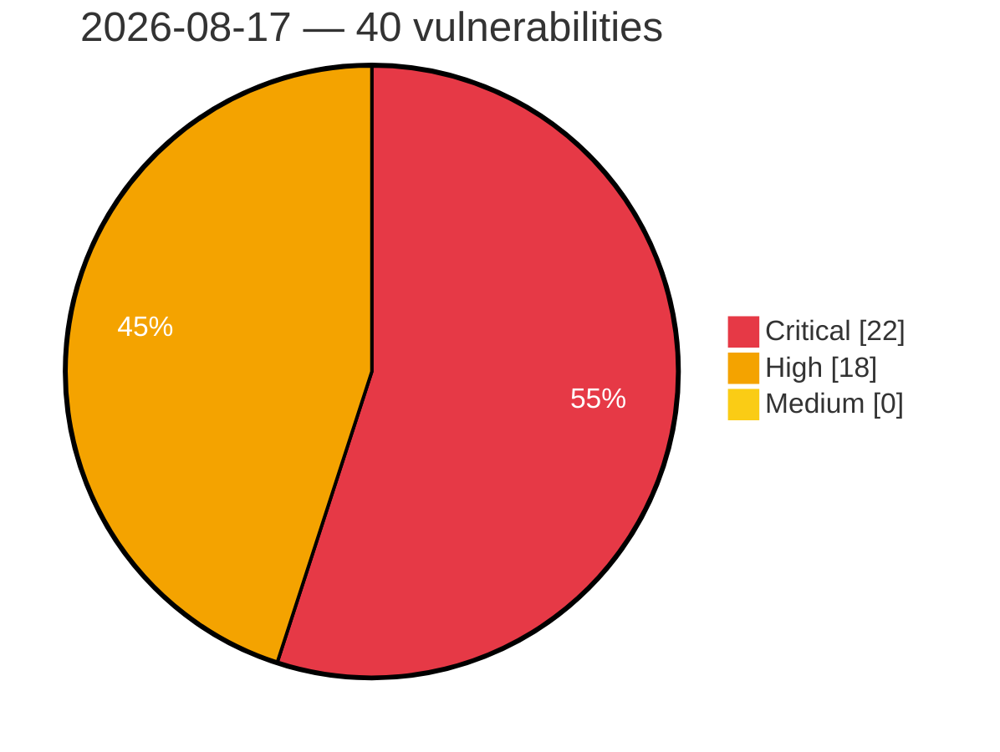

# Critical, High & Medium Severity Vulnerabilities — 2026-08-17

**Source status for this day:**

| Source | Critical | High | Medium | Total |
|--------|---------:|-----:|-------:|------:|
| cvefeed.io (High/Critical) | 22 | 18 | 0 | 40 |

**KEV (actively exploited):** 0  **Watchlist matches:** 13

## Critical (22)

| CVSS | Flags | Source | CVE / Title | Reported |
|------|-------|--------|-------------|----------|
| 10.0 | — | cvefeed.io (High/Critical) | [CVE-2026-19977 - EFM ipTIME A3004T Session Validation httpcon_check_session_url improper authentication](https://cvefeed.io/vuln/detail/CVE-2026-19977) | 1 hour, 8 minutes ago |
| 10.0 | — | cvefeed.io (High/Critical) | [CVE-2026-74843 - Wavlink WN531P3/WN535M1 Export Pingortrace CGI export_pingortrace.cgi strcpy stack-based overflow](https://cvefeed.io/vuln/detail/CVE-2026-74843) | 2 hours, 11 minutes ago |
| 9.8 | ⭐ | cvefeed.io (High/Critical) | [CVE-2026-74901 - openssl_encrypt before 1.4.0 Authentication Bypass via AES-CTR Fallback](https://cvefeed.io/vuln/detail/CVE-2026-74901) | 17 minutes ago |
| 9.8 | — | cvefeed.io (High/Critical) | [CVE-2026-74900 - openssl_encrypt before 1.4.0 Weak Shared Secret via PQC Simulation Mode](https://cvefeed.io/vuln/detail/CVE-2026-74900) | 17 minutes ago |
| 9.8 | — | cvefeed.io (High/Critical) | [CVE-2026-74899 - openssl_encrypt before 1.4.0 Sandbox Escape via Type Hierarchy](https://cvefeed.io/vuln/detail/CVE-2026-74899) | 17 minutes ago |
| 9.8 | — | cvefeed.io (High/Critical) | [CVE-2026-74896 - openssl_encrypt before 1.4.0 Sandbox Escape via Dunder Attribute Traversal](https://cvefeed.io/vuln/detail/CVE-2026-74896) | 17 minutes ago |
| 9.8 | — | cvefeed.io (High/Critical) | [CVE-2026-74895 - openssl_encrypt before 1.4.0 Plugin Sandbox Bypass via Process Isolation](https://cvefeed.io/vuln/detail/CVE-2026-74895) | 17 minutes ago |
| 9.8 | ⭐ | cvefeed.io (High/Critical) | [CVE-2026-74894 - openssl_encrypt before 1.4.0 Authentication Bypass via Bearer Token](https://cvefeed.io/vuln/detail/CVE-2026-74894) | 17 minutes ago |
| 9.8 | — | cvefeed.io (High/Critical) | [CVE-2026-74891 - openssl_encrypt before 1.4.0 Hardcoded Database Credentials](https://cvefeed.io/vuln/detail/CVE-2026-74891) | 17 minutes ago |
| 9.8 | — | cvefeed.io (High/Critical) | [CVE-2026-74889 - openssl_encrypt before 1.4.0 Weak Key Derivation via HKDF](https://cvefeed.io/vuln/detail/CVE-2026-74889) | 17 minutes ago |
| 9.8 | — | cvefeed.io (High/Critical) | [CVE-2026-74886 - openssl_encrypt before 1.4.0 Plugin Import Guard Bypass](https://cvefeed.io/vuln/detail/CVE-2026-74886) | 17 minutes ago |
| 9.8 | — | cvefeed.io (High/Critical) | [CVE-2026-74880 - openssl_encrypt before 1.4.0 Token Leakage via Query Parameters](https://cvefeed.io/vuln/detail/CVE-2026-74880) | 17 minutes ago |
| 9.8 | ⭐ | cvefeed.io (High/Critical) | [CVE-2026-74878 - openssl_encrypt before 1.4.0 TOTP Rate Limiter Bypass](https://cvefeed.io/vuln/detail/CVE-2026-74878) | 17 minutes ago |
| 9.8 | — | cvefeed.io (High/Critical) | [CVE-2026-74876 - openssl_encrypt before 1.4.0 Unverified Key Bundle Encryption](https://cvefeed.io/vuln/detail/CVE-2026-74876) | 17 minutes ago |
| 9.8 | — | cvefeed.io (High/Critical) | [CVE-2026-74875 - openssl_encrypt before 1.4.0 Schema Validation Bypass](https://cvefeed.io/vuln/detail/CVE-2026-74875) | 17 minutes ago |
| 9.8 | — | cvefeed.io (High/Critical) | [CVE-2026-74872 - openssl_encrypt before 1.4.0 Arbitrary Code Execution via Whirlpool](https://cvefeed.io/vuln/detail/CVE-2026-74872) | 3 hours, 13 minutes ago |
| 9.4 | ⭐ | cvefeed.io (High/Critical) | [CVE-2026-15623 - Authenticated Blind SQL Injection in Google Cloud SecOps SOAR Dashboard Widget Query Service](https://cvefeed.io/vuln/detail/CVE-2026-15623) | 34 minutes ago |
| 9.3 | ⭐ | cvefeed.io (High/Critical) | [CVE-2026-74890 - openssl_encrypt before 1.4.0 HMAC Authentication Bypass via Environment Variable](https://cvefeed.io/vuln/detail/CVE-2026-74890) | 17 minutes ago |
| 9.3 | — | cvefeed.io (High/Critical) | [CVE-2026-74887 - openssl_encrypt before 1.4.0 Insecure Random Import in PQC Module](https://cvefeed.io/vuln/detail/CVE-2026-74887) | 17 minutes ago |
| 9.3 | — | cvefeed.io (High/Critical) | [CVE-2026-74885 - openssl_encrypt before 1.4.0 Logging Bug and Race Condition](https://cvefeed.io/vuln/detail/CVE-2026-74885) | 17 minutes ago |
| 9.3 | — | cvefeed.io (High/Critical) | [CVE-2026-71566 - KubeVirt backend is not authenticated](https://cvefeed.io/vuln/detail/CVE-2026-71566) | 7 minutes ago |
| 9.0 | — | cvefeed.io (High/Critical) | [CVE-2026-14564 - Sensitive Data Exposure in Innotim Software's Logsign SIEM](https://cvefeed.io/vuln/detail/CVE-2026-14564) | 1 hour, 13 minutes ago |

## High (18)

| CVSS | Flags | Source | CVE / Title | Reported |
|------|-------|--------|-------------|----------|
| 8.8 | ⭐ | cvefeed.io (High/Critical) | [CVE-2026-74845 - 2100 Technology｜Official Document Management System - Arbitrary File Upload](https://cvefeed.io/vuln/detail/CVE-2026-74845) | 23 minutes ago |
| 8.8 | ⭐ | cvefeed.io (High/Critical) | [CVE-2026-74893 - openssl_encrypt before 1.4.0 JWT Token Forgery via Hardcoded Secrets](https://cvefeed.io/vuln/detail/CVE-2026-74893) | 17 minutes ago |
| 8.8 | ⭐ | cvefeed.io (High/Critical) | [CVE-2026-74883 - openssl_encrypt before 1.4.0 Sandbox Bypass via pathlib and io](https://cvefeed.io/vuln/detail/CVE-2026-74883) | 17 minutes ago |
| 8.8 | — | cvefeed.io (High/Critical) | [CVE-2026-74877 - openssl_encrypt before 1.4.0 Missing Ownership Verification via revoke_key](https://cvefeed.io/vuln/detail/CVE-2026-74877) | 17 minutes ago |
| 8.8 | ⭐ | cvefeed.io (High/Critical) | [CVE-2026-74997 - Roundcube Webmail Markasjunk Plugin Remote Code Execution Vulnerability](https://cvefeed.io/vuln/detail/CVE-2026-74997) | 1 hour, 13 minutes ago |
| 8.7 | ⭐ | cvefeed.io (High/Critical) | [CVE-2026-74892 - openssl_encrypt before 1.4.0 Hardcoded Secret Key](https://cvefeed.io/vuln/detail/CVE-2026-74892) | 17 minutes ago |
| 8.7 | — | cvefeed.io (High/Critical) | [CVE-2026-74888 - openssl_encrypt before 1.4.0 Non-Standard PBKDF2 Key Derivation](https://cvefeed.io/vuln/detail/CVE-2026-74888) | 17 minutes ago |
| 8.7 | ⭐ | cvefeed.io (High/Critical) | [CVE-2026-74884 - openssl_encrypt before 1.4.0 Path Traversal via plugin_id](https://cvefeed.io/vuln/detail/CVE-2026-74884) | 17 minutes ago |
| 8.7 | — | cvefeed.io (High/Critical) | [CVE-2026-74882 - openssl_encrypt before 1.4.0 Insecure Default Configuration](https://cvefeed.io/vuln/detail/CVE-2026-74882) | 17 minutes ago |
| 8.7 | — | cvefeed.io (High/Critical) | [CVE-2026-74879 - openssl_encrypt before 1.4.0 Information Disclosure via /ready endpoint](https://cvefeed.io/vuln/detail/CVE-2026-74879) | 17 minutes ago |
| 8.7 | — | cvefeed.io (High/Critical) | [CVE-2026-74874 - openssl_encrypt before 1.4.0 Weak PRNG Steganography Pixel Selection](https://cvefeed.io/vuln/detail/CVE-2026-74874) | 17 minutes ago |
| 8.5 | — | cvefeed.io (High/Critical) | [CVE-2026-50602 - Planet9 Incorrect Permission Assignment Vulnerability Information](https://cvefeed.io/vuln/detail/CVE-2026-50602) | 1 hour, 8 minutes ago |
| 8.3 | — | cvefeed.io (High/Critical) | [CVE-2026-19979 - GL.iNet XE3000 WebDAV Service MOVE authorization](https://cvefeed.io/vuln/detail/CVE-2026-19979) | 43 minutes ago |
| 8.3 | ⭐ | cvefeed.io (High/Critical) | [CVE-2026-19983 - GL.iNet XE3000 NAS Command Service gl_nas_sys os command injection](https://cvefeed.io/vuln/detail/CVE-2026-19983) | 42 minutes ago |
| 8.3 | — | cvefeed.io (High/Critical) | [CVE-2026-22072 - Arbitrary URL Loading in WebView Leading to Token Leakage Risk](https://cvefeed.io/vuln/detail/CVE-2026-22072) | 48 minutes ago |
| 8.2 | — | cvefeed.io (High/Critical) | [CVE-2026-74802 - SiYuan 3.7.3 Cross-Site WebSocket Hijacking via network proxy](https://cvefeed.io/vuln/detail/CVE-2026-74802) | 3 hours, 13 minutes ago |
| 8.1 | — | cvefeed.io (High/Critical) | [CVE-2026-19693 - extract-zip arbitrary file write outside the destination directory via a symlink at the final path component](https://cvefeed.io/vuln/detail/CVE-2026-19693) | 59 minutes ago |
| 8.0 | ⭐ | cvefeed.io (High/Critical) | [CVE-2026-16138 - Remote code execution via unsafe deserialization in Progress ShareFile Storage Zones Controller's CICO service](https://cvefeed.io/vuln/detail/CVE-2026-16138) | 58 minutes ago |
