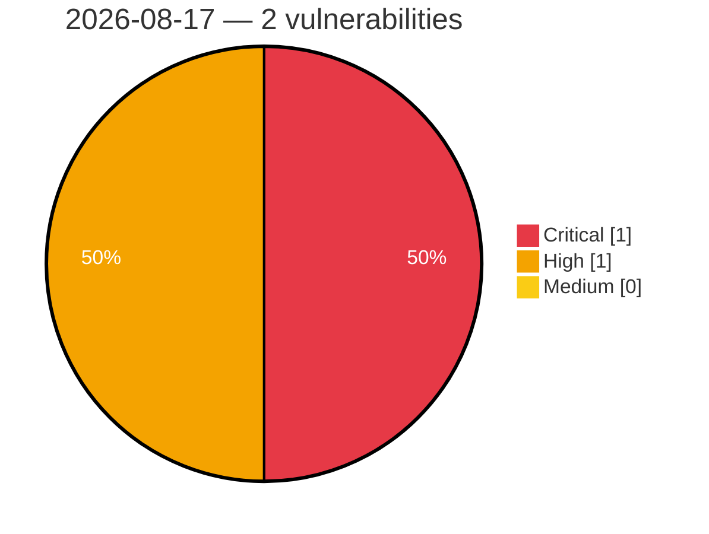

# Critical, High & Medium Severity Vulnerabilities — 2026-08-17

**Source status for this day:**

| Source | Critical | High | Medium | Total |
|--------|---------:|-----:|-------:|------:|
| cvefeed.io (High/Critical) | 1 | 1 | 0 | 2 |

**KEV (actively exploited):** 0  **Watchlist matches:** 0

## Critical (1)

| CVSS | Flags | Source | CVE / Title | Reported |
|------|-------|--------|-------------|----------|
| 10.0 | — | cvefeed.io (High/Critical) | [CVE-2026-19977 - EFM ipTIME A3004T Session Validation httpcon_check_session_url improper authentication](https://cvefeed.io/vuln/detail/CVE-2026-19977) | 1 hour, 8 minutes ago |

## High (1)

| CVSS | Flags | Source | CVE / Title | Reported |
|------|-------|--------|-------------|----------|
| 8.5 | — | cvefeed.io (High/Critical) | [CVE-2026-50602 - Planet9 Incorrect Permission Assignment Vulnerability Information](https://cvefeed.io/vuln/detail/CVE-2026-50602) | 1 hour, 8 minutes ago |
