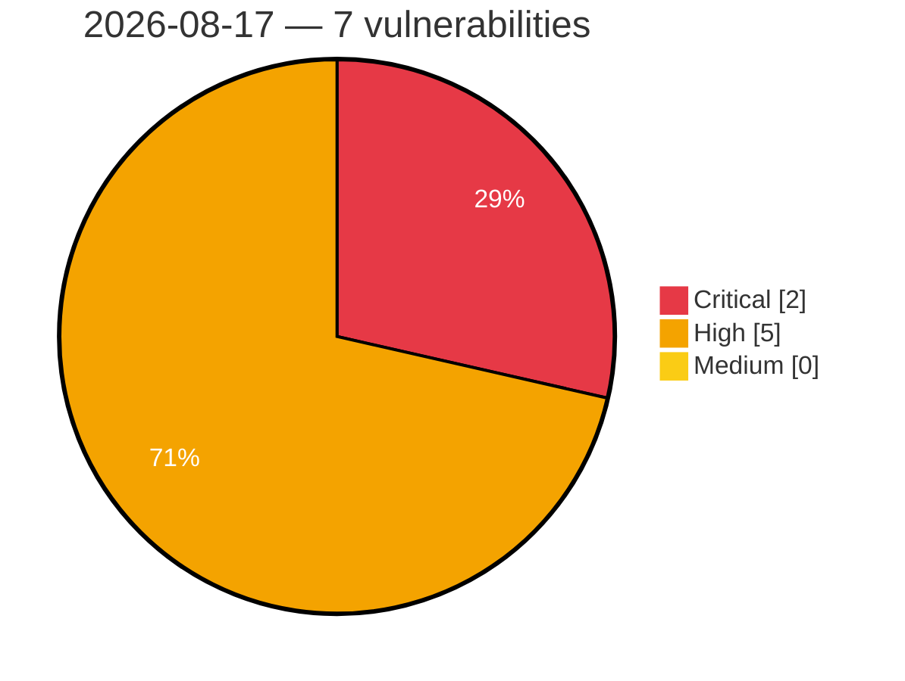

# Critical, High & Medium Severity Vulnerabilities — 2026-08-17

**Source status for this day:**

| Source | Critical | High | Medium | Total |
|--------|---------:|-----:|-------:|------:|
| cvefeed.io (High/Critical) | 2 | 5 | 0 | 7 |

**KEV (actively exploited):** 0  **Watchlist matches:** 3

## Critical (2)

| CVSS | Flags | Source | CVE / Title | Reported |
|------|-------|--------|-------------|----------|
| 10.0 | — | cvefeed.io (High/Critical) | [CVE-2026-19977 - EFM ipTIME A3004T Session Validation httpcon_check_session_url improper authentication](https://cvefeed.io/vuln/detail/CVE-2026-19977) | 1 hour, 8 minutes ago |
| 9.4 | ⭐ | cvefeed.io (High/Critical) | [CVE-2026-15623 - Authenticated Blind SQL Injection in Google Cloud SecOps SOAR Dashboard Widget Query Service](https://cvefeed.io/vuln/detail/CVE-2026-15623) | 34 minutes ago |

## High (5)

| CVSS | Flags | Source | CVE / Title | Reported |
|------|-------|--------|-------------|----------|
| 8.8 | ⭐ | cvefeed.io (High/Critical) | [CVE-2026-74845 - 2100 Technology｜Official Document Management System - Arbitrary File Upload](https://cvefeed.io/vuln/detail/CVE-2026-74845) | 23 minutes ago |
| 8.5 | — | cvefeed.io (High/Critical) | [CVE-2026-50602 - Planet9 Incorrect Permission Assignment Vulnerability Information](https://cvefeed.io/vuln/detail/CVE-2026-50602) | 1 hour, 8 minutes ago |
| 8.3 | — | cvefeed.io (High/Critical) | [CVE-2026-19979 - GL.iNet XE3000 WebDAV Service MOVE authorization](https://cvefeed.io/vuln/detail/CVE-2026-19979) | 43 minutes ago |
| 8.3 | ⭐ | cvefeed.io (High/Critical) | [CVE-2026-19983 - GL.iNet XE3000 NAS Command Service gl_nas_sys os command injection](https://cvefeed.io/vuln/detail/CVE-2026-19983) | 42 minutes ago |
| 8.3 | — | cvefeed.io (High/Critical) | [CVE-2026-22072 - Arbitrary URL Loading in WebView Leading to Token Leakage Risk](https://cvefeed.io/vuln/detail/CVE-2026-22072) | 48 minutes ago |
